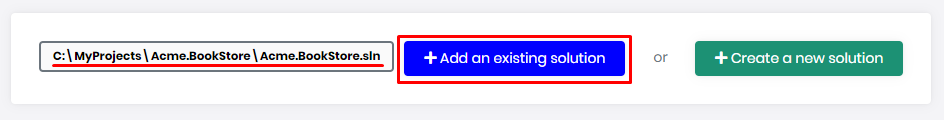
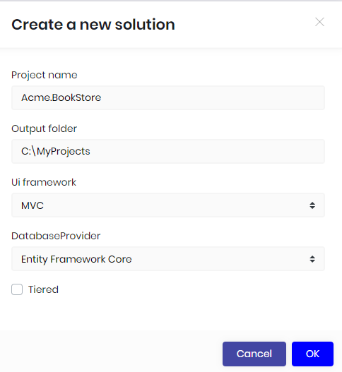
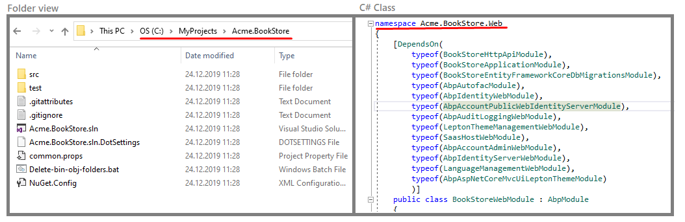
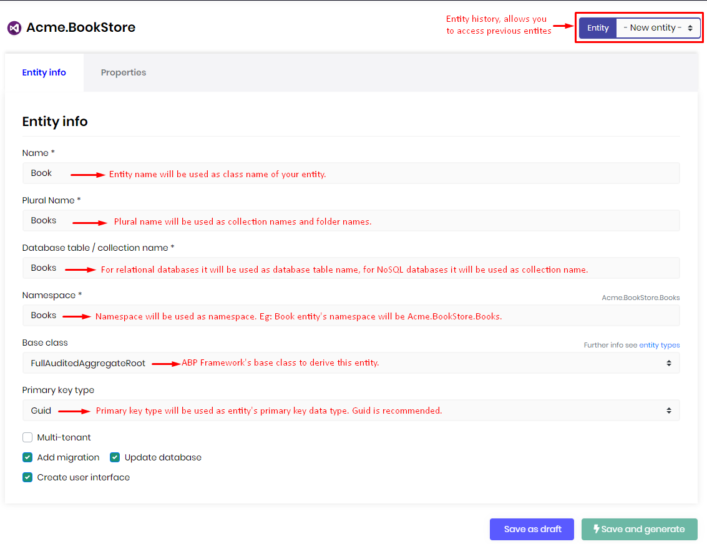
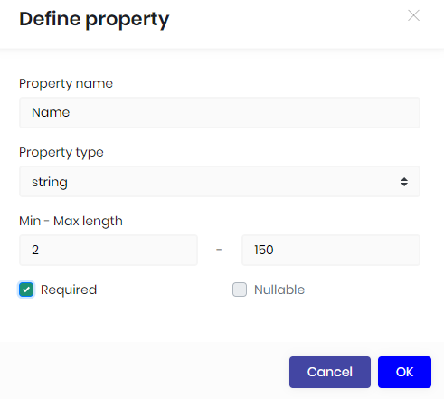
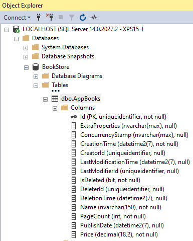
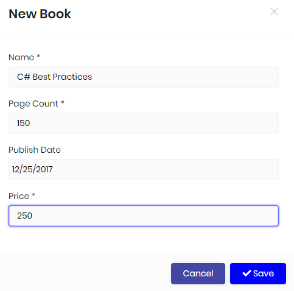

# ABP Suite

ABP Suite is a complementary tool to the ABP Platform for commercial version. ABP Suite allows you to build web pages in a matter of minutes. It's a .NET Core Global tool that can be installed from the command line. Current capabilities of the Suite are creating a new ABP solution and generating CRUD pages from the database to the front-end layer. In the future more features will be added. 

## How to install?

1. First of all, [ABP CLI](https://docs.abp.io/en/abp/latest/CLI) must be installed on the computer. If it's not already installed, [click here to see how to install it](https://docs.abp.io/abp/latest/CLI#installation). 

2. Make sure you have logged in to abp.io via ABP CLI. If you are not logged in, [click here to see how to login](https://docs.abp.io/abp/latest/CLI#login).

3. To install ABP Suite write the following command:

   ```bash
   abp suite install
   ```

   Wait for the process to download and install to your computer. It may take average less than a minute on a 25 Megabit internet.

## How to start?

To start ABP Suite, write the following command to the command line:

```n
abp suite
```

ABP Suite will open in your default browser. Do not close the command line window until you finish your work, otherwise the Suite will not function. When you finish your work, you can return to the command line and press `CTRL+C` to close the Suite.

Remember that, first access to the Suite requires to have an active internet connection, so make sure you are connected to internet. 

## First look

Suite requires an ABP solution to work, that's why when you start it, you will see the following basic functions:

* **Add an existing solution:** Adds your existing solution which was created from the [ABP CLI](https://docs.abp.io/en/abp/latest/CLI) or [abp.io](https://abp.io/get-started) website. You have to enter your `YourProject.sln` file path. It also works if you enter the directory of the `YourProject.sln` when there's single solution inside.

  

* **Create a new solution:** Creates a new ABP solution. It's an alternative way of creating an ABP project rather than [ABP CLI](https://docs.abp.io/en/abp/latest/CLI#new) or [abp.io](https://abp.io/get-started) website. To create your project, you need to provide your project name, the output folder where the project will be created in, UI Framework as your front-end and database provider.  And the "Tiered" option.



- **Project name:** This is the solution name and also the prefix for the namespace of your solution. In this example `Acme.BookStore` is the project name. The solution file will be named as `Acme.BookStore.sln`. And the namespaces of `c#` files will start with `Acme.BookStore.*`

- **Output folder:** This is the directory where the new project will be created. Suite automatically creates the output directory if not exists and places the project folder inside the output directory. See the below folder view for `Acme.BookStore` project.

  

- **UI Framework:** There are 2 types of UI Frameworks, `Angular` and `MVC`. If you would like to create a SPA (single page application), you can choose the `Angular`, or if you would like to create a MPA (multiple page application) with `jQuery` you can choose the `MVC`. Suite works with both of these frameworks.

- **Database Provider:** ABP framework supports 2 database providers: `Entity Framework Core` and `MongoDB`.  `Entity Framework Core` supports a variety of database management systems like `MS SQL Server`, `Oracle`, `MySQL` or  `PostgreSQL`. See the full list https://docs.microsoft.com/ef/core/providers/?tabs=dotnet-core-cli. On the other hand [MongoDB](https://www.mongodb.com/) is a document-oriented NoSQL database used for high volume data storage. If you have a requirement to work with relational database systems, choose  `Entity Framework Core` otherwise choose `MongoDB`.

- **Tiered:** Creates a tiered solution where `Web` and `Http API ` layers are physically separated. If not specified, it creates a layered solution which is less complex and suitable for most scenarios. You can leave it unchecked, if you are not sure.

### Generating a CRUD page

When you add an existing project or create a new one, the project will be listed in the "Open Recent" section. To select the project, click on the project name. 

Be aware that, ABP Suite generates a unique URL for every project. After you select your project, you can safely bookmark it to your browser to access it faster.

#### Entity info

To create a new entity, make sure the *-New entity-* is selected in the **Entity** combo box which is on the top-right of the page. In this section, you need to provide the meta data of your entity. Do not use [C# reserved keywords](https://docs.microsoft.com/en-us/dotnet/csharp/language-reference/keywords/) for your entity name, plural name, database table name or the namespace. 

* **Name**: Name of the entity.

* **Plural Name**: Folder names in of the entity and name of `DbSet`in the `DbContext`.

* **Database table/collection name**: Name of the database table for relational databases or name of the collection name for NoSQL databases.

* **Namespace**: Namespaces of the entities, DTOs and other `C#` classes.

* **Base class**: There are several base classes that comes out of the box from the ABP Framework. Basically there are 2 main types of entity. `AggregateRoot` and simple `Entity`. And these two have 2 more variants with `Audited` and `FullAudited` derivatives. 

  If your entity consists of child entities like an `Order` with its `OrderDetail ` entities, then you should choose [AggregateRoot](https://github.com/abpframework/abp/blob/dev/framework/src/Volo.Abp.Ddd.Domain/Volo/Abp/Domain/Entities/AggregateRoot.cs) / [AuditedAggregateRoot](https://github.com/abpframework/abp/blob/dev/framework/src/Volo.Abp.Ddd.Domain/Volo/Abp/Domain/Entities/Auditing/AuditedAggregateRoot.cs) / [FullAuditedAggregateRoot](https://github.com/abpframework/abp/blob/dev/framework/src/Volo.Abp.Ddd.Domain/Volo/Abp/Domain/Entities/Auditing/FullAuditedAggregateRoot.cs).  

  If it doesn't have any child entities like a `City` entity, you can choose [Entity](https://github.com/abpframework/abp/blob/dev/framework/src/Volo.Abp.Ddd.Domain/Volo/Abp/Domain/Entities/Entity.cs) / [AuditedEntity](https://github.com/abpframework/abp/blob/dev/framework/src/Volo.Abp.Ddd.Domain/Volo/Abp/Domain/Entities/Auditing/AuditedEntity.cs) / [FullAuditedEntity](https://github.com/abpframework/abp/blob/dev/framework/src/Volo.Abp.Ddd.Domain/Volo/Abp/Domain/Entities/Auditing/FullAuditedEntity.cs)

  * **Entity** and **AggregateRoot** are the low-level simple base classes.

  * **AuditedEntity** and **AuditedAggregateRoot** adds these fields to the entity: 

    * `CreationTime`

    * `CreatorId`

    * `LastModificationTime`

    * `LastModifierId`

      Hence, it keeps track of who created and changed the data with the date time information.

  * **FullAuditedEntity** and **FullAuditedAggregateRoot** adds these fields to the entity: 

    * `CreationTime`

    * `CreatorId`

    * `LastModificationTime`

    * `LastModifierId`

    * `IsDeleted` 

    * `DeleterId`

    * `DeletionTime`

      It extends the audited entity features with soft delete functionality. When the data is deleted, it sets the `IsDeleted` field to `true` instead of physically removing it. The ABP Framework automatically filters the soft deleted data on data fetch. Also it saves who and when deleted.

* **Primary key type**:  Primary key is a field in a table or collection which uniquely identifies each record.  ABP Suite allows you to create an entity with one of the 4 types: `Int`,`Long`,`Guid` and `String`. ABP Suite recommends `Guid `  because,

  * You can identify objects at the application level.
  * You can generate `IDs` anywhere, instead of having to roundtrip to the database.
  * Better migration and replication! When working with other databases it's easy to migrate data with all its child entities because unique across every table, database and server.
  * Allows easy distribution of databases across multiple servers
  * The performance is not bad as `String` because database systems handle `Guids` nicely.
  * It's being generated as sequentially by the ABP Framework, so that the physical order of the data in your database will be creation order.
  * `Guids` use 16 bytes. When comparing to `Int` as 4 bytes,  additional 12 bytes do come at a cost.

  On the other hand `Int` and `Long` types have some other advantages:

  * Small storage footprint
  * Optimal join / index performance
  * Useful for data warehousing
  * Native data type of the OS and easy to work with in all languages

* **Multi-tenant**: For your multi-tenant application, you can set an entity as multi-tenant which means the data will be isolated between the tenants. To make an entity multi-tenant, ABP Suite adds the `IMultiTenant` interface to the entity.  Further information see [Multi-Tenancy](../../abp/latest/Multi-Tenancy)

* **Add migration:** Adds a new migration for the new entity. If you are updating an existing entity, it creates an update migration.

  * **Update database:** When you add a new migration, ABP Suite can automatically execute update-database command so that the changes are being applied to the database.

* **Create user interface:** Creates pages, modals, components, `JavaScript`, `CSS ` files and adds the new page to the main menu.  If you don't have a requirement to manage the entity via user interface, you can uncheck this option.

  ​	



#### Properties

##### Define a property

A property is a field in the entity which refers a column in the relational database table or a `JSON` field in `NoSQL` database collection. In the properties section, you can manage the properties your entity. To add a new property, click the "Add Property" button on the top-right of the page. 

* **Property name:** Name of the field. Do not use [C# reserved keywords](https://docs.microsoft.com/en-us/dotnet/csharp/language-reference/keywords/) and database reserved keywords.
* **Property type:** Choose a relevant property type from the list.
* **Min-Max length:** These values are used to limit the data value. The length of the database column will also be created by taking this number into consideration. ABP validates the data on the client and server side according to these values.
* **Required:** Defines whether a value is required or not. 
* **Nullable**: Allows you to set the property as `nullable` for the `C#` supported data types.



##### Property list

The list of all properties defined for the entity. You can delete or edit a property. 

###### Sorting

You can use sorting field column to specify or change the order in which results are sorted. To arrange sorting, click the first combo box (`Sort Index`) that you want to set order index. Choose `Ascending` or `Descending` to specify the sort order for the column.


##### Saving

There are 2 action to save the entity. 

###### Save as draft

Saves only the entity and not generates any code. This is useful when you don't want to apply changes to your project.

###### Save and generate

Saves the entity and generates related code. Your project will be updated.

##### Database Table

When you click **Save and generate** button it'll create all the related objects. The below screenshot is the MS SQL database table that's generated via ABP Suite.




##### User interface

###### New book dialog

###### 

###### Book list page


### Configuration

ABP Suite find your project directories automatically, but when you customize your solution, you can change the directories and file paths from the Suite configuration file. The configuration file is located

**Windows:**

```bash
%USERPROFILE%\.dotnet\tools\.store\volo.abp.suite\<version>\volo.abp.suite\<version>\tools\netcoreapp3.1\any\appsettings.json
```

**Linux/macOS**:

```bash
$HOME/.dotnet/tools/.store/volo.abp.suite/<version>/volo.abp.suite/<version>/tools/netcoreapp3.1/any/appsettings.json
```

