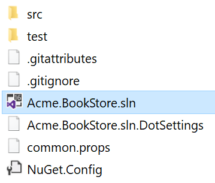
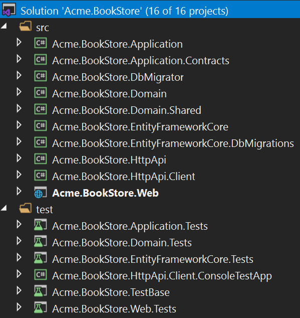
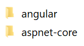
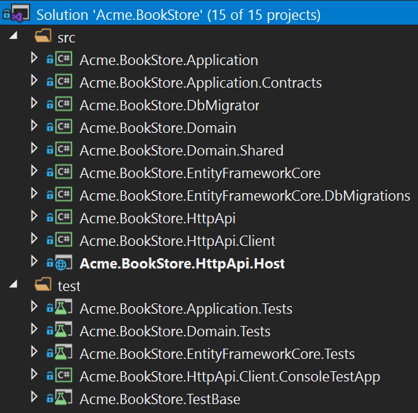
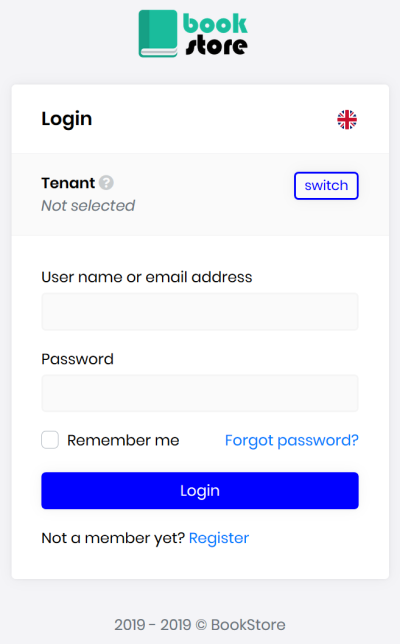

# Getting Started

````json
//[doc-params]
{
    "UI": ["MVC","NG"],
    "DB": ["EF", "Mongo"],
    "Tiered": ["Yes", "No"]
}
````

> This tutorial assumes that you've already purchased an [ABP Commercial license](https://commercial.abp.io/pricing) and have an active ABP Commercial account.

## Setup Your Development Environment

First things first! Let's setup your development environment before creating the first project.

### Pre Requirements

The following tools should be installed on your development machine:

* [Visual Studio 2019 (v16.3+)](https://visualstudio.microsoft.com/vs/) for Windows / [Visual Studio for Mac](https://visualstudio.microsoft.com/vs/mac/).
* [.NET Core 3.0+](https://www.microsoft.com/net/download/dotnet-core/)

* [Node v12+](https://nodejs.org)
* [Yarn v1.19+](https://yarnpkg.com/)

> You can use another editor instead of Visual Studio as long as it supports .NET Core and ASP.NET Core.

### Install the ABP CLI

[ABP CLI](https://docs.abp.io/en/abp/latest/CLI) is a command line interface that is used to authenticate and automate some tasks for ABP based applications.

> ABP CLI is a free & open source tool for [the ABP framework](https://abp.io/). It is also used for ABP Commercial application development.

First, you need to install the ABP CLI using the following command:

````shell
dotnet tool install -g Volo.Abp.Cli
````

If you've already installed, you can update it using the following command:

````shell
dotnet tool update -g Volo.Abp.Cli
````

#### Login to Your Account

In order to use ABP Commercial features, you need to login your account using the ABP CLI:

````shell
abp login <username>
````

It will ask a password, so you enter the password of your account.

> You can freely create a new account from the [ABP Account web site](https://account.abp.io/Account/Register). However, your account should be registered to an organization as a developer to be able to use the ABP Commercial. If your company has an ABP Commercial license, ask your manager to add your account to the developer list of the organization.

### Install the ABP Suite

[ABP Suite](Abp-Suite/Index.md) is an application aims to assist you on your development.

First, you need to install the ABP Suite:

````shell
abp suite install
````

If you've already installed, you can update it:

````shell
abp suite update
````

## Create a New Project

> This document assumes that you prefer to use **{{ UI_Value }}** as the UI framework and **{{ DB_Value }}** as the database provider. For other options, please change the preference on top of this document.

There are two ways of creating a new project: ABP Suite and ABP CLI.

### Using the ABP Suite to Create a New Project

Run the ABP Suite with the following command:

````bash
abp suite
````

This command starts the ABP Suite and opens in your default browser:


Click to the "+ Create solution" button and fill the modal form:


Select the UI framework, Database provider and other option based on your requirements then click to the OK button.

> You can use different level of namespaces; e.g. BookStore, Acme.BookStore or Acme.Retail.BookStore. 

### Using the ABP CLI to Create a New Project

Use the `new` command of the ABP CLI to create a new project:

````shell
abp new Acme.BookStore -t app-pro{{if UI == "NG"}} -u angular{{end}}{{if DB == "Mongo"}} -d mongodb{{end}}{{if Tiered == "Yes"}} --tiered{{end}}
````

* `-t` argument specifies the [startup template](Startup-Templates/Index.md) name. `app-pro` is the startup template that contains the essential [ABP Commercial Modules](https://commercial.abp.io/modules) pre-installed and configured for you.

{{ if UI == "NG" }}

* `-u` argument specifies the UI framework, `angular` in this case.

{{ end }}

{{ if DB == "Mongo" }}

* `-d` argument specifies the database provider, `mongodb` in this case.

{{ end }}

{{ if Tiered == "Yes" }}

* `--tiered` argument is used to create N-tiered solution where authentication server, UI and API layers are physically separated.

{{ end }}

> You can use different level of namespaces; e.g. BookStore, Acme.BookStore or Acme.Retail.BookStore. 

#### ABP CLI Commands & Options

[ABP CLI document](https://docs.abp.io/en/abp/latest/CLI) covers all of the available commands and options for the ABP CLI. The main difference for the ABP Commercial is the template names. See the [ABP Commercial Startup Templates](Startup-Templates/Index.md) document for other commercial templates.

## The Solution Structure

{{ if UI == "MVC" }}

After creating your project, you will have the following solution folders & files:



You will see the following solution structure when you open the `.sln` file in the Visual Studio:



{{ else if UI == "NG" }}

There are two folders in the created solution:



`angular` folder contains the Angular UI application while the `aspnet-core` folder contains the backend solution.

Open the `.sln` (Visual Studio solution) file under the `aspnet-core` folder:



{{ end }}

> ###### About the projects in your solution
>
> Your solution may have slightly different structure based on your **UI**, **database** and other preferences.

The solution has a layered structure (based on [Domain Driven Design](https://docs.abp.io/en/abp/latest/Domain-Driven-Design)) and also contains unit & integration test projects.

{{ if DB == "EF" }}

Integration tests projects are properly configured to work with **EF Core** & **SQLite in-memory** database.

{{ else if DB == "Mongo" }}

Integration tests projects are properly configured to work with in-memory **MongoDB** database created per test (used [Mongo2Go](https://github.com/Mongo2Go/Mongo2Go) library).

{{ end }}

> See the [application template document](Startup-Templates/Application.md) to understand the solution structure in details. 

## Create the Database

### Database Connection String

Check the **connection string** in the `appsettings.json` file under the {{if UI == "MVC"}}{{if Tiered == "Yes"}}`.IdentityServer` and `.HttpApi.Host` projects{{else}}`.Web` project{{end}}{{else if UI == "NG" }}`.HttpApi.Host` project{{end}}:

{{ if DB == "EF" }}

````json
"ConnectionStrings": {
  "Default": "Server=localhost;Database=BookStore;Trusted_Connection=True"
}
````

The solution is configured to use **Entity Framework Core** with **MS SQL Server**. EF Core supports [various](https://docs.microsoft.com/en-us/ef/core/providers/) database providers, so you can use another DBMS if you want (see [the document to change DBMS](Change-DBMS-For-EntityFramework.md) for EF Core).

### Apply the Migrations

The solution uses the [Entity Framework Core Code First Migrations](https://docs.microsoft.com/en-us/ef/core/managing-schemas/migrations/?tabs=dotnet-core-cli). So, you need to apply migrations to create the database. There are two ways of applying the database migrations.

#### Using the DbMigrator Application

The solution comes with a `.DbMigrator` console application which applies migrations and also seed the initial data. It is useful on development as well as on production environment.

> `.DbMigrator` project has its own `appsettings.json`. So, if you have changed the connection string above, you should also change this one. 

Right click to the `.DbMigrator` project and select **Set as StartUp Project**:


 Hit F5 (or Ctrl+F5) to run the application. It will have an output like shown below:

 

> Initial seed data creates the `admin` user in the database which is then used to login to the application. So, you need to use `.DbMigrator` at least once for a new database.

#### Using EF Core Update-Database Command

Ef Core has `Update-Database` command which creates database if necessary and applies pending migrations.

{{ if UI == "MVC" }}

Right click to the {{if Tiered == "Yes"}}`.IdentityServer`{{else}}`.Web`{{end}} project and select **Set as StartUp Project**: 

{{ else if UI == "NG" }}

Right click to the `.HttpApi.Host` project and select **Set as StartUp Project**: 

{{ end }}


Open the **Package Manager Console**, select `.EntityFrameworkCore.DbMigrations` project as the **Default Project** and run the `Update-Database` command:


This will create a new database based on the configured connection string.

> Using the `.Migrator` tool is the suggested way, because it also seeds the initial data to be able to properly run the web application. 

{{ else if DB == "Mongo" }}

````json
"ConnectionStrings": {
  "Default": "mongodb://localhost:27017/BookStore"
}
````

The solution is configured to use **MongoDB** in your local computer, so you need to have a MongoDB server instance up and running or change the connection string to another MongoDB server.

### Seed Initial Data

The solution comes with a `.DbMigrator` console application which seeds the initial data. It is useful on development as well as on production environment.

> `.DbMigrator` project has its own `appsettings.json`. So, if you have changed the connection string above, you should also change this one. 

Right click to the `.DbMigrator` project and select **Set as StartUp Project**:


 Hit F5 (or Ctrl+F5) to run the application. It will have an output like shown below:

 

> Initial seed data creates the `admin` user in the database which is then used to login to the application. So, you need to use `.DbMigrator` at least once for a new database.

{{ end }}

## Run the Application

{{ if UI == "MVC" }}

{{ if Tiered == "Yes" }}

Ensure that the `.IdentityServer` project is the startup project. Run the application which will open a **login** page in your browser.

> Use Ctrl+F5 in Visual Studio (instead of F5) to run the application without debugging. If you don't have a debug purpose, this will be faster.

You can login, but you cannot enter to the main application here. This is just the authentication server.

Ensure that the `.HttpApi.Host` project is the startup project and run the application which will open a **Swagger UI** in your browser.


This is the API application that is used by the web application.

Lastly, ensure that the `.Web` project is the startup project and run the application which will open a **Welcome** page in your browser:

Click to the LOGIN button which will redirect you to the Identity Server to login to the application:



{{ else }}

Ensure that the `.Web` project is the startup project. Run the application which will open the **login** page in your browser:

> Use Ctrl+F5 in Visual Studio (instead of F5) to run the application without debugging. If you don't have a debug purpose, this will be faster.


{{ end }}

{{ else if UI == "NG" }}

#### Run the HTTP API Host (Server Side)

{{ if Tiered == "Yes" }}

Ensure that the `.IdentityServer` project is the startup project. Run the application which will open a **login** page in your browser.

> Use Ctrl+F5 in Visual Studio (instead of F5) to run the application without debugging. If you don't have a debug purpose, this will be faster.

You can login, but you cannot enter to the main application here. This is just the authentication server.

{{ end }}

Ensure that the `.HttpApi.Host` project is the startup project and run the application which will open a Swagger UI:

{{ if Tiered == "No" }}

> Use Ctrl+F5 in Visual Studio (instead of F5) to run the application without debugging. If you don't have a debug purpose, this will be faster.

{{ end }}


You can see the application APIs and test them here. Get [more info](https://swagger.io/tools/swagger-ui/) about the Swagger UI.

> ##### Authorization for the Swagger UI
>
> Most of the HTTP APIs require authentication & authorization. If you want to test authorized APIs, manually go to the `/Account/Login` page, enter `admin` as the username and `1q2w3E*` as the password to login to the application. Then you will be able to execute authorized APIs too.

#### Run the Angular Application (Client Side)

Go to the `angular` folder, open a command line terminal, type the `yarn` command (we suggest to the [yarn](https://yarnpkg.com/) package manager while `npm install` will also work in most cases):

```bash
yarn
```

Once all node modules are loaded, execute `yarn start` (or `npm start`) command:

```bash
yarn start
```

Wait Angular to start, open your favorite browser and go to `localhost:4200` URL.


{{ end }}

Enter `admin` as the username and `1q2w3E*` as the password to login to the application:


The application is up and running. You can continue to develop your application based on this startup template.

> The [application startup template](Startup-Templates/Application.md) includes the SaaS, Identity, Identity Server, Language Management and Audit Log and a few more modules.

## What's Next?

[Application development tutorial](Tutorials/BookStore/Mvc-Razor-Pages/Index.md)

