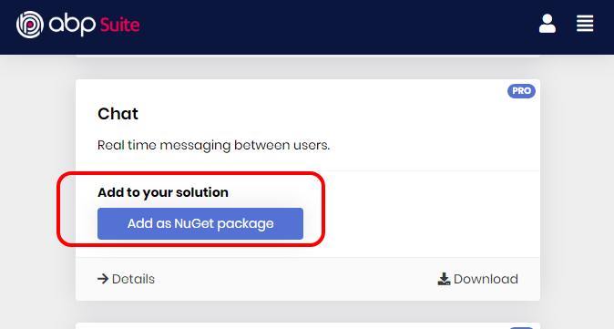
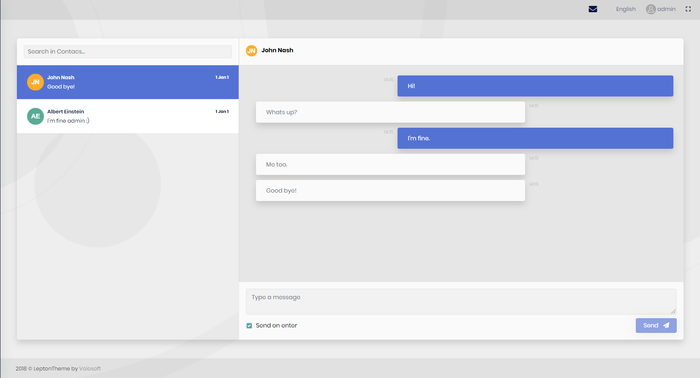

# Chat module

This module implements real time messaging between users for an application.

See [the module description page](https://commercial.abp.io/modules/Volo.Chat) for an overview of the module features.

## How to Install

Chat module is not installed in [the startup templates](../Startup-Templates/Index). So, it needs to be installed manually. There are two ways of installing a module into your application.

### Installation

#### 1. Using ABP Suite

ABP Sute allows adding a module to a solution using ``Add to your solution`` option in modules list.


#### 2. Manual Installation

If you modified your solution structure, adding module using ABP Suite might not work for you. In such cases, chat module can be added to a solution manually.

In order to do that, add packages listed below to matching project on your solution. For example, ```Volo.Chat.Application``` package to your **{ProjectName}.Application.csproj** like below;

```json
<PackageReference Include="Volo.Chat.Application" Version="x.x.x" />
```

After adding the package reference, open the module class of the project (eg: `{ProjectName}ApplicationModule`) and add the below code to the `DependsOn` attribute.

```csharp
[DependsOn(
  //...
  typeof(ChatApplicationModule)
)]
```
The `Volo.Chat.SignalR` package must be added according to your project structure:

* **Mvc**
  * **Non-Tiered**: {ProjectName}.Web project.
  * **Tiered**: {ProjectName}.HttpApi.Host project.
* **Angular**
  * **Unified Backend**: {ProjectName}.HttpApi.Host project.
  * **Separated Identity Server**:  {ProjectName}.HttpApi.Host project. 

If database provider of your project is **EntityFrameworkCore**, use `modelBuilder.ConfigureChat()` to configure database tables in your project's DbContext.

## Configuration

### SignalR Access Token Configuration for Angular Projects

See [Microsoft SignalR Authentication and Authorization](https://docs.microsoft.com/en-us/aspnet/core/signalr/authn-and-authz) and [Microsoft SignalR Security](https://docs.microsoft.com/en-us/aspnet/core/signalr/security#access-token-logging) documentations.

> In standard web APIs, bearer tokens are sent in an HTTP header. However, SignalR is unable to set these headers in browsers when using some transports. When using WebSockets and Server-Sent Events, the token is transmitted as a query string parameter. To support this on the server, additional configuration is required.
>

Here is a sample configuration for this:

```csharp
app.Use(async (httpContext, next) =>
{
    var accessToken = httpContext.Request.Query["access_token"];

    var path = httpContext.Request.Path;
    if (!string.IsNullOrEmpty(accessToken) &&
        (path.StartsWithSegments("/signalr-hubs/chat")))
    {
        httpContext.Request.Headers["Authorization"] = "Bearer " + accessToken;
    }

    await next();
});
```

### Adding Distributed Event Bus for distributed architecture projects

When Web & API tiers are separated, it is impossible to directly send a server-to-client message from the HTTP API. This is also true for a microservice architected application. **Chat Module** uses the distributed event bus to deliver the message from API application to the web application, then to the client.

If your project has such an architecture (example: MVC + tiered option), then you need a Distributed Event Bus. See [related ABP documentation](https://docs.abp.io/en/abp/latest/Distributed-Event-Bus) to understand Distributed Event Bus system in ABP framework. Also see [RabbitMQ Integration documentation](https://docs.abp.io/en/abp/latest/Distributed-Event-Bus-RabbitMQ-Integration) if your choice is to use RabbitMQ.

## Packages

This module follows the [module development best practices guide](https://docs.abp.io/en/abp/latest/Best-Practices/Index) and consists of several NuGet and NPM packages. See the guide if you want to understand the packages and relations between them.

### NuGet packages

* Volo.Chat.Domain.Shared
* Volo.Chat.Domain
* Volo.Chat.Application.Contracts
* Volo.Chat.Application
* Volo.Chat.EntityFrameworkCore
* Volo.Chat.MongoDB
* Volo.Chat.HttpApi
* Volo.Chat.HttpApi.Client
* Volo.Chat.Web
* Volo.Chat.SignalR

### Npm packages

* @volo/chat (MVC)
* @volo/abp.ng.chat (Angular)
* @volo/abp.ng.chat.config (Angular)

## User interface

#### Chat page

This is the page that users send messages to each other.



#### Chat icon on navigation bar

An icon that shows unread message count of the user and leads to chat page when clicked is added to navigation menu.


## Internals

### Domain layer

#### Entities and aggregate roots

* `Message` (aggregate root): Represents a chat message. Implements `IMultiTenant`.
  * `Text`: Message content.
  * `IsAllRead`: Message read information.
  * `ReadTime`: Message read time information.
* `ChatUser` (aggregate root): Represents a chat user. Implements `IUser` and `IUpdateUserData` interfaces.
* `UserMessage`: is created for each side (sender and receiver) of a message. Implements `IMultiTenant` and `IAggregateRoot` interfaces.
  *  `ChatMessageId`: Id of related `Message`.
  *  `UserId`: Id of related `ChatUser.`
  *  `TargetUserId`: Id of other related `ChatUser`.
  *  `Side`: States that if it is a send message or received message.
  *  `IsRead`: Read information.
  *  `ReadTime`: Read time information.
* `Conversation`: is created for each side of a conversation between users. Implements `IMultiTenant` and `IAggregateRoot` interfaces.
  *  `UserId`: Id of related `ChatUser.`
  *  `TargetUserId`: Id of other related `ChatUser`.
  *  `LastMessageSide`: States the side of the latest message (send or received).
  *  `LastMessage`: Content of the last message in the conversation.
  *  `LastMessageDate`: Date of the last message in the conversation.
  *  `UnreadMessageCount`: Count of unread messages in the conversation.

#### Repositories

This module follows the [Repository Best Practices & Conventions](https://docs.abp.io/en/abp/latest/Best-Practices/Repositories) guide.

Following custom repositories are defined for this module:

* `IConversationRepository`
* `IUserMessageRepository`
* `IChatUserRepository`
* `IMessageRepository`

#### Domain Services

* `MessagingManager`

### Application layer

#### Application services

* `ConversationAppService` (implements `IConversationAppService`): Used to send messages, get conversation between users and mark a conversation as read.
* `SettingsAppService` (implements `ISettingsAppService`): Used to save chat settings.
* `ContactAppService` (implements `IContactAppService`): Used to get list of contacts and total unread message count of a user.
* `DistributedEventBusRealTimeChatMessageSender` (implements `IRealTimeChatMessageSender`): Used to publish chat messages to distributed event bus.
* `SignalRRealTimeChatMessageSender` (implements `IRealTimeChatMessageSender`): Used to send messages to target `SignalR` client.

### Database providers

#### Common

##### Table / collection prefix & schema

All tables/collections use the `Chat` prefix by default. Set static properties on the `ChatDbProperties` class if you need to change the table prefix or set a schema name (if supported by your database provider).

##### Connection string

This module uses `Chat` for the connection string name. If you don't define a connection string with this name, it fallbacks to the `Default` connection string.

See the [connection strings](https://docs.abp.io/en/abp/latest/Connection-Strings) documentation for details.

#### Entity Framework Core

##### Tables

* **ChatUsers**
* **ChatMessages**
* **ChatUserMessages**
* **ChatConversations**

#### MongoDB

##### Collections

* **ChatUsers**
* **ChatMessages**
* **ChatUserMessages**
* **ChatConversations**

## Distributed Events

This module defines an event for messaging. It is published when a new message is sent from a user to another user, with an Event Transfer Object type of `ChatMessageEto`. See the [standard distributed events](https://docs.abp.io/en/abp/latest/Distributed-Event-Bus) for more information about distributed events.