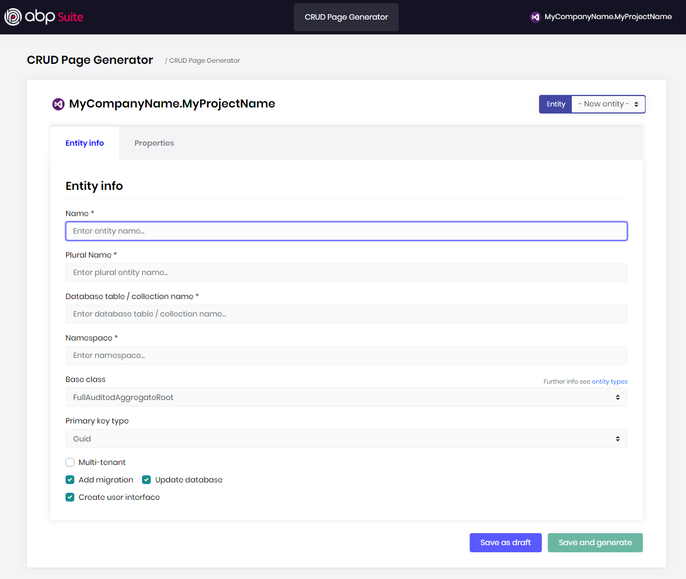
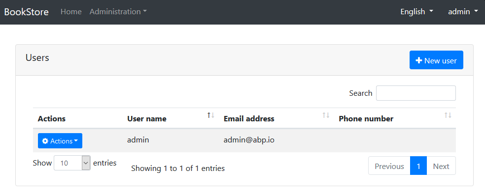
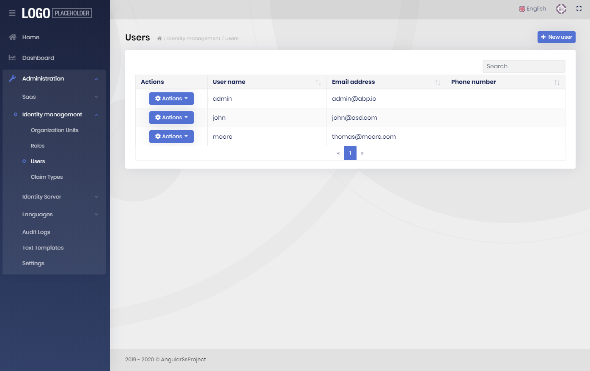

# ABP Framework vs ABP Commercial

**ABP.IO Platform** consists of the open source ABP Framework and the ABP Commercial.

## Introduction

[ABP Framework](https://abp.io) is a completely free, open source and community-driven project. It provides a base framework, [startup templates](https://docs.abp.io/en/abp/latest/Startup-Templates/Index), [CLI](https://docs.abp.io/en/abp/latest/CLI), a [basic theme](https://docs.abp.io/en/abp/latest/Themes/Basic) and some pre-built [application modules](https://docs.abp.io/en/abp/latest/Modules/Index). 

[ABP Commercial](https://commercial.abp.io) adds some benefits on top of the ABP framework with a set of professional [application modules](https://commercial.abp.io/modules), [UI themes](https://commercial.abp.io/themes), [tools](https://commercial.abp.io/tools), [premium support](https://commercial.abp.io/support) and  [services](https://commercial.abp.io/additional-services). 

> This document only focuses the major differences between the ABP Framework and the ABP Commercial. It doesn't cover all the features.

## Overall

Here are the differences between the open source ABP Framework project and the ABP Commercial in overall:

|                                                              | Open Source ABP Framework Project          | ABP Commercial                               |
| ------------------------------------------------------------ | ------------------------------------------ | -------------------------------------------- |
| [Base framework](https://github.com/abpframework/abp/)       | <i class="fa fa-check text-success"></i>   | <i class="fa fa-check text-success"></i>     |
| [Free startup templates](https://docs.abp.io/en/abp/latest/Startup-Templates/Index) | <i class="fa fa-check text-success"></i>   | <i class="fa fa-check text-success"></i>     |
| [Free (basic) application modules](https://docs.abp.io/en/abp/latest/Modules/Index) | <i class="fa fa-check text-success"></i>   | <i class="fa fa-check text-success"></i>     |
| [Free (basic) UI theme](https://docs.abp.io/en/abp/latest/Themes/Basic) | <i class="fa fa-check text-success"></i>   | <i class="fa fa-check text-success"></i>     |
| [ABP CLI](https://docs.abp.io/en/abp/latest/CLI) (Command Line Interface) | <i class="fa fa-check text-success"></i>   | <i class="fa fa-check text-success"></i>     |
| [Community support](https://stackoverflow.com/questions/tagged/abp) | <i class="fa fa-check text-success"></i>   | <i class="fa fa-check text-success"></i>     |
| [Pro startup templates](https://commercial.abp.io/startup-templates) | <i class="fa fa-minus text-secondary"></i> | <i class="fa fa-check text-success"></i>     |
| [Pro application modules](https://commercial.abp.io/modules) | <i class="fa fa-minus text-secondary"></i> | <i class="fa fa-check text-success"></i>     |
| [Pro UI themes](https://commercial.abp.io/themes)            | <i class="fa fa-minus text-secondary"></i> | <i class="fa fa-check text-success"></i>     |
| [ABP Suite](https://commercial.abp.io/tools/suite)           | <i class="fa fa-minus text-secondary"></i> | <i class="fa fa-check text-success"></i>     |
| [Premium support](https://commercial.abp.io/support)         | <i class="fa fa-minus text-secondary"></i> | <i class="fa fa-check text-success"></i>     |
|                                                              | [Download](https://abp.io/get-started)     | [Pricing](https://commercial.abp.io/pricing) |

## The Framework

**ABP Framework** is completely open source and developed in a community-driven manner. While it is mainly developed and maintained by the [Volosoft](https://volosoft.com/) Team, it is [getting contributions](https://github.com/abpframework/abp/graphs/contributors) from the community. It will always remain open source and free.

**ABP Commercial** is not a replacement for the ABP Framework. It directly uses the ABP Framework and adds some benefits on top of it, those are described in this document.

## Startup Templates

Startup Templates are pre-built and configured solution templates that you can easily create your own solutions based on them.

| Startup Template      | Open Source ABP Framework Project          | ABP Commercial                           |
| --------------------- | ------------------------------------------ | ---------------------------------------- |
| Application <sup>[1]</sup> | <i class="fa fa-check text-success"></i>   | <i class="fa fa-check text-success"></i> |
| Module / Service      | <i class="fa fa-check text-success"></i>   | <i class="fa fa-check text-success"></i> |
| Microservice Solution | <i class="fa fa-minus text-secondary"></i> | <i class="fa fa-check text-success"></i> |

<sup>[1]</sup> ABP Commercial application startup template has some additional features, like public website and separate tenant database schema support.

>**Open source** startup templates use the **open source themes and modules** while **ABP Commercial** startup templates use the **commercial (pro) modules and themes**.

## Modules

ABP Commercial has a lot of **additional modules** compared to the open source ABP Framework project. Also, some modules have commercial versions with more features. The table below shows the list of module differences in overall:

| Module                                                       | Open Source ABP Framework Project                            | ABP Commercial                                             |
| ------------------------------------------------------------ | ------------------------------------------------------------ | ---------------------------------------------------------- |
| Identity                                                     | [Basic](https://docs.abp.io/en/abp/latest/Modules/Identity)  | [Pro](https://commercial.abp.io/modules/Volo.Identity.Pro) |
| Account                                                      | [Basic](https://docs.abp.io/en/abp/latest/Modules/Account)   | [Pro](https://commercial.abp.io/modules/Volo.Account.Pro)  |
| Multi-Tenancy                                                | [Basic](https://docs.abp.io/en/abp/latest/Modules/Tenant-Management) (only tenant management) | [Pro](https://commercial.abp.io/modules/Volo.Saas) (SaaS)  |
| CMS Kit | [Basic](https://docs.abp.io/en/abp/latest/Modules/Cms-Kit)   | [Pro](https://commercial.abp.io/modules/Volo.CmsKit.Pro)  |
| [Blogging](https://docs.abp.io/en/abp/latest/Modules/Blogging) | <i class="fa fa-check text-success"></i>                     | <i class="fa fa-check text-success"></i>                   |
| [Docs](https://docs.abp.io/en/abp/latest/Modules/Docs)       | <i class="fa fa-check text-success"></i>                     | <i class="fa fa-check text-success"></i>                   |
| [Identity Server Integration](https://docs.abp.io/en/abp/latest/Modules/IdentityServer) | <i class="fa fa-check text-success"></i>                     | <i class="fa fa-check text-success"></i>                   |
| [Identity Server Management UI](https://commercial.abp.io/modules/Volo.Identityserver.Ui) | <i class="fa fa-minus text-secondary"></i>                   | <i class="fa fa-check text-success"></i>                   |
| [Audit Log Reporting UI](https://commercial.abp.io/modules/Volo.AuditLogging.Ui) | <i class="fa fa-minus text-secondary"></i>                   | <i class="fa fa-check text-success"></i>                   |
| [Dynamic Language Management](https://commercial.abp.io/modules/Volo.LanguageManagement) | <i class="fa fa-minus text-secondary"></i>                   | <i class="fa fa-check text-success"></i>                   |
| [Payment](https://commercial.abp.io/modules/Volo.Payment)    | <i class="fa fa-minus text-secondary"></i>                   | <i class="fa fa-check text-success"></i>                   |
| [Text Template Management](https://commercial.abp.io/modules/Volo.TextTemplateManagement) | <i class="fa fa-minus text-secondary"></i>                   | <i class="fa fa-check text-success"></i>                   |
| [Chat](https://commercial.abp.io/modules/Volo.Chat)          | <i class="fa fa-minus text-secondary"></i>                   | <i class="fa fa-check text-success"></i>                   |
| [File Management](https://commercial.abp.io/modules/Volo.FileManagement) | <i class="fa fa-minus text-secondary"></i>                   | <i class="fa fa-check text-success"></i>                   |
| [Forms](https://commercial.abp.io/modules/Volo.Forms)        | <i class="fa fa-minus text-secondary"></i>                   | <i class="fa fa-check text-success"></i>                   |
| [Twilio SMS Integration](https://commercial.abp.io/modules/Volo.Abp.Sms.Twilio) | <i class="fa fa-minus text-secondary"></i>                   | <i class="fa fa-check text-success"></i>                   |

Some modules have "Basic" (open source) and "Pro" (commercial) versions. The next sections show the differences between the basic and the pro versions.

### Identity Module: Basic vs Pro

Identity module's domain layer is the same. But the application, HTTP API and UI layers have differences shown below:

| Feature                                                | Basic                                      | Pro                                      |
| ------------------------------------------------------ | ------------------------------------------ | ---------------------------------------- |
| User Management                                        | <i class="fa fa-check text-success"></i>   | <i class="fa fa-check text-success"></i> |
| Role Management                                        | <i class="fa fa-check text-success"></i>   | <i class="fa fa-check text-success"></i> |
| Organization Unit Management                           | <i class="fa fa-minus text-secondary"></i> | <i class="fa fa-check text-success"></i> |
| Claim Type Management                                  | <i class="fa fa-minus text-secondary"></i> | <i class="fa fa-check text-success"></i> |
| Security Log Reporting                                 | <i class="fa fa-minus text-secondary"></i> | <i class="fa fa-check text-success"></i> |
| Locok/Unlock a User                                    | <i class="fa fa-minus text-secondary"></i> | <i class="fa fa-check text-success"></i> |
| Setting Management (like Password Complexity Settings) | <i class="fa fa-minus text-secondary"></i> | <i class="fa fa-check text-success"></i> |

### Account Module: Basic vs Pro

| Feature                          | Basic                                      | Pro                                      |
| -------------------------------- | ------------------------------------------ | ---------------------------------------- |
| Login                            | <i class="fa fa-check text-success"></i>   | <i class="fa fa-check text-success"></i> |
| Register                         | <i class="fa fa-check text-success"></i>   | <i class="fa fa-check text-success"></i> |
| Multi-Tenancy (tenant switch)    | <i class="fa fa-check text-success"></i>   | <i class="fa fa-check text-success"></i> |
| User Lockout                     | <i class="fa fa-check text-success"></i>   | <i class="fa fa-check text-success"></i> |
| Forgot Password / Password Reset | <i class="fa fa-check text-success"></i>   | <i class="fa fa-check text-success"></i> |
| Social Logins                    | <i class="fa fa-check text-success"></i>   | <i class="fa fa-check text-success"></i> |
| Email Confirmation               | <i class="fa fa-minus text-secondary"></i> | <i class="fa fa-check text-success"></i> |
| Two Factor Authentication        | <i class="fa fa-minus text-secondary"></i> | <i class="fa fa-check text-success"></i> |
| Account Linking                  | <i class="fa fa-minus text-secondary"></i> | <i class="fa fa-check text-success"></i> |
| LDAP / Active Directory Login    | <i class="fa fa-minus text-secondary"></i> | <i class="fa fa-check text-success"></i> |
| User and Tenant Impersonation    | <i class="fa fa-minus text-secondary"></i> | <i class="fa fa-check text-success"></i> |
| Email / Phone Verification       | <i class="fa fa-minus text-secondary"></i> | <i class="fa fa-check text-success"></i> |
| User Profile Picture             | <i class="fa fa-minus text-secondary"></i> | <i class="fa fa-check text-success"></i> |
| Captcha on Login/Register Forms  | <i class="fa fa-minus text-secondary"></i> | <i class="fa fa-check text-success"></i> |

### Multi-Tenancy

Open source multi-tenancy module named as "Tenant Management" while the commercial one named as "SaaS". The "SaaS" module is aimed to be a complete SaaS solution while the free one is for basic tenant management.

| Feature                          | Basic (Tenant Management)                  | Pro (SaaS)                               |
| -------------------------------- | ------------------------------------------ | ---------------------------------------- |
| Tenant Management                | <i class="fa fa-check text-success"></i>   | <i class="fa fa-check text-success"></i> |
| Edition Management               | <i class="fa fa-minus text-secondary"></i> | <i class="fa fa-check text-success"></i> |
| Separate tenant databases <sup>[1]</sup> | <i class="fa fa-minus text-secondary"></i> | <i class="fa fa-check text-success"></i> |

<sup>[1]</sup> ABP Framework supports separate tenant databases in the framework level. However, only the SaaS module implements the UI, automatic database migrations and separate tenant database schema support.

## ABP CLI vs ABP Suite

[ABP CLI](https://docs.abp.io/en/abp/latest/CLI) is an open source & free command line interface that is used to create a new solution, add a module/package to the solution, update ABP related packages and so on. Example usage:

````bash
abp new Acme.BookStore -d mongodb -u angular
````

ABP CLI can be used by the ABP Framework and the ABP Commercial developers.

ABP Suite, on the other hand, is a commercial tool that aims to assist to your development;

* It has the **UI for the ABP CLI**, so you don't have to memorize the commands.
* It has a **code generator** that creates a CRUD page from database to the user interface, including HTTP APIs, entities, services, DTOs, database migration and so on. It is a big time saver for creating new entities.
* It is planned to add more features in the future to help your development process.

A screenshot from the CRUD Page Generator:



## Basic Theme vs Pro Theme

ABP Framework provides a theme system that has the following goals:

* To allow us to develop different kind of themes and let the application to use and upgrade a theme easily.
* To determine a standard set of libraries (like Bootstrap) to be supported by all the themes.
* To provide a standard and theme-independent development model for module developers, so a module can play nice with any theme.

There are currently two standard themes;

[The Basic Theme](https://docs.abp.io/en/abp/latest/Themes/Basic) is open source and free. It provides fundamental layout and features and looks like a standard Bootstrap UI.

Example screenshot from the user management page:



[The Lepton Theme](https://commercial.abp.io/themes) is a commercial theme development by the ABP Framework Core Team. It is 100% Bootstrap compatible, lightweight and powerful with multiple color styles and layout options.

A screenshot from the user management page of Lepton Theme:



## Samples

We provide a lot of sample solutions based on the ABP Framework and ABP Commercial. All the [sample solutions built with the ABP Framework](https://docs.abp.io/en/abp/latest/Samples/Index) are also valid for the ABP Commercial. So, ABP Commercial users can benefit from these samples. Because of that, we tend to create samples in the open source side to provide more value for everyone.

However, there are some samples only for the ABP Commercial. See the [unique samples for the ABP Commercial](https://docs.abp.io/en/commercial/latest/samples/index).

## Support

ABP Commercial provides two premium support options;

* All [license types](https://commercial.abp.io/pricing) has the premium forum support. Your questions are answered by the ABP Framework development and experienced support team with a high priority.
* Enterprise license includes email & private ticket support too.

If you only use the open source project, you still get community support from the [Stack Overflow](https://stackoverflow.com/questions/tagged/abp) and [GitHub Issues](https://github.com/abpframework/abp/). However, commercial customers have higher priority.
