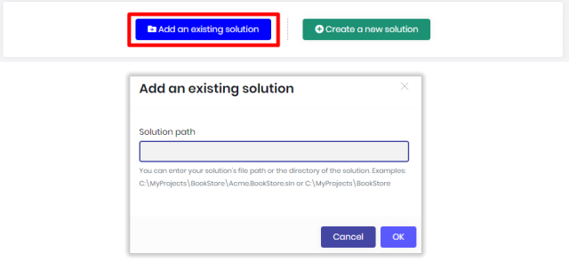
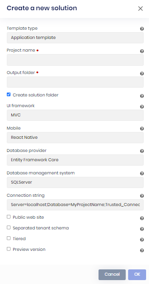

# Adding a new ABP Solution

ABP Suite requires an ABP solution to work on, that's why when you start it, you will see the following basic functions:

* **Add an existing solution:** Adds your existing solution which was created from the [ABP CLI](https://docs.abp.io/en/abp/latest/CLI) or [abp.io](https://abp.io/get-started) website. You have to enter your `YourProject.sln` file path. It also works if you enter the directory of the `YourProject.sln` when there's single solution inside.

  

* **Create a new solution:** Creates a new ABP solution. It's an alternative way of creating an ABP project rather than [ABP CLI](https://docs.abp.io/en/abp/latest/CLI#new) or [abp.io](https://abp.io/get-started) website. To create your project, you need to provide your project name, the output folder where the project will be created in, UI Framework as your front-end and database provider.  And the "Tiered" option.

- **Project name:** This is the solution name and also the prefix for the namespace of your solution. In this example `Acme.BookStore` is the project name. The solution file will be named as `Acme.BookStore.sln`. And the namespaces of `c#` files will start with `Acme.BookStore.*`

- **Output folder:** This is the directory where the new project will be created. Suite automatically creates the output directory if not exists and places the project folder inside the output directory. See the below folder view for `Acme.BookStore` project.

  

- **UI Framework:** There are 2 types of UI Frameworks, `Angular` and `MVC`. If you would like to create a SPA (single page application), you can choose the `Angular`, or if you would like to create a MPA (multiple page application) with `jQuery` you can choose the `MVC`. Suite works with both of these frameworks.

- **Database Provider:** ABP framework supports 2 database providers: `Entity Framework Core` and `MongoDB`.  `Entity Framework Core` supports a variety of database management systems like `MS SQL Server`, `Oracle`, `MySQL` or  `PostgreSQL`. See the full list https://docs.microsoft.com/ef/core/providers/?tabs=dotnet-core-cli. On the other hand [MongoDB](https://www.mongodb.com/) is a document-oriented NoSQL database used for high volume data storage. If you have a requirement to work with relational database systems, choose  `Entity Framework Core` otherwise choose `MongoDB`.

- **Tiered:** Creates a tiered solution where `Web` and `Http API ` layers are physically separated. If not specified, it creates a layered solution which is less complex and suitable for most scenarios. You can leave it unchecked, if you are not sure.

## What's Next?

[Generating a CRUD page](generating-crud-page.md)