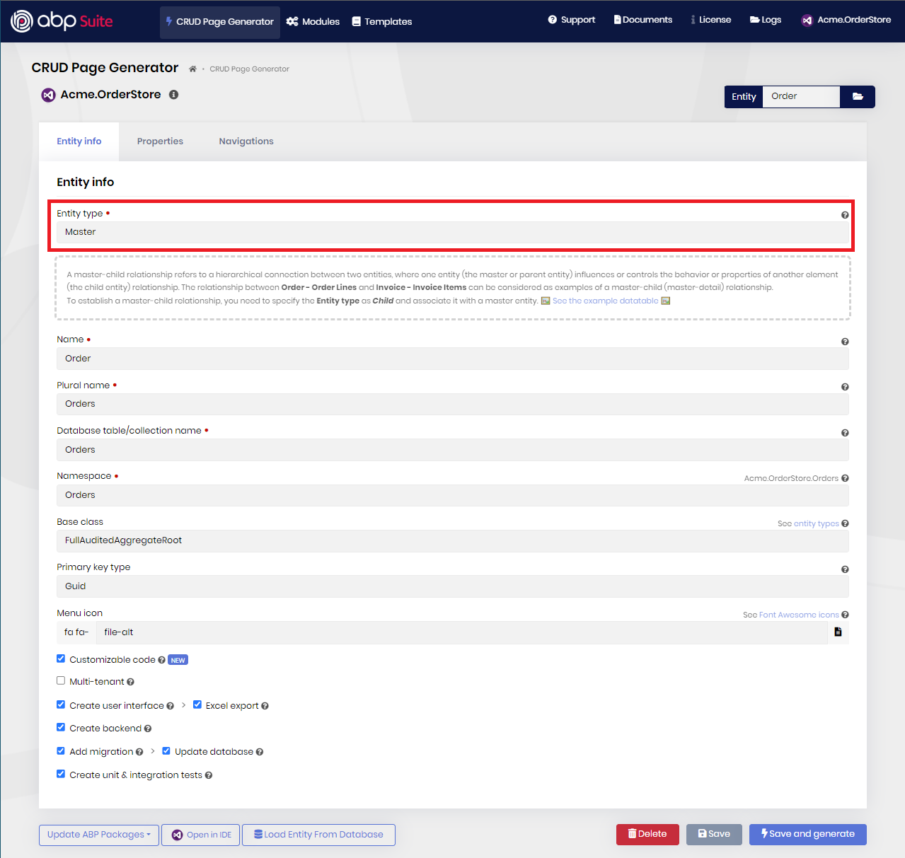
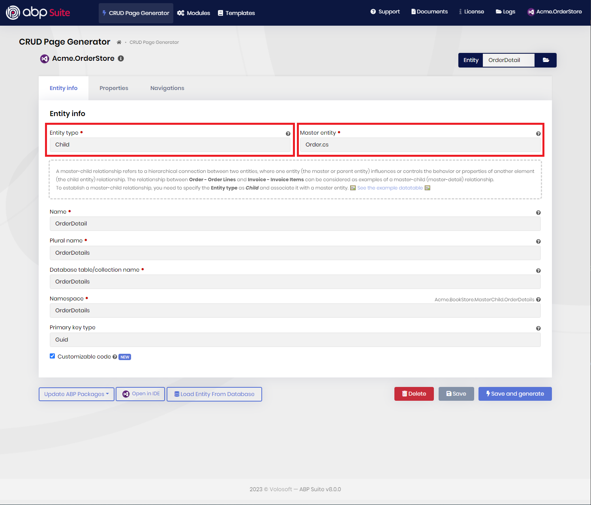
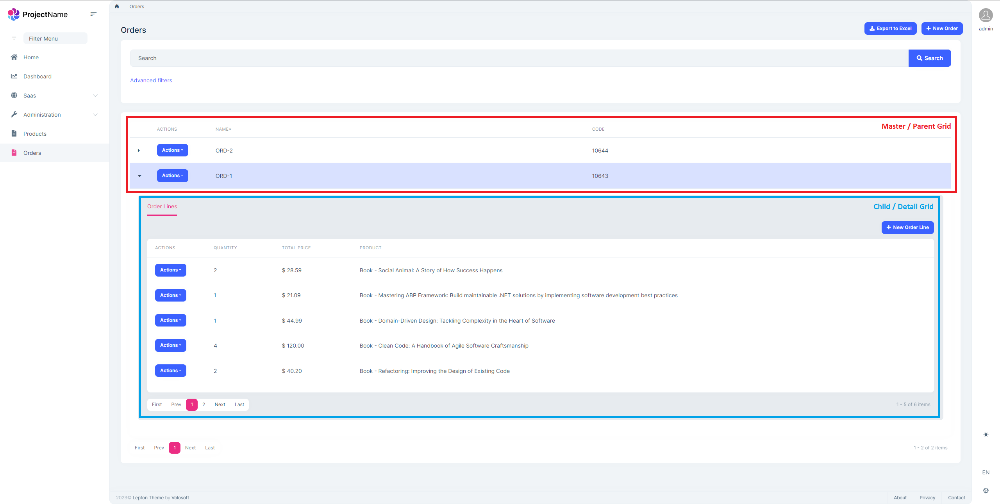

# Master - Detail Forms

Master-Detail (or Master-Child) relationship refers to a hierarchical connection between two entities, where one entity (the master or parent entity) influences or controls the behavior or properties of another element (the child entity) relationship. The relationship between **Order - Order Lines** and **Invoice - Invoice Items** can be considered as examples of a master-detail relationship.

In this relationship, the master entity contains unique records that act as the main source of the information. On the other hand, the child entity contains related records that are associated with a single record in the master entity. In another word, the child entity contains the detail information about the master entity.

## Creating Master - Detail Relationship

ABP Suite allows you to create a master-detail relationship with a few clicks. It generates the necessary code for the master and detail tables, including the foreign key relationship between the two tables.

To establish a master-detail relationship, you can apply the following steps:

**1-) Creating the master entity:** 

You need to specify the **Entity type** as _Master_ (default). Then, provide the meta data of your entity, establish one-to-many or many-to-many relationship if you want and generate the entity.

**2-) Creating the child entity and associating it with a master entity:** 

Create a child entity, specify the **Entity type** as _Child_ and associate it with a master entity. In the figure above, you can see an example, child entity **OrderLine** with the associated master entity **Order**. When you specified the **Entity type** as _Child_, then UI and tests will not be generated for the child entity and instead all of the orchestration of the entity will be delegated to its master entity.

Application services will be generated for the child entity, so it's possible for you to consume its endpoints and create-update-list or delete the child entity specifically. Also, Suite respects your multi-tenancy selection and set the child entity as multi-tenant entity, if the master-entity has multi-tenancy enabled.

> **Note**: Child entities are not good candiate to establish many-to-many relationship and therefore it's being disabled in the Suite UI. So, you can't create a many-to-many relationship for child entities, but you can create a one-to-many relationship.

After, you have provided the other meta data of your entity, click the **"Save and Generate"** button.

**3-) Run the application and see the master-child relationship has been established:**

That's it! These was the only required steps: "First, create the master entity, and then create the child entity and associate it with a master entity" and now, you're ready to go. 

Run the application, and navigates to the page of your master entity. If you have granted the all related permissions, you would see the child data-grids and will be able to collapse/uncollapse and see the details. Also, you can create-update or delete child entity records from these child grids. 

> **Note**: Detail rows are shown in tabs as can be seen in the figure above, and that means that you can have **multiple child entities** that associated with the same master entity. You just need to apply the steps above for establishing the master-child relationship.

## What's next?

[Accessing source code of modules](source-code.md)
