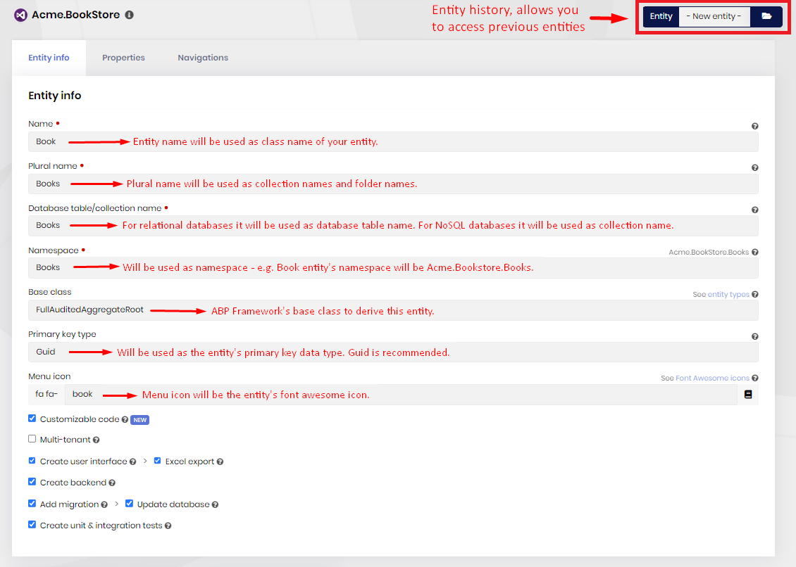
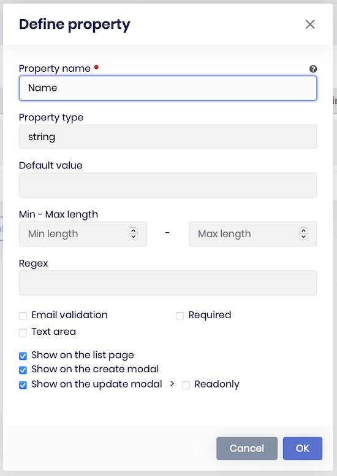
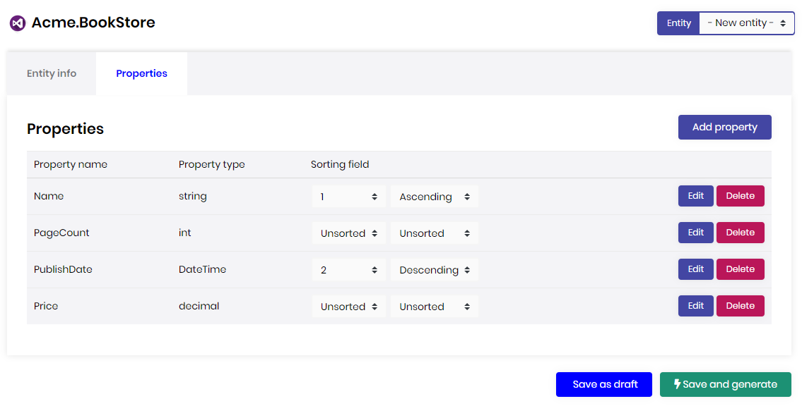
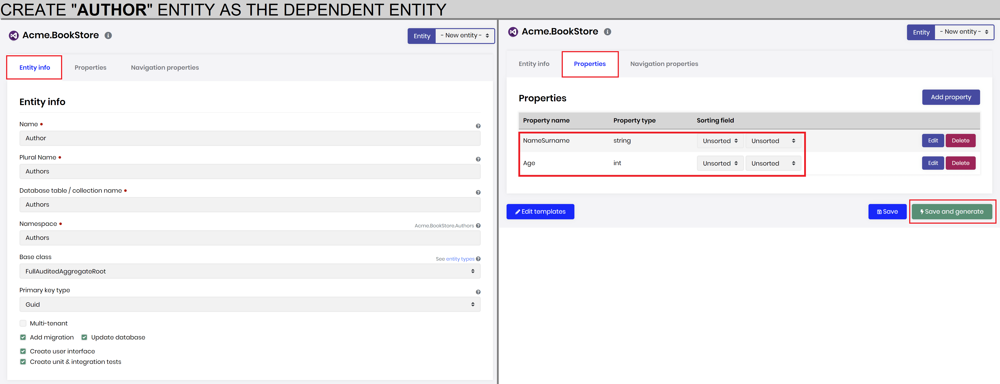
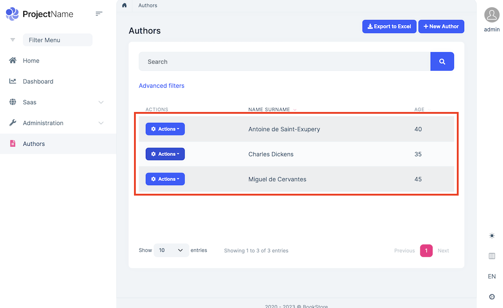
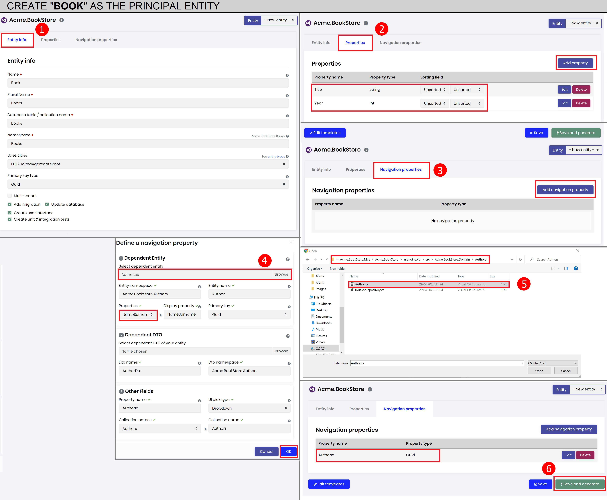
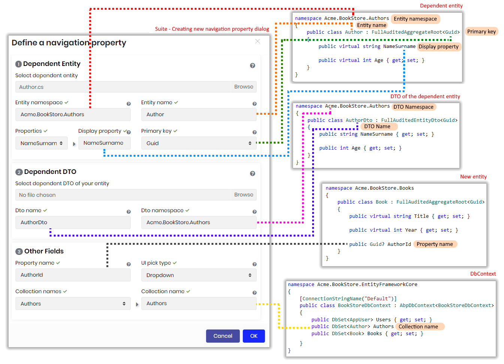
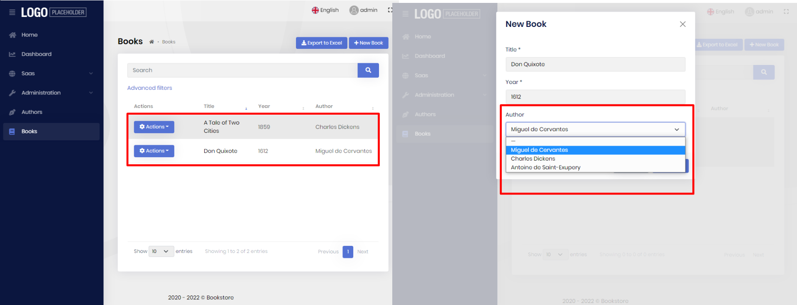
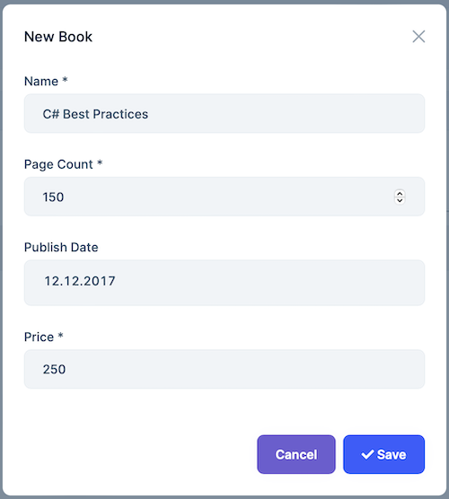
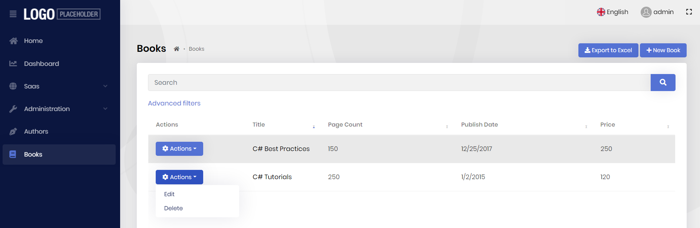

# Generating a CRUD page

When you add an existing project or create a new one, the project will be listed in the "Open Recent" section. To select the project, click on the project name. 

Be aware that, ABP Suite generates a unique URL for every project. After you select your project, you can safely bookmark it to your browser to access it faster.

## Entity info

To create a new entity, make sure the *-New entity-* is selected in the **Entity** combo box which is on the top-right of the page. In this section, you need to provide the meta data of your entity. Do not use [C# reserved keywords](https://docs.microsoft.com/en-us/dotnet/csharp/language-reference/keywords/) for your entity name, plural name, database table name or the namespace. 

* **Name**: Name of the entity.

* **Plural Name**: Folder names of the entity and name of `DbSet`in the `DbContext`.

* **Database table/collection name**: Name of the database table for relational databases or name of the collection name for NoSQL databases.

* **Namespace**: Namespaces of the entities, DTOs and other `C#` classes.

* **Base class**: There are several base classes that comes out of the box from the ABP Framework. Basically there are 2 main types of entity. `AggregateRoot` and simple `Entity`. And these two have 2 more variants with `Audited` and `FullAudited` derivatives. 

  If your entity consists of child entities like an `Order` with its `OrderDetail ` entities, then you should choose [AggregateRoot](https://github.com/abpframework/abp/blob/dev/framework/src/Volo.Abp.Ddd.Domain/Volo/Abp/Domain/Entities/AggregateRoot.cs) / [AuditedAggregateRoot](https://github.com/abpframework/abp/blob/dev/framework/src/Volo.Abp.Ddd.Domain/Volo/Abp/Domain/Entities/Auditing/AuditedAggregateRoot.cs) / [FullAuditedAggregateRoot](https://github.com/abpframework/abp/blob/dev/framework/src/Volo.Abp.Ddd.Domain/Volo/Abp/Domain/Entities/Auditing/FullAuditedAggregateRoot.cs).  

  If it doesn't have any child entities like a `City` entity, you can choose [Entity](https://github.com/abpframework/abp/blob/dev/framework/src/Volo.Abp.Ddd.Domain/Volo/Abp/Domain/Entities/Entity.cs) / [AuditedEntity](https://github.com/abpframework/abp/blob/dev/framework/src/Volo.Abp.Ddd.Domain/Volo/Abp/Domain/Entities/Auditing/AuditedEntity.cs) / [FullAuditedEntity](https://github.com/abpframework/abp/blob/dev/framework/src/Volo.Abp.Ddd.Domain/Volo/Abp/Domain/Entities/Auditing/FullAuditedEntity.cs)

  * **Entity** and **AggregateRoot** are the low-level simple base classes.

  * **AuditedEntity** and **AuditedAggregateRoot** adds these fields to the entity: 

    * `CreationTime`

    * `CreatorId`

    * `LastModificationTime`

    * `LastModifierId`

      Hence, it keeps track of who created and changed the data with the date time information.

  * **FullAuditedEntity** and **FullAuditedAggregateRoot** adds these fields to the entity: 

    * `CreationTime`

    * `CreatorId`

    * `LastModificationTime`

    * `LastModifierId`

    * `IsDeleted` 

    * `DeleterId`

    * `DeletionTime`

      It extends the audited entity features with soft delete functionality. When the data is deleted, it sets the `IsDeleted` field to `true` instead of physically removing it. The ABP Framework automatically filters the soft deleted data on data fetch. Also it saves who and when deleted.

* **Primary key type**:  Primary key is a field in a table or collection which uniquely identifies each record.  ABP Suite allows you to create an entity with one of the 4 types: `Int`,`Long`,`Guid` and `String`. ABP Suite recommends `Guid `  because,

  * You can identify objects at the application level.
  * You can generate `IDs` anywhere, instead of having to roundtrip to the database.
  * Better migration and replication! When working with other databases it's easy to migrate data with all its child entities because unique across every table, database and server.
  * Allows easy distribution of databases across multiple servers
  * The performance is not bad as `String` because database systems handle `Guids` nicely.
  * It's being generated as sequentially by the ABP Framework, so that the physical order of the data in your database will be creation order.
  * `Guids` use 16 bytes. When comparing to `Int` as 4 bytes,  additional 12 bytes do come at a cost.

  On the other hand `Int` and `Long` types have some other advantages:

  * Small storage footprint
  * Optimal join / index performance
  * Useful for data warehousing
  * Native data type of the OS and easy to work with in all languages

* **Multi-tenant**: For your multi-tenant application, you can set an entity as multi-tenant which means the data will be isolated between the tenants. To make an entity multi-tenant, ABP Suite adds the `IMultiTenant` interface to the entity.  Further information see [Multi-Tenancy](https://docs.abp.io/{{Document_Language_Code}}/abp/{{Document_Version}}/Multi-Tenancy)

* **Add migration:** Adds a new migration for the new entity. If you are updating an existing entity, it creates an update migration.

  * **Update database:** When you add a new migration, ABP Suite can automatically execute update-database command so that the changes are being applied to the database.

* **Create user interface:** Creates pages, modals, components, `JavaScript`, `CSS ` files and adds the new page to the main menu.  If you don't have a requirement to manage the entity via user interface, you can uncheck this option.

  ​	

## Properties

##### Define a property

A property is a field in the entity which refers a column in the relational database table or a `JSON` field in `NoSQL` database collection. In the properties section, you can manage the properties your entity. To add a new property, click the "Add Property" button on the top-right of the page. 

* **Property name:** Name of the field. Do not use [C# reserved keywords](https://docs.microsoft.com/en-us/dotnet/csharp/language-reference/keywords/) and database reserved keywords.
* **Property type:** Choose a relevant property type from the list.
* **Min-Max length:** These values are used to limit the data value. The length of the database column will also be created by taking this number into consideration. ABP validates the data on the client and server side according to these values.
* **Required:** Defines whether a value is required or not. 
* **Nullable**: Allows you to set the property as `nullable` for the `C#` supported data types.

### Property list

The list of all properties defined for the entity. You can delete or edit a property. 

#### Sorting

You can use sorting field column to specify or change the order in which results are sorted. To arrange sorting, click the first combo box (`Sort Index`) that you want to set order index. Choose `Ascending` or `Descending` to specify the sort order for the column.

## Navigation Properties

A **navigation property** is a type of property on an entity that allows for navigation from one end of an association to the other end. Unlike normal properties, navigation properties do not carry data.

Navigation properties provide a way to navigate an association between two entity types. Every object can have a navigation property for every relationship in which it participates. 

When you create a navigation property with ABP Suite, you will have a dropdown or look up table to pick a record from the dependent record list. ABP Suite allows you to create a navigation property for only **1-to-many (1:N)** relationships.

> Currently there's no support for many-to-1 (N:1) or many-to-many (N:N) relationships!

In this scenario there are multiple records from one entity associated with a single record from another entity. This means you have a principal (parent) entity and many dependent (child) entities. 

Let's see an example to understand it deeper... 
We will have a `Book` entity and an `Author` entity. Let each book has an author.

- `Book` entity (1) is associated to `Author` entity (N).

### Step by step creating a navigation property

Let's see how to create a navigation property for a **Book Store** project.  We will create an `Author` entity and a `Book` entity. The `Book` entity will hold a foreign key to the `Author` entity which will store the primary key of the `Author` entity.

#### 1- Create the "Author" entity

`Author` entity is the dependent or child entity of the `Book` entity. So we will firstly create the `Author` entity. In the **Entity Info** tab, write "**Author**" in the **name** field. The rest will be automatically filled. Then click **Properties** tab and add the below 2 properties:

1. **Property name:** `NameSurname`, **Property type:** `string`
2. **Property name:** `Age`, **Property type:** `int`

Click **Save and generate** button and wait for ABP Suite to create the page.

After it finishes, run the web project and go to **Authors** page. Click **New Author** button and add the below 3 records:

1. **Name Surname:** `Miguel de Cervantes`, **Age:** `40`
2. **Name Surname:** `Charles Dickens`, **Age:** `35`
3. **Name Surname:** `Antoine de Saint-Exupery`, **Age:** `45`

#### 1- Create the "Book" entity

`Book` is the principal (parent) entity. It will hold a reference to the `Author` entity in `AuthorId` property. Let's create the `Book` entity in the ABP Suite. Click **-New entity-** in the **Entity** dropdown on the top of the page and write **"Book"** in the **Name** field. The rest will be automatically filled. Then click **Properties** tab and add 2 properties:

1. **Property name:** `Title`, **Property type:** `string`
2. **Property name:** `Year`, **Property type:** `int`

Click the **Navigation properties** tab. Then click **Add navigation property** button. In the opening window, click **Select dependent entity** textbox. A file browser will pop up. Find the `Author.cs` that we previously created in step 1.  `Author.cs`  is located in `src\Acme.BookStore.Domain\Authors` directory. After you select the file, almost all fields will be automatically filled, except **Display Property**. Select `NameSurname` from the **Properties** dropdown. It will write it to the **Display Property** textbox. Revise the other fields for the last check and click **OK** button. A new navigation property is added. Click **Save and generate** button and wait for the ABP Suite to create the Books page with the navigation property.

> Notice that almost all fields are automatically filled by convention. If you don't rename the `DTO` names, `DbSet` names in the `DbContext`, navigation property names or namespaces, this tool will automatically set all required fields. On the other hand, these textboxes are not readonly, so that you can change them according to your requirements.
>

In the below image, you will see the mappings of navigation property fields with the code classes.

##### Description of the navigation property window fields

* **Entity namespace**: Namespace of the dependent (child) entity you want to use as the navigation property. Example: `Acme.BookStore.Authors`.

* **Entity name**: Name of the dependent entity. Example `Author`.

* **Display property**: Property name of the dependent entity which you want to show as display text on the UI. Should be a string field. Example: `NameSurname`.

* **Primary key**: Primary key type of the dependent entity. Example: `Guid`.

* **DTO name**: Name of the dependent entity DTO.  Example: `AuthorDto`.

* **DTO namespace**: Namespace of the dependent entity DTO. Example: `Acme.BookStore.Authors`.

* **Collection name**: Collection name or DbSet name of the of the dependent entity in the `DbContext`.  You can select your collection name from **Collection names** dropdown. Example: `Authors`.

* **Property name**: Name of the property that will be created in the principal (parent) entity. Example: `AuthorId`.

* **UI pick type**: Specifies the method of setting the navigation value. There are 2 types:

  * **Modal**: Value is being set in a modal window. A button named as **Pick** will allow users to open a look up table which has search functionality. User will be able to select a single record from the look up table. It's recommended for entities with large data.
  * **Dropdown**: A dropdown will allow users to select a single record. It's recommended for entities with fewer data. 

##### Database structure of navigation property

`AppBooks` table stores items for the principal entity and `AppAuthors` stores the items for dependent entity. Each book has an `AuthorId` field referenced to `Authors` table.

##### Final look

The below image is the final page created by the ABP Suite. The **new book** dialog has **Author** dropdown which lists all authors. After saving the book, the author column will show the `NameSurname` field (display property) of the author entity.

### Saving an entity

There are 2 options to save an entity. 

#### Save

Saves only the entity as draft and doesn't generate code. This is useful when you don't want to apply changes to your project.

#### Save and generate

Saves the entity and generates code. Your project will be added a new CRUD page.

### Database table

When you click **Save and generate** button it'll create all the related objects. The below screenshot is the MS-SQL database table which is generated by the ABP Suite.

## User interface

### New book dialog

###### 

### Book list page

## What's next?

[Accessing source code of modules](source-code.md)
