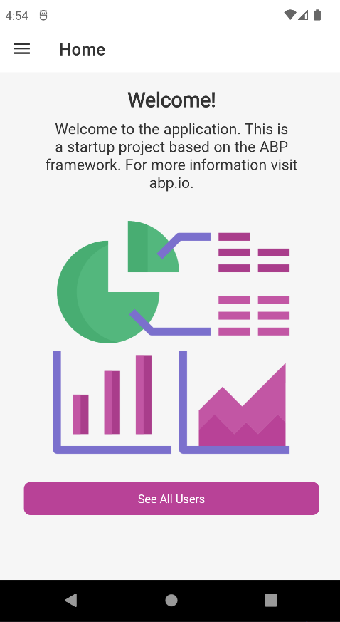
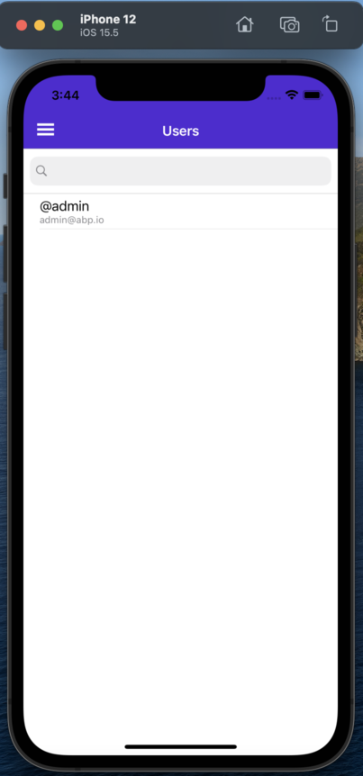

# Getting Started with the MAUI

ABP Commercial platform provides a basic [MAUI](https://docs.microsoft.com/en-us/dotnet/maui/what-is-maui) template to develop mobile applications **integrated to your ABP based backends**.

## Run the Server Application

Run the backend application as described in the [getting started document](getting-started.md).

Open the `appsettings.json` in the `MAUI` project:

{{ if Tiered == "Yes" }}

* Make sure that `Authority` matches the running address of the `.AuthServer` project, `BaseUrl` matches the running address of the `.HttpApi.Host` project.

{{else}}

* Make sure that `Authority` and `BaseUrl` matches the running address of the `.HttpApi.Host` or `.Web` project.

{{ end }}

### Android

The emulator or a physical phone **cannot connect to the backend** on `localhost`. To fix this problem, we need to configure port mapping.

Open a command line terminal and run the [`adb reverse`](https://developer.android.com/studio/command-line/adb#forwardports) command to set up the port forwarding, which forwards requests on a specific host port to a different port on a device. For example:

`adb reverse tcp:44305: tcp:44305`

> You should run the command after starting the emulator

### iOS

The iOS simulator uses the host machine network. Therefore, applications running in the simulator can connect to web services running on your local machine via the machines IP address or via the localhost hostname. For example, given a local secure web service that exposes a GET operation via the /api/todoitems/ relative URI, an application running on the iOS simulator can consume the operation by sending a GET request to https://localhost:<port>/api/todoitems/.

> If simulator is used from windows with a remote connection, follow the [Microsoft documentation](https://docs.microsoft.com/en-us/xamarin/cross-platform/deploy-test/connect-to-local-web-services#specify-the-local-machine-address) to setup a proper configuration.

## Run the Mobile Application

When you click the *Login to the application button*, it will redirects you to the auth server login page and enter **admin** as the username and **1q2w3E*** as the password to login to the application:

The user page shows you how to use CSharp client proxy to request backend API.

The application is up and running. You can continue to develop your application based on this startup template.
