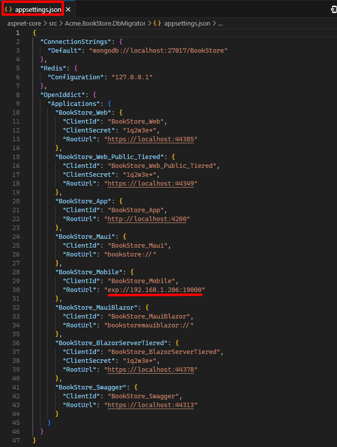
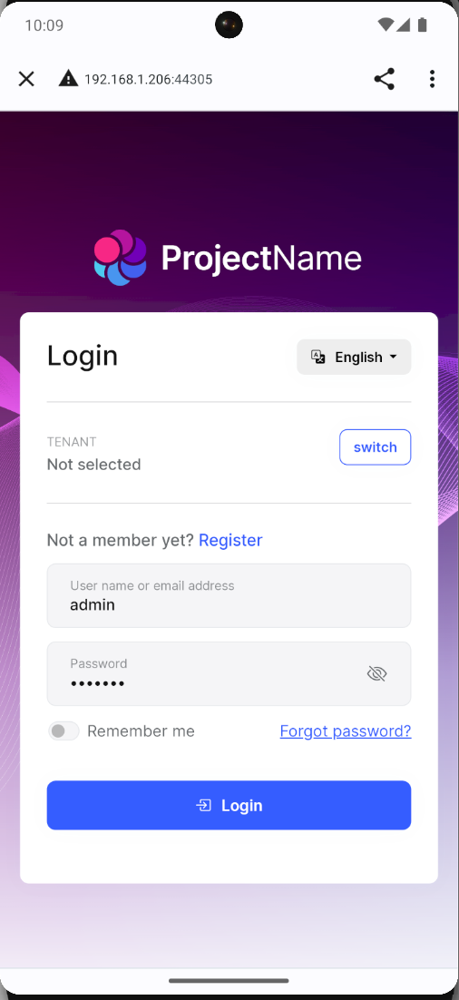
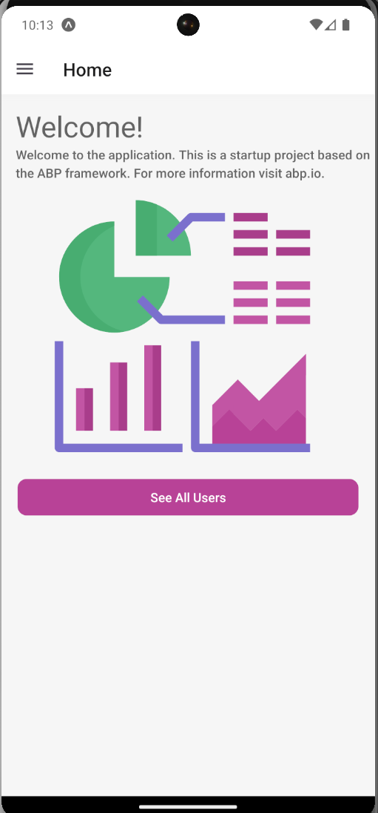

# Getting Started with the React Native

ABP Commercial platform provides a basic [React Native](https://reactnative.dev/) template to develop mobile applications **integrated to your ABP based backends**.

When you **create a new application** as described in the [getting started document](getting-started.md), the solution includes the React Native application in the `react-native` folder as default.

## Configure Your Local IP Address

A React Native application running on an Android emulator or a physical phone **cannot connect to the backend** on `localhost`. To fix this problem, it is necessary to run backend on your **local IP address**.

### Add application to database



> Since ABP version `7.4` react native uses [authorization code flow](https://datatracker.ietf.org/doc/html/rfc8252). So you need to add an application to the database for mobile application. ABP will create a client for the mobile application. You can use the `DbMigrator` project to add an application to the database. You can find the `DbMigrator` project in the `aspnet-core/src/ProjectName.DbMigrator` folder.

- Open the `appsettings.json` in the .DbMigrator folder. Replace the `localhost` address on the `ProjectName_Mobile` property with your local IP address.

{{ if Tiered == "No"}}


- Open the `appsettings.json` in the `.HttpApi.Host` folder. Replace the `localhost` address on the `SelfUrl` and `Authority` properties with your local IP address.
- Open the `launchSettings.json` in the `.HttpApi.Host/Properties` folder. Replace the `localhost` address on the `applicationUrl` properties with your local IP address.

{{ else if Tiered == "Yes" }}


- Open the `appsettings.json` in the `.IdentityServer` folder. Replace the `localhost` address on the `SelfUrl` property with your local IP address.
- Open the `launchSettings.json` in the `.IdentityServer/Properties` folder. Replace the `localhost` address on the `applicationUrl` properties with your local IP address.
- Open the `appsettings.json` in the `.HttpApi.Host` folder. Replace the `localhost` address on the `Authority` property with your local IP address.
- Open the `launchSettings.json` in the `.HttpApi.Host/Properties` folder. Replace the `localhost` address on the `applicationUrl` properties with your local IP address.

{{ end }}

> You should turn off the "Https Restriction" if you're using OpenIddict as a central identity management solution. Because the IOS Simulator doesn't support self-signed certificates and OpenIddict is set to only work with HTTPS by default.

## How to disable the Https-only settings of OpenIddict

Go to MyProjectNameHttpApiHostModule.cs under the host project. Add put these codes under the `PreConfigureServices` function.

```csharp
#if DEBUG
    PreConfigure<OpenIddictServerBuilder>(options =>
    {
        options
        .UseAspNetCore()
        .DisableTransportSecurityRequirement();
    });
#endif
```

## Run the Server Application

Run the backend application as described in the [getting started document](getting-started.md).

> React Native application does not trust the auto-generated .NET HTTPS certificate, you should use the HTTP during development.

Go to the `react-native` folder, open a command line terminal, type the `yarn` command (we suggest to the [yarn](https://yarnpkg.com/) package manager while `npm install` will also work in most cases):

```bash
yarn
```

- Open the `Environment.js` in the `react-native` folder and replace the `localhost` address on the `apiUrl` and `issuer` properties with your local IP address as shown below:


{{ if Tiered == "Yes" }}

> Make sure that `issuer` matches the running address of the `.IdentityServer` project, `apiUrl` matches the running address of the `.HttpApi.Host` project.

{{else}}

> Make sure that `issuer` and `apiUrl` match the running address of the `.HttpApi.Host`, `.Web` or `.Blazor`(BlazorServer UI) projects.

{{ end }}

Once all node modules are loaded, execute `yarn start` (or `npm start`) command:

```bash
yarn start
```

Wait Expo CLI to start. Expo CLI opens the management interface on the `http://localhost:19002/` address.


In the above management interface, you can start the application with an Android emulator, an iOS simulator or a physical phone by the scan the QR code with the [Expo Client](https://expo.io/tools#client).

> See the [Android Studio Emulator](https://docs.expo.io/workflow/android-studio-emulator), [iOS Simulator](https://docs.expo.io/workflow/ios-simulator) documents on expo.io.



Enter **admin** as the username and **1q2w3E\*** as the password to login to the application:



The application is up and running. You can continue to develop your application based on this startup template.

## Authorization

- For authorization process ABP uses 2 main library
  - [Expo AuthSession](https://docs.expo.dev/versions/latest/sdk/auth-session/)
  - [Expo WebBrowser](https://docs.expo.dev/versions/latest/sdk/webbrowser/)

## UI Theme

- For UI theme ABP uses [react-native-paper](https://callstack.github.io/react-native-paper/)
- Also [expo-image-picker](https://docs.expo.dev/versions/latest/sdk/imagepicker/), [react-native-root-toast](https://github.com/magicismight/react-native-root-toast) some libraries used in the project.
