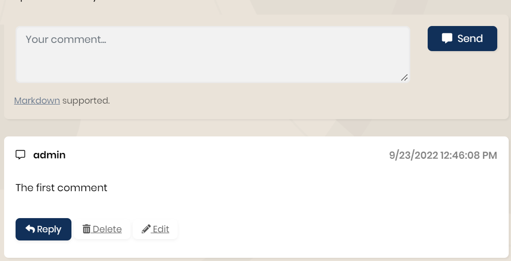

# Add Module to Existing Microservices

> This documentation introduces guidance for adding a module to a microservice for your microservice template project. Eventually, every module has its own documentation and implementation steps. However, some steps can be different for the microservice template. This guide will demonstrate the steps to add a module to an existing microservice.

## Adding a module

After adding a new service to your microservice template by following the [add new microservice guide](https://docs.abp.io/en/commercial/latest/startup-templates/microservice/add-microservice.md), you can add any module to this service in your microservice solution by using the ABP CLI. Use the following command to add the preferred module under the newly added microservice directory:

```powershell
abp add-module ModuleName
```

After completing the module documentation steps you can build your solution and continue with this documentation.

```bash
dotnet build
```

## Converting the dynamic proxy to the static proxy

ABP Framework supports [dynamic](https://docs.abp.io/en/abp/latest/UI/AspNetCore/Dynamic-JavaScript-Proxies) and [static](https://docs.abp.io/en/abp/latest/UI/AspNetCore/Static-JavaScript-Proxies) proxies. Both have advantages and disadvantages.  By default, the dynamic proxy is used but It is suggested to use the static proxy in the microservice template to remove the coupling between services. The static proxy should be configured manually in the `HttpApiClientModule` of the microservice you have installed your module to as below:

```csharp
public class YourServiceHttpApiClientModule : AbpModule
{
    public override void ConfigureServices(ServiceConfigurationContext context)
    {
        //Should be `AddStaticHttpClientProxies` instead of `AddHttpClientProxies`
        context.Services.AddHttpClientProxies(typeof(YourServiceApplicationContractsModule).Assembly,
            YourServiceRemoteServiceConsts.RemoteServiceName);

        Configure<AbpVirtualFileSystemOptions>(options =>
        {
            options.FileSets.AddEmbedded<YourServiceHttpApiClientModule>();
        });
    }
}
```

Need to convert `AddHttpClientProxies` to `AddStaticHttpClientProxies`. Then you should create the static proxies in `YourService.HttpApi.Client` by using the following command line:

```powershell
abp generate-proxy -t csharp --module YourModuleName -u http://localhost:YourProjectPort/
```

> If you have generated a new microservice with the ABP CLI by following the [add new microservice guide](https://docs.abp.io/en/commercial/latest/startup-templates/microservice/add-microservice.md), it should already have been configured to use the static proxy.

## Configure Gateways
The microservice template project has two gateway projects.

- **WebGateway** 
- **PublicWebGateway**

The first one is for the admin side and the other one is for the public side. If you would like to use your module on both sides, you should configure `ocelot.json ` in both projects. There is an example one below and you need to configure it according to your requirements.

```json
{
    "ServiceKey": "YourModuleName",
    "DownstreamPathTemplate": "/api/your-module/{everything}",
    "DownstreamScheme": "https",
    "DownstreamHostAndPorts": [
        {
            "Host": "localhost",
            "Port": YourProjectPort
        }
    ],
    "UpstreamPathTemplate": "/api/your-module/{everything}",
    "UpstreamHttpMethod": [ "Put", "Delete", "Get", "Post" ]
}
```

> You can make different configurations for each method or endpoint for your service and add QoS configurations based on your business requirements. You can check the [ocelot documentation](https://ocelot.readthedocs.io/en/latest/) for more.

## Build Errors Typo

After completing adding your module, you should see some changes on the different pages to the inject dependencies. In `YourServiceDbContext` the overridden method `OnModelCreating` may be a typo because of the parameter name. For example, for CmsKit comes with `builder` parameter name but in this class, the parameter name is `modelBuilder`. It's enough to change it with the correct one.

```csharp
[ConnectionStringName(YourServiceDbProperties.ConnectionStringName)]
public class YourServiceDbContext : AbpDbContext<YourServiceDbContext>
{
    protected override void OnModelCreating(ModelBuilder builder)
    {
        //`builder` may be `modelBuilder`
        builder.ConfigureModule();
    }
}
```

## Implementing IYourModuleDbContext

After running adding module command, you should see your migration files under the `Migrations` in the `EntityFrameworkCore` project. If it's empty please make sure whether to implement `IModuleDbContext` or not. Once implemented, the compiler should warn you to import your entities here. Now, you're ready to create your migration properly. If you create your migrations properly, just you need to run the project. ABP Framework will handle it automatically.

```csharp
[ConnectionStringName(YourServiceDbProperties.ConnectionStringName)]
public class YourServiceDbContext : AbpDbContext<YourServiceDbContext>, IYourModuleDbContext
{
    public DbSet<YourEntity> YourEntities { get; set; }
}
```

Now you should configure `AbpDbContextOptions` in the `YourServiceEntityFrameworkCoreModule` under the `EntityFrameworkCore` project. Already you should see the configuration for your service in `ConfigureServices` for your project, but also need to configure it for the new module projects.

```csharp
public override void ConfigureServices(ServiceConfigurationContext context)
{
    //The other congiurations
    options.Configure<YourModuleDbContext>(c =>
    {
        c.UseSqlServer(b => //It may change up to your db
        {
            b.MigrationsHistoryTable("__YourService_Migrations");
        });
    });
}
```

## Using Component

If you would like to use the defined component in the module on your web page, you should add its related page on NuGet. After adding your package you should add the dependency to `YourModulePublicWebModule` as the following code

```csharp
[DependsOn(typeof(YourModulePublicWebModule))]
public class YourServicePublicWebModule : AbpModule
{
    //Configurations
}
```

Now you can use your components on your razor page.
```csharp
    @await Component.InvokeAsync(typeof(YourViewComponent), new {key = "value"})
```

Now you should see your component, but probably you will the following error once trying to submit. Because still you need some configurations regarding user syncrozation.


## Configured External User

To submit some components you need to log in to the system. Already you logged in to the system but your module database can be empty hence we need to check `IdentityService` for this user. 

Firstly you should add service client to `IdentityServerDataSeeder` under the `IdentityService.HttpApi.Host`

```csharp
//The other configurations
await CreateClientAsync(
    name: "YourServiceName",
    scopes: commonScopes.Union(new[]
    {
        "IdentityService"
    }),
    grantTypes: new[] { "client_credentials" },
    secret: "1q2w3e*".Sha256(),
    permissions: new[] { } //This changes up to your permission
);
```

Then change your `appsetting.json` by adding the following code under the `YourService.HttpApi.Host`
```json
"RemoteServices": {
    "AbpIdentity": {
    "BaseUrl": "https://localhost:IdentityServicePort"
    }
},
"IdentityClients": {
    "Default": {
    "GrantType": "client_credentials",
    "ClientId": "YourService",
    "ClientSecret": "1q2w3e*",
    "Authority": "https://localhost:AuthServerPort",
    "Scope": "IdentityService"
    }
}
```

Now add the Nuget package by using the following code and implement it to the module.

> dotnet add package Volo.Abp.Identity.Pro.HttpApi.Client 

> dotnet add package Volo.Abp.Http.Client.IdentityModel.Web


```csharp
using Volo.Abp.Identity;
using Volo.Abp.Http.Client.IdentityModel.Web;

[DependsOn(
    typeof(AbpIdentityHttpApiClientModule),
    typeof(AbpHttpClientIdentityModelWebModule)
)]
public class YourServiceHttpApiHostModule : AbpModule
{
    //
}
```

Finally you need to map YourModule to YourService in `DocSharedHostingModule` under the `Shared.Hosting`
```csharp
public override void ConfigureServices(ServiceConfigurationContext context)
{
    Configure<AbpDbConnectionOptions>(options =>
    {
        options.Databases.Configure("YourService", database =>
        {
            database.MappedConnections.Add("YourModuleName");
            database.MappedConnections.Add("YourService");
        });
    }
}
```

If you applied all steps correctly, you should see the below output after clicking the `Send` button.



