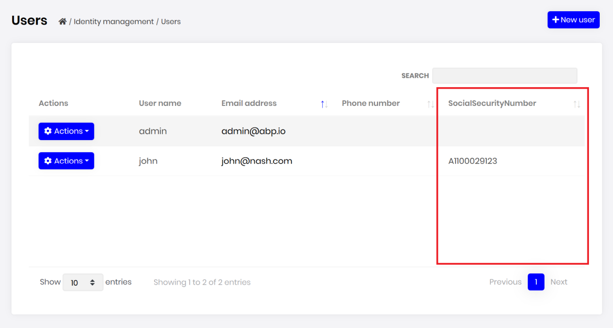

# Module Entity Extensions

## Introduction

Module entity extension system is the main extension system that allows you to **define new properties** for existing entities of the depended modules. It automatically **adds properties to the entity, database, HTTP API and the user interface** in a single point.

## Quick Example

Open the `YourProjectNameModuleExtensionConfigurator` class inside the `Domain.Shared` project of your solution and change it as shown below to add a `SocialSecurityNumber` property to the `IdentityUser` entity of the [Identity Module](../modules/identity.md).

````csharp
public static void Configure()
{
    OneTimeRunner.Run(() =>
    {
        ObjectExtensionManager.Instance.Modules()
            .ConfigureIdentity(identity =>
            {
                identity.ConfigureUser(user =>
                {
                    user.AddOrUpdateProperty<string>( //property type: string
                        "SocialSecurityNumber", //property name
                        property =>
                        {
                            //validation rules
                            property.Attributes.Add(new RequiredAttribute());
                            property.Attributes.Add(
                                new StringLengthAttribute(64) {
                                    MinimumLength = 4
                                }
                            );

                            //...other configurations for this property
                        }
                    );
                });
            });
    });
}
````

>This method is called inside the `YourProjectNameDomainSharedModule` at the beginning of the application. `OneTimeRunner` is a utility class that guarantees to execute this code only one time per application, since multiple calls are unnecessary.

* `ObjectExtensionManager.Instance.Modules()` is the starting point to configure a module. `ConfigureIdentity(...)`  method is used to configure the entities of the Identity Module.
* `identity.ConfigureUser(...)` is used to configure the user entity of the identity module.
* `user.AddOrUpdateProperty<string>(...)` is used to add a new property to the user entity with the `string` type (`AddOrUpdateProperty` method can be called multiple times for the same property of the same entity. Each call can configure the options of the same property, but only one property is added to the entity with the same property name). You can call this method with different property names to add more properties.
* `SocialSecurityNumber` is the name of the new property.
* `AddOrUpdateProperty` gets a second argument (the `property =>` lambda expression) to configure additional options for the new property.
  * We can add data annotation attributes like shown here, just like adding a data annotation attribute to a class property.

#### Create & Update Forms

Once you define a property, it appears in the create and update forms of the related entity:


`SocialSecurityNumber` field comes into the form. Next sections will explain the localization and the validation for this new property.

### Data Table

New properties also appear in the data table of the related page:



`SocialSecurityNumber` column comes into the table. Next sections will explain the option to hide this column from the data table.

## Property Options

There are some options that you can configure while defining a new property.

### Display Name

You probably want to set a different (human readable) display name for the property that is shown on the user interface.

#### Don't Want to Localize?

If your application is not localized, you can directly set the `DisplayName` for the property to a `FixedLocalizableString` object. Example:

````csharp
property =>
{
    property.DisplayName = new FixedLocalizableString("Social security no");
}
````

#### Localizing the Display Name

If you want to localize the display name, you have two options.

##### Localize by Convention

Instead of setting the `property.DisplayName`, you can directly open your localization file (like `en.json`) and add the following entry to the `texts` section:

````json
"SocialSecurityNumber": "Social security no"
````

Define the same `SocialSecurityNumber` key (the property name you've defined before) in your localization file for each language you support. That's all!

In some cases, the localization key may conflict with other keys in your localization files. In such cases, you can use the `DisplayName:` prefix for display names in the localization file. Extension system looks for prefixed version first, then fallbacks to the non prefixed name (it then fallbacks to the property name if you haven't localized it).

> This approach is recommended since it is simple and suitable for most scenarios.

##### Localize using the `DisplayName` Property

If you want to specify the localization key or the localization resource, you can still set the `DisplayName` option:

````csharp
property =>
{
    property.DisplayName =
        LocalizableString.Create<MyProjectNameResource>(
            "UserSocialSecurityNumberDisplayName"
        );
}
````

* `MyProjectNameResource` is the localization resource and `UserSocialSecurityNumberDisplayName` is the localization key in the localization resource.

> See [the localization document](https://docs.abp.io/en/abp/latest/Localization) if you want to learn more about the localization system.

### Validation

TODO

### UI Visibility

TODO

### API Availability

TODO