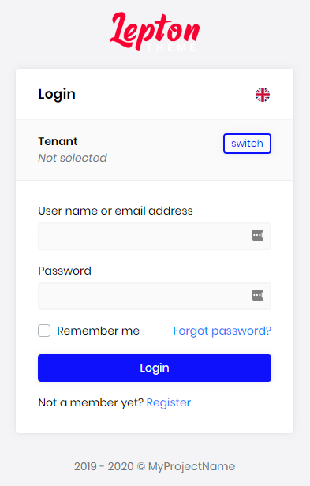
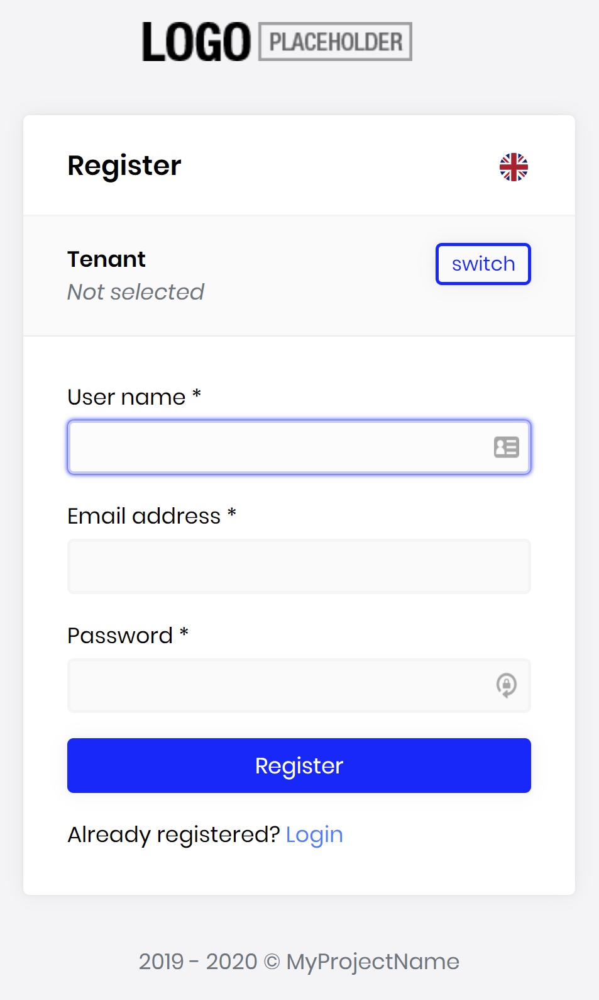
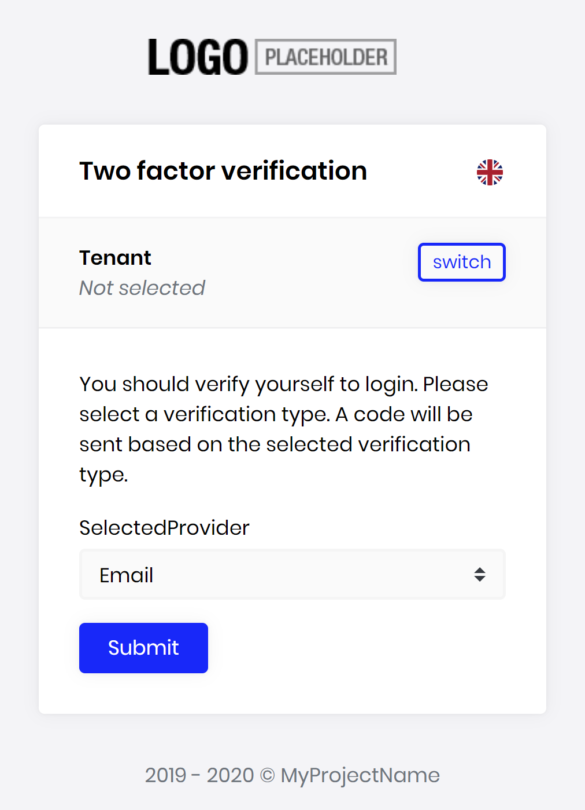
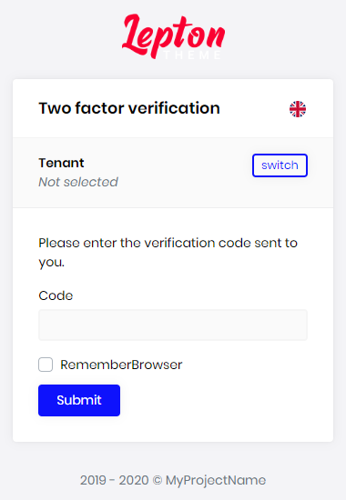

# Account Module

This module implements the Login, Register, Forgot Password, Email Confirmation, Password Reset, sending and confirming Two-Factor Authentication functionalities of an application;

* Built on the [Microsoft's ASP.NET Core Identity](https://docs.microsoft.com/en-us/aspnet/core/security/authentication/identity) library.
* Identity Server Grant and Consent pages.
* Setting page to manage **self registration** and two-factor authentication.

See [the module description page](https://commercial.abp.io/modules/Volo.Identity.Pro) for an overview of the module features.

## How to Install

Identity is pre-installed in [the startup templates](../Startup-Templates/Index). So, no need to manually install it.

## Packages

This module follows the [module development best practices guide](https://docs.abp.io/en/abp/latest/Best-Practices/Index) and consists of several NuGet and NPM packages. See the guide if you want to understand the packages and relations between them.

### NuGet Packages

* Volo.Abp.Account.Pro.Admin.Application
* Volo.Abp.Account.Pro.Admin.Application.Contracts
* Volo.Abp.Account.Pro.Admin.HttpApi
* Volo.Abp.Account.Pro.Admin.HttpApi.Client
* Volo.Abp.Account.Pro.Admin.Web
* Volo.Abp.Account.Pro.Public.Application
* Volo.Abp.Account.Pro.Public.Application.Contracts
* Volo.Abp.Account.Pro.Public.HttpApi
* Volo.Abp.Account.Pro.Public.HttpApi.Client
* Volo.Abp.Account.Pro.Public.Web
* Volo.Abp.Account.Pro.Public.Web.IdentityServer
* Volo.Abp.Account.Pro.Shared.Application
* Volo.Abp.Account.Pro.Shared.Application.Contracts

### NPM Packages

* @volo/abp.ng.account
* @volo/abp.ng.account.config

## User Interface

### Menu Items

This module doesn't define any menu items.

### Pages

#### Login Page

Login page is used to log in to the system.



#### Register Page

Register page allows new users to register to your system.



#### Two Factor Authentication

Identity module allows two factor authentication pages.

##### Send Security Code

Send security code page allows selecting a two factor authentication provider (Email, Phone etc...) and sends a security code to user via selected provider.



##### Verify Security Code

Verify security code page verifies the security code sent to user and if the code is verified, user logs in to the system.



## Data Seed

This module doesn't seed any data.

## Options

### AbpIdentityAspNetCoreOptions

`AbpAccountOptions` can be configured in the UI layer, in the `ConfigureServices` method of your [module](https://docs.abp.io/en/abp/latest/Module-Development-Basics). Example:

````csharp
Configure<AbpAccountOptions>(options =>
{
    //Set options here...
});
````

`AbpAccountOptions` properties:

* `WindowsAuthenticationSchemeName` (default: Windows): Name of the Windows authentication scheme.

## Internals

### Settings

See the `IAccountSettingNames` class members for all settings defined for this module.

### Application Layer

#### Application Services

* `AccountAppService` (implements `IAccountAppService`): Implements the use cases of the register and password reset UIs.
* `AccountSettingsAppService` (implements `IAccountSettingsAppService`):  Implements the use case of the account settings UI.

### Permissions

See the `AccountPermissions` class members for all permissions defined for this module.

## Distributed Events

This module doesn't define any additional distributed event. See the [standard distributed events](https://docs.abp.io/en/abp/latest/Distributed-Event-Bus).