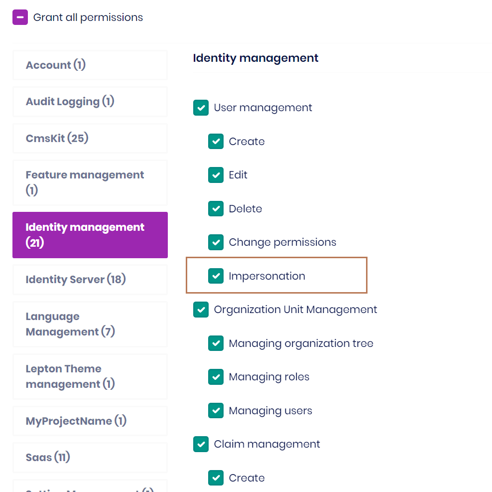
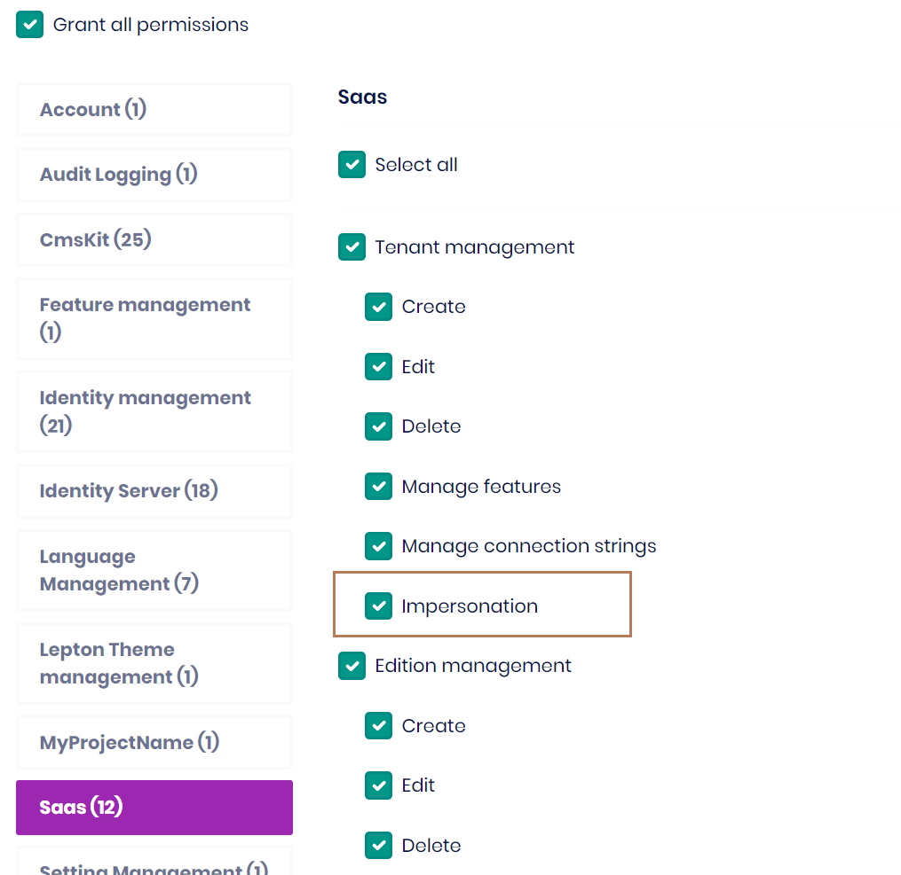

# Tenant impersonation & User impersonation

User impersonation allows you to temporarily sign in as a different user in your tenant's users. This article introduces how to enable impersonation in ABP Framework. Impersonation is enabled by defautl in ABP v5.0 and above.

## Introduction

In some cases, users need to sign in as another user and perform operations on behalf of the target user without sharing the target user's password. 

## How to enable impersonation feature?

If you your ABP version is lower than 5.0, you can implement the impersonation feature by following the steps below.

### MVC

```cs
public override void ConfigureServices(ServiceConfigurationContext context)
{
    var configuration = context.Services.GetConfiguration();

    //For impersonation in Saas module
    context.Services.Configure<AbpSaasHostWebOptions>(options =>
    {
        options.EnableTenantImpersonation = true;
    });

    //For impersonation in Identity module
    context.Services.Configure<AbpIdentityWebOptions>(options =>
    {
        options.EnableUserImpersonation = true;
    });

    context.Services.Configure<AbpAccountOptions>(options =>
    {
        //For impersonation in Saas module
        options.TenantAdminUserName = "admin";
        options.ImpersonationTenantPermission = SaasHostPermissions.Tenants.Impersonation;

        //For impersonation in Identity module
        options.ImpersonationUserPermission = IdentityPermissions.Users.Impersonation;
    });
}
```

### MVC Tiered

#### IdentityServer

1. Depends `AbpAccountPublicWebImpersonationModule(Volo.Abp.Account.Pro.Public.Web.Impersonation)` and `SaasHostApplicationContractsModule` on your `IdentityServerModule`
2. Configure the `AbpAccountOptions`, then add `JwtBearer` authentication and `UseJwtTokenMiddleware` to the ASP.NET Core pipeline

```cs
public override void ConfigureServices(ServiceConfigurationContext context)
{
    context.Services.Configure<AbpAccountOptions>(options =>
    {
        //For impersonation in Saas module
        options.TenantAdminUserName = "admin";
        options.ImpersonationTenantPermission = SaasHostPermissions.Tenants.Impersonation;

        //For impersonation in Identity module
        options.ImpersonationUserPermission = IdentityPermissions.Users.Impersonation;
    });

    context.Services.AddAuthentication()
        .AddJwtBearer(options =>
        {
            options.Authority = configuration["AuthServer:Authority"];
            options.RequireHttpsMetadata = Convert.ToBoolean(configuration["AuthServer:RequireHttpsMetadata"]);
            options.Audience = "MyProjectName";
        });
}

public override void OnApplicationInitialization(ApplicationInitializationContext context)
{
    var app = context.GetApplicationBuilder();
    app.UseAuthentication();

    //Add this line after `UseAuthentication`
    app.UseJwtTokenMiddleware();
}
```
#### HttpApi.Host

No need to do anything here.

#### Web

1. Depends `AbpAccountPublicWebImpersonationModule(Volo.Abp.Account.Pro.Public.Web.Impersonation)` on your `WebModule`

2. Chnage the base class of `AccountController` to `AbpAccountImpersonationChallengeAccountController`
```cs
public class AccountController : AbpAccountImpersonationChallengeAccountController
{

}
```

3. Add `ImpersonationViewComponent` to `\Components\Toolbar\Impersonation` folder

```cs
public class ImpersonationViewComponent : AbpViewComponent
{
    public virtual IViewComponentResult Invoke()
    {
        return View("~/Components/Toolbar/Impersonation/Default.cshtml");
    }
}
```
```cs
@using Microsoft.AspNetCore.Mvc.Localization
@using Volo.Abp.Account.Localization
@inject IHtmlLocalizer<AccountResource> L
<form method="post" data-ajaxForm="false" action="~/Account/BackToImpersonator">
    @Html.AntiForgeryToken()
    <button type="submit" class="btn text-danger" data-bs-toggle="tooltip" data-bs-placement="left" title="@L["BackToImpersonator"]">
        <i class="fa fa-undo"></i>
    </button>
</form>
```

4. Add `ImpersonationViewComponent` to `ToolbarContributor`.

```cs
if (context.ServiceProvider.GetRequiredService<ICurrentUser>().FindImpersonatorUserId() != null)
{
    context.Toolbar.Items.Add(new ToolbarItem(typeof(ImpersonationViewComponent), order: -1));
}
```

5. Configure `AbpSaasHostWebOptions` and `AbpIdentityWebOptions`

```cs
public override void ConfigureServices(ServiceConfigurationContext context)
{
    var configuration = context.Services.GetConfiguration();

    //For impersonation in Saas module
    context.Services.Configure<AbpSaasHostWebOptions>(options =>
    {
        options.EnableTenantImpersonation = true;
    });

    //For impersonation in Identity module
    context.Services.Configure<AbpIdentityWebOptions>(options =>
    {
        options.EnableUserImpersonation = true;
    });
}
```

### Blazor Server

1. Depends `AbpAccountPublicWebImpersonationModule(Volo.Abp.Account.Pro.Public.Web.Impersonation)` and `AbpAccountPublicBlazorServerModule(Volo.Abp.Account.Pro.Public.Blazor.Server)` on your `BlazorModule`

2. Configure `SaasHostBlazorOptions` and `AbpAccountOptions`

```cs
public override void ConfigureServices(ServiceConfigurationContext context)
{
    var configuration = context.Services.GetConfiguration();

    //For impersonation in Saas module
    context.Services.Configure<SaasHostBlazorOptions>(options =>
    {
        options.EnableTenantImpersonation = true;
    });

    //For impersonation in Identity module
    context.Services.Configure<AbpIdentityProBlazorOptions>(options =>
    {
        options.EnableUserImpersonation = true;
    });

    context.Services.Configure<AbpAccountOptions>(options =>
    {
        //For impersonation in Saas module
        options.TenantAdminUserName = "admin";
        options.ImpersonationTenantPermission = SaasHostPermissions.Tenants.Impersonation;

        //For impersonation in Identity module
        options.ImpersonationUserPermission = IdentityPermissions.Users.Impersonation;
    });
}
```

### Blazor Server Tiered

#### Identity Server

1. Depends `AbpAccountPublicWebImpersonationModule(Volo.Abp.Account.Pro.Public.Web.Impersonation)` and `SaasHostApplicationContractsModule` on your `IdentityServerModule`
2. Configure the `AbpAccountOptions`, then add `JwtBearer` authentication and `UseJwtTokenMiddleware` to the ASP.NET Core pipeline

```cs
public override void ConfigureServices(ServiceConfigurationContext context)
{
    context.Services.Configure<AbpAccountOptions>(options =>
    {
        //For impersonation in Saas module
        options.TenantAdminUserName = "admin";
        options.ImpersonationTenantPermission = SaasHostPermissions.Tenants.Impersonation;

        //For impersonation in Identity module
        options.ImpersonationUserPermission = IdentityPermissions.Users.Impersonation;
    });

    context.Services.AddAuthentication()
        .AddJwtBearer(options =>
        {
            options.Authority = configuration["AuthServer:Authority"];
            options.RequireHttpsMetadata = Convert.ToBoolean(configuration["AuthServer:RequireHttpsMetadata"]);
            options.Audience = "MyProjectName";
        });
}

public override void OnApplicationInitialization(ApplicationInitializationContext context)
{
    var app = context.GetApplicationBuilder();
    app.UseAuthentication();

    //Add this line after `UseAuthentication`
    app.UseJwtTokenMiddleware();
}
```

#### HttpApi.Host

No need to do anything here.

#### Blazor

1. Depends `AbpAccountPublicWebImpersonationModule(Volo.Abp.Account.Pro.Public.Web.Impersonation)` and `AbpAccountPublicBlazorServerModule(Volo.Abp.Account.Pro.Public.Blazor.Server)` on your `BlazorModule`

2. Chnage the base class of `AccountController` to `AbpAccountImpersonationChallengeAccountController`
```cs
public class AccountController : AbpAccountImpersonationChallengeAccountController
{

}
```

3. Configure `SaasHostBlazorOptions` and `AbpAccountOptions`

```cs
public override void ConfigureServices(ServiceConfigurationContext context)
{
    //For impersonation in Saas module
    context.Services.Configure<SaasHostBlazorOptions>(options =>
    {
        options.EnableTenantImpersonation = true;
    });

    //For impersonation in Identity module
    context.Services.Configure<AbpIdentityProBlazorOptions>(options =>
    {
        options.EnableUserImpersonation = true;
    });
}
```

### Angular

Add `Impersonation` to the Angular grant types.

```cs
//Console Test / Angular Client
var consoleAndAngularClientId = configurationSection["MyProjectName_App:ClientId"];
if (!consoleAndAngularClientId.IsNullOrWhiteSpace())
{
    var webClientRootUrl = configurationSection["MyProjectName_App:RootUrl"]?.TrimEnd('/');

    await CreateClientAsync(
        name: consoleAndAngularClientId,
        scopes: commonScopes,
        grantTypes: new[] { "password", "client_credentials", "authorization_code", "LinkLogin", "Impersonation" },
        secret: (configurationSection["MyProjectName_App:ClientSecret"] ?? "1q2w3e*").Sha256(),
        requireClientSecret: false,
        redirectUri: webClientRootUrl,
        postLogoutRedirectUri: webClientRootUrl,
        corsOrigins: new[] { webClientRootUrl.RemovePostFix("/") }
    );
}
```

### Blazor WASM

It is currently not supported.

## Tenant & User Impersonation permissions



