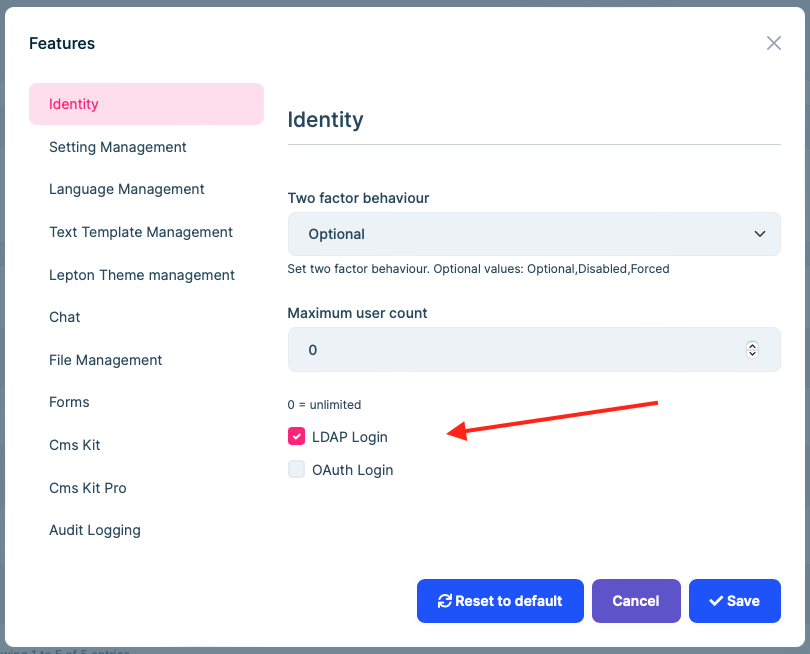
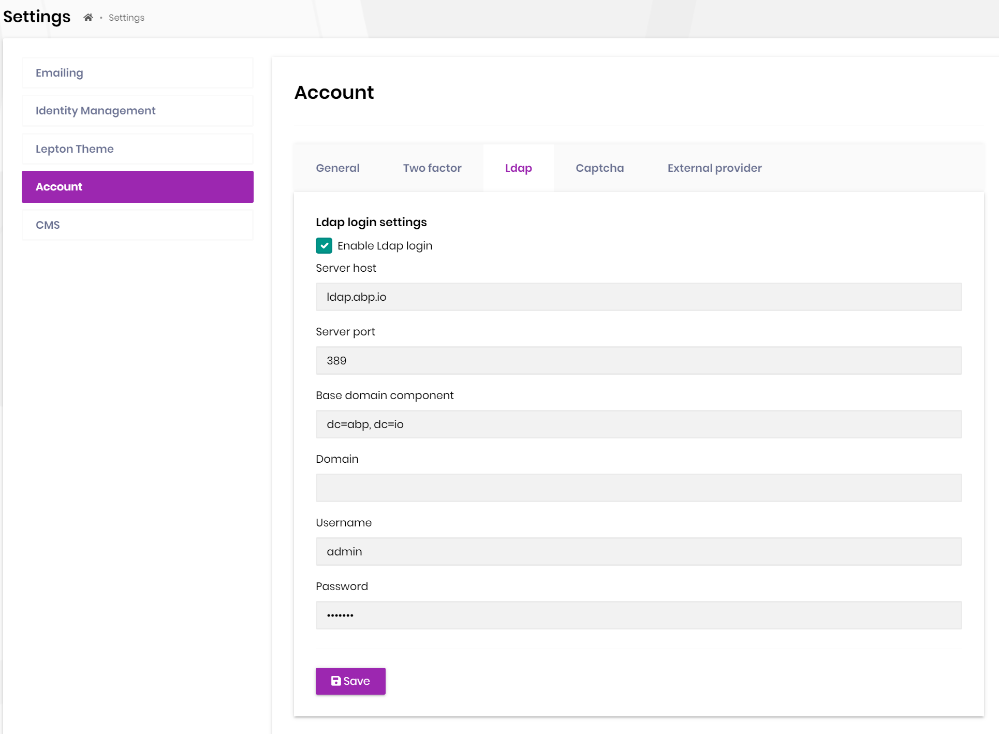

# LDAP External login Provider

## Introduction

The Account pro module has built-in `LdapExternalLoginProvider` and `OpenLdapManager` services. It implements LDAP authentication and gets user info for [external login](https://github.com/abpframework/abp/issues/4977).

We use [ldap4net](https://github.com/flamencist/ldap4net) library. For more information you can check [its Github homepage](https://github.com/flamencist/ldap4net).

## How to enable LDAP external login?

We need to enable the LDAP login feature and configure related settings.





Now you can enter the LDAP user name and password on the Login page for external login.


## Customize built-in services

The default `OpenLdapManager` service uses `$"cn={userName},{BaseDc}"` to normalize user name, and use `$"(&(uid={userName}))"` to search for users, use `mail` as attribute name to get email.

> The value of `BaseDc` is the setting of the `Base domain component`.

If your **username** has a prefix or a specific format, you can override the `NormalizeUserName` method of `OpenLdapManager` to handle it. You can also customize the `GetUserFilter` and `GetUserEmail` methods at the same time.

```cs
[Dependency(ReplaceServices = true)]
[ExposeServices(typeof(OpenLdapManager), typeof(ILdapManager), typeof(LdapManager))]
public class VoloOpenLdapManager : OpenLdapManager
{
    public VoloOpenLdapManager(IOptions<AbpLdapOptions> ldapSettingsOptions)
        : base(ldapSettingsOptions)
    {
    }

    protected override string NormalizeUserName(string userName)
    {
        return $"Volo\\{userName}";
    }

    protected override string GetUserFilter(string userName)
    {
        // Default is $"cn={userName},{LdapOptions.BaseDc}"
        return $"(&(objectClass=user)(sAMAccountName={userName}))";
    }

    protected override string GetUserEmail(LdapEntry ldapEntry)
    {
        // You can use another attribute to get user email.
        return ldapEntry.ToDirectoryEntry().GetAttribute("mail")?.GetValue<string>();
    }
}
```

At the same time, `$"uid={userName}, {BaseDc}"` is used in the built-in `LdapExternalLoginProvider` service to normalize the username, you have to change it together.

```cs
public class VoloLdapExternalLoginProvider : LdapExternalLoginProvider
{
    public VoloLdapExternalLoginProvider(
        IGuidGenerator guidGenerator,
        ICurrentTenant currentTenant,
        IdentityUserManager userManager,
        IIdentityUserRepository identityUserRepository,
        OpenLdapManager ldapManager,
        IOptions<AbpLdapOptions> ldapOptions,
        IFeatureChecker featureChecker,
        ISettingProvider settingProvider,
        IOptions<IdentityOptions> identityOptions)
        : base(guidGenerator,
            currentTenant,
            userManager,
            identityUserRepository,
            ldapManager,
            ldapOptions,
            featureChecker,
            settingProvider,
            identityOptions)
    {

    }

    protected override string NormalizeUserName(string userName)
    {
        // Default is $"uid={userName}, {BaseDc}"
        return $"Volo\\{userName}";
    }
}
```

Replace the default implementation with `VoloLdapExternalLoginProvider`.

```cs
public override void ConfigureServices(ServiceConfigurationContext context)
{
    //...
    Configure<AbpIdentityOptions>(options =>
    {
        options.ExternalLoginProviders.Remove(LdapExternalLoginProvider.Name);
        options.ExternalLoginProviders.Add<VoloLdapExternalLoginProvider>(LdapExternalLoginProvider.Name);
    });
    //...
}
```

## Test application

It is more complicated to test the LDAP configuration in the ABP project. We provide a test application for this. You can test those settings in the console.

See [AbpLdapSample/Program.cs](https://github.com/abpframework/abp-samples/blob/master/AbpLdapSample/AbpLdapSample/Program.cs)
