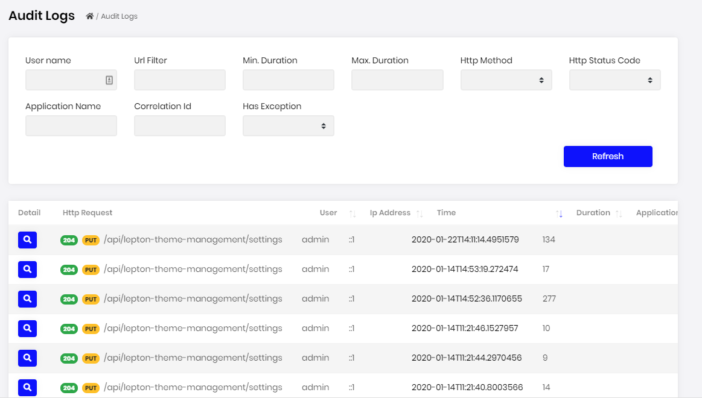
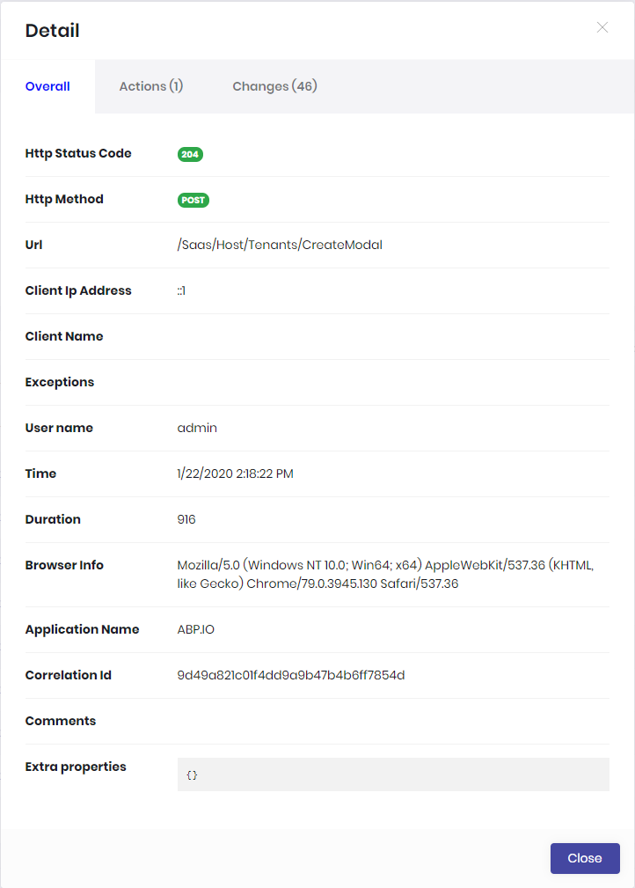

# Audit Logging module

This module implements the Audit Logging system of an application;

* See all audit logs of the system and filter audit logs easily.
* View audit log details, executed actions and changed entities.
* This module also defines reusable "Average Execution Duration Per Day" and "Error Rate" widgets.

See [the module description page](https://commercial.abp.io/modules/Volo.Identity.Pro) for an overview of the module features.

## How to install

Identity is pre-installed in [the startup templates](../Startup-Templates/Index). So, no need to manually install it.

## Packages

This module follows the [module development best practices guide](https://docs.abp.io/en/abp/latest/Best-Practices/Index) and consists of several NuGet and NPM packages. See the guide if you want to understand the packages and relations between them.

### NuGet packages

* Volo.Abp.AuditLogging.Domain.Shared
* Volo.Abp.AuditLogging.Domain
* Volo.Abp.AuditLogging.Application.Contracts
* Volo.Abp.AuditLogging.Application
* Volo.Abp.AuditLogging.EntityFrameworkCore
* Volo.Abp.AuditLogging.MongoDB
* Volo.Abp.AuditLogging.HttpApi
* Volo.Abp.AuditLogging.HttpApi.Client
* Volo.Abp.AuditLogging.Web

### NPM packages

* @volo/abp.ng.audit-logging
* @volo/abp.ng.audit-logging.config

## User interface

### Menu items

Audit logs module adds the following items to the "Main" menu, under the "Administration" menu item:

* **Audit Logs**: List, view and filter audit logs.

`IAbpAuditLoggingMainMenuNames` class has the constants for the menu item names.

### Pages

#### Audit Logs

Audit logs page is used to list, view and filter audit logs in the system. 




Each line on the list contains basic information about an audit log like HTTP Status Code, HTTP Method, Execution Time etc...

##### Audit Log Details

You can view details of an audit log by clicking the magnifier icon on each audit log line:



* **Overall:** This tab contains detailed information about audit log.
* **Actions:** This tab shows list of actions (controller actions and application service method calls with their parameters) executed during a web request.
* **Changes:** This tab shows changed entities during the web request.

## Data seed

This module doesn't seed any data.

## Options

### AbpAuditingOptions

`AbpAuditingOptions` can be configured in the UI layer, in the `ConfigureServices` method of your [module](https://docs.abp.io/en/abp/latest/Module-Development-Basics). Example:

````csharp
Configure<AbpAuditingOptions>(options =>
{
    //Set options here...
});
````

To see `AbpAuditingOptions` properties, please see its [documentation](https://docs.abp.io/en/abp/latest/Audit-Logging#abpauditingoptions).

## Internals

### Domain layer

#### Aggregates

This module follows the [Entity Best Practices & Conventions](https://docs.abp.io/en/abp/latest/Best-Practices/Entities) guide.

##### AuditLog

An audit log is a security-relevant chronological record, set of records, and/or destination and source of records that provide documentary evidence of the sequence of activities that have affected at any time a specific operation, procedure, or event.

* `AuditLog` (aggregate root): Represents an audit log in the system.
  * `EntityChange` (collection): Changed entities of audit log.
  * `AuditLogAction` (collection): Executed actions of audit log.

#### Repositories

This module follows the [Repository Best Practices & Conventions](https://docs.abp.io/en/abp/latest/Best-Practices/Repositories) guide.

Following custom repositories are defined for this module:

* `IAuditLogRepository`

### Application layer

#### Application services

* `AuditLogsAppService` (implements `IAuditLogsAppService`): Implements the use cases of the audit logs management UI.

### Database providers

#### Common

##### Table / collection prefix & schema

All tables/collections use the `Abp` prefix by default. Set static properties on the `AbpAuditLoggingDbProperties` class if you need to change the table prefix or set a schema name (if supported by your database provider).

##### Connection string

This module uses `AbpAuditLogging` for the connection string name. If you don't define a connection string with this name, it fallbacks to the `Default` connection string.

See the [connection strings](https://docs.abp.io/en/abp/latest/Connection-Strings) documentation for details.

#### Entity Framework Core

##### Tables

* **AbpAuditLogs**
  * AbpAuditLogActions
  * AbpEntityChanges
    * AbpEntityPropertyChanges

#### MongoDB

##### Collections

* **AbpAuditLogs**

### Permissions

See the `AbpAuditLoggingPermissions` class members for all permissions defined for this module.

## Distributed Events

This module doesn't define any additional distributed event. See the [standard distributed events](https://docs.abp.io/en/abp/latest/Distributed-Event-Bus).