# CMS Kit Pro Module

This module provides CMS(Content Management System) capabilities for your application.

* Provides a **page** management system to manage dynamic pages.
* Provides a **blog** system to create blogs and publish posts.
* Provides a **tag** system to tag any kind of resources, like blog posts.
* Provides a **comment** system to add comments feature to any kind of resource, like blog posts.
* Provides a **reaction** system to add reactions feature to any kind of resource, like blog posts or comments.
* Provides a **rating** system to add ratings feature to any kind of resource.
* Provides a **newsletter** system to allow users to subscribe to newsletters.
* Provides a **contact form** system to allow users to write message to you.

See [the module description page](https://commercial.abp.io/modules/Volo.CmsKit.Pro) for an overview of the module features.

## How to install

CMS Kit Pro is pre-installed in [the startup templates](../startup-templates/application/index.md) if you create the solution with public website option. So, no need to manually install it. If you want to add CMS kit to your projects, you can use the `add-module` command to install the packages and configure the desired features using the feature management system. See features section for feature management details. 

## Packages

This module follows the [module development best practices guide](https://docs.abp.io/en/abp/latest/Best-Practices/Index) and consists of several NuGet and NPM packages. See the guide if you want to understand the packages and relations between them.

You can visit [CMS kit module package list page](https://abp.io/packages?moduleName=Volo.CmsKit.Pro) to see list of packages related with this module.

## User interface

### Menu items

CMS kit module adds the following items to the "Main" menu, under the "CMS" menu item:

* **Pages**: Role management page.
* **Blogs**: User management page.
* **Blog Posts**: Claim type management page.
* **Tags**: Organization unit management page.
* **Comments**: Security log search page.
* **Newsletters**: 

`CmsKitProAdminMenus` and `CmsKitAdminMenus` classes have the constants for the menu item names.

### Pages

### Page Management

Pages page is used to manage dynamic pages in the system.

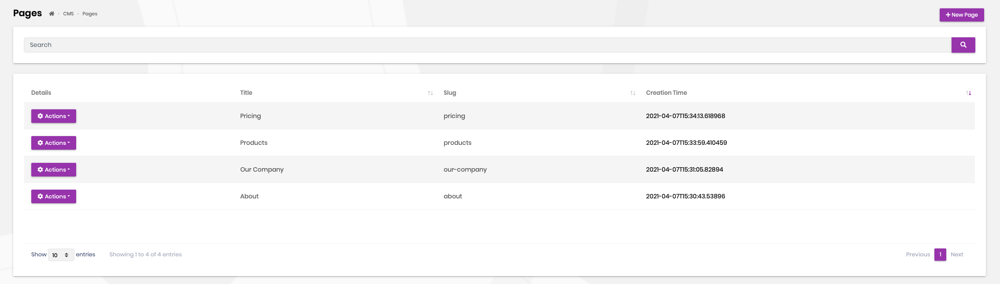

You can create or edit an existing page on this page.

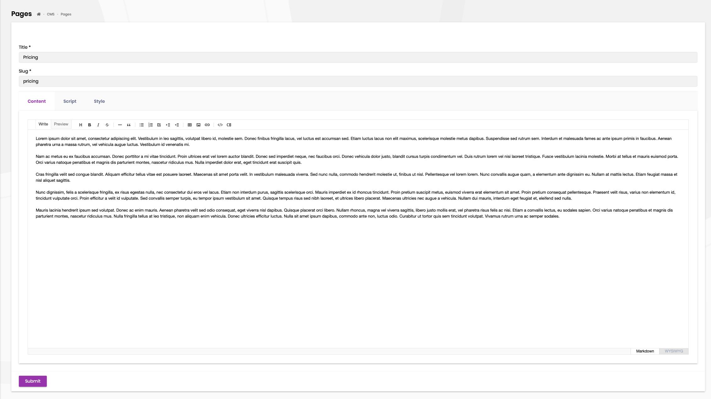

* When you create a page, you can access the created page via `pages/{slug}` URL.

### Blog Management

Blogs page is used to create and manage blogs in your system. 

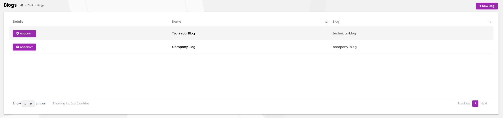

A screenshot from the new blog creation modal:

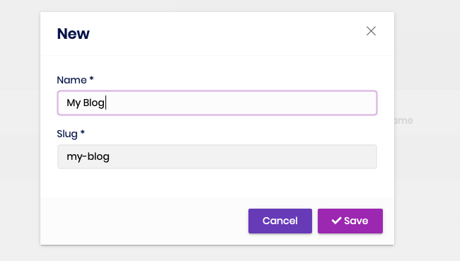

#### Blog Features

You can enable or disable a specific feature for blogs by clicking the features action.

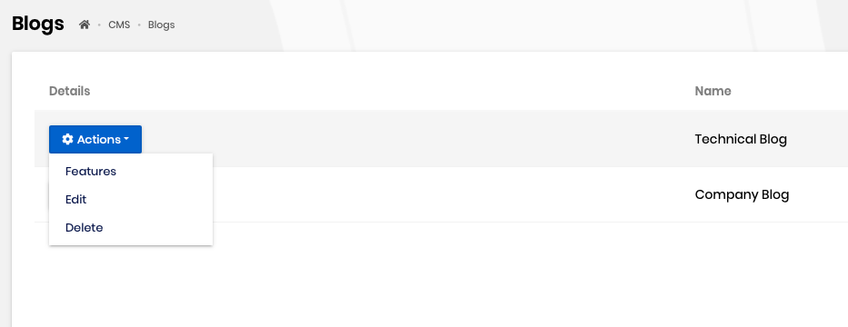

You can select/deselect the desired features for blog posts. 

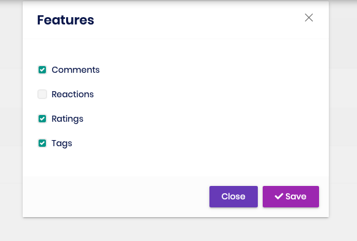

### Blog Post Management

When you create blogs, you can manage blog posts on this page.

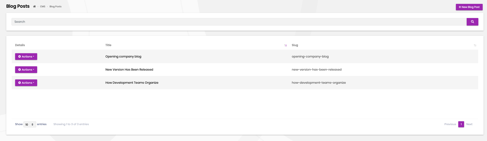

You can create and edit an existing blog post on this page. If you enable specific features such as tags, you can set tags for the blog post on this page.

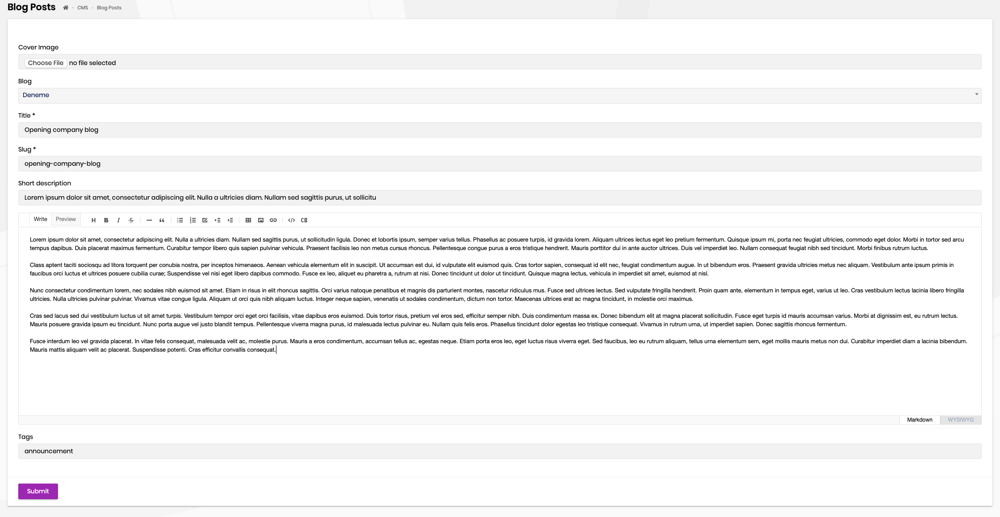

### Tag Management

CMS Kit provides an extensible tagging mechanism to add tagging capabilities to various places. 

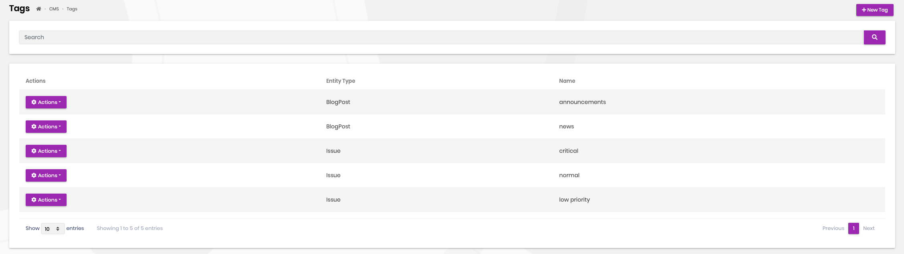

You can create or edit an existing tag on this page.

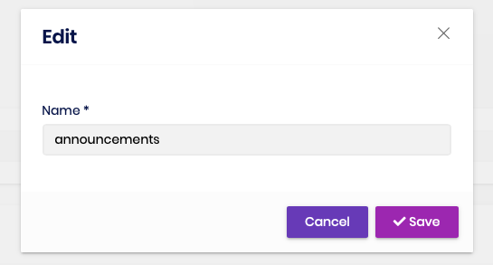

### Comment Management

CMS Kit provides an extensible commenting mechanism to add comments to various places. You can add comment control to anywhere you want and manage the comments.

You can view and manage comments on this page.

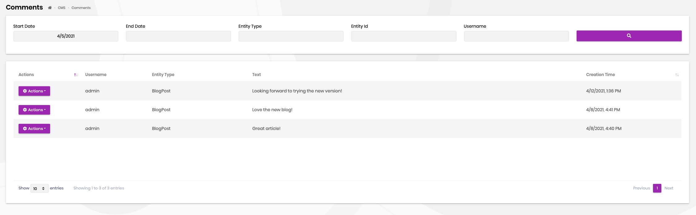

You can manage and view replies on this page.

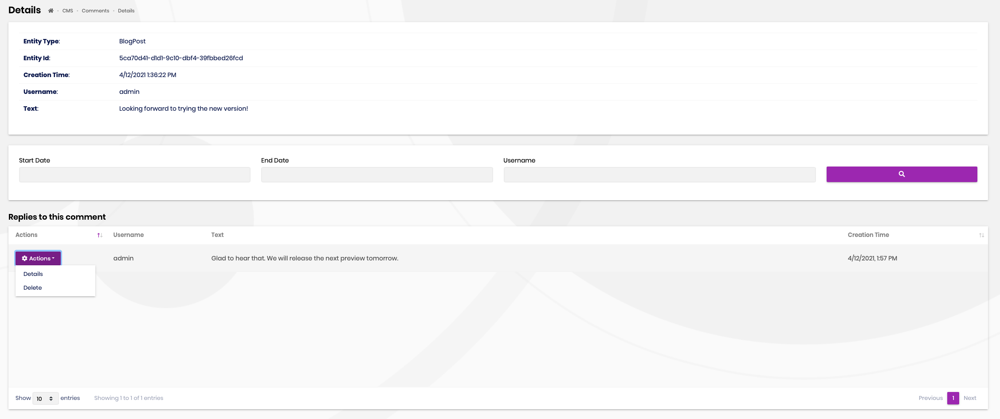

### Newsletter System

Newsletter system allows you to place a newsletter subscription box to any page on your website. You can then view the subscribers and export the list as CSV file.


### Contact Management

CMS Kit provides an infrastructure to create contact forms on your websites and easily manage contact options. You can use the available contact form component on your pages like below. 


When a user sends a message through the contact form, the system automatically sends the form content to the configured email address. You can change the email address on the setting page.


### Reactions

CMS Kit provides an extensible reaction component system to allow users to send reactions to your content. Here how the reactions component looks in the comment system. 

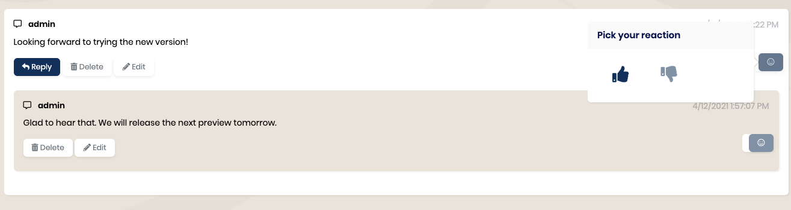

You can also customize the reaction icons shown in the reaction component.

### Ratings

You can use the rating component to add rating a mechanism to your content. Here how the rating component looks on the blog post page. 

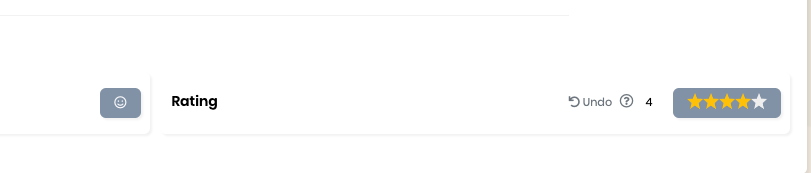

## Feature System

CMS kit uses the [global feature](https://docs.abp.io/en/abp/latest/Global-Features) system for all implemented features. Startup templates come with all the CMS kit related features are enabled by default. If you want to use only some spesific features, you can disable the features using the global feature system.

You can see how to disable newsletter and page features below. 

Open the `GlobalFeatureConfigurator` class in the `Domain.Shared` project. You will see that all open-source and pro features are enabled. You can call the `Disable` method on the feature definitions. 

```csharp
GlobalFeatureManager.Instance.Modules.CmsKit(cmsKit =>
{
    cmsKit.EnableAll();
    cmsKit.Pages.Disable();
});

GlobalFeatureManager.Instance.Modules.CmsKitPro(cmsKitPro =>
{
    cmsKitPro.EnableAll();
    cmsKitPro.Newsletter.Disable();
});
```