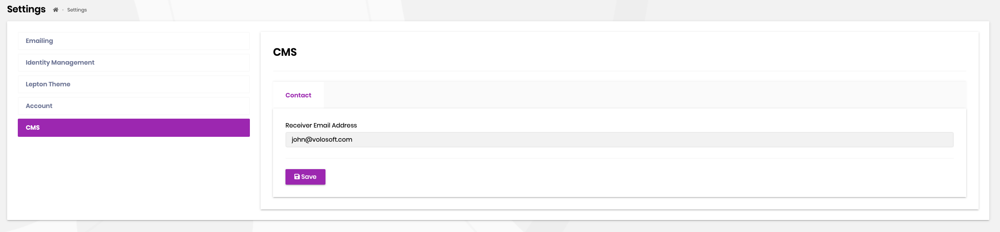

# Contact Management

CMS Kit provides an infrastructure to create contact forms on your websites and easily manage contact options. This section describes the details of the contact system. 

## Feature

CMS kit uses the [global feature](https://docs.abp.io/en/abp/latest/Global-Features) system for all implemented features. Startup templates come with all the CMS kit related features are enabled by default. If you want to enable the newsletter system feature individually, open the `GlobalFeatureConfigurator` class in the `Domain.Shared` project and place the following code to the `Configure ` method.

```csharp
GlobalFeatureManager.Instance.Modules.CmsKitPro(cmsKitPro =>
{
    cmsKitPro.Contact.Enable();
});
```

### Settings 
You can configure contact request reciever email address by using the settings UI. 



You can also see the `CmsKitProSettingNames.Contact` type for available settings.

# Internals

## Domain Layer

#### Services
##### ContactEmailSender
`ContactEmailSender` is used to send email to notify the configured receiver when a new contact form entry is arrived.

### MVC UI
The contact management system provides a contact form widget to create contact forms on public websites easily.
You can simply place the widget on a page like below. 

```csharp
@await Component.InvokeAsync(typeof(ContactViewComponent))
```

For more information about widgets see [widgets](https://docs.abp.io/en/abp/latest/UI/AspNetCore/Widgets) documentation.
