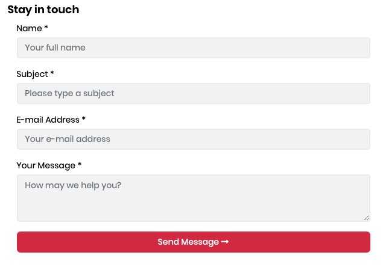

# Contact Management

CMS Kit provides a widget to create a contact form on your website.

### The Contact Widget

The contact management system provides a contact form [widget](https://docs.abp.io/en/abp/latest/UI/AspNetCore/Widgets) to create contact forms on the UI:

```csharp
@await Component.InvokeAsync(typeof(ContactViewComponent))
```

Here, a screenshot from the widget:



## Settings 

You can configure the receiver (email address) by using the CMS tab in the settings page 


## Internals

* `ContactEmailSender` is used to send email to notify the configured receiver when a new contact form entry is arrived.