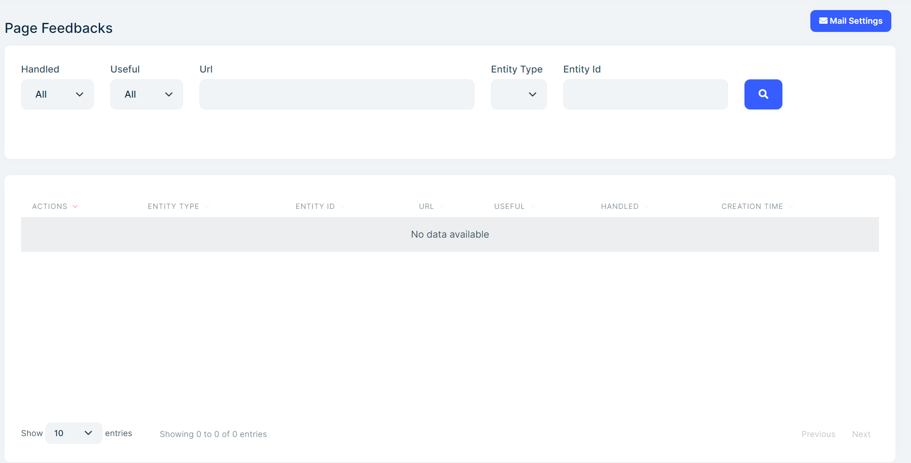
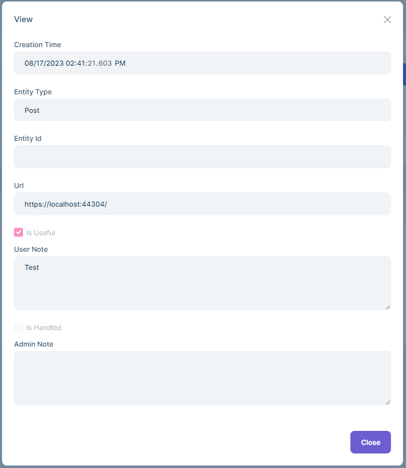
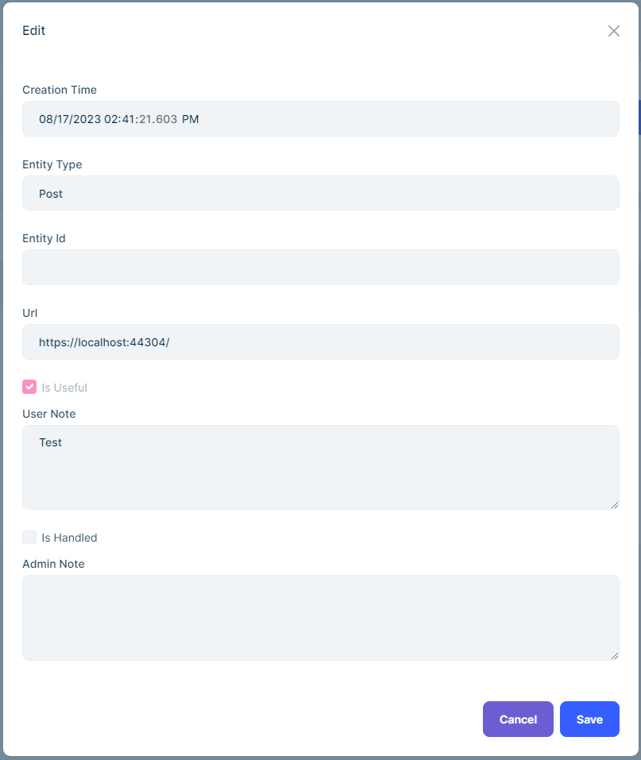

# Page Feedback System

CMS kit provides a **Page Feedback** system to collect feedback from users about pages.

## Enabling the Page Feedback System

By default, CMS Kit features are disabled. Therefore, you need to enable the features you want, before starting to use it. You can use the [Global Feature](https://docs.abp.io/en/abp/latest/Global-Features) system to enable/disable CMS Kit features on development time. Alternatively, you can use the ABP Framework's [Feature System](https://docs.abp.io/en/abp/latest/Features) to disable a CMS Kit feature on runtime.

> Check the ["How to Install" section of the CMS Kit Module documentation](index.md#how-to-install) to see how to enable/disable CMS Kit features on development time.

## User Interface

### Menu Items

CMS Kit module admin side adds the following items to the main menu, under the **CMS** menu item:

**Page Feedbacks**: Page feedback management page.

`CmsKitProAdminMenus` class has the constants for the menu item names.

### Pages

#### Page Feedbacks

You can list, view, update and delete page feedbacks in the admin side of your solution, and you can also set the email addresses to send notifications.






## Page Feedback Widget

The page feedback system provides a page feedback [widget](https://docs.abp.io/en/abp/latest/UI/AspNetCore/Widgets) for users to send feedback about the current page. You can place the widget on a page like the below:

```csharp
@(await Component.InvokeAsync(typeof(PageFeedbackViewComponent), new PageFeedbackViewDto
    {
        EntityType = "Page",
    }))
```

### PageFeedbackViewDto Properties

| Property | Type | Default Value | Description |
| -------- | ---- | ------------- | ----------- |
| EntityType | string | null | Entity type name. |
| EntityId | string | null | Entity id. |
| Header | string | null | Header text. |
| YesButtonText | string | null | Yes button text. |
| NoButtonText | string | null | No button text. |
| UserNotePlaceholder | string | null | User note placeholder. |
| SubmitButtonText | string | null | Submit button text. |
| ReverseButtons | bool | false | Reverse buttons. |
| ThankYouMessageDescription | string | null | Thank you message description. |
| ThankYouMessageTitle | string | null | Thank you message title. |
| HeaderVisible | bool | true | Header visible. |
| HeaderText | string | null | Header text. |

### Page Feedback Modal Widget

The page feedback system provides a page feedback modal [widget](https://docs.abp.io/en/abp/latest/UI/AspNetCore/Widgets) for users to send feedback about the current page. You can place the widget on a page like the below:

```html
<button type="button" class="btn btn-primary mb-5" data-bs-toggle="modal" data-bs-target="#page-feedback-modal">
       Feedback
</button>
```

```csharp
@(await Component.InvokeAsync(typeof(PageFeedbackModalViewComponent), new PageFeedbackModalViewDto
    {
        EntityType = "Page",
        ModalId = "page-feedback-modal",
    }))
```

### PageFeedbackModalViewDto Properties

It inherits from the [PageFeedbackViewDto](#pagefeedbackviewdto-properties) and has the following additional properties:

| Property | Type | Default Value | Description |
| -------- | ---- | ------------- | ----------- |
| ModalId | string | page-feedback-modal | Modal id. |

## Page Feedback Notification

The page feedback system sends an email notification to the configured email addresses when a user sends a feedback. You can configure the email addresses from the admin side of your solution.


## Options

The page feedback system provides a mechanism to group feedbacks by entity types. For example, you can group feedbacks by pages, blog posts, etc.

`CmsKitPageFeedbackOptions` can be configured in the domain layer, in the `ConfigureServices` method of your [module](https://docs.abp.io/en/abp/latest/Module-Development-Basics) class.

**Example: Adding page feedback support for the post entity type**

```csharp
Configure<CmsKitPageFeedbackOptions>(options =>
{
    options.EntityTypes.Add(new PageFeedbackEntityTypeDefinition("Post"));
});
```

`CmsKitPageFeedbackOptions` properties:

- `EntityTypes`: List of defined entity types(`PageFeedbackEntityTypeDefinition`) in the page feedback system.

`PageFeedbackEntityTypeDefinition` properties:

- `EntityType`: Name of the entity type.
- `DisplayName`: Display name of the entity type. You can use a user friendly display name to show entity type definition on the admin website.
- `CreatePolicies`: List of policy/permission names allowing users to create tags under the entity type.
- `UpdatePolicies`: List of policy/permission names allowing users to update tags under the entity type.
- `DeletePolicies`: List of policy/permission names allowing users to delete tags under the entity type.