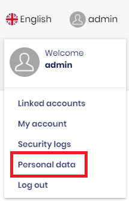
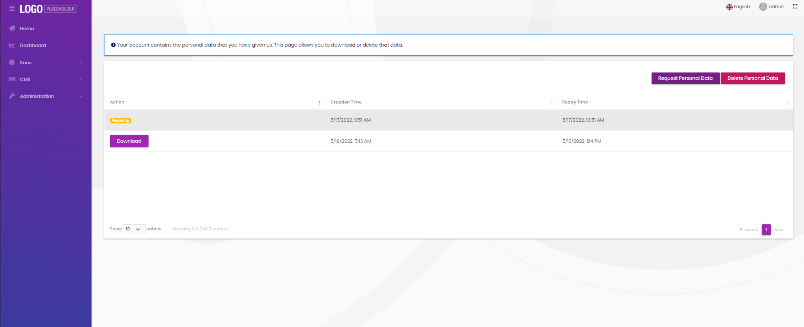
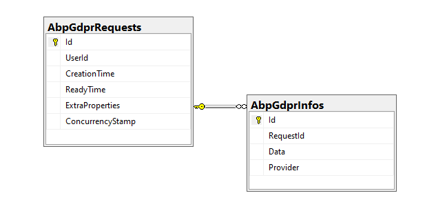

# GDPR Module

This module allows user to download their personal data collected by the application. The Gdpr module requests the information from the other modules that references `Volo.Abp.Gdpr.Abstractions` package and merges the response data into a Json file. 

See [the module description page](https://commercial.abp.io/modules/Volo.Gdpr) for an overview of the module features.

## How to install

The form module doesn't come pre-installed. You need to install it manually. There are 2 ways of installing it:

* **Via ABP CLI:** Open a command line window in your solution folder (in the folder where the `* .sln` file is located) and type the following command:

  ```bash
  abp add-module Volo.Gdpr
  ```
* **Via ABP Suite:** Open ABP Suite and select your project. Then go to the modules page from the top menu. Find **Gdpr** card and click add as project (with source-code) or add as package (without source-code).


## Packages

This module follows the [module development best practices guide](https://docs.abp.io/en/abp/latest/Best-Practices/Index) and consists of several NuGet and NPM packages. See the guide if you want to understand the packages and relations between them.

You can visit the [forms module package list page](https://abp.io/packages?moduleName=Volo.Gdpr) to see list of packages related with this module.

## User interface

### Menu items

Gdpr module adds the following item to the user main menu.

* **Personal Data**: List personal data, request personal data, download personal data, delete personal data.




The `GdprMenus`  class has the constant variable for the menu item name.

### Pages

#### Personal Data

Personal Data page is used to manage the personal data requests. You can view the past requests, current status of the latest request, create a new request, download a data or delete all your personal data from the application.



To see the other features of the Gdpr module, visit [the module description page](https://commercial.abp.io/modules/Volo.Gdpr).

## Internals

### Domain layer

#### Aggregates

- ##### GdprRequest

  - The main aggregate root of the Gdpr requests. This aggregates stores general information about the request and a list of `GdprInfo`s collected from other modules.
#### Entities

- ##### GdprInfo

  - Stores the collected data from a provider.

#### Repositories

This module follows the [Repository Best Practices & Conventions](https://docs.abp.io/en/abp/latest/Best-Practices/Repositories) guide.

Following custom repositories are defined for this module:

* `IGdprRequestRepository`

#### Event Handlers

- ##### GdprUserDataEventHandler

  - Triggered by the personal data providers in the application. Saves the collected data to database.

### Application layer

#### Application services

- `GdprRequestAppService` 

### Database providers

#### Common

##### Table / collection prefix & schema

All tables/collections use the `Abp` prefix by default. Set static properties on the `GdprDbProperties` class if you need to change the table prefix or set a schema name (if supported by your database provider).

##### Connection string

This module uses `AbpGdpr` for the connection string name. If you don't define a connection string with this name, it fallbacks to the `Default` connection string.

See the [connection strings](https://docs.abp.io/en/abp/latest/Connection-Strings) documentation for details.

#### Entity Framework Core / MongoDB

##### Tables / Collections

- **AbpGdprRequests**: Gdpr Requests.
- **AbpGdprInfos**: Gdpr data.

##### Entity Relationships


### Angular UI

We are working on Angular UI for this module.

### Blazor UI

We are working on Blazor UI for this module.

## Distributed Events

The Gdpr module collects the data asynchronous to work compatible with microservice solutions. An event is published when a user requests their information. 

#### GdprUserDataRequestedEto

This [Event Transfer Object](https://docs.abp.io/en/abp/latest/Distributed-Event-Bus#event-transfer-object) is published to trigger all personal data collectors to begin preparing their data.