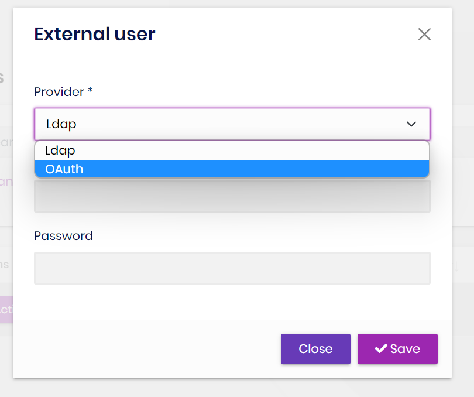
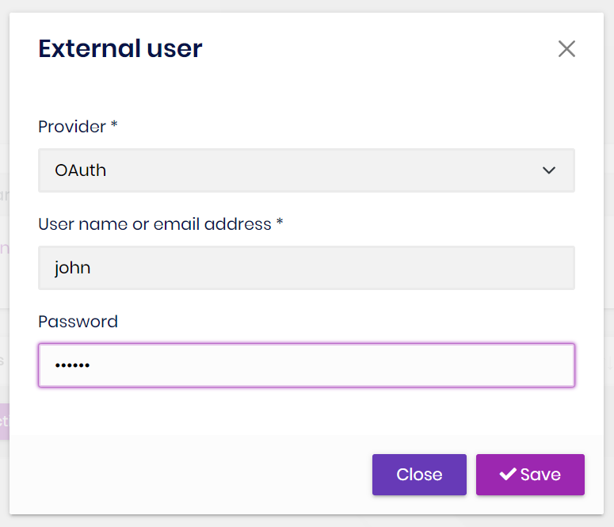

# Import External Users

## Introduction

The Identity PRO module has built-in `LdapExternalLoginProvider` and `OAuthExternalLoginProvider` services. They not only support external login but also import users.

## How to import users from external login provider?

1. Click the `Import` button on  `Users` page of Identity Pro module.

2. Select the `external login provider`

3. Enter the correct `username` and `password` to complete the import.

