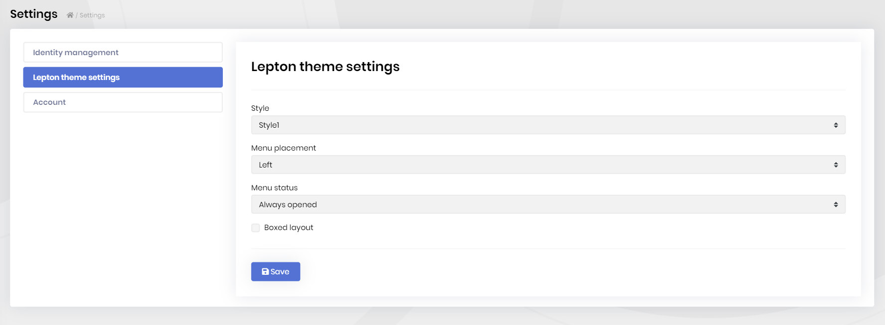

# Lepton Theme Module

This module provides a theme for [abp.io](https://www.abp.io) based applications. To see live preview of Lepton Theme, please visit [leptontheme.com](http://leptontheme.com/).

* Built on the [Bootstrap 4](https://getbootstrap.com) library.
* 100% compatible with  [Bootstrap 4](https://getbootstrap.com) HTML structure and CSS classes
* Responsive & mobile-compatible.
* Provides different style like Material, Dark, Light.
* Provides styles for [Datatables](https://datatables.net).

See [the module description page](https://commercial.abp.io/modules/Volo.Identity.Pro) for an overview of the module features.

## How to Install

Lepton Theme module is pre-installed in [the startup templates](../Startup-Templates/Index). So, no need to manually install it.

## Packages

This module follows the [module development best practices guide](https://docs.abp.io/en/abp/latest/Best-Practices/Index) and consists of several NuGet and NPM packages. See the guide if you want to understand the packages and relations between them.

### NuGet Packages

* Volo.Abp.LeptonTheme.Management.Domain.Shared
* Volo.Abp.LeptonTheme.Management.Domain
* Volo.Abp.LeptonTheme.Management.Application.Contracts
* Volo.Abp.LeptonTheme.Management.Application
* Volo.Abp.LeptonTheme.Management.HttpApi
* Volo.Abp.LeptonTheme.Management.HttpApi.Client
* Volo.Abp.LeptonTheme.Management.Web
* Volo.Abp.AspNetCore.Mvc.UI.Theme.Lepton

### NPM Packages

* @volo/abp.ng.theme.lepton

## User Interface

Lepton Theme module doesn't provide any UI pages. It just changes the existing UI pages of an application. Here are some sample pages:

#### Login page

 

#### Languages Page

### Menu Items

This module doesn't define any menu items.

### Pages

This module doesn't define any pages.

#### Identity Module Settings UI

Lepton Theme module adds a new tab to the Settings page to customize the behavior on runtime.

## Internals

### Settings

See the `LeptonThemeSettingNames` class members for all settings defined for this module.

### Permissions

See the `LeptonThemeManagementPermissions` class members for all permissions defined for this module.

## Distributed Events

This module doesn't define any additional distributed event. See the [standard distributed events](https://docs.abp.io/en/abp/latest/Distributed-Event-Bus).