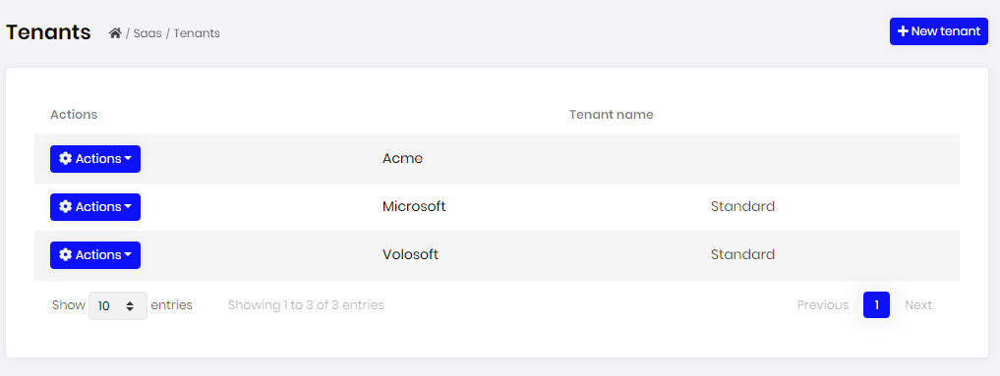
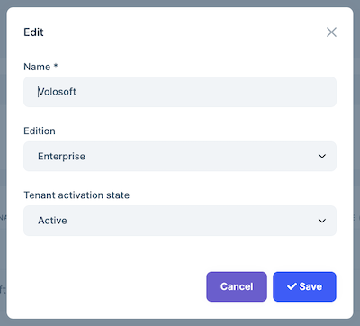
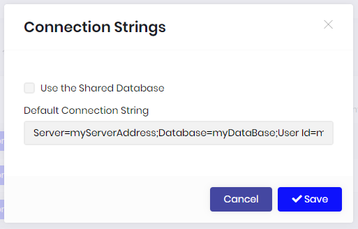
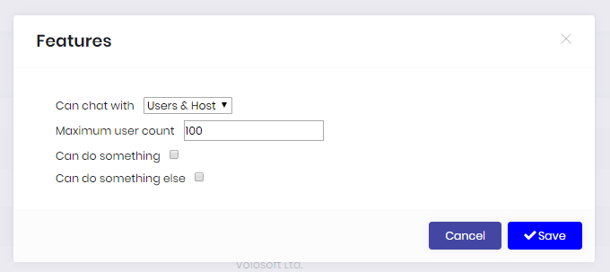
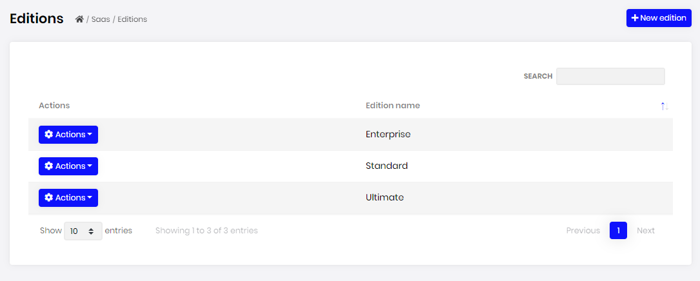
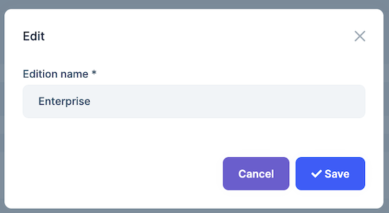

# SaaS module

This module implements the User and Role system of an application;

* Manage **tenants** and **editions** in the system. A tenant is allowed to have one **edition**.
* Set **features** of tenants.
* Set **connection string** of tenants.
* Set **features** of editions.

See [the module description page](https://commercial.abp.io/modules/Volo.Saas) for an overview of the module features.

## How to install

Saas is pre-installed in [the startup templates](../Startup-Templates/Index). So, no need to manually install it.

## Packages

This module follows the [module development best practices guide](https://docs.abp.io/en/abp/latest/Best-Practices/Index) and consists of several NuGet and NPM packages. See the guide if you want to understand the packages and relations between them.

### NuGet packages

* Volo.Saas.Domain.Shared
* Volo.Saas.Domain
* Volo.Saas.EntityFrameworkCore
* Volo.Saas.MongoDB
* Volo.Saas.Tenant.Application
* Volo.Saas.Tenant.Application.Contracts
* Volo.Saas.Tenant.HttpApi
* Volo.Saas.Tenant.HttpApi.Client
* Volo.Saas.Tenant.Web
* Volo.Saas.Host.Application
* Volo.Saas.Host.Application.Contracts
* Volo.Saas.Host.HttpApi
* Volo.Saas.Host.HttpApi.Client
* Volo.Saas.Host.Web

### NPM packages

* @volo/abp.ng.saas

## User interface

### Menu items

SaaS module adds the following items to the "Main" menu, under the "Administration" menu item:

* **Tenants**: Tenant management page.
* **Editions**: Edition management page.

`SaasHostMenuNames` and `SaasTenantMenuNames`  classes have the constants for the menu item names.

### Pages

#### Tenant management

Tenant page is used to manage tenants in the system. 



You can create a new tenant or edit a tenant in this page:



##### Connection String

You can manage connection string of a tenant in case you want to use a separate database for a specific tenant. If you want to use Host database for a tenant, select "Use the Shared Database" option.



##### Tenant Features

You can set features of tenants.



#### Edition management

Editions page is used to manage the editions in your system.



You can create a new edition or edit an existing edition in this page:



##### Edition Features

You can set features of an edition in this page:


## Data seed

This module adds some initial data (see [the data seed system](https://docs.abp.io/en/abp/latest/Data-Seeding)) to the database when you run the `.DbMigrator` application:

* Creates an `Standard` edition.

## Internals

### Domain layer

#### Aggregates

This module follows the [Entity Best Practices & Conventions](https://docs.abp.io/en/abp/latest/Best-Practices/Entities) guide.

##### Tenant

A tenant is generally represents a group of users who share a common access with specific privileges to the software instance.

* `Tenant` (aggregate root): Represents a tenant in the system.
  * `TenantConnectionString` (collection): Connection strings of a tenant.

##### Edition

An edition is typically a category of features of the application.

* `Edition` (aggregate root): Represents an edition in the system.

#### Repositories

This module follows the [Repository Best Practices & Conventions](https://docs.abp.io/en/abp/latest/Best-Practices/Repositories) guide.

Following custom repositories are defined for this module:

* `ITenantRepository`
* `IEditionRepository`

#### Domain services

This module follows the [Domain Services Best Practices & Conventions]( https://docs.abp.io/en/abp/latest/Best-Practices/Domain-Services) guide.

##### Tenant manager

`TenantManager` is used to create tenants, change and validate name of tenants.

### Application layer

#### Application services

* `TenantAppService` (implements `ITenantAppService`): Implements the use cases of the tenant management UI.
* `EditionAppService` (implement `IEditionAppService`): Implements the use cases of the edition management UI.

### Database providers

#### Common

##### Table / collection prefix & schema

All tables/collections use the `Saas` prefix by default. Set static properties on the `SaasDbProperties` class if you need to change the table prefix or set a schema name (if supported by your database provider).

##### Connection string

This module uses `Saas` for the connection string name. If you don't define a connection string with this name, it fallbacks to the `Default` connection string.

See the [connection strings](https://docs.abp.io/en/abp/latest/Connection-Strings) documentation for details.

#### Entity Framework Core

##### Tables

* **SaasTenants**
  * SaasTenantConnectionStrings
* **SaasEditions**

#### MongoDB

##### Collections

* **SaasTenants**
* **SaasEditions**

### Permissions

See the `SaasHostPermissions` class members for all permissions defined for this module.


### Angular UI

#### Installation

In order to configure the application to use the `SaasModule`, you first need to import `SaasConfigModule` from `@volo/abp.ng.saas/config` to root module. `SaasConfigModule` has a static `forRoot` method which you should call for a proper configuration.

```js
// app.module.ts
import { SaasConfigModule } from '@volo/abp.ng.saas/config';

@NgModule({
  imports: [
    // other imports
    SaasConfigModule.forRoot(),
    // other imports
  ],
  // ...
})
export class AppModule {}
```

The `SaasModule` should be imported and lazy-loaded in your routing module. It has a static `forLazy` method for configuration. Available options are listed below. It is available for import from `@volo/abp.ng.saas`.

```js
// app-routing.module.ts
const routes: Routes = [
  // other route definitions
  {
    path: 'saas',
    loadChildren: () =>
      import('@volo/abp.ng.saas').then(m => m.SaasModule.forLazy(/* options here */)),
  },
];

@NgModule(/* AppRoutingModule metadata */)
export class AppRoutingModule {}
```

> If you have generated your project via the startup template, you do not have to do anything, because it already has both `SaasConfigModule` and `SaasModule`.

<h4 id="h-saas-module-options">Options</h4>

You can modify the look and behavior of the module pages by passing the following options to `SaasModule.forLazy` static method:

- **entityActionContributors:** Changes grid actions. Please check [Entity Action Extensions for Angular](https://docs.abp.io/en/commercial/latest/ui/angular/entity-action-extensions) for details.
- **toolbarActionContributors:** Changes page toolbar. Please check [Page Toolbar Extensions for Angular](https://docs.abp.io/en/commercial/latest/ui/angular/page-toolbar-extensions) for details.
- **entityPropContributors:** Changes table columns. Please check [Data Table Column Extensions for Angular](https://docs.abp.io/en/commercial/latest/ui/angular/data-table-column-extensions) for details.
- **createFormPropContributors:** Changes create form fields. Please check [Dynamic Form Extensions for Angular](https://docs.abp.io/en/commercial/latest/ui/angular/dynamic-form-extensions) for details.
- **editFormPropContributors:** Changes create form fields. Please check [Dynamic Form Extensions for Angular](https://docs.abp.io/en/commercial/latest/ui/angular/dynamic-form-extensions) for details.


#### Services

The `@volo/abp.ng.saas` package exports the following services which cover HTTP requests to counterpart APIs:

- **SaasService:** Covers several methods that performing HTTP calls for `Tenants` and `Editions` pages.


#### SaasModule Replaceable Components

`eSaasComponents` enum provides all replaceable component keys. It is available for import from `@volo/abp.ng.saas`.

Please check [Component Replacement document](https://docs.abp.io/en/abp/latest/UI/Angular/Component-Replacement) for details.


#### Remote Endpoint URL

The Saas module remote endpoint URLs can be configured in the environment files.

```js
export const environment = {
  // other configurations
  apis: {
    default: {
      url: 'default url here',
    },
    SaasHost: {
      url: 'SaasHost remote url here'
    },
    SaasTenant: {
      url: 'SaasTenant remote url here'
    },
    // other api configurations
  },
};
```

The Saas module remote URL configurations shown above are optional. If you don't set any URLs, the `default.url` will be used as fallback.


## Distributed Events

This module doesn't define any additional distributed event. See the [standard distributed events](https://docs.abp.io/en/abp/latest/Distributed-Event-Bus).