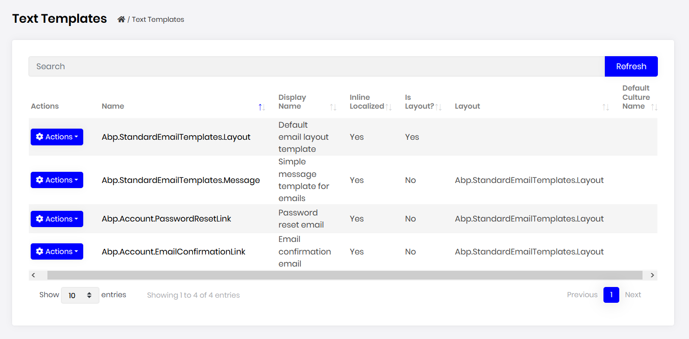
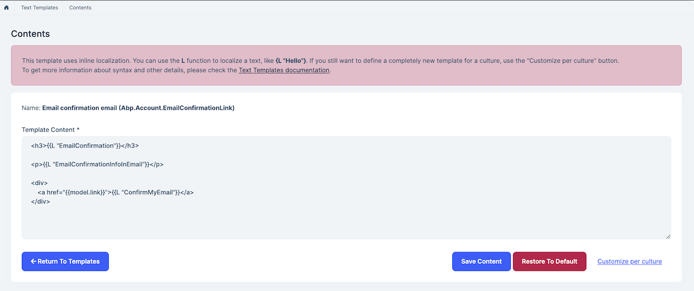
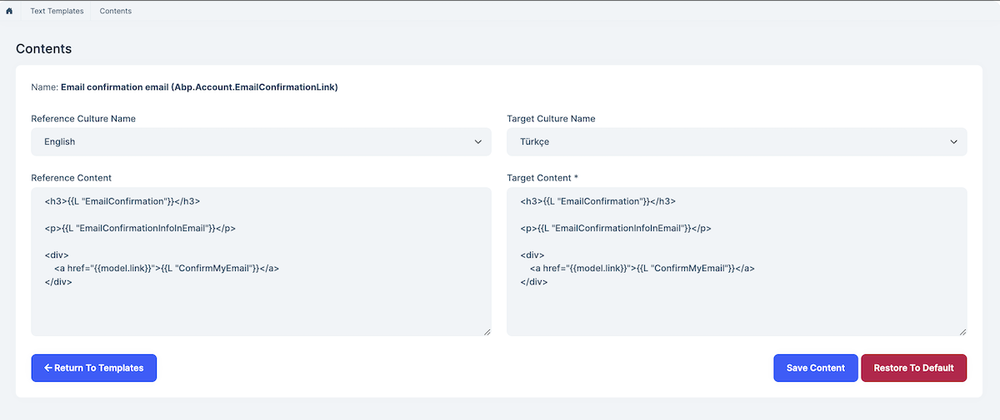

# Text Template Management Module

This module implements Text Template Management system of an application;

* Edit **text template contents** in the UI.
* Add different contents for different cultures.

See [the module description page](https://commercial.abp.io/modules/Volo.TextTemplateManagement) for an overview of the module features.

## How to Install

Text Template Management management module is pre-installed in [the startup templates](../Startup-Templates/Index). So, no need to manually install it.

## Packages

This module follows the [module development best practices guide](https://docs.abp.io/en/abp/latest/Best-Practices/Index) and consists of several NuGet and NPM packages. See the guide if you want to understand the packages and relations between them.

### NuGet Packages

* Volo.Abp.TextTemplateManagement.Domain.Shared
* Volo.Abp.TextTemplateManagement.Domain
* Volo.Abp.TextTemplateManagement.Application.Contracts
* Volo.Abp.TextTemplateManagement.Application
* Volo.Abp.TextTemplateManagement.EntityFrameworkCore
* Volo.Abp.TextTemplateManagement.MongoDB
* Volo.Abp.TextTemplateManagement.HttpApi
* Volo.Abp.TextTemplateManagement.HttpApi.Client
* Volo.Abp.TextTemplateManagement.Web

### NPM Packages

* @volo/abp.ng.text-template-management
* @volo/abp.ng.text-template-management.config

## User Interface

### Menu Items

Text Template Management module adds the following items to the "Main" menu, under the "Administration" menu item:

* **Text Templates**: List, view and filter text template definitions.

`TextTemplateManagementMainMenuNames` class has the constants for the menu item names.

### Pages

#### Text Templates

Text Templates page is used to view template definitions.

You can edit your template contents for different cultures:

**Inline Localized Content Edit**

**Culture Localized Content Edit**

## Data Seed

This module doesn't seed any data.

## Internals

### Domain Layer

#### Aggregates

This module follows the [Entity Best Practices & Conventions](https://docs.abp.io/en/abp/latest/Best-Practices/Entities) guide.

##### TextTemplateContent

* `TextTemplateContent` (aggregate root): Represents a content of text template.

#### Repositories

This module follows the [Repository Best Practices & Conventions](https://docs.abp.io/en/abp/latest/Best-Practices/Repositories) guide.

Following custom repositories are defined for this module:

* `ITextTemplateContentRepository`

#### Domain Services

This module follows the [Domain Services Best Practices & Conventions]( https://docs.abp.io/en/abp/latest/Best-Practices/Domain-Services) guide.

##### DatabaseTemplateContentContributor

`DatabaseTemplateContentContributor` is used by `ITemplateContentProvider` to get template contents that stored in DB.

### Settings

This module doesn't define any setting.

### Application Layer

#### Application Services

* `TemplateDefinitionAppService` (implements `ITemplateDefinitionAppService`): Implements the use cases of the text template management UI.
* `TemplateContentAppService` (implements `ITemplateContentAppService`): Implements the use cases of the text template management UI.

### Database Providers

#### Common

##### Table/Collection Prefix & Schema

All tables/collections use the `Abp` prefix by default. Set static properties on the `TextTemplateManagementDbProperties` class if you need to change the table prefix or set a schema name (if supported by your database provider).

##### Connection String

This module uses `TextTemplateManagement` for the connection string name. If you don't define a connection string with this name, it fallbacks to the `Default` connection string.

See the [connection strings](https://docs.abp.io/en/abp/latest/Connection-Strings) documentation for details.

#### Entity Framework Core

##### Tables

* **AbpTextTemplateContents**

#### MongoDB

##### Collections

* **AbpTextTemplateContents**

### Permissions

See the `TextTemplateManagementPermissions` class members for all permissions defined for this module.

## Distributed Events

This module doesn't define any additional distributed event. See the [standard distributed events](https://docs.abp.io/en/abp/latest/Distributed-Event-Bus).