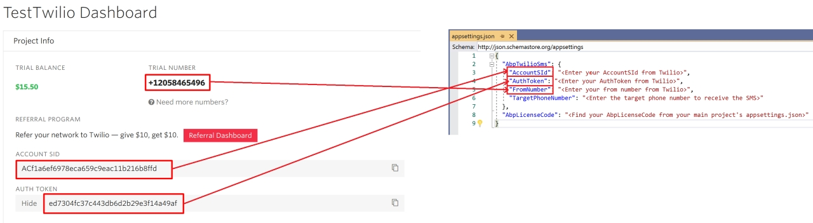

# Twilio SMS Module

[Twilio](https://www.twilio.com) is a cloud communication provider that makes it easy to send and receive SMS. ABP Twilio SMS module implements the SMS sending feature of `ISmsSender` interface with Twilio. 

See [the module description page](https://commercial.abp.io/modules/Volo.Abp.Sms.Twilio) for an overview of the module features.

## How to Install

To install the Twilio SMS module, you need to add a package reference of `Volo.Abp.Sms.Twilio` in your project.  You can add this package to your application layer (eg: `Acme.BookStore.Application`).

**Acme.BookStore.Application.csproj**

```json
<PackageReference Include="Volo.Abp.Sms.Twilio" Version="x.x.x" />
```

After you add the package reference, open the module class of the project (eg: `BookStoreApplicationModule`) and add the below code to the `DependsOn` attribute.

```csharp
[DependsOn(
  //...
  typeof(AbpTwilioSmsModule)
)]
```


## Packages

This module follows the [module development best practices guide](https://docs.abp.io/en/abp/latest/Best-Practices/Index) and depends on the below NuGet packages. See the guide if you want to understand the packages and relations between them.

### NuGet Packages

* Volo.Abp.Sms
* Volo.Abp.Commercial.Core

## User Interface

There is no user interface for this module.

## Data Seed

This module doesn't seed any data.

## Configuration

You can configure `AbpTwilioSms` module in several ways. It uses the [options pattern](https://docs.microsoft.com/en-us/aspnet/core/fundamentals/configuration/options) in ASP.NET Core.

### Configure by AbpTwilioSmsOptions

`AbpTwilioSmsOptions` can be used to configure the module.  You can use the below code to configure it in the `ConfigureServices` method of your [module](https://docs.abp.io/en/abp/latest/Module-Development-Basics) (eg: `BookStoreApplicationModule`).

````csharp
Configure<AbpTwilioSmsOptions>(options =>
{
	options.AccountSId = "***";
	options.AuthToken = "***";
	options.FromNumber = "***";
});
````

`AbpTwilioSmsOptions` properties:

* `AccountSId` : This is a security key of Twilio. You can get your `AccountSId` from [Twilio Console](https://www.twilio.com/console.).
* `AuthToken`:  This is a security key of Twilio. You can get your `AuthToken` from [Twilio Console](https://www.twilio.com/console.).
* `FromNumber`:  This is the sender number of SMS. You can get your `FromNumber` from [Twilio Console](https://www.twilio.com/console.).

Twilio allows you to create a free trial to test the SMS provider. Create an account https://www.twilio.com/try-twilio and get your credentials to test it. 

### Configure by appsettings.json

You can configure the module with the `appsettings.json` file of the final project (eg: `Acme.BookStore.Web`)

**appsettings.json**:

```json
{
  "AbpTwilioSms": {
    "AccountSId": "<Enter your AccountSId from Twilio>",
    "AuthToken": "<Enter your AuthToken from Twilio>",
    "FromNumber": "<Enter your from number from Twilio>"
  }
}
```


Twilio allows you to create a free trial to send test SMS. Get your Twilio `AccountSId`, `AuthToken`, `FromNumberv` values from https://www.twilio.com/try-twilio.  Enter these values in your `appsettings.json` or configure it via `AbpTwilioSmsOptions`.



## Sending SMS

Sending SMS is pretty simple. Inject `ISmsSender` to your class (eg: `MyApplicationService`) and call `SendAsync()` method. 

```csharp
public class MyAppService : IMyAppService, ITransientDependency
{
	private readonly ISmsSender _smsSender;

	public MyAppService(ISmsSender smsSender)
	{
		_smsSender = smsSender;
	}

	public async Task SendSmsAsync(string toPhoneNumber, string message)
	{
		await _smsSender.SendAsync(new SmsMessage(toPhoneNumber, message));
	}
}

public interface IMyAppService : IApplicationService
{
	Task SendSmsAsync(string toPhoneNumber, string message);
}
```

## Internals

### Application Layer

#### Application Services

This module doesn't have any application services.

### Permissions

This module doesn't have any permissions.

## Distributed Events

This module doesn't define any additional distributed event. See the [standard distributed events](https://docs.abp.io/en/abp/latest/Distributed-Event-Bus).