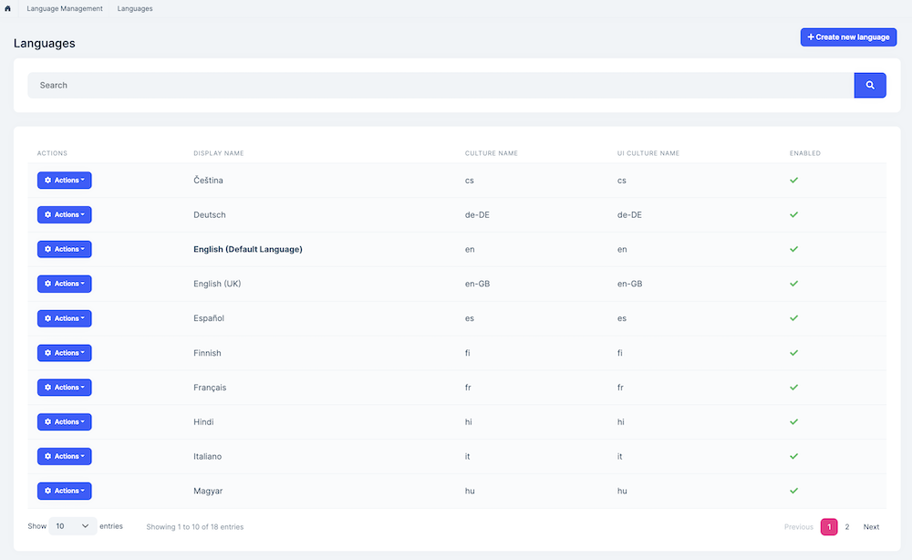
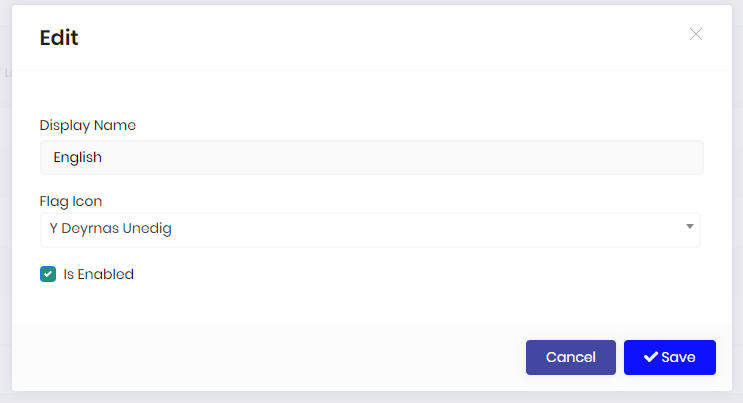
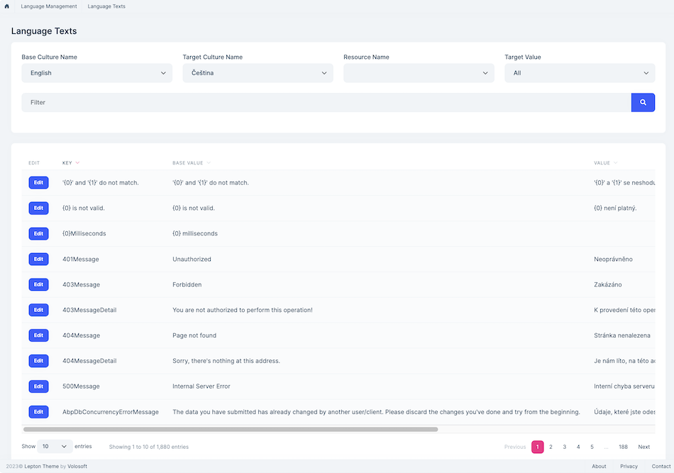
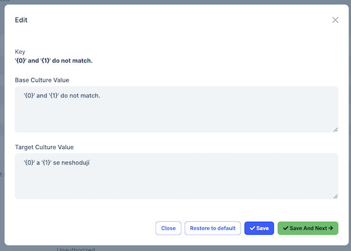

# Language Management Module

This module implements the Language management system of an application;

* Manage **languages** in the system.
* Translate texts in the UI.
* Enable/disable **languages**.
* Select **default language** in the UI.

See [the module description page](https://commercial.abp.io/modules/Volo.Identity.Pro) for an overview of the module features.

## How to Install

Language management module is pre-installed in [the startup templates](../Startup-Templates/Index). So, no need to manually install it.

## Packages

This module follows the [module development best practices guide](https://docs.abp.io/en/abp/latest/Best-Practices/Index) and consists of several NuGet and NPM packages. See the guide if you want to understand the packages and relations between them.

### NuGet Packages

* Volo.Abp.LanguageManagement.Domain.Shared
* Volo.Abp.LanguageManagement.Domain
* Volo.Abp.LanguageManagement.Application.Contracts
* Volo.Abp.LanguageManagement.Application
* Volo.Abp.LanguageManagement.EntityFrameworkCore
* Volo.Abp.LanguageManagement.MongoDB
* Volo.Abp.LanguageManagement.HttpApi
* Volo.Abp.LanguageManagement.HttpApi.Client
* Volo.Abp.LanguageManagement.Web

### NPM Packages

* @volo/abp.ng.language-management
* @volo/abp.ng.language-management.config

## User Interface

### Menu Items

Language management module adds the following items to the "Main" menu, under the "Administration" menu item:

* **Languages**: Language management page.
* **Language Texts**: Language text management page.

`LanguageManagementMenuNames` class has the constants for the menu item names.

### Pages

#### Languages

Languages page is used to manage languages in the system. 

You can create a new language or edit an existing language in this page:

* **Enabled** languages can be selected as the system language.

#### Language Texts

Language texts page is used to manage texts in different languages.

You can translate a text for a language or edit the already existing translation in this page.

## Data Seed

This module adds some initial data (see [the data seed system](https://docs.abp.io/en/abp/latest/Data-Seeding)) to the database when you run the `.DbMigrator` application:

* Creates language records configured using `AbpLocalizationOptions`.

If you want to change the seeded language list, see the next section.

## Internals

### Domain Layer

#### Aggregates

This module follows the [Entity Best Practices & Conventions](https://docs.abp.io/en/abp/latest/Best-Practices/Entities) guide.

##### Language

* `Language` (aggregate root): Represents a language in the system.
* `LanguageText` (aggregate root): Represents a language text in the system.

#### Repositories

This module follows the [Repository Best Practices & Conventions](https://docs.abp.io/en/abp/latest/Best-Practices/Repositories) guide.

Following custom repositories are defined for this module:

* `ILanguageRepository`
* `ILanguageTextRepository`

#### Domain Services

This module doesn't define any domain service.

### Settings

This module doesn't define any setting.

### Application Layer

#### Application Services

* `LanguageAppService` (implements `ILanguageAppService`): Implements the use cases of the language management UI.
* `LanguageTextAppService` (implements `ILanguageTextAppService`): Implements the use cases of the language texts management UI. 

### Database Providers

#### Common

##### Table/Collection Prefix & Schema

All tables/collections use the `Abp` prefix by default. Set static properties on the `LanguageManagementDbProperties` class if you need to change the table prefix or set a schema name (if supported by your database provider).

##### Connection String

This module uses `AbpLanguageManagement` for the connection string name. If you don't define a connection string with this name, it fallbacks to the `Default` connection string.

See the [connection strings](https://docs.abp.io/en/abp/latest/Connection-Strings) documentation for details.

#### Entity Framework Core

##### Tables

* **AbpLanguages**
* **AbpLanguageTexts**

#### MongoDB

##### Collections

* **AbpLanguages**
* **AbpLanguageTexts**

### Permissions

See the `LanguageManagementPermissions` class members for all permissions defined for this module.

## Distributed Events

This module doesn't define any additional distributed event. See the [standard distributed events](https://docs.abp.io/en/abp/latest/Distributed-Event-Bus).