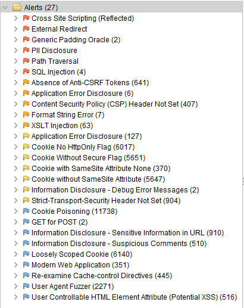
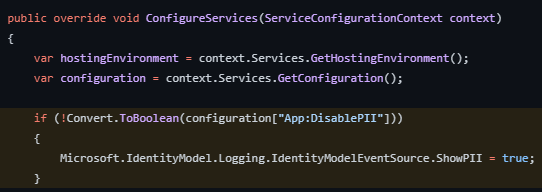
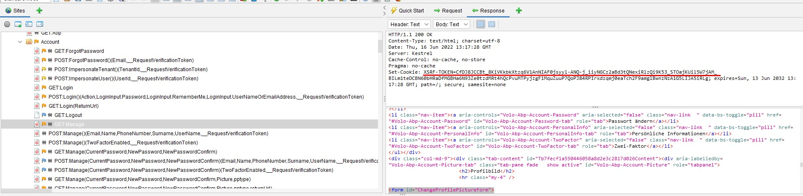
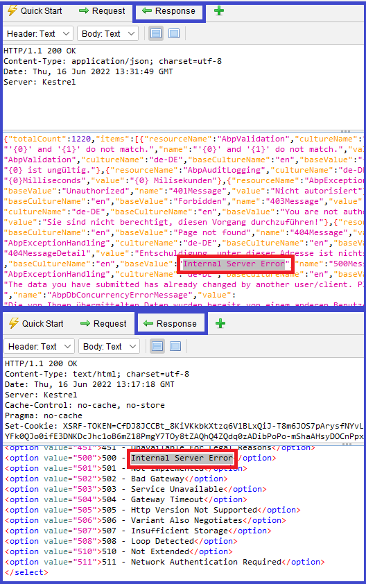
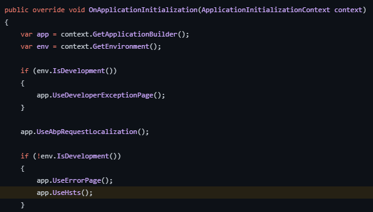

# ABP Commercial Penetration Test Report

The ABP Commercial MVC `v7.0.0` application template has been tested against security vulnerabilities by the [OWASP ZAP v2.11.1](https://www.zaproxy.org/) tool. The demo web application was started on the `https://localhost:44378` address. The below alerts have been reported by the pentest tool. These alerts are sorted by the risk level as high, medium, and low. The informational alerts are not mentioned in this document. 

Many of these alerts are **false-positive**, meaning the vulnerability scanner detected these issues, but they are not exploitable. It's clearly explained for each false-positive alert why this alert is a false-positive. 

In the next sections, you will find the affected URLs, alert descriptions, false-positive explanations, and fixes for the issues. Some positive alerts are already fixed, and some of them will be fixed in the next milestone. The issue links for the fixes are mentioned in each positive alert.

## Alerts

There are high _(red flag)_, medium _(orange flag)_, low _(yellow flag)_, and informational _(blue flag)_ alerts. 



> The informational alerts are not mentioned in this document. These alerts are not raising any risks on your application and they are optional.

### Cross Site Scripting (Reflected) [Risk: High] — Positive (Fixed)

* *[GET]* — https://localhost:44378/AbpPermissionManagement/PermissionManagementModal?
providerName=C&providerKey=EfCoreNonTierZap_Web_Public_Tiered&providerKeyDisplayName=%
3C%2Fh5%3E%3CscrIpt%3Ealert%281%29%3B%3C%2FscRipt%3E%3Ch5%3E

The above URL was reported to be vulnerable to a "Cross Site Scripting (Reflected)" attack. We fixed this problem, see the following PR for the changes: https://github.com/abpframework/abp/pull/15519.

### External Redirect [Risk: High] - False Positive

- *[GET] - https://localhost:44378/Account/Login?handler=6426431813712824969.owasp.org&LinkUserId=548b97b1-ab3a-a6a2-e961-3a08a881b211&LinkToken=CfDJ8KJ4q0EP0P9EsZ5KtdIYqZ1SPxVNqhILj3UjN0C1mWPlvrw%2FBPriEbgrwcypDnv7b4QC0tvrMihmtEUZUuY5YrAIDwWhQ9vyCPTbFTjpS7kjX%2BNRC%2FAFlWrxvTyPrhtV4QcHD2VRnBx1xmASFq1XvxhANylej7iVTnii8QTsFpF2vcW0tu%2FO1xADiS1geFyDgk1vZGcPlLGs45pEGBazcw%2Bi2p35xakGNGu7OI8zJWyw*

**Description**:

URL redirectors represent common functionality employed by websites to forward an incoming request to an alternate resource. This can be done for a variety of reasons and is often done to allow resources to be moved within the directory structure and to avoid breaking functionality for users that request the resource at its previous location. URL redirectors may also be used to implement load balancing, leveraging abbreviated URLs or recording outgoing links.

**Explanation**:
This is a false-positive alert since ABP Framework validates inputs (for example, `returnUrl` or `handler` (in this case)) to prevent external redirections.

### Generic Padding Oracle [Risk: High] - False Positive

- *[GET] - https://localhost:44390/Account/Login?handler=CreateLinkUser&LinkUserId=548b97b1-ab3a-a6a2-e961-3a08a881b211&LinkToken=CfDJ8KJ4q0EP0P9EsZ5KtdIYqZ1SPxVNqhILj3UjN0C1mWPlvrw%2FBPriEbgrwcypDnv7b4QC0tvrMihmtEUZUuY5YrAIDwWhQ9vyCPTbFTjpS7kjX%2BNRC%2FAFlWrxvTyPrhtV4QcHD2VRnBx1xmASFq1XvxhANylej7iVTnii8QTsFpF2vcW0tu%2FO1xADiS1geFyDgk1vZGcPlLGs45pEGBazcw%2Bi2p35xakGNGu7OI8zJWyx*

**Description**: 

By manipulating the padding on an encrypted string, an attacker is able to generate an error message that indicates a likely 'padding oracle' vulnerability. Such a vulnerability can affect any application or framework that uses encryption improperly, such as some versions of ASP.Net, Java Server Faces, and Mono. 

**Explanation:**

This is a false-positive alert. Because the URL returns "500 - Internal Error" and does not reveal any encrypted/decrypted data.

### PII Disclosure [Risk: High] - Positive (No need for a fix)

- *[GET] - https://localhost:44378/Account/Manage?Picture=test_file.txt&pptype=use-default&returnUrl=%2FAccount%2FManage%3FPicture%3Dtest_file.txt%26pptype%3Duse-default%26returnUrl%3D%252FPrivacyPolicy*

**Description**:

The response contains Personally Identifiable Information, such as a CC number, SSN, and similar sensitive data.

**Solution**:

You can set **Microsoft.IdentityModel.Logging.IdentityModelEventSource.ShowPII** as `false` to exclude the PII from logs.



### Path Traversal [Risk: High] - False Positive

- *[GET] - https://localhost:44378/api/audit-logging/audit-logs?startTime=&endTime=&url=&userName=&applicationName=&clientIpAddress=&correlationId=&httpMethod=audit-logs&httpStatusCode=&maxExecutionDuration=&minExecutionDuration=&hasException=&sorting=executionTime+desc&skipCount=0&maxResultCount=10*

**Description**:

The Path Traversal attack technique allows an attacker access to files, directories, and commands that potentially reside outside the web document root directory. An attacker may manipulate a URL in such a way that the website will execute or reveal the contents of arbitrary files anywhere on the web server. Any device that exposes an HTTP-based interface is potentially vulnerable to Path Traversal.

**Solution**:

This is a false-positive alert since ABP Framework does all related checks for this kind of attack on the backend side for this endpoint.

### SQL Injection [Risk: High] - False Positive

- *[POST] - https://localhost:44378/Account/ForgotPassword?returnUrl=%2FAccount%2FSecurityLogs*
- *[POST] - https://localhost:44378/AuditLogs*
- *[POST] - https://localhost:44378/FeatureManagement/FeatureManagementModal*
- *[POST] - https://localhost:44378/Identity/OrganizationUnits/CreateModal*

**Description**:

SQL injection may be possible. SQL injection is a web security vulnerability that allows an attacker to interfere with the queries that an application makes to its database. It allows an attacker to view data that they are not normally able to retrieve and perform unauthorized actions.

**Explanation**:

ABP uses Entity Framework Core and LINQ. It's safe against SQL Injection because it passes all data to the database via SQL parameters. LINQ queries are not composed by using string manipulation or concatenation, that's why they are not susceptible to traditional SQL injection attacks. Therefore, this is a false-positive alert.

### Absence of Anti-CSRF Tokens [Risk: Medium] — False Positive

* *[GET] — https://localhost:44378/Account/Manage*

**Description**: 

No Anti-CSRF tokens were found in an HTML submission form.
A cross-site request forgery is an attack that involves forcing a victim to send an HTTP request to a target destination without their knowledge or intent in order to perform an action as the victim. The underlying cause is application functionality using predictable URL/form actions in a repeatable way. The nature of the attack is that CSRF exploits the trust that a website has for a user. By contrast, cross-site scripting (XSS) exploits the trust that a user has in a website. Like XSS, CSRF attacks are not necessarily cross-site, but they can be. Cross-site request forgery is also known as CSRF, XSRF, one-click attack, session riding, confused deputy, and sea surf.

**Explanation:**

This is a **false-positive** alert because ABP provides the Anti-CSRF token via a cookie as seen on the following screenshot:



### Application Error Disclosure [Risk: Medium] - False Positive

- *[POST] — https://localhost:44378/Account/ImpersonateTenant*
- *[POST] — https://localhost:44378/Account/ImpersonateUser*
- *[POST] — https://localhost:44378/Account/Manage*

**Description**: 

This page contains an error/warning message that may disclose sensitive information like the location of the file that produced the unhandled exception. This information can be used to launch further attacks against the web application. The alert could be a false positive if the error message is found inside a documentation page.

**Explanation**:

There are 3 URLs that are reported as exposing error messages. This is a false-positive alert. All these endpoints return Internal Server Error and there is no sensitive information disclosed.

### Content Security Policy (CSP) Header Not Set [Risk: Medium] — Positive (Fixed)

- *[GET] — https://localhost:44378*

**Description:** 

Content Security Policy (CSP) is an added layer of security that helps to detect and mitigate certain types of attacks, including Cross Site Scripting (XSS) and data injection attacks. These attacks are used for everything from data theft to site defacement or distribution of malware. CSP provides a set of standard HTTP headers that allow website owners to declare approved sources of content that browsers should be allowed to load on a certain page — covered types are JavaScript, CSS, HTML frames, fonts, images and embeddable objects such as Java applets, ActiveX, audio, and video files.

**Solution:** 

Ensure that your web server, application server, load balancer, etc. are configured to set the `Content-Security-Policy` header, to achieve optimal browser support: "Content-Security-Policy" for Chrome 25+, Firefox 23+, and Safari 7+, "X-Content-Security-Policy" for Firefox 4.0+ and Internet Explorer 10+, and "X-WebKit-CSP" for Chrome 14+ and Safari 6+.

In ASP.NET Core, you can create middleware to set the header to the HTTP response, here is a minimal middleware to do this. You need to add this code to the `Configure()` method in `Startup.cs` before the `UseEndpoints` method.

```
app.Use(async (context, next) =>
{
    context.Response.Headers.Add("Content-Security-Policy", "default-src 'self';");
    await next();
});
```

This vulnerability is being fixed in ABP v7.0. You can check and track the issue from https://github.com/abpframework/abp/issues/14173.

### Format String Error [Risk: Medium] - Positive and False Positive 

- *[GET] - https://localhost:44378/Abp/Languages/Switch?culture=ZAP%25n%25s%25n%25s%25n%25s%25n%25s%25n%25s%25n%25s%25n%25s%25n%25s%25n%25s%25n%25s%25n%25s%25n%25s%25n%25s%25n%25s%25n%25s%25n%25s%25n%25s%25n%25s%25n%25s%25n%25s%0A&returnUrl=%2F&uiCulture=ar*
- *[GET] - https://localhost:44378/Abp/ApplicationLocalizationScript?cultureName=ZAP%25n%25s%25n%25s%25n%25s%25n%25s%25n%25s%25n%25s%25n%25s%25n%25s%25n%25s%25n%25s%25n%25s%25n%25s%25n%25s%25n%25s%25n%25s%25n%25s%25n%25s%25n%25s%25n%25s%25n%25s%0A*
- *[POST] — https://localhost:44378/Account/Login*
- *[POST] — https://localhost:44378/Account/Register*

**Description**:

A Format String error occurs when the submitted data of an input string is evaluated as a command by the application.

**Solution**:

Rewrite the background program using proper deletion of bad character strings. This will require a recompile of the background executable. The first affected URL is being fixed by this issue https://github.com/abpframework/abp/issues/14174. 

The second one is positive and we created an issue for it. See the following issue for the progress: https://github.com/abpframework/abp/issues/15525.

The last 2 URLs are false-positive because there is no bad character string in the response. For example, the third request's response is the following and as seen there is no invalid chars in the response:

```
Volo.Abp.Validation.AbpValidationException: ModelState is not valid! See ValidationErrors for details.
   at Volo.Abp.AspNetCore.Mvc.Validation.ModelStateValidator.Validate(ModelStateDictionary modelState)
   at Volo.Abp.Account.Web.Pages.Account.IdentityServerSupportedLoginModel.OnPostAsync(String action)
   at Microsoft.AspNetCore.Mvc.RazorPages.Infrastructure.ExecutorFactory.GenericTaskHandlerMethod.Convert[T](Object taskAsObject)
   at Microsoft.AspNetCore.Mvc.RazorPages.Infrastructure.ExecutorFactory.GenericTaskHandlerMethod.Execute(Object receiver, Object[] arguments)
   at Microsoft.AspNetCore.Mvc.RazorPages.Infrastructure.PageActionInvoker.InvokeHandlerMethodAsync()
   at Microsoft.AspNetCore.Mvc.RazorPages.Infrastructure.PageActionInvoker.InvokeNextPageFilterAsync()
   at Microsoft.AspNetCore.Mvc.RazorPages.Infrastructure.PageActionInvoker.Rethrow(PageHandlerExecutedContext context)
   at Microsoft.AspNetCore.Mvc.RazorPages.Infrastructure.PageActionInvoker.Next(State& next, Scope& scope, Object& state, Boolean& isCompleted)
   at Microsoft.AspNetCore.Mvc.RazorPages.Infrastructure.PageActionInvoker.InvokeInnerFilterAsync()
   at Microsoft.AspNetCore.Mvc.Infrastructure.ResourceInvoker.<InvokeNextExceptionFilterAsync>g__Awaited|26_0(ResourceInvoker invoker, Task lastTask, State next, Scope scope, Object state, Boolean isCompleted)
   at Microsoft.AspNetCore.Mvc.Infrastructure.ResourceInvoker.Rethrow(ExceptionContextSealed context)
   at Microsoft.AspNetCore.Mvc.Infrastructure.ResourceInvoker.Next(State& next, Scope& scope, Object& state, Boolean& isCompleted)
   at Microsoft.AspNetCore.Mvc.Infrastructure.ResourceInvoker.InvokeNextResourceFilter()
--- End of stack trace from previous location ---
   at Microsoft.AspNetCore.Mvc.Infrastructure.ResourceInvoker.Rethrow(ResourceExecutedContextSealed context)
   at Microsoft.AspNetCore.Mvc.Infrastructure.ResourceInvoker.Next(State& next, Scope& scope, Object& state, Boolean& isCompleted)
   at Microsoft.AspNetCore.Mvc.Infrastructure.ResourceInvoker.InvokeFilterPipelineAsync()
--- End of stack trace from previous location ---
   at Microsoft.AspNetCore.Mvc.Infrastructure.ResourceInvoker.<InvokeAsync>g__Logged|17_1(ResourceInvoker invoker)
   at Microsoft.AspNetCore.Mvc.Infrastructure.ResourceInvoker.<InvokeAsync>g__Logged|17_1(ResourceInvoker invoker)
   at Microsoft.AspNetCore.Routing.EndpointMiddleware.<Invoke>g__AwaitRequestTask|6_0(Endpoint endpoint, Task requestTask, ILogger logger)
   at Volo.Abp.AspNetCore.Serilog.AbpSerilogMiddleware.InvokeAsync(HttpContext context, RequestDelegate next)
   at Microsoft.AspNetCore.Builder.UseMiddlewareExtensions.<>c__DisplayClass6_1.<<UseMiddlewareInterface>b__1>d.MoveNext()
--- End of stack trace from previous location ---
   at Volo.Abp.AspNetCore.Auditing.AbpAuditingMiddleware.InvokeAsync(HttpContext context, RequestDelegate next)
   at Volo.Abp.AspNetCore.Auditing.AbpAuditingMiddleware.InvokeAsync(HttpContext context, RequestDelegate next)
   at Microsoft.AspNetCore.Builder.UseMiddlewareExtensions.<>c__DisplayClass6_1.<<UseMiddlewareInterface>b__1>d.MoveNext()
--- End of stack trace from previous location ---
   at Swashbuckle.AspNetCore.SwaggerUI.SwaggerUIMiddleware.Invoke(HttpContext httpContext)
   at Swashbuckle.AspNetCore.Swagger.SwaggerMiddleware.Invoke(HttpContext httpContext, ISwaggerProvider swaggerProvider)
   at Microsoft.AspNetCore.Authorization.AuthorizationMiddleware.Invoke(HttpContext context)
   at IdentityServer4.Hosting.IdentityServerMiddleware.Invoke(HttpContext context, IEndpointRouter router, IUserSession session, IEventService events, IBackChannelLogoutService backChannelLogoutService)
   at IdentityServer4.Hosting.MutualTlsEndpointMiddleware.Invoke(HttpContext context, IAuthenticationSchemeProvider schemes)
   at Microsoft.AspNetCore.Authentication.AuthenticationMiddleware.Invoke(HttpContext context)
   at IdentityServer4.Hosting.BaseUrlMiddleware.Invoke(HttpContext context)
   at Volo.Abp.AspNetCore.Uow.AbpUnitOfWorkMiddleware.InvokeAsync(HttpContext context, RequestDelegate next)
   at Microsoft.AspNetCore.Builder.UseMiddlewareExtensions.<>c__DisplayClass6_1.<<UseMiddlewareInterface>b__1>d.MoveNext()
--- End of stack trace from previous location ---
   at Volo.Abp.AspNetCore.ExceptionHandling.AbpExceptionHandlingMiddleware.InvokeAsync(HttpContext context, RequestDelegate next)
   at Volo.Abp.AspNetCore.ExceptionHandling.AbpExceptionHandlingMiddleware.InvokeAsync(HttpContext context, RequestDelegate next)
   at Microsoft.AspNetCore.Builder.UseMiddlewareExtensions.<>c__DisplayClass6_1.<<UseMiddlewareInterface>b__1>d.MoveNext()
--- End of stack trace from previous location ---
   at Volo.Abp.AspNetCore.MultiTenancy.MultiTenancyMiddleware.InvokeAsync(HttpContext context, RequestDelegate next)
   at Microsoft.AspNetCore.Builder.UseMiddlewareExtensions.<>c__DisplayClass6_1.<<UseMiddlewareInterface>b__1>d.MoveNext()
--- End of stack trace from previous location ---
   at Microsoft.AspNetCore.Builder.ApplicationBuilderAbpJwtTokenMiddlewareExtension.<>c__DisplayClass0_0.<<UseJwtTokenMiddleware>b__0>d.MoveNext()
--- End of stack trace from previous location ---
   at Microsoft.AspNetCore.Authentication.AuthenticationMiddleware.Invoke(HttpContext context)
   at Volo.Abp.AspNetCore.Tracing.AbpCorrelationIdMiddleware.InvokeAsync(HttpContext context, RequestDelegate next)
   at Microsoft.AspNetCore.Builder.UseMiddlewareExtensions.<>c__DisplayClass6_1.<<UseMiddlewareInterface>b__1>d.MoveNext()
--- End of stack trace from previous location ---
   at Microsoft.AspNetCore.Localization.RequestLocalizationMiddleware.Invoke(HttpContext context)
   at Microsoft.AspNetCore.RequestLocalization.AbpRequestLocalizationMiddleware.InvokeAsync(HttpContext context, RequestDelegate next)
   at Microsoft.AspNetCore.Builder.UseMiddlewareExtensions.<>c__DisplayClass6_1.<<UseMiddlewareInterface>b__1>d.MoveNext()
--- End of stack trace from previous location ---
   at Microsoft.AspNetCore.Diagnostics.DeveloperExceptionPageMiddleware.Invoke(HttpContext context)

HEADERS
=======

Host: localhost:44378
User-Agent: Mozilla/5.0 (Windows NT 10.0; Win64; x64; rv:92.0) Gecko/20100101 Firefox/92.0
Cache-Control: no-cache
Content-Type: application/x-www-form-urlencoded
Cookie: .AspNetCore.Culture=c%3Des%7Cuic%3Des; XSRF-TOKEN=CfDJ8JCCBt_8KiVKkbkXtzq6V1BEYfhL6Rn88RfFmrkfC8EzpKhj8ZWhGP8HT8Su_7q2wcmhITLg9rrh-Pj-Tu2c88c--wQg5UvXiQBVc_LqlQiqzMUWyxSrrxDIq22_1kmRA62cvIOrUkGLe4ezmZIYCRU; .AspNetCore.Antiforgery.x3gzYhuqPJM=CfDJ8JCCBt_8KiVKkbkXtzq6V1Ar3NwJpY9vG9eyrUYeAySYBUHsTHCmdGylFpjWOKf6CGVEnPNtJP3FDmgWIXe8le2DgOYxcAIkBkM5W1bybUkamp4yVbDYcimwEswXU1tsMSv3el885ZapGup7WneIcZo
Pragma: no-cache
Referer: https://localhost:44378/Account/Login
Content-Length: 639
X-Correlation-Id: 2c103514abd44a17b1ec792b6a5c1dc3
```

### XSLT Injection [Risk: Medium] - False Positive

- *[GET] - https://localhost:44378/?page=%3Cxsl%3Avalue-of+select%3D%22system-property%28%27xsl%3Avendor%27%29%22%2F%3E*
- *[GET] - https://localhost:44378/Abp/Languages/Switch?culture=%3Cxsl%3Avalue-of+select%3D%22system-property%28%27xsl%3Avendor%27%29%22%2F%3E&returnUrl=%2F&uiCulture=ar*
- *[GET] - https://localhost:44378/Account/ForgotPassword?returnUrl=%3Cxsl%3Avalue-of+select%3D%22system-property%28%27xsl%3Avendor%27%29%22%2F%3E*
- *[GET] - https://localhost:44378/Account/Login?handler=CreateLinkUser&LinkUserId=%3Cxsl%3Avalue-of+select%3D%22system-property%28%27xsl%3Avendor%27%29%22%2F%3E&LinkToken=CfDJ8KJ4q0EP0P9EsZ5KtdIYqZ1SPxVNqhILj3UjN0C1mWPlvrw%2FBPriEbgrwcypDnv7b4QC0tvrMihmtEUZUuY5YrAIDwWhQ9vyCPTbFTjpS7kjX%2BNRC%2FAFlWrxvTyPrhtV4QcHD2VRnBx1xmASFq1XvxhANylej7iVTnii8QTsFpF2vcW0tu%2FO1xADiS1geFyDgk1vZGcPlLGs45pEGBazcw%2Bi2p35xakGNGu7OI8zJWyw*
- *[GET] - https://localhost:44378/Account/Manage?CurrentPassword=%3Cxsl%3Avalue-of+select%3D%22system-property%28%27xsl%3Avendor%27%29%22%2F%3E&NewPassword=ZAP&NewPasswordConfirm=ZAP&Picture=test_file.txt&pptype=use-default*
- *[GET] - https://localhost:44378/LanguageManagement/Create*
- other similar page URLS...

**Description**: 

Injection using XSL transformations may be possible and may allow an attacker to read system information, read and write files, or execute arbitrary code.

**Explanation**: 

This is a false-positive alert. XSLT transformation is not possible on .NET Core or .NET 5 or later.

### Application Error Disclosure [Risk: Low] — False Positive

- *[POST] — https://localhost:44378/Account/ImpersonateTenant*
- *[POST] — https://localhost:44378/Account/ImpersonateUser*  
- *[POST] — https://localhost:44378/Account/Manage?returnUrl=https://localhost:44378/AuditLogs (and other similar URLS)*
- *[POST] — https://localhost:44378/SettingManagement?BoxedLayout=true&MenuPlacement=Left&MenuStatus=AlwaysOpened&PublicLayoutStyle=Style1&Style=Style6 (and other similar URLS)*

**Description:** 

The reported pages contain an error/warning message that may disclose sensitive information like the location of the file that produced the unhandled exception. This information can be used to launch further attacks against the web application. The alert could be a false positive if the error message is found inside a documentation page.

**Explanation:** 

This vulnerability was reported as a positive alert because the application ran in `Development` mode. ABP Framework throws exceptions for developers in the `Development` environment. We set the environment to `Production` and re-run the test, then the server sent a 500-Internal Error. Therefore this alert is false-positive. Further information can be found in the following issue https://github.com/abpframework/abp/issues/14177.

### Cookie No `HttpOnly`  [Risk: Low] — Positive (No need for a fix)

* *[GET] — https://localhost:44378 (and there are several URLs)*

**Description:** 

A cookie has been set without the secure flag, which means that the cookie can be accessed via unencrypted connections.

**Explanation:** 

The following alert also includes this issue. To understand this alert, you can take a look at the next alert: _Cookie Without Secure Flag [Risk: Low]_

### Cookie Without Secure Flag [Risk: Low] — Positive (No need for a fix)

* *[GET] — https://localhost:44378 (and there are several URLs)*

**Description:** A cookie has been set without the secure flag, which means that the cookie can be accessed via unencrypted connections. The following cookies don't have an `httponly` flag.

* `XSRF-TOKEN` (Anti CSRF token cookie)
* `.AspNetCore.Culture` (ASP.NET Core culture cookie)
* `idsrv.session` (Identity Server 4 cookie)

**Explanation:** 

All the pages that are setting `XSRF-TOKEN` , `.AspNetCore.Culture` and `idsrv.session` in the HTTP response are reported as "No `HttpOnly` Flag" vulnerability. This is a positive alert. The `idsrv.session` cookie is being used in IDS4 and after ABP 6.x the support for IDS will be dropped. And therefore, this cookie will not be used anymore. There's also an issue related to the `idsrv.session` cookie, it cannot be set as `HttpOnly`; you can see the related thread at its own repository https://github.com/IdentityServer/IdentityServer4/issues/3873. 

On the other hand, the cookies `.AspNetCore.Culture` and `XSRF-TOKEN` are being retrieved via JavaScript in ABP Angular, MVC and Blazor WASM projects. Therefore cannot be set as `HttpOnly`. You can check out the following modules that retrieve these cookies via JavaScript:

* https://github.com/abpframework/abp/blob/dev/framework/src/Volo.Abp.Swashbuckle/wwwroot/swagger/ui/abp.swagger.js#L28
* https://github.com/abpframework/abp/blob/dev/modules/cms-kit/src/Volo.CmsKit.Admin.Web/Pages/CmsKit/Pages/update.js#L54
* https://github.com/abpframework/abp/blob/dev/modules/cms-kit/src/Volo.CmsKit.Admin.Web/Pages/CmsKit/Pages/create.js#L84
* https://github.com/abpframework/abp/blob/392beb897bb2d7214db8facba7a2022be7aa837c/modules/cms-kit/src/Volo.CmsKit.Admin.Web/Pages/CmsKit/BlogPosts/update.js#L91
* https://github.com/abpframework/abp/blob/dev/modules/cms-kit/src/Volo.CmsKit.Admin.Web/Pages/CmsKit/BlogPosts/create.js#L127
* https://github.com/abpframework/abp/blob/dev/modules/docs/app/VoloDocs.Web/wwwroot/libs/abp/jquery/abp.jquery.js#L261
* https://github.com/abpframework/abp/blob/dev/framework/src/Volo.Abp.AspNetCore.Components.Web/Volo/Abp/AspNetCore/Components/Web/AbpBlazorClientHttpMessageHandler.cs#L94

**Setting `XSRF-TOKEN` cookie as `HttpOnly`:**
If you want to set it, you can do it in the [AbpAntiForgeryOptions](https://github.com/abpframework/abp/blob/dev/framework/src/Volo.Abp.AspNetCore.Mvc/Volo/Abp/AspNetCore/Mvc/AntiForgery/AbpAntiForgeryOptions.cs#L56) class.

**Setting `.AspNetCore.Culture` cookie as `HttpOnly`:**
If you want to set it, you can do it in the [AbpRequestCultureCookieHelper](https://github.com/abpframework/abp/blob/dev/framework/src/Volo.Abp.AspNetCore/Microsoft/AspNetCore/RequestLocalization/AbpRequestCultureCookieHelper.cs#L16) class. Set the option `HttpOnly = true`.

The related issue for this alert is https://github.com/abpframework/abp/issues/14214.

### Cookie with SameSite Attribute None [Risk: Low] — Positive (No need for a fix)

* *[GET] — https://localhost:44378 (and there are several URLs)*

**Description:** 

A cookie has been set with its `SameSite` attribute set to `none`, which means that the cookie can be sent as a result of a `cross-site` request. The `SameSite` attribute is an effective counter measure to cross-site request forgery, cross-site script inclusion, and timing attacks.

**Solution:** 

Ensure that the `SameSite` attribute is set to either `lax` or ideally `strict` for all cookies. You can see the Amazon.com `SameSite` attribute policy. We discussed to set **SameSite** attribute to `strict` in the following issue https://github.com/abpframework/abp/issues/14215 and decided to leave this change to the final developer.


### Cookie without `SameSite` Attribute [Risk: Low] — Positive 

* *[GET] — https://localhost:44378/Abp/Languages/Switch?culture=ar&returnUrl=%2F&uiCulture=ar _(and there are several URLs with different parameters of https://localhost:44378/Abp/Languages/Switch endpoint)_* 

**Description:** 

A cookie has been set with its `SameSite` attribute set to `none`, which means that the cookie can be sent as a result of a `cross-site` request. The `SameSite` attribute is an effective counter measure to cross-site request forgery, cross-site script inclusion, and timing attacks.

**Solution:** 

Ensure that the `SameSite` attribute is set to either `lax` or ideally `strict` for all cookies. We discussed to set the **SameSite** attribute to `strict` in the following issue https://github.com/abpframework/abp/issues/14215 and decided to leave this change to the final developer.

### Information Disclosure - Debug Error Messages [Risk: Low] — False Positive

* *[GET] —* https://localhost:44378/api/language-management/language-texts?filter=&resourceName=&baseCultureName=en&targetCultureName=de-DE&getOnlyEmptyValues=false&sorting=name%20asc&skipCount=0&maxResultCount=10

**Description:**  

The response appeared to contain common error messages returned by platforms such as ASP.NET, and Web-servers such as IIS and Apache. You can configure the list of common debug messages.

**Solution:**  

Disable debugging messages before pushing to production.

**Explanation:** 

The response of https://localhost:44378/api/language-management/language-texts endpoint returns localization texts which are not real error messages. As there is no real error in the backend, this vulnerability is a false-positive alert.



### Strict-Transport-Security Header Not Set [Risk: Low] - False Positive

- *[DELETE] - https://localhost:44378/api/feature-management/features?providerName=T&providerKey=*
- *[DELETE] - https://localhost:44378/api/identity/claim-types/2b4a38aa-778a-df02-47bf-3a08a8c0ac28*
- *[GET] - https://localhost:44378/Abp/ApplicationConfigurationScript*
- other URLS...

**Description**: 

HTTP Strict Transport Security (HSTS) is a web security policy mechanism whereby a web server declares that complying user agents (such as a web browser) are to interact with it using only secure HTTPS connections (i.e. HTTP layered over TLS/SSL). HSTS is an IETF standards track protocol and is specified.

**Solution**: 

Enabling HSTS on production.

**Explanation**: 

This vulnerability was reported as a positive alert because the application ran in `Development` mode. We enable HSTS on `Production` mode as can be seen in the image below, therefore this is a false-positive alert.


