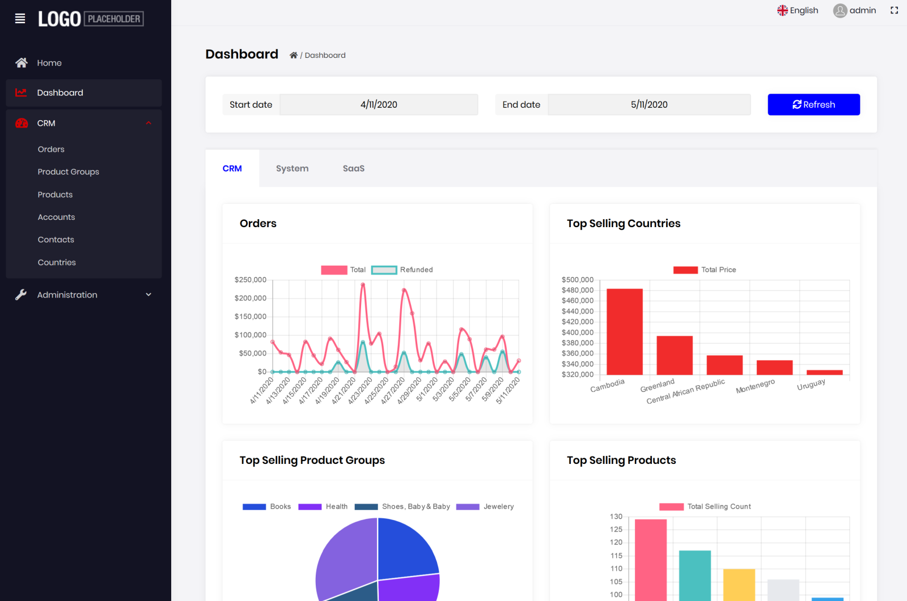

# Sample: Easy CRM

This is a sample solution developed using the ABP Commercial.

## Download

* [Download the source code from here](https://abp.io/api/download/samples/EasyCrm) (you need to login to the https://commercial.abp.io/ first).

## How To Run?

* Open the solution in the **Visual Studio 2019** or later (or with another IDE you like).
* Run the `Volo.EasyCrm.DbMigrator` console application to create the database and seed the initial data.
* Run the application, login using `admin` as the user name and `1q2w3E*` as the password.
* Click to the "**Generate and import sample data**" on the home page if you want to generate some random data in order to better investigate the application.
* Enjoy and investigate the source code!

## Notes

It currently supports;

* **Entity Framework Core** as the database provider.
* ASP.NET Core MVC / **Razor Pages** for the user interface.

**Angular UI** version is being developed.