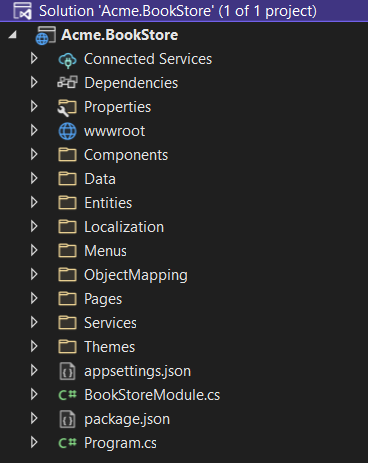
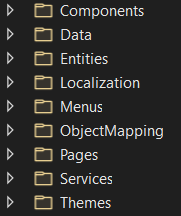
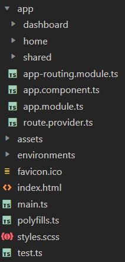

# Solution Structure

If you don't specify any additional options while creating an `app-nolayers-pro` template, you will have a solution as shown below:



In the next section, we will explain the structure based on this example. Your startup solution can be slightly different based on your preferences.

## Folder Structure

Since this template provides a single-project solution, we've seperated concerns into folders instead of projects. You can see the pre-defined folders as shown below:



* Define your components in the `Components` folder. There is a simple toolbar component named **LinkLogin** in this folder.
* Define your database mappings (for **EF Core** or **MongoDB**) and repositories in the `Data` folder.
* Define your **entities** in the `Entities` folder.
* Define your **localization keys/values** in the `Localization` folder.
* Define your **UI menu items** in the `Menus` folder.
* Define your **object-to-object mapping** classes in the `ObjectMapping` folder.
* Define your **UI pages (Razor Pages)** in the `Pages` folder (create `Controllers` and `Views` folder yourself if you prefer the MVC pattern).
* Define your **application services** in the `Services` folder.
* Define your **theme-related** files in the `Themes` folder. You can add files into this folder to override components/pages for your application. There are already some files under this folder, you can change their content to customize the layout.

## How to Run?

Before running the application, you need to create the database and seed the initial data. To do that, you can run the following command in the directory of your project (in the same folder of the `.csproj` file):

```bash
dotnet run --migrate-database
```

This command will create the database and seed the initial data for you. Then, you can run the application with any IDE that supports .NET or by running the `dotnet run` command in the directory of your project. The default username is `admin` and the password is `1q2w3E*`.

> While creating a database & applying migrations seem only necessary for relational databases, you should run this command even if you choose a NoSQL database provider (like **MongoDB**). In that case, it still seeds the initial data which is necessary for the application.

### The Angular UI

If you choose `Angular` as the UI framework, the solution will be seperated into two folders:

* An `angular` folder that contains the Angular UI application, the client-side code.
* An `aspnet-core` folder that contains the ASP.NET Core solution (a single project), the server-side code.

The server-side is similar to the solution described in the *Solution Structure* section above. This project serves the API, so the Angular application can consume it.

The client-side application consumes the HTTP APIs as mentioned above. You can see the folder structure of the Angular project shown below:

