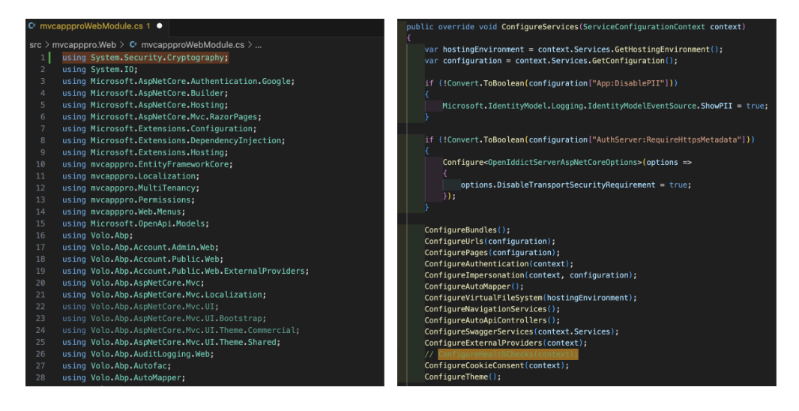

````json
//[doc-params]
{
    "UI": ["MVC", "Blazor", "BlazorServer", "NG"],
    "DB": ["EF", "Mongo"],
    "Tiered": ["Yes", "No"]
}
````

## Step 2: Customizing the Configuration of Your ABP Application

- Modify the `ConnectionStrings` in every location throughout your project, especially within the **./src/yourapp.DbMigrator/appsettings.json** and **./src/yourapp.Web/appsettings.json** files, to match your database connection string.

    ```json
    "ConnectionStrings": {
        "Default": "Server=yourserver;Database=yourdatabase;User Id=youruser;Password=yourpassword;"
    }
    ```

{{ if UI_Value == "NG" }}
- Modify the `localhost:4200` in every location throughout your project, especially within the **./angular/src/environments/environment.prod.ts** file to match your Azure Web App Service url.

    ```typescript
    export const environment = {
        production: true,
        application: {
            baseUrl: 'https://yourapp.azurewebsites.net'
        }
    };
    ```
{{ end }}

{{ if UI_Value != "NG" }}
- Modify the yourapp.Web url in every location throughout your project, especially within the **./src/yourapp.Web/appsettings.json** file, to match your Azure Web App Service url.

    ```json
    "App": {
        "SelfUrl": "https://yourapp.azurewebsites.net"
    }
    ```
{{ end }}

{{ if Tiered == "Yes"}}
- Modify the yourapp.AuthServer url in every location throughout your project, especially within the **./src/yourapp.AuthServer/appsettings.json** file, to match your Azure Web App Service url.

    ```json
    "App": {
        "SelfUrl": "https://yourapp-authserver.azurewebsites.net"
    }
    ```

- Modify the yourapp.ApiHost url in every location throughout your project, especially within the **./src/yourapp.ApiHost/appsettings.json** file, to match your Azure Web App Service url.

    ```json
    "App": {
        "SelfUrl": "https://yourapp-apihost.azurewebsites.net"
    }
    ```
{{ end }}

- Modify the **GetSigningCertificate** method in your project

    ```csharp
    private X509Certificate2 GetSigningCertificate(IWebHostEnvironment hostingEnv, IConfiguration configuration)
    {
        var fileName = $"cert-signing.pfx";
        var passPhrase = configuration["MyAppCertificate:X590:PassPhrase"]; 
        var file = Path.Combine(hostingEnv.ContentRootPath, fileName);        
        if (File.Exists(file))
        {
            var created = File.GetCreationTime(file);
            var days = (DateTime.Now - created).TotalDays;
            if (days > 180)          
                File.Delete(file);
            else
                return new X509Certificate2(file, passPhrase,
                            X509KeyStorageFlags.MachineKeySet);
        }
        // file doesn't exist or was deleted because it expired
        using var algorithm = RSA.Create(keySizeInBits: 2048);
        var subject = new X500DistinguishedName("CN=Fabrikam Signing Certificate");
        var request = new CertificateRequest(subject, algorithm, 
                            HashAlgorithmName.SHA256, RSASignaturePadding.Pkcs1);
        request.CertificateExtensions.Add(new X509KeyUsageExtension(
                            X509KeyUsageFlags.DigitalSignature, critical: true));
        var certificate = request.CreateSelfSigned(DateTimeOffset.UtcNow, 
                            DateTimeOffset.UtcNow.AddYears(2));
        File.WriteAllBytes(file, certificate.Export(X509ContentType.Pfx, string.Empty));
        return new X509Certificate2(file, passPhrase, 
                            X509KeyStorageFlags.MachineKeySet);
    }
    private X509Certificate2 GetEncryptionCertificate(IWebHostEnvironment hostingEnv,
                                IConfiguration configuration)
    {
        var fileName = $"cert-encryption.pfx";
        var passPhrase = configuration["MyAppCertificate:X590:PassPhrase"]; 
        var file = Path.Combine(hostingEnv.ContentRootPath, fileName);
        if (File.Exists(file))
        {
            var created = File.GetCreationTime(file);
            var days = (DateTime.Now - created).TotalDays;
            if (days > 180)
                File.Delete(file);
            else
                return new X509Certificate2(file, passPhrase, 
                                X509KeyStorageFlags.MachineKeySet);
        }
        // file doesn't exist or was deleted because it expired
        using var algorithm = RSA.Create(keySizeInBits: 2048);
        var subject = new X500DistinguishedName("CN=Fabrikam Encryption Certificate");
        var request = new CertificateRequest(subject, algorithm, 
                            HashAlgorithmName.SHA256, RSASignaturePadding.Pkcs1);
        request.CertificateExtensions.Add(new X509KeyUsageExtension(
                            X509KeyUsageFlags.KeyEncipherment, critical: true));
        var certificate = request.CreateSelfSigned(DateTimeOffset.UtcNow,
                            DateTimeOffset.UtcNow.AddYears(2));
        File.WriteAllBytes(file, certificate.Export(X509ContentType.Pfx, string.Empty));
        return new X509Certificate2(file, passPhrase, X509KeyStorageFlags.MachineKeySet);
    }
    ```

- In the same file, modify the **PreConfigureServices** method by ensuring the two methods above are called when your application is not running in a production environment
    
    ```csharp
        if (!hostingEnvironment.IsDevelopment())
        {
            PreConfigure<AbpOpenIddictAspNetCoreOptions>(options =>
            {
                options.AddDevelopmentEncryptionAndSigningCertificate = false;
            });
            PreConfigure<OpenIddictServerBuilder>(builder =>
            {
                // In production, it is recommended to use two RSA certificates, 
                // one for encryption, one for signing.
                builder.AddEncryptionCertificate(
                        GetEncryptionCertificate(hostingEnvironment, context.Services.GetConfiguration()));
                builder.AddSigningCertificate(
                        GetSigningCertificate(hostingEnvironment, context.Services.GetConfiguration()));
            });
        }
    ```

- In the same file, add ```using System.Security.Cryptography;``` to the top of the file.

- In the same file, comment ```ConfigureHealthChecks(context);``` in the **ConfigureServices** method.

    

- Add a custom passphrase to your **appsettings.json** or Azure configuration:

    ```json
    "MyAppCertificate": {
    "X590": "[custom string]"
    }
    ```