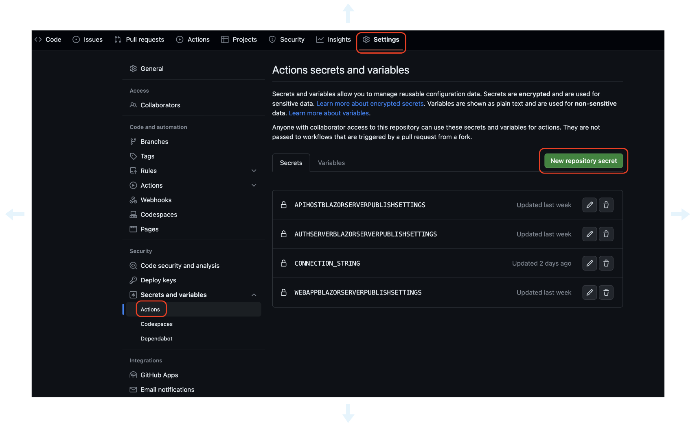
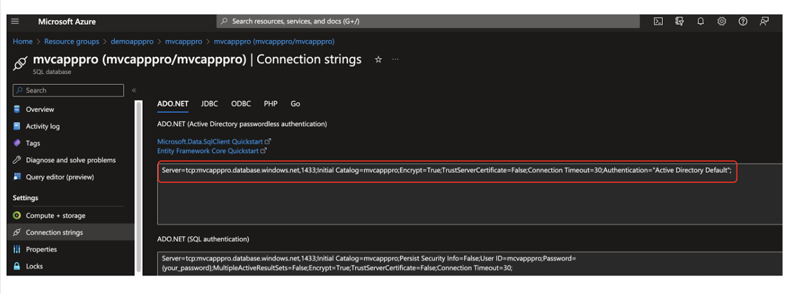
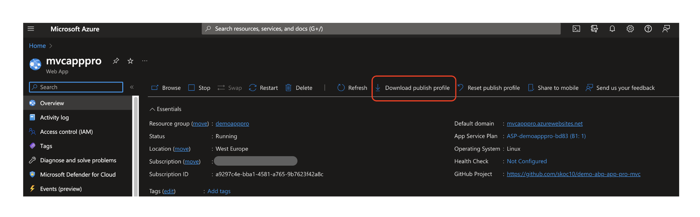
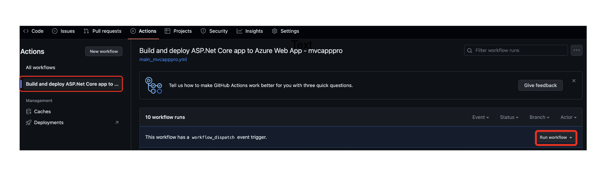
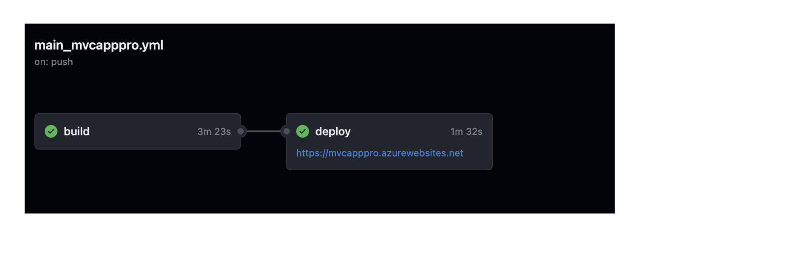
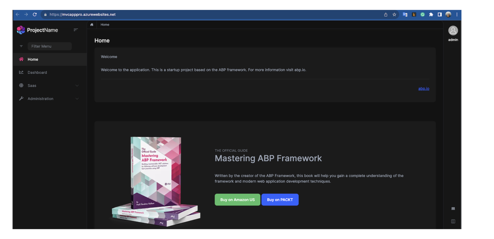

````json
//[doc-params]
{
    "UI": ["MVC", "Blazor", "BlazorServer", "NG"],
    "DB": ["EF", "Mongo"],
    "Tiered": ["Yes", "No"]
}
````

## Step 3: Deploying Your Application to Azure Web App Service

### Deploying Your Application to Azure Web App Service using GitHub Actions

1. Create a new GitHub repository for your project if you don't have one.

2. Push your project to the new GitHub repository.

3. Navigate to the **Actions** tab of your GitHub repository.

4. Click the **set up a workflow yourself** button.

    

5. Copy this content to the opened file and commit it.

{{if UI_Value != "NG"}}
    {{if Tiered == "No"}}
        {{if UI_Value == "MVC"}}

    ```yml
    # Docs for the Azure Web Apps Deploy action: https://github.com/Azure/webapps-deploy
    # More GitHub Actions for Azure: https://github.com/Azure/actions

    name: Build and deploy ASP.Net Core app to Azure Web App

    on:
    push:
        branches:
        - main
    workflow_dispatch:

    jobs:
    build:
        runs-on: ubuntu-latest

        steps:
        - uses: actions/checkout@v2

        - name: Set up .NET Core
            uses: actions/setup-dotnet@v1
            with:
            dotnet-version: '7.x'
            include-prerelease: true

        - name: Build with dotnet
            run: dotnet build --configuration Release

        - name: Run migrations
            run: dotnet run -- "${{ secrets.CONNECTION_STRING }}" # Set your connection string as a secret in your repository settings
            working-directory: ./src/yourapp.DbMigrator

        - name: dotnet publish
            run: dotnet publish -c Release -o ${{env.DOTNET_ROOT}}/myapp
            working-directory: ./src/yourapp.Web

        - name: Generate authserver.pfx
            run: dotnet dev-certs https -v -ep ${{env.DOTNET_ROOT}}/myapp/authserver.pfx -p 2D7AA457-5D33-48D6-936F-C48E5EF468ED

        - name: Upload artifact for deployment job
            uses: actions/upload-artifact@v2
            with:
            name: .net-app
            path: ${{env.DOTNET_ROOT}}/myapp

    deploy:
        runs-on: ubuntu-latest
        needs: build
        environment:
        name: 'Production'
        url: ${{ steps.deploy-to-webapp.outputs.webapp-url }}

        steps:
        - name: Download artifact from build job
            uses: actions/download-artifact@v2
            with:
            name: .net-app

        - name: Deploy to Azure Web App
            id: deploy-to-webapp
            uses: azure/webapps-deploy@v2
            with:
            app-name: 'yourapp' # Replace with your azure web app name
            slot-name: 'Production'
            publish-profile: ${{ secrets.AZUREAPPSERVICE_PUBLISHPROFILE }} # Set your Azure Web App publish profile as a secret in your repository settings
            package: .
    ```
        {{else}}

7. Navigate to the **Settings** tab of your GitHub repository.

8. Click the **Secrets** button.
    
9. Click the **New repository secret** button.

    

10. Add the following secrets:

    - **CONNECTION_STRING**: The connection string of your database.
    
        Example of azure sql connection string:
    
    

    - **AZUREAPPSERVICE_PUBLISHPROFILE**: The publish profile of your Azure Web App Service. You can download it from the **Overview** tab of your Azure Web App Service.

    

11. Navigate to the **Actions** tab of your GitHub repository.

12. Click the **Deploy to Azure Web App** workflow.

    

13. Click the **Run workflow** button.

    

14. Navigate to the web app url to see the deployed application.

    

> If you are unsuccessful in deploying your application, you can check the logs of the deployment by clicking the **Deploy to Azure Web App** workflow and then clicking the **deploy-to-webapp** job.

> If deployment is successful, but you get an error when you navigate to the web app url, you can check the logs of the web app by clicking the **Logs** button on the **Overview** tab of your Azure Web App Service.

> Finally you have CI/CD pipeline for your application. Every time you push your code to the main branch, your application will be deployed to Azure Web App Service automatically.


## What's next?

- [Docker Deployment using Docker Compose](deployment-docker-compose.md)

- [IIS Deployment](deployment-iis.md)
