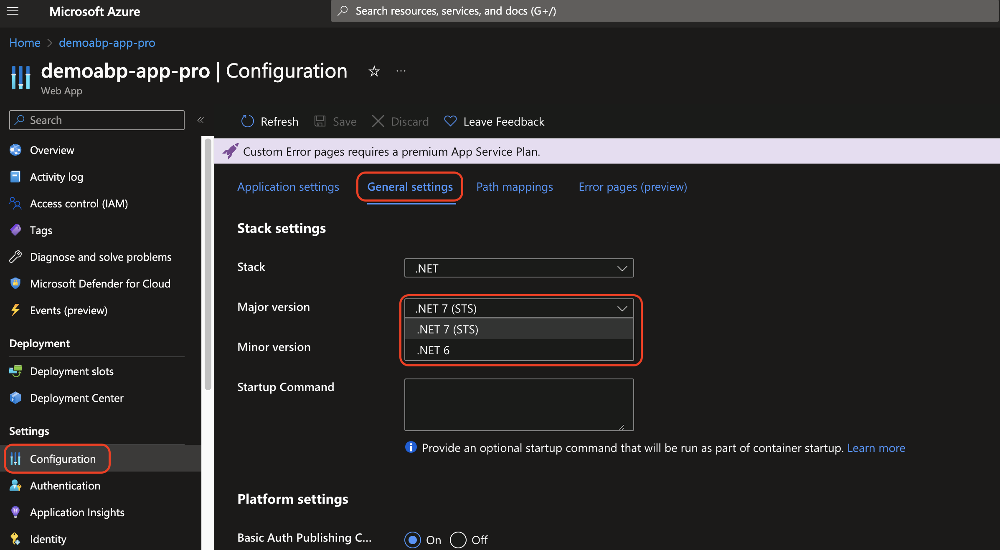

# Provisioning an Azure Web App using Terraform

````json
//[doc-params]
{
    "UI": ["MVC", "Blazor", "BlazorServer", "NG"],
    "DB": ["EF", "Mongo"],
    "Tiered": ["Yes", "No"]
}
````

In this tutorial, we'll walk through the steps to provision an Azure Web App using Terraform. Terraform is an open-source infrastructure as code tool that allows you to define and manage your infrastructure in a declarative way.

## Prerequisites

Before you begin, you'll need the following:

- An [Azure account](https://azure.microsoft.com/en-us/free/)
- [Terraform installed](https://developer.hashicorp.com/terraform/downloads) on your local machine 
- [Azure CLI installed](https://docs.microsoft.com/en-us/cli/azure/install-azure-cli) on your local machine

## Creating a Service Principal for Terraform in Azure

When working with Terraform on Azure, you'll need a Service Principal for authentication purposes. A service principal is an identity created for use with applications, hosted services, and automated tools to access Azure resources.

[To create a service principal](https://learn.microsoft.com/en-us/azure/developer/terraform/authenticate-to-azure?tabs=bash#create-a-service-principal), run the following command in the Azure CLI:

1. Login to Azure CLI

    Before you begin, make sure you are logged into your Azure account via the Azure CLI:
    ```bash
    az login
    ```

2. Set your Subscription:

    If you have multiple Azure subscriptions, specify the one you intend to use:
    ```bash
    az account set --subscription="YOUR_SUBSCRIPTION_ID"
    ```

3. Create the Service Principal:

    The following command will create a service principal. Replace YOUR_APP_NAME with a suitable name for your application:
    ```bash
    az ad sp create-for-rbac --name "YOUR_APP_NAME" --role contributor --scopes /subscriptions/YOUR_SUBSCRIPTION_ID
    ```
    > Replace `YOUR_SUBSCRIPTION_ID` with your subscription id.

    The output of this command will provide the **appId**, **displayName**, **name**, **password**, and **tenant**. It's crucial to note these values, especially **appId (Client ID)** and **password (Client Secret)**, as you'll need them for Terraform authentication.

4. Specify service principal credentials in environment variables

    bash:
    ```bash
    export ARM_SUBSCRIPTION_ID="<azure_subscription_id>"
    export ARM_TENANT_ID="<azure_subscription_tenant_id>"
    export ARM_CLIENT_ID="<service_principal_appid>"
    export ARM_CLIENT_SECRET="<service_principal_password>"
    ```
    To execute the ~/.bashrc script, run source ~/.bashrc (or its abbreviated equivalent . ~/.bashrc). You can also exit and reopen Cloud Shell for the script to run automatically.
    Run the following bash command to verify the Azure environment variables:
    ```bash
    . ~/.bashrc
    ```
    powershell:
    ```powershell
    $env:ARM_SUBSCRIPTION_ID="<azure_subscription_id>"
    $env:ARM_TENANT_ID="<azure_subscription_tenant_id>"
    $env:ARM_CLIENT_ID="<service_principal_appid>"
    $env:ARM_CLIENT_SECRET="<service_principal_password>"
    ```
    Run the following PowerShell command to verify the Azure environment variables:
    ```powershell
    gci env:ARM_*
    ```
    > Replace the values with your own.

## Creating a Terraform Configuration

1. Create a new directory for your Terraform configuration files.

2. Create a new file named `main.tf` in the directory and add the following code:

        ```terraform
        # Configure the Azure provider
        terraform {
        required_providers {
            azurerm = {
            source  = "hashicorp/azurerm"
            version = "~> 3.0.0"
            }
        }
        required_version = ">= 0.14.9"
        }
        provider "azurerm" {
            features {}
        }

        # Create the resource group
        resource "azurerm_resource_group" "rg" {
            name     = "demo-abp-web-app"
            location = "westeurope"
        }

        # Create the Linux App Service Plan
        resource "azurerm_service_plan" "appserviceplan" {
            name                = "demo-abp-web-app-plan"
            location            = azurerm_resource_group.rg.location
            resource_group_name = azurerm_resource_group.rg.name
            os_type             = "Linux"
            sku_name            = "B1"
        }

{{if UI_Value != "NG"}}

        resource "azurerm_linux_web_app" "webapp" {
            name                  = "webapp-prodemo"
            location              = azurerm_resource_group.rg.location
            resource_group_name   = azurerm_resource_group.rg.name
            service_plan_id       = azurerm_service_plan.appserviceplan.id
            https_only            = true
            site_config {
                application_stack {
                dotnet_version = "6.0"
                }
                minimum_tls_version  = "1.2"
            }
            app_settings = {
                "Redis__Configuration" = azurerm_redis_cache.redis.primary_connection_string
            }
        }
{{else}}

        resource "azurerm_linux_web_app" "webapp" {
            name                  = "webapp-angular-demo"
            location              = azurerm_resource_group.rg.location
            resource_group_name   = azurerm_resource_group.rg.name
            service_plan_id       = azurerm_service_plan.appserviceplan.id
            https_only            = true
            site_config {
                application_stack {
                node_version = "16-lts"
                }
                minimum_tls_version  = "1.2"
            }
            app_settings = {
                "Redis__Configuration" = azurerm_redis_cache.redis.primary_connection_string
            }
        }
{{end}}

        

        output "webappurl" {
            value = "${azurerm_linux_web_app.webapp.name}.azurewebsites.net"
        }
        ```

3. Run `terraform init` to initialize the directory.

4. Run `terraform plan` to see the execution plan.

5. Run `terraform apply` to apply the changes. Type `yes` when prompted to confirm the deployment.

6. Wait for the deployment to complete.

7. Navigate to the web app url to see the deployed application.

> You can also see the web app url in the output of the `terraform apply` command.

> You have to change **dotnet version** of runtime stack according to your application. For example, if you are using .NET 7, you should change `dotnet_version = "6.0"` to `dotnet_version = "7.0"`.



## Destroying the Terraform Configuration

1. Run `terraform destroy` to destroy the created resources.

2. Type `yes` when prompted to confirm the destruction.

