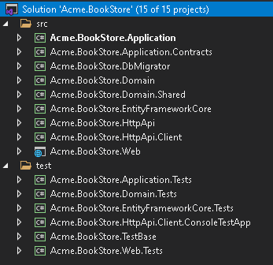
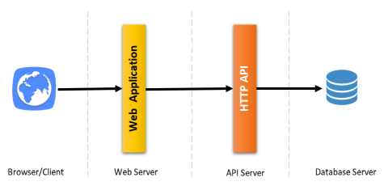
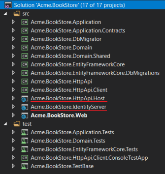
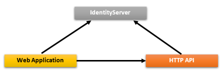
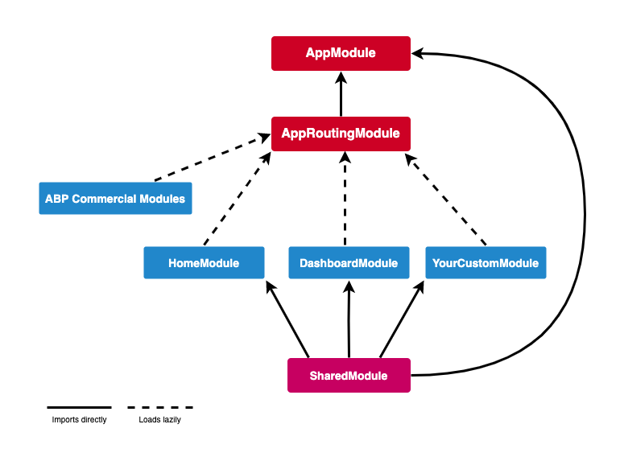

# Solution structure

You will get a slightly different solution structure, based on the options you have specified.

## Default structure

If you don't specify any additional option, you will have a solution in the **aspnet-core** folder like the below:



Projects are located in **aspnet-core/src** and **aspnet-core/test** folders. While the **aspnet-core/src** folder contains the actual application, **aspnet-core/test** folder contains unit tests and test base projects. The below diagram shows the layers & project dependencies of the application:


Each section below describes the related project and its dependencies.

### *.Domain.Shared project

This project contains `constants`, `enums`and the other objects which are part of the domain layer, but shared across by all projects in the solution.

For example `BookType <enum>` or `BookConsts <class> ` (contains validation constants like `MaxNameLength`) are good candidates to be in the `*.Domain.Shared` project.

**Dependencies:**

* `Domain.Shared` project has no dependency to other projects in the solution. All other projects depend on this directly or indirectly.

### *.Domain project

This is the domain layer of the solution. It contains [entities, aggregate roots](https://docs.abp.io/{{Document_Language_Code}}/abp/latest/Entities), [domain services](https://docs.abp.io/{{Document_Language_Code}}/abp/latest/Domain-Services), [value types](https://docs.abp.io/{{Document_Language_Code}}/abp/latest/Value-Types), [repository interfaces](https://docs.abp.io/{{Document_Language_Code}}/abp/latest/Repositories) and other domain objects.

A `Book` entity, a `BookManager` domain service and an `IBookRepository` interface are good examples to be inside the `*.Domain` project.

**Dependencies:**

* Depends on the *`.Domain.Shared` because it uses `constants`, `enums` and other objects defined in that project.

### *.Application.Contracts project

This project contains [application service](https://docs.abp.io/{{Document_Language_Code}}/abp/latest/Application-Services) interfaces and [Data Transfer Objects](https://docs.abp.io/{{Document_Language_Code}}/abp/latest/Data-Transfer-Objects) (DTO) of the application layer. It separates the interface & implementation of the application layer. In this way, the interface project can be shared to the clients as a contract package.

`IBookAppService` interface and `BookCreationDto` class are good examples to be inside the `*.Application.Contracts` project.

**Dependencies:**

* Depends on the *`.Domain.Shared` because it may use `constants`, `enums `and other shared objects of this project in the application service interfaces and DTOs.

### *.Application project

This project contains the [application service](https://docs.abp.io/{{Document_Language_Code}}/abp/latest/Application-Services) **implementations** of the interfaces defined in the `.Application.Contracts` project.

`BookAppService` is the implementation of `IBookAppService` interface and good examples to be inside the `*.Application` project.

**Dependencies:**

* Depends on the `*.Application.Contracts` project to be able to implement the interfaces and use the `DTOs`.
* Depends on the `*.Domain` project to be able to use domain objects like entities, repository interfaces, etc... to perform the application logic.

### *.EntityFrameworkCore project

This is the integration project for the `EF Core`. It defines the `DbContext` and implements repository interfaces defined in the `*.Domain` project.

**Dependencies:**

* Depends on the `*.Domain` project to be able to reference to entities and repository interfaces.

> This project is available only if you are using EF Core as the database provider. If you select another database provider, its name will be different.

### *.EntityFrameworkCore.DbMigrations project

Contains EF Core database migrations for the solution. It has a separated `DbContext` dedicated to manage migrations.

ABP is a modular framework and with an ideal design. Each module has its own `DbContext` class. This is where the migration `DbContext` comes in and unifies all `DbContext` configurations into a single model to maintain a single database schema. For advanced scenarios, you can have multiple databases (each contains a single or a few module tables) and multiple migration `DbContexts`  (each maintains a different database schema).

Notice that the migration `DbContext` is only used for database migrations and *not used on runtime*.

* Depends on the `*.EntityFrameworkCore` project since it re-uses the configuration defined for the `DbContext` of the application.

> This project is available only if you are using `EF Core` as the database provider.

### *.DbMigrator project

This is a console application which simplifies to execute database migrations on development and production environments. When you run this application, it;

* Creates the database if necessary.
* Applies the pending database migrations.
* Seeds initial data if needed.

> Notice that, this project has its own `appsettings.json` file. If you need to change the default database connection string, you must set it in its own `appsettings.json` .

Seeding initial data is important at this point. ABP has a modular data seed infrastructure. Further information see [data seeding documentation](https://docs.abp.io/{{Document_Language_Code}}/abp/latest/Data-Seeding).

While creating database and applying migrations seem only necessary for relational databases, this project is included even if you choose a `NoSQL` database provider (like `MongoDB`). In that case, it still seeds initial data which is necessary for the application startup.

**Dependencies:**

* Depends on the `*.EntityFrameworkCore.DbMigrations` project (for EF Core) since it needs to access to the migrations.
* Depends on the `*.Application.Contracts` project to be able to access permission definitions, because initial data seeder grants all permissions for the admin role by default.

### *.HttpApi project

This project is used to define your API Controllers.

Most of the time you don't need to manually define API Controllers since ABP's [Auto API Controllers](https://docs.abp.io/{{Document_Language_Code}}/abp/latest/API/Auto-API-Controllers) feature creates them automagically based on your application layer. However, in case, you need to write API controllers, this is the best place to do it.

**Dependencies:**

* Depends on the `*.Application.Contracts` project to be able to inject the application service interfaces.

### *.HttpApi.Client project

This is project defines `C#` client proxies to use the HTTP APIs of the solution. You can share this library to 3rd-party clients, so they can easily consume your HTTP APIs in their `.NET` applications. For other type of applications, they can still use the APIs, either manually or using a tool in their own platform.

Most of the time you don't need to manually create C# client proxies, thanks to ABP's [Dynamic C# API Clients](https://docs.abp.io/{{Document_Language_Code}}/abp/latest/API/Dynamic-CSharp-API-Clients) feature.

`*.HttpApi.Client.ConsoleTestApp` project is a console application created to demonstrate the usage of the client proxies.

* Depends on the `*.Application.Contracts` project to be able to share the same application service interfaces and DTOs with the remote service.

> Notice that, you can delete this project & dependencies if you don't need to create `C#` client proxies for your APIs.

### *.Web project

This project contains the user interface (UI) of the application if you are using ASP.NET Core MVC UI. It contains Razor pages, JavaScript files, CSS files, images and so on...

This project has a `appsettings.json` file which contains the connection string and other configuration of the application.

**Dependencies:**

* Depends on the `*.HttpApi` since the UI layer needs to use APIs and application service interfaces of the solution.

> If you check the source code of the `*.Web.csproj` file, you will see the references to the `*.Application` and the `*.EntityFrameworkCore.DbMigrations` projects. These references are actually not needed while coding your UI layer, because UI layer doesn't depend on the `EF Core` or the Application layer's implementation. This startup template is pre-configured for the tiered deployment, where API layer is hosted in a separate server apart from the UI layer.
>
> However, if you don't choose the `--tiered` option when you create a solution, these references will be in the `*.Web` project to be able to host the Web, API and application layers in a single application endpoint. This gives you the ability to use the domain entities & repositories in your presentation layer. However, this is considered as a bad practice according to the DDD rules.
>

### Test projects

The solution has multiple test projects, one for each layer:

* `*.Domain.Tests` is used to test the domain layer.
* `*.Application.Tests` is used to test the application layer.
* `*.EntityFrameworkCore.Tests` is used to test `EF Core` configuration and custom repositories.
* `*.Web.Tests` is used to test the UI (if you are using ASP.NET Core MVC UI).
* `*.TestBase` is a shared / base project for other tests.

In addition, `*.HttpApi.Client.ConsoleTestApp` is a console application (not an automated test project) which demonstrates the usage of HTTP APIs from a `.NET` application.

Test projects are prepared for integration testing:

* It is fully integrated to ABP framework and all services in your application.
* It uses `SQLite` in-memory database for `EF Core` and it uses the [Mongo2Go](https://github.com/Mongo2Go/Mongo2Go) library for `MongoDB`.
* Authorization is disabled, so any application service can be easily used in tests.

You can also create unit tests to test your functions that requires several clicks to trigger. Because it runs faster by skipping all the initialization processes.

### How to run?

Set `*.Web` project as the startup and run the application. The default login credentials are;

* Username: **admin**  

* Password: **1q2w3E***

See [Getting Started With the ASP.NET Core MVC Template](https://docs.abp.io/{{Document_Language_Code}}/abp/latest/Getting-Started-AspNetCore-MVC-Template) for more information.

## Tiered structure

If you have selected the ASP.NET Core UI and specified the `--tiered` option, it becomes a tiered solution. The purpose of the tiered structure is to be able to deploy the Web application and the HTTP API to separate servers.



* The browser runs your UI by executing HTML, CSS & JavaScript files.
* The web servers host static UI files (CSS, JavaScript, images) & dynamic components (e.g: Razor pages). It performs HTTP requests to the API server to execute the business logic of the application.
* The API Server hosts the HTTP APIs which then use application & domain layers of the application to perform the business logic.
* Finally, the database server hosts your database.

Hence, the final solution enables a 4-tiered deployment.

> Unless you actually need such a 4-tiered deployment, its suggested to go with the default structure which is simpler to develop, deploy and maintain.

The tiered solution structure is shown below:



There are 2 new projects as different from the default structure:

*  `*.IdentityServer` 
* `*.HttpApi.Host`

### *.IdentityServer project

This project is used as an authentication server for other projects. `.Web` project uses `OpenId Connect Authentication` to get identity and access token for the current user from the `IdentityServer`. Then uses the access token to call the HTTP API server. The HTTP API server uses bearer token authentication to obtain claims from the token to authorize the current user.



ABP uses the open source [Identity Server 4](https://identityserver.io/) framework for the authentication between applications. Further information, check out [Identity Server 4 documentation](http://docs.identityserver.io) for the ` Identity Server 4` and `OpenID Connect protocol`.

`*.IdentityServer` project has its own `appsettings.json`  which contains database connection string and other configurations.

### *.HttpApi.Host project

`*.HttpApi.Host` project hosts the API of the solution. It has its own `appsettings.json` that contains database connection string and other configurations.

### *.Web project

Just like the default structure, this project contains the user interface (UI) of the application. It contains razor pages, JavaScript files, CSS, images and so on...

This project contains its own `appsettings.json` file, but this time it does not have a connection string because it doesn't need to connect to the database. It contains endpoints of the remote API server and the authentication server.

### Pre-requirements

* [Redis](https://redis.io/): The applications use `Redis` as the distributed cache. So, you need to have `Redis` up & running.

### How to run?

You must run the application with the below order:

1. Run the `*.IdentityServer` since other applications depends on it.

2. Then run the `*.HttpApi.Host` since it is used by the `*.Web` application.

3. Finally, run the `.Web` project and wait for it to initialize.

   When you see the login page, Use **admin** as the username and **1q2w3E*** as the password to login.

## Angular UI

If you choose `Angular` as the UI framework (using the `-u angular` option), the solution is being separated into three folders:

* `angular` folder contains the Angular UI application, the client-side code.
* `aspnet-core` folder contains the ASP.NET Core solution, the server-side code.
* `react-native` folder contains the React Native UI application, the client-side code for mobile.

The server-side is similar to the solution described above. `*.HttpApi.Host` project serves the API, so the `Angular` application consumes it.

Angular application folder structure looks like below:


Each of ABP Commercial modules is an NPM package. Some ABP modules are added as a dependency in `package.json`. These modules install with their dependencies. To see all ABP packages, you can run the following command in the `angular` folder:

```bash
yarn list --pattern abp
```

Angular application module structure:



### AppModule

`AppModule` is the root module of the application. Some of ABP modules and some essential modules imported to the `AppModule`.

ABP Config modules also have imported to `AppModule`  for initially requirements of lazy-loadable ABP modules.

### AppRoutingModule

There are lazy-loadable ABP modules in the `AppRoutingModule` as routes.

> Paths of ABP Modules should not be changed.

You should add `routes` property in the `data` object to add a link on the menu to redirect to your custom pages.

```js
{
   path: 'dashboard',
   loadChildren: () => import('./dashboard/dashboard.module').then(m => m.DashboardModule),
   canActivate: [AuthGuard, PermissionGuard],
   data: {
      routes: {
         name: 'ProjectName::Menu:Dashboard',
         order: 2,
         iconClass: 'fa fa-dashboard',
         requiredPolicy: 'ProjectName.Dashboard.Host'
      } as ABP.Route
   }
}
```
In the above example;
*  If the user is not logged in, AuthGuard blocks access and redirects to the login page.
*  PermissionGuard checks the user's permission with `requiredPolicy` property of the `rotues` object. If the user is not authorized to access the page, the 403 page appears.
*  `name` property of `routes` is the menu link label. A localization key can be defined .
*  `iconClass` property of `routes` object is the menu link icon class.
*  `requiredPolicy` property of `routes` object is the required policy key to access the page.

After the above `routes` definition, if the user is authorized, the dashboard link will appear on the menu.

### Shared Module

The modules that may be required for all modules have imported to the `SharedModule`. You should import the `SharedModule` to all modules.

See the [Sharing Modules](https://angular.io/guide/sharing-ngmodules) document.

### Environments

The files under the `src/environments` folder has the essential configuration of the application.

### Home Module

Home module is an example lazy-loadable module that loads on the root address of the application.

### Dashboard Module

Dashboard module is a lazy-loadable module. `HostDashboardComponent` and `TenantDashboardComponent` declared to this module. One of these components is shown according to the user's authorization. 

There are four widgets in the `HostDashboardComponent` which declared in ABP modules.

### Styles

The required style files added to `styles` array in the `angular.json`. `AppComponent` loads some style files lazily via `LazyLoadService` after the main bundle is loaded to shorten the first rendering time.

### Logos

Lepton theme uses two logos for each style. You can change these logos with your own logos without changing the filenames in the `assets/images/logo` folder.

### Testing

You should create your tests in the same folder as the file file you want to test.

See the [testing document](https://angular.io/guide/testing).

### Depended Packages

* [NG Bootstrap](https://ng-bootstrap.github.io/) is used as UI component library.
* [NGXS](https://www.ngxs.io/) is used as state management library.
* [angular-oauth2-oidc](https://github.com/manfredsteyer/angular-oauth2-oidc) is used to support for OAuth 2 and OpenId Connect (OIDC).
* [Chart.js](https://www.chartjs.org/) is used to create widgets.
* [ngx-validate](https://github.com/ng-turkey/ngx-validate) is used for dynamic validation of reactive forms.

## What's next?

- See the [Getting Started](../../getting-started.md) document to create a new solution and run it for this template.
- See the [ASP.NET Core MVC Tutorial](../../tutorials/book-store/mvc-razor-pages/index.md) to learn how to develop applications using this template.