# Creating New Microservice

You can create a new microservice for your microservice project by using the abp CLI:

```powershell
dotnet new OrderService -t microservice-service-pro -o C:\myprojectfolder
```

You can see your newly created (order) microservice under your **microservices** directory of your project solution.

## Add Newly Created Microservice to Solution

Right click to microservices solution folder in your solution and add **HttpApi.Host.csproj** of your newly created microservice as an existing project.


> dotnet restore and dotnet build commands will fail for **OrderService.HttpApi.Host** project. Navigate to **OrderServiceHttpApiHostModule** and change depends on module **MyProjectNameSharedHostingMicroservicesModule** to **BookStoreSharedHostingMicroservicesModule**. (bug)

### Update OrderService appsettings (bug):

Rename all the MyProjectName fields to your project name and update AbpLicenseCode

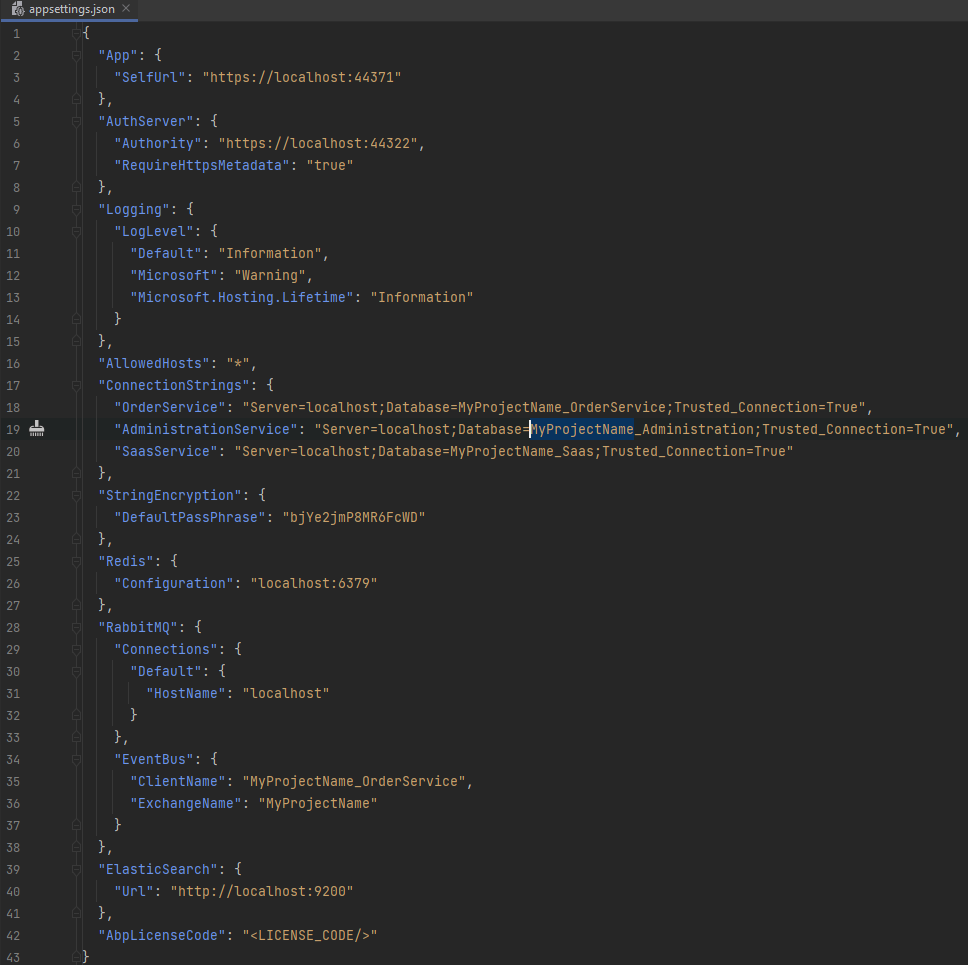


### Update Administration Microservice

Administration microservice hosts the permission management. Hence, we need to add newly created service Application.Contracts so that the permissions of the service can be available in permission management screen.

Add OrderService.Application.Contracts reference to AdministrationService.HttpApi.Host project:

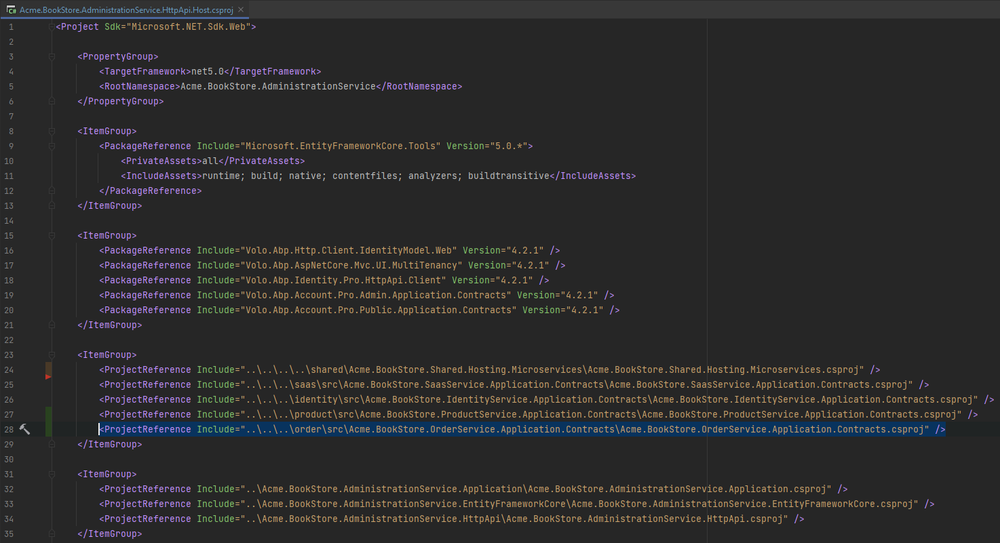

Update **AdministrationServiceHttpApiHostModule** with new depends on module:

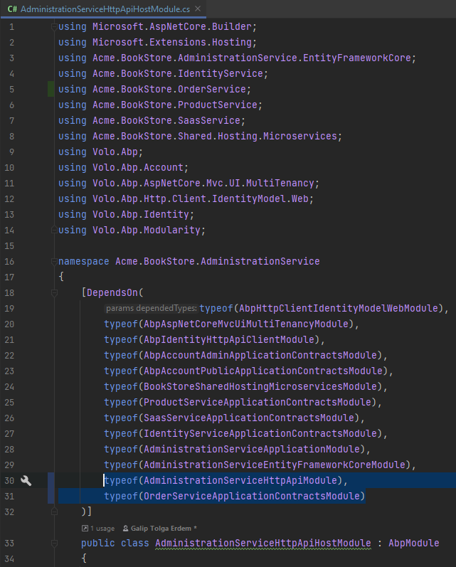

### Updating DbMigrator

Add OrderService.Application.Contracts and EntityFrameworkCore projects as references to DbMigrator project:

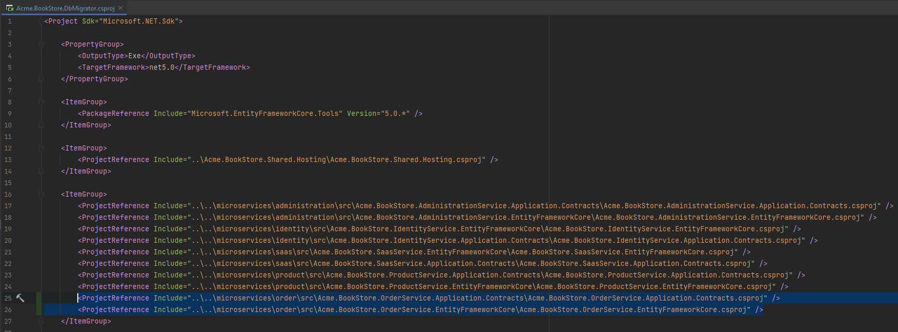

Update **DbMigratorModule** with new depends on modules:

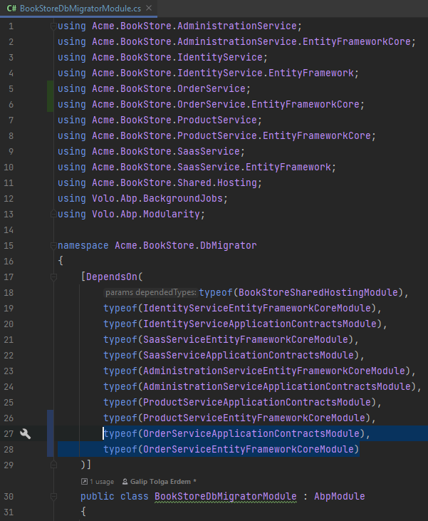

Update **appsettings**.json ConnectionStrings: 

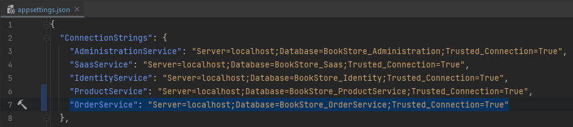

Update **DbMigrationService** MigrateAllDatabasesAsync method: 


Update **IdentityServerDataSeeder**: 


This is an optional step since identityserver management can be done via UI. However it is a good practice to keep IdentityServerDataSeeder updated. You can select the gateways you want to grant for new service to be reached. Keep in mind, you need to add route configuration for each gateway. In this sample, OrderService will be used in all default gateways. 

> If you also want to use your newly created service as a client; making sync calls to an other microservice, don't forget to create client for the service under **CreateClientAsync** private method just like Administration Service Client. Also don't forget to update appsettings.json of your new  service with **IdentityClients** section with your ClientId and granted scopes you have defined in **CreateClientAsync** method of IdentityServerDataSeeder.

### Updating Gateways

Update each gateways you have granted with the new service ocelot configuration:

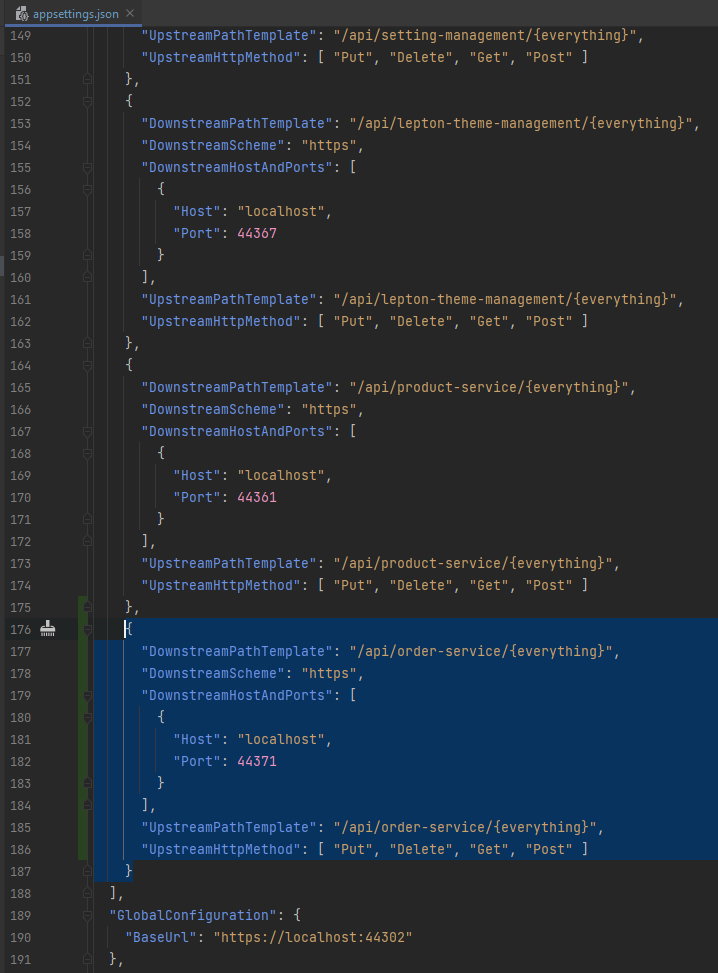

You can test your gateways and should be able to see your new microservice endpoints.

### Adding UI to Applications

You can develop UI for your application with two different ways:

#### 1) UI development inside microservice (self-hosted (confirmation for naming required from hikalkan*)):

Develop your application UI like any abp application template; add your pages under OrderService.Web. This way you can have the integrity of backend and frontend in your microservice as a whole. 

**To add your microservice UI to your application (Web application in this case):**

Add **HttpApi.Client** and **Web** projects as references to Web project:

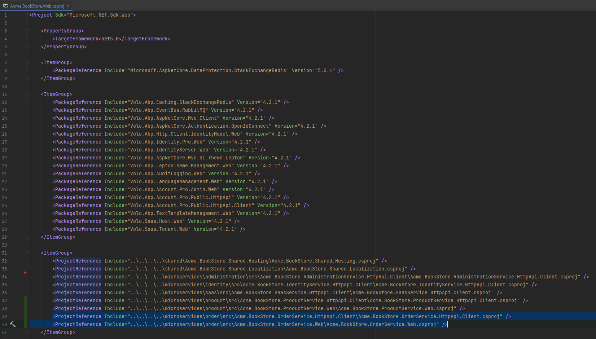

Update WebModule.cs file with new depends on modules:

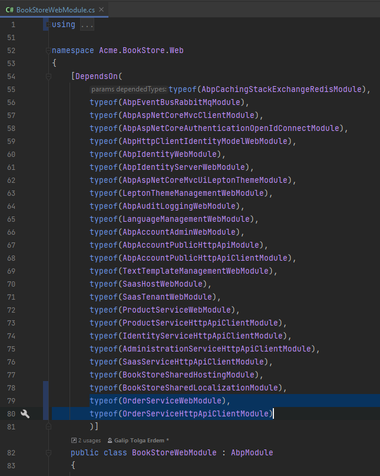

> ProductService.Web module is designed with this approach. You can examine ProductService.Web project for sample implementation.

#### 2) UI development inside application:

Develop your application UI inside back-office application and call microservice as web-service. This way you can separate the frontend and backend team and develop each of them in their respected solutions.

**To add your microservice UI to your application (PublicWeb application in this case):**

Add **HttpApi.Client** project as references to PublicWeb project:

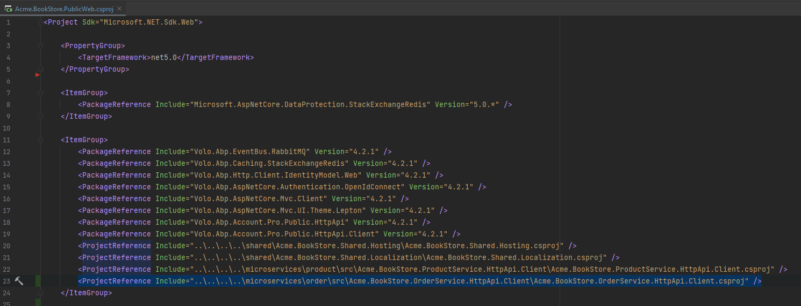

Update PublicWebModule.cs file with new depends on modules:

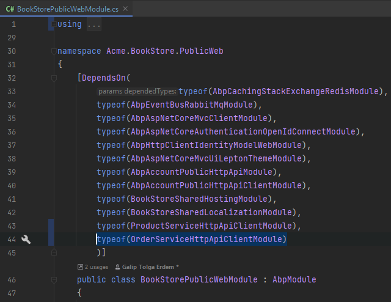

#### Updating Tye configuration:

You can also update your tye.yaml configuration. Add your new service HttpApi.Host.csproj path and port with self-sign development certification information

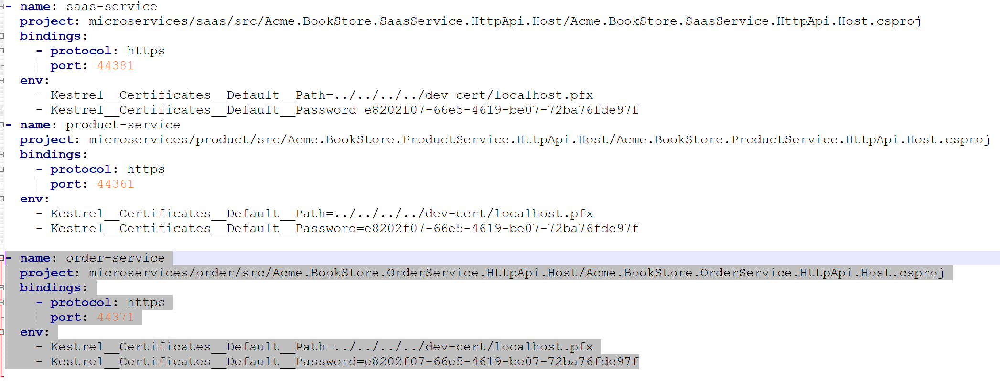

