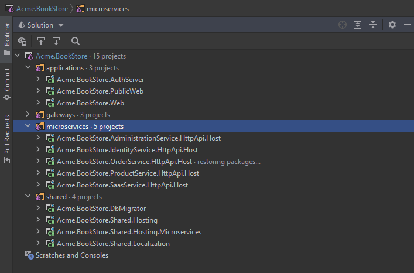
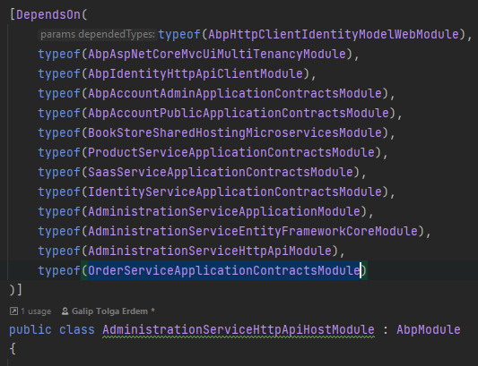
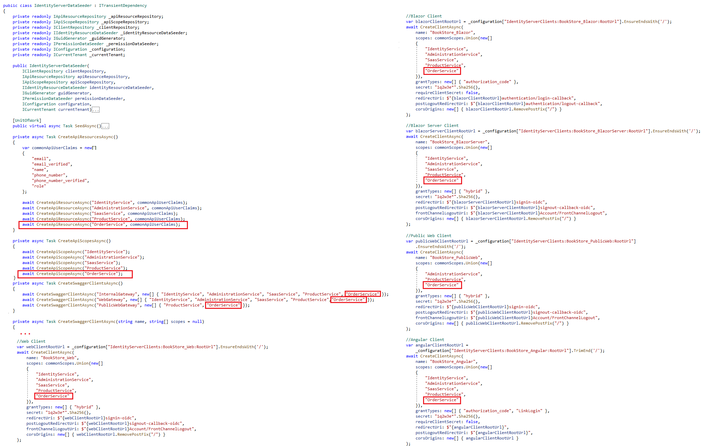
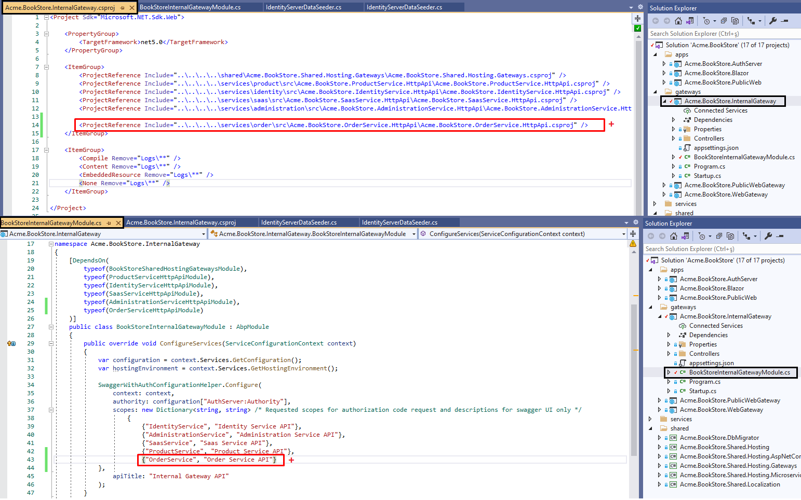
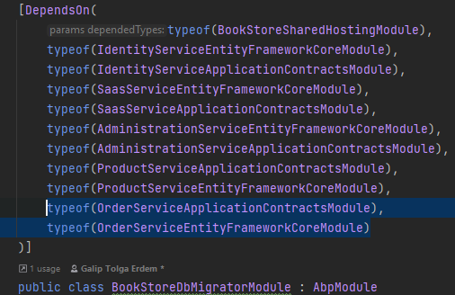
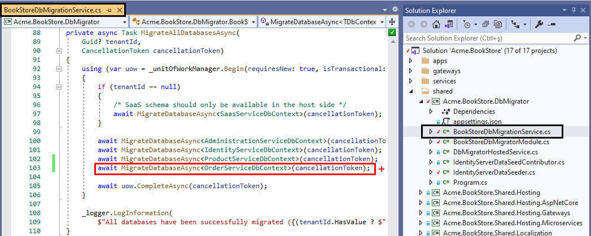

# Add new Microservices to the Solution

> This documentation introduces guidance for creating a new microservice for your microservice startup template. Eventually, these steps will be automated in the future however learning these steps may provide insight to learn the relations between microservices.

## Creating new microservice

You can create a new microservice for your microservice solution by using the abp CLI with the following command:

```powershell
abp new OrderService -t microservice-service-pro
```

You can see your newly created (order) microservice under your **microservices** directory of your project solution.

Add **OrderService.HttpApi.Host.csproj** as an existing project to your main solution so that you can manage the host projects from one solution.



> Dont' forget to `dotnet build` your newly created *order* service under *services/order* directory.

You need to update several projects in order to integrate your new service into your composition. 

## Updating Administration Microservice

Administration microservice hosts the **permission management**. In order to make your microservice permissions available in permission management screen; you need to add **OrderService.Application.Contracts** project reference then add module dependency to **AdministrationServiceHttpApiHostModule** as below: 

```csharp
typeof(OrderServiceApplicationContractsModule)
```

So that your AdministrationServiceHttpApiHostModule should look like below:



## IdentityServer Configuration

> You can also replicate the same functionality in this step by using identityserver management UI. However it is a good practice to keep IdentityServerDataSeeder updated. 

To keep IdentityServerDataSeeder updated, you need to:

- **Create ApiResource**: OrderService itself is a new api resource, you should add it by updating **CreateApiResourcesAsync** method with:

  ```csharp
  await CreateApiResourceAsync("OrderService", commonApiUserClaims);
  ```

- **Create ApiScope**: To make OrderService a reachable scope for other services, you should add it as a new scope by updating **CreateApiScopesAsync** method with: 

  ```csharp
  await CreateApiScopeAsync("OrderService");
  ```

- **Update SwaggerClients**: Swagger clients are used for ***authorizing*** the microservice endpoints via *authorization code* flow for the swagger endpoints. You need to update the related swagger client creation scopes with adding the **OrderService** scope. You can select the gateways you want to grant for new service to be reached. **Keep in mind**, you need to add route configuration for each gateway. 

- **Update Clients**: Update Web and/or Public (angular or blazor if application is not mvc) client creations in **CreateClientsAsync** method. Add **OrderService** scope. If you want to call OrderService from an other service, add OrderService scope to caller service client aswell.

- **Create New Client:** If you want OrderService to be able call other services, you need to add OrderService as a client under **CreateClientsAsync** aswell. Then, update appsettings.json of the OrderService with **IdentityClients** section with the ClientId and granted scopes you have defined in **CreateClientAsync** method for client credential flow. Also, check microservice intercommunication docs for more information (**TODO**).

  > AdministrationService microservice has configuration for making sync calls to IdentityService which can be examined if you are planning sync communication for your new microservice.  

You can see updated **IdentityServerDataSeeder** image below that creates OrderService ApiResource and ApiScope which also granted scopes to all swagger clients.



## Updating Gateways

Update each related gateway ocelot configuration with the new service endpoint configuration. Above sample added OrderService to all three gateways; InternalGateway, WebGateway and PublicWebGateway.

For each gateway you want to expose new microservice endpoint, you need to:

1. **Add project reference and module dependency**: Add OrderService.HttpApi project reference to your gateway project dependency and add OrderServiceHttpApiModule to gateway module dependency like:

  ```csharp
  typeof(OrderServiceHttpApiModule)
  ```

  Update the *SwaggerWithAuthConfigurationHelper* `Configure` method, adding the **OrderService** api scope for swagger client authorization.

  

2. **Update appsettings.json for ocelot configuration:** You need to add new Downstream and Upstream path templates for new microservice like:

  ```json
  {
    "DownstreamPathTemplate": "/api/order-service/{everything}",
    "DownstreamScheme": "https",
    "DownstreamHostAndPorts": [
      {
        "Host": "localhost",
        "Port": 44371
      }
    ],
    "UpstreamPathTemplate": "/api/order-service/{everything}",
    "UpstreamHttpMethod": [ "Put", "Delete", "Get", "Post" ]
  }
  ```

  > You can make different configurations for each method or endpoint for your microservice and add QoS configurations based on your business requirements. You can check [ocelot documentation](https://ocelot.readthedocs.io/en/latest/) for more.

## Updating DbMigrator

Since OrderService is using its own database, you should add it to `DbMigrator` aswell so that DbMigrator can handle OrderService migrations and data seeding. 

1. **Update Project References:** Add **OrderService.Application.Contracts** and **OrderService.EntityFrameworkCore** project references to **DbMigrator** project then add the related dependencies to **DbMigratorModule** as below:

   ```csharp
   typeof(OrderServiceApplicationContractsModule),
   typeof(OrderServiceEntityFrameworkCoreModule)
   ```

   

2. **Update DbMigrationService:** DbMigratorHostedService runs the MigrateAsync method which eventually runs the **MigrateAllDatabasesAsync** method. Add the new database migration with the others: 

   ```csharp
   await MigrateDatabaseAsync<OrderServiceDbContext>(cancellationToken);
   ```

   

3. **Update appsetings.json:** Migration of OrderService will require predefined connection string name under OrderService.Domain.OrderServiceDbProperties. Add related connection string name to **appsettings.json** ConnectionStrings sections of DbMigrator as below:

   ```json
   "OrderService": "Server=localhost;Database=BookStore_OrderService;Trusted_Connection=True"
   ```

## Adding UI to Applications

You can develop UI for your application with two different ways:

### 1) Modular UI Development:

Develop your application UI like any abp application template; add your pages under **OrderService.Web** project. This way, back-office application will be showing the UI without hosting the microservice application just by using as a remote service. You can check [Module Architecture Best Practices & Conventions](https://docs.abp.io/en/abp/latest/Best-Practices/Module-Architecture#layers-packages) **Section C** for more information. 

**To add your microservice UI to your back-office application (Web application):**

Add **HttpApi.Client** and **Web** projects as references to Web project and add new dependencies to **WebModule** as below:

```csharp
typeof(OrderServiceWebModule),
typeof(OrderServiceHttpApiClientModule)
```

> ProductService.Web module is designed this way. You can examine ProductService.Web project for sample implementation.

This approach may benefit you with having the integrity of backend and frontend in your microservice as a whole since you will be able to develop your microservice backend and frontend in the same microservice solution.

### 2) Monolith UI Development inside application:

Develop your application UI inside application; add your pages under application layer of your solution and use microservice as a remote service. You can check [Module Architecture Best Practices & Conventions](https://docs.abp.io/en/abp/latest/Best-Practices/Module-Architecture#layers-packages) **Section D** for more information.  

**To add your microservice UI to your application (PublicWeb application in this case):**

Add **HttpApi.Client** reference to **PublicWeb** project and add new dependency to **PublicWebModule** as below:

```csharp
typeof(OrderServiceHttpApiClientModule)
```

> ProductService.PublicWeb module is designed this way. You can examine ProductService.PublicWeb project for sample implementation.

This way you can separate the frontend and backend team and develop each of them in their respected solutions.

## Updating Tye configuration:

If you are planning to use [dotnet tye](https://github.com/dotnet/tye) for your solution, you can also update your tye.yaml configuration that is already provided after project creation. Add **OrderService.HttpApi.Host.csproj** path and port with self-sign development certification information as below:

```yaml
- name: order-service
  project: microservices/order/src/Acme.BookStore.OrderService.HttpApi.Host/Acme.BookStore.OrderService.HttpApi.Host.csproj
  bindings:
    - protocol: https
      port: 44371
  env:
    - Kestrel__Certificates__Default__Path=../../../../dev-cert/localhost.pfx
    - Kestrel__Certificates__Default__Password=e8202f07-66e5-4619-be07-72ba76fde97f
```
