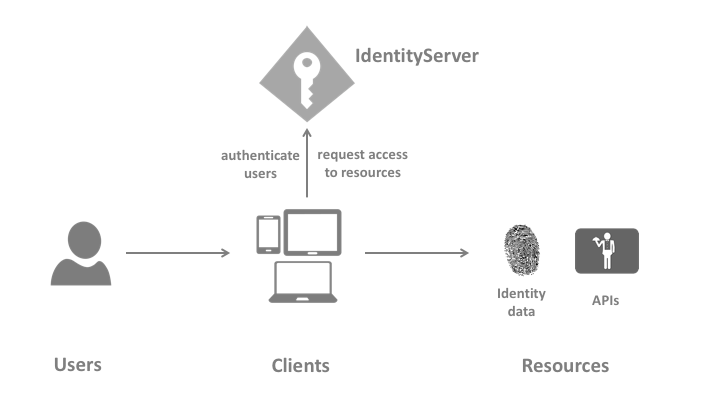

# Microservice Startup Template Applications

There are 3 different applications are presented in the microservice startup template;

- **Authentication Server** is located under *apps/auth-server* folder. This application is the single sign on and single sign out point of your application that also authenticates and authorizes your applications, gateways and microservices.
- **Web (Back-office)** application has `Razor/MVC`, `Angular`, `Blazor (Web Assembly)` and `Blazor.Server` options. This is the main application of your solution.
- **Public Web (Landing page)**  application is located under apps/public-web folder. This is the front page application of your solution.

All applications has their respected solutions created already and can be developed further when if required without opening the whole template solution. It is also possible to add test projects to applications. Create a **test** folder where the *src* folder is located.  Open the application solution and add a new solution folder named **test**.

Add the test projects required by your needs under this folder. Check [The Test Projects Docs](https://docs.abp.io/en/abp/latest/Testing) for more information.


## Authentication Server

> The Authentication Server (named as AuthServer) is a web application that is used as the single sign-on authentication server. It hosts the public account pages such as login, register, forgot password, two factor authentication, profile management... pages, OAuth endpoints and authentication related APIs. All applications and services use this application as a central authority for the authentication. It is built upon OpenId certified [IdentityServer 4](https://identityserver4.readthedocs.io/en/latest/).

AuthServer is the single sign-on and single sign-out server of the microservice template that handles authentication and authorization between applications. Consecutively, it is the most **independent** application that doesn't require any gateway or microservice to run. It only requires related databases up and running.

AuthServer references to [Account Module](https://docs.abp.io/en/commercial/latest/modules/account) that `Account.Pro.Public.Web` package serves the pages like login, sign-out, external login providers etc. and `Account.Pro.Public.Application` package hosts the implementations.

Also, Account Module functionality is split between **microservices**;

- *Identity* and *IdentityServer* related data is kept in **IdentityService microservice**
- *Account management* and *profile management* related data is kept in **AdministrationService microservice** 
- *Tenant* login related data is kept in **SaasService microservice**

AuthServer makes directly database requests to these microservices to reach related data for operating successfully. Hence depends on `IdentityService EntityFrameworkCore`, `AdministrationService EntityFrameworkCore` and `SaasService EntityFrameworkCore` modules and also has the configuration of related connection strings in the *appsettings*.

### Authentication & Authorization

IdentityServer4 is an implementation of *OpenId Connect* and *Oauth2.0* protocols that uses middleware for necessary protocol headers. Based on applications; different flows are used to authenticate the *clients* for the *resources*. 



### Single Sign-On

When logging in to an application, user will be automatically redirected to AuthServer. If the user has already been logged in to one of the applications and try to login to other application, signing in will be immediately granted without prompting the login page.

Since login functionality is centralized, external logins like *Azure*, *Google*, *Twitter*, *Facebook* etc must be implemented in **AuthServerModule** aswell. 

### Single Sign-Out

All the applications are configured to use [Front-Channel Logout](https://openid.net/specs/openid-connect-frontchannel-1_0.html) and *Account Module* already implements the necessary functionality. Whenever you logout from one of your application, you are automatically logged out of other signed in applications once you re-visit them.

> Ex:
>
> If you are logged in to both Web and Public applications, if you log out from **Web application**; you will receive a *Signed Out* page noticing you that you have been signed out and redirected back. If you refresh the **Public application**, you will see that you are logged off from this application too. 

If you want to change this behaviour, update the related client data `FrontChannelLogoutSessionRequired = false` in the *IdentityServer Management* pages.

### Data Seed

AuthServer needs initial data such as identityserver *clients*, *api resources*, api scopes etc and admin user to operate when the microservice stack starts running. To kick-start the process, AuthService uses [Abp Data Seeding](https://docs.abp.io/en/abp/latest/Data-Seeding) to add the required initial data. This information can be found in **IdentityServerDataSeeder**. *IdentityServerDataSeedContributor* is responsible to run the data seeder. Both files are located under shared **DbMigrator** project. 

It is a good practice to keep your *IdentityServerDataSeeder* **up to date** whenever you expand your microservice solution with new api resources and clients.

#### Api Resources

> Api Resources are typically http api endpoints that clients wants to access. All the microservices are added as Api Resources

```csharp
private async Task CreateApiResourcesAsync()
{
    ...
    await CreateApiResourceAsync("IdentityService", commonApiUserClaims);
    await CreateApiResourceAsync("AdministrationService", commonApiUserClaims);
    await CreateApiResourceAsync("SaasService", commonApiUserClaims);
    await CreateApiResourceAsync("ProductService", commonApiUserClaims);
}
```

These are the **name** of the resources.

#### Api Scopes

> Api Scopes can be considered as one-to-many **parts** of **a resource** that represents what a client application is **allowed to** do. They are mostly defined as *myApi.read*, *myApi.write* etc.. for authorization purposes. Abp uses [Permission Management](https://docs.abp.io/en/abp/latest/UI/Angular/Permission-Management) and delegates to authorization to permission management. Hence declaring one scope for each api resource

```csharp
private async Task CreateApiScopesAsync()
{
    await CreateApiScopeAsync("IdentityService");
    await CreateApiScopeAsync("AdministrationService");
    await CreateApiScopeAsync("SaasService");
    await CreateApiScopeAsync("ProductService");
}
```

#### Clients

> Clients are the applications that want to reach *api resources* via allowed interactions (*grant types*) with the token server by representing a list (*scopes*) of  what they request to do.

There are different clients seeded for AuthServer application;

- **Swagger Clients:** These are the gateways added as clients using  `authorization_code` grant type. While *WebGateway* and *Internal Gateway* are allowed for all the scopes, *PublicWeb Gateway* is only allowed to `ProductService` scope default.

- **Back-Office Clients:** 

  - **Web** Client is the Razor/MVC application client using `hybrid` grant type. This client has all the scope allowance as default.
  - **Angular** is the spa application client using `authorization_code` grant type. This client has all the scope allowance as default.
  - **Blazor** Client is the Blazor WebAssembly application client using `authorization_code` grant type. This client has all the scope allowance as default.
  - **Blazor Server** is the application client using `hybrid` grant type. This client has all the scope allowance as default.

- **Public/Landing Page Client:** Public Web application is a Razor/MVC application client using `hybrid` grant type. This client has `AdministrationService` and `ProductService` scope allowance as default.

- **Service Clients**: These are the server-to-server interactions between services. This is a `client_credentials` grant type and there is no user or user information involved in this flow. 

  As default, **AdministrationService** is declared as a client. AdministrationService requires list of user data from *IdentityService*. Since this endpoint is authorized with a permission, required permission is also granted on the client creation. Granted permission will be seen with ProviderName `C` under *AbpPermissionGrants* table in Administration database. That indicates this is a `client_credential` given permission.

  ```csharp
  //Administration Service Client
  await CreateClientAsync(
      name: "MyProjectName_AdministrationService",
      scopes: commonScopes.Union(new[]
      {
          "IdentityService" // Allowed scope to make request
      }),
      grantTypes: new[] {"client_credentials"},
      secret: "1q2w3e*".Sha256(),
      permissions: new[] {IdentityPermissions.Users.Default}
  );
  ```

### Deployment Configurations

> Since AuthServer is an application based on IdentityServer4; all the deployment requirements are also valid for AuthServer application.

#### Cors Origins

Cors origins configuration for **Gateway** authorizations and **Angular/Blazor** (web assembly) must be updated for deployment. This can be found under **App** configuration in *appsettings.json* 

```json
"CorsOrigins": "https://*.MyProjectName.com,http://localhost:4200,https://localhost:44307,https://localhost:44302,https://localhost:44325,https://localhost:44353",
```

#### Redirect Allowed Urls

This configuration must be done if **Angular** or **Blazor** (web assembly) is used as back-office web application. It is found under **App** configuration in appsettings.json

```json
"RedirectAllowedUrls": "http://localhost:4200,https://localhost:44307"
```

#### Signing Certificate

AuthServer application uses [developer signing certificates option]([abp/AbpIdentityServerBuilderOptions.cs at dev · abpframework/abp (github.com)](https://github.com/abpframework/abp/blob/dev/modules/identityserver/src/Volo.Abp.IdentityServer.Domain/Volo/Abp/IdentityServer/AbpIdentityServerBuilderOptions.cs#L29)) for default development environment. Using developer signing certificates may cause *IDX10501: Signature validation failed* error. 

To change the signing credential for staging/production, update your application module with IIdentityServerBuilder pre-configuration.

```csharp
public override void PreConfigureServices(ServiceConfigurationContext context)
{
	PreConfigure<IIdentityServerBuilder>(builder =>
	{
    	builder.AddSigningCredential(...);	
	});
}
```

#### Running AuthServer on HTTPS

AuthServer must be publicly reachable and available over https. [Microsoft recommendation for enforcing https](https://docs.microsoft.com/en-us/aspnet/core/security/enforcing-ssl?view=aspnetcore-5.0&tabs=visual-studio#require-https) is using **Https** and **Hsts** together for https redirection;

```csharp
public override void OnApplicationInitialization(ApplicationInitializationContext context)
{
    var app = context.GetApplicationBuilder();
    var env = context.GetEnvironment();
    ...
    if (!env.IsDevelopment())
    {
        app.UseErrorPage();
        app.UseHsts();
    }
    
    app.UseHttpsRedirection();    
    app.UseCors(DefaultCorsPolicyName);
    ...
}
```

#### Running AuthServer Behind Load Balancer


Configure *Forewarded Headers* when running AuthServer behind Load Balancers;

```csharp
 public override void ConfigureServices(ServiceConfigurationContext context)
 {
     var hostingEnvironment = context.Services.GetHostingEnvironment();
     var configuration = context.Services.GetConfiguration();
     ...
     context.Services.Configure<ForwardedHeadersOptions>(options =>
     {
         options.ForwardedHeaders = ForwardedHeaders.XForwardedFor | ForwardedHeaders.XForwardedProto;
     });
 }
public override void OnApplicationInitialization(ApplicationInitializationContext context)
{
    var app = context.GetApplicationBuilder();
    var env = context.GetEnvironment();
    ...
    if (!env.IsDevelopment())
    {
        app.UseErrorPage();          
	    app.UseForwardedHeaders();
        app.UseHsts();
    }
    
    app.UseHttpsRedirection();    
    app.UseCors(DefaultCorsPolicyName);
    ...
}
```

#### Running AuthServer on Kubernates Pods

You may not be able to set certificates in pods and have to use http inside pods. In this case, use midware for redirection to https

```csharp
public override void OnApplicationInitialization(ApplicationInitializationContext context)
{
    var app = context.GetApplicationBuilder();
    var env = context.GetEnvironment();
    ...
    if (!env.IsDevelopment())
    {
        app.UseErrorPage();
        app.UseHsts();
    }
    
    app.Use((httpContext, next) =>
    {
        httpContext.Request.Scheme = "https";
        return next();
    });
    
    app.UseHttpsRedirection();    
    app.UseCors(DefaultCorsPolicyName);
    ...
}
```

If headers are not forwarded as expected, enable logging. Check [Microsoft Troubleshoot Guide](https://docs.microsoft.com/en-us/aspnet/core/host-and-deploy/proxy-load-balancer?view=aspnetcore-5.0#troubleshoot) fore more information.

## Web Application (Back-office)

This is the back-office (admin-side) application of the template. This application shows the module **UI** but does not host the module. **Modules are hosted by related microservices** and the back-office application just uses them **as remote services**. For more information, do check [Module Architecture Best Practices & Conventions Section C](https://docs.abp.io/en/abp/latest/Best-Practices/Module-Architecture#layers-packages).

To achieve this functionality, **back-office** application needs to reference to `IdentityService`, `AdministrationService`, `SaasService` and sample `ProductService` microservices'  `.Web` and `HttpApi.Client` layers to use them as remote services while microservices need to host the modules. 

Therefore;

- **IdentityService** microservice **hosts** [IdentityServer Management](https://docs.abp.io/en/commercial/latest/modules/identity-server) and [Identity Management](https://docs.abp.io/en/commercial/latest/modules/identity) modules. `Identity.HttpApi.Client` project is referenced for remote service calls but since IdentityService microservice doesn't have a Web layer; module's `.Web` packages are referenced explicitly.
- **AdministrationService** microservice hosts [Text-Template Management](https://docs.abp.io/en/commercial/latest/modules/text-template-management), [Language Management](https://docs.abp.io/en/commercial/latest/modules/language-management), [Audit Logging](https://docs.abp.io/en/commercial/latest/modules/audit-logging), [Lepton Theme Management](https://docs.abp.io/en/commercial/latest/themes/lepton) modules. `Administration.HttpApi.Client` is referenced for remote service calls but since AdministrationService microservice doesn't have a Web layer; module's `.Web` packages are referenced explicitly.
- **SaasService** microservice hosts [Saas Tenant and Host Management](https://docs.abp.io/en/commercial/latest/modules/saas) module.  `Saas.HttpApi.Client` is referenced for remote service calls but since SaasService microservice doesn't have a Web layer; module's `.Web` packages are referenced explicitly.
- **ProductService** microservice doesn't host any external module and has its own Web layer with modularly developed UI. Hence forth, `ProductService.Web` and `ProductService.HttpApi.Client` are referenced together.

### Remote Service Calls - Web Gateway

The back-office application's interactions with the microservices will be through the `Web Gateway`. There is a related configuration for remote services in the *appsettings.json*:

```json
"RemoteServices": {
  "Default": {
    "BaseUrl": "https://localhost:44325/"
  }
},
```

This configuration indicates the default base url of all the Http Api requests; which is the url of the Web Gateway for the back-office application. 

### Application Templates

There are 4 different back-office application templates supported:

#### Razor/MVC

This is a server side application that you can use both Razor Pages and MVC Controllers. 

##### AuthServer Interaction

This application uses [hybrid flow](https://docs.identityserver.io/en/release/topics/grant_types.html?#hybrid). This client is being seeded in *IdentityServerDataSeeder* with **MyProjectName_Web** client name with all the available scopes.

In the **WebModule** authorization is configured as below to be able to make request to all the api resources and some basic identity resources:

```csharp
context.Services.AddAuthentication(options =>
    {
        options.DefaultScheme = "Cookies";
        options.DefaultChallengeScheme = "oidc";
    })
    .AddCookie("Cookies", options =>
    {
        options.ExpireTimeSpan = TimeSpan.FromDays(365);
    })
    .AddAbpOpenIdConnect("oidc", options =>
    {
        options.Authority = configuration["AuthServer:Authority"];
        options.RequireHttpsMetadata = Convert.ToBoolean(configuration["AuthServer:RequireHttpsMetadata"]);;
        options.ResponseType = OpenIdConnectResponseType.CodeIdToken;

        options.ClientId = configuration["AuthServer:ClientId"];
        options.ClientSecret = configuration["AuthServer:ClientSecret"];

        options.SaveTokens = true;
        options.GetClaimsFromUserInfoEndpoint = true;

        options.Scope.Add("role");
        options.Scope.Add("email");
        options.Scope.Add("phone");
        options.Scope.Add("IdentityService");
        options.Scope.Add("AdministrationService");
        options.Scope.Add("SaasService");
        options.Scope.Add("ProductService");
    });
```

There is also related configuration about the `Authority`, `ClientId`, `ClientSecret` under *appsettings.json*:

```json
"AuthServer": {
  "Authority": "https://localhost:44322",
  "RequireHttpsMetadata": "true",
  "ClientId": "MyProjectName_Web",
  "ClientSecret": "1q2w3e*"
},
```

#### Blazor.Server

This is the [Blazor Server](https://docs.microsoft.com/en-us/aspnet/core/blazor/hosting-models?view=aspnetcore-5.0#blazor-server) application that is built on top of [AspNet Core SignalR](https://docs.microsoft.com/en-us/aspnet/core/signalr/introduction?view=aspnetcore-5.0). 

##### AuthServer Interaction

This application uses [hybrid flow](https://docs.identityserver.io/en/release/topics/grant_types.html?#hybrid). This client is being seeded in *IdentityServerDataSeeder* with **MyProjectName_BlazorServer** client name with all the available scopes.

Since it shares the same flow with Razor/MVC application; same configurations applies to this application type aswell.

#### Angular

This is the SPA application used for back-office application.

##### Remote Service Call

In the **environment.ts** file, you can find the configuration for default remote service call and ProductService. They are both set to Web Gateway.

```typescript
apis: {
    default: {
      url: 'https://localhost:44325',
      rootNamespace: 'MyCompanyName.MyProjectName',
    },
    ProductService: {
      url: 'https://localhost:44325',
      rootNamespace: 'MyCompanyName.MyProjectName.ProductService',
    },
  },
```

##### AuthServer Interaction

This application uses [authorization_code](https://docs.identityserver.io/en/release/topics/grant_types.html?#authorization-code) with [PKCE](https://docs.identityserver.io/en/latest/topics/grant_types.html#interactive-clients) (update). This client is being seeded in *IdentityServerDataSeeder* with **MyProjectName_Angular** client name with all the available scopes.

In the **environment.ts** file, authorization is configured as below to be able to make request to all the api resources and some basic identity resources:

```typescript
oAuthConfig: {
    issuer: 'https://localhost:44322',
    redirectUri: baseUrl,
    clientId: 'MyProjectName_Angular',
    responseType: 'code',
    scope:
      'offline_access openid profile email phone IdentityService AdministrationService SaasService ProductService',
  },
```

#### Blazor (Web Assembly)

This is the web assembly application of blazor ui. 

##### AuthServer Interaction

This application uses [authorization_code](https://docs.identityserver.io/en/release/topics/grant_types.html?#authorization-code) with [PKCE](https://docs.identityserver.io/en/latest/topics/grant_types.html#interactive-clients) (update). This client is being seeded in *IdentityServerDataSeeder* with **MyProjectName_Blazor** client name with all the available scopes.

In the **BlazorModule** authorization is configured as below to be able to make request to all the api resources and some basic identity resources:

```csharp
private static void ConfigureAuthentication(WebAssemblyHostBuilder builder)
{
    builder.Services.AddOidcAuthentication(options =>
    {
      builder.Configuration.Bind("AuthServer", options.ProviderOptions);
      options.UserOptions.RoleClaim = JwtClaimTypes.Role;
      options.ProviderOptions.DefaultScopes.Add("role");
      options.ProviderOptions.DefaultScopes.Add("email");
      options.ProviderOptions.DefaultScopes.Add("phone");
      options.ProviderOptions.DefaultScopes.Add("IdentityService");
      options.ProviderOptions.DefaultScopes.Add("AdministrationService");
      options.ProviderOptions.DefaultScopes.Add("SaasService");
      options.ProviderOptions.DefaultScopes.Add("ProductService");
    });
}
```

There is also related configuration about the `Authority`, `ClientId`, `ResponseType` under *wwwroot/appsettings.json*:

```json
"AuthServer": {
  "Authority": "https://localhost:44322",
  "ClientId": "MyProjectName_Blazor",
  "ResponseType": "code"
},
```

## Public Application (Landing Page)

This is the landing page application of your microservice solution. This application is **Razor/MVC** simply because of SEO reasons and has no other varieties by default. However it is possible to replace or create a new public application.

This application uses the account related functionality by hosting the Account Module Api but **forwarding** all the requests to **PublicWeb Gateway**. So that application can use the functionality of just the **Account Module** without depending on to whole IdentityService microservice. For more information, do check [Module Architecture Best Practices & Conventions Section E](https://docs.abp.io/en/abp/latest/Best-Practices/Module-Architecture#layers-packages).

To achieve this functionality, Public Application needs to reference to **Account Module** `.HttpApi` and `HttpApi.Client` layers to host the api but **proxy** the request to a remote service.

### Remote Service Calls - PublicWeb Gateway

The public application's interactions with the microservices will be through the `PublicWeb Gateway`. There is a related configuration for remote services in the *appsettings.json*:

```json
"RemoteServices": {
  "Default": {
    "BaseUrl": "https://localhost:44353/"
  }
},
```

This configuration indicates the default base url of all the Http Api requests; which is the url of the PublicWeb Gateway for the public application. 

### AuthServer Interaction

This application uses [hybrid flow](https://docs.identityserver.io/en/release/topics/grant_types.html?#hybrid). This client is being seeded in *IdentityServerDataSeeder* with **MyProjectName_Web** client name with all the available scopes.

In the **PublicWebModule** authorization is configured as below to be able to make request to **AdministrationService** and **ProductService** api resources and some basic identity resources since only these two scopes were allowed in *IdentityServerDataSeeder*:

```csharp
context.Services.AddAuthentication(options =>
    {
        options.DefaultScheme = "Cookies";
        options.DefaultChallengeScheme = "oidc";
    })
    .AddCookie("Cookies", options =>
    {
        options.ExpireTimeSpan = TimeSpan.FromDays(365);
    })
    .AddAbpOpenIdConnect("oidc", options =>
    {
        options.Authority = configuration["AuthServer:Authority"];
        options.RequireHttpsMetadata = Convert.ToBoolean(configuration["AuthServer:RequireHttpsMetadata"]);
        options.ResponseType = OpenIdConnectResponseType.CodeIdToken;

        options.ClientId = configuration["AuthServer:ClientId"];
        options.ClientSecret = configuration["AuthServer:ClientSecret"];

        options.SaveTokens = true;
        options.GetClaimsFromUserInfoEndpoint = true;

        options.Scope.Add("role");
        options.Scope.Add("email");
        options.Scope.Add("phone");
        options.Scope.Add("AdministrationService");
        options.Scope.Add("ProductService");
    });
```

There is also related configuration about the `Authority`, `ClientId`, `ClientSecret` under *appsettings.json*:

```json
"AuthServer": {
  "Authority": "https://localhost:44322",
  "RequireHttpsMetadata": "true",
  "ClientId": "MyProjectName_PublicWeb",
  "ClientSecret": "1q2w3e*"
},
```

## Updating Scopes

If a new **Api Resource** and **Scope** is added to microservice stack;

1. Add the new scope to allowed scopes in *IdentityServerDataSeeder* **web/public-web client creation**. 
2. Add the new scope to authentication configuration of the **web/public-web application**.

## UI Development

It is possible to develop UI for the applications with two different ways:

- ### Modular UI Development

  Develop the application UI like any abp application template; add UI pages under **microservice's .Web** project. This way, back-office application will be showing the UI without hosting the microservice application just by using as a remote service. For more information, do check [Module Architecture Best Practices & Conventions Section C](https://docs.abp.io/en/abp/latest/Best-Practices/Module-Architecture#layers-packages).

  **Add microservice UI to back-office application (Web application):**

  Add **HttpApi.Client** and **.Web** projects as references to Web project and add new dependencies to **WebModule**. Already provided sample is as below:

  ```csharp
  typeof(ProductServiceWebModule),
  typeof(ProductServiceHttpApiClientModule)
  ```

  > ProductService.Web module is designed this way. Examine ProductService.Web project for sample implementation.

  This approach may benefit with having the integrity of backend and frontend in a microservice as a whole since it is possible to develop microservice backend and frontend in the same microservice solution.

- ### Monolith UI Development inside application

  Develop the application UI inside the application. Add UI pages under **application's .Web** project. This will allow using microservice as a remote service. You can check [Module Architecture Best Practices & Conventions Section D](https://docs.abp.io/en/abp/latest/Best-Practices/Module-Architecture#layers-packages) for more information.

  **Add microservice UI to public-web application (PublicWeb application):**

  Add **HttpApi.Client** reference to **PublicWeb** project and add new dependency to **PublicWebModule** as below:

  ```csharp
  typeof(ProductServiceHttpApiClientModule)
  ```

  > ProductService.PublicWeb module is designed this way. Examine ProductService.PublicWeb project for sample implementation.

  This way it is possible to separate the frontend and backend teams and develop each of them in their respected solutions.