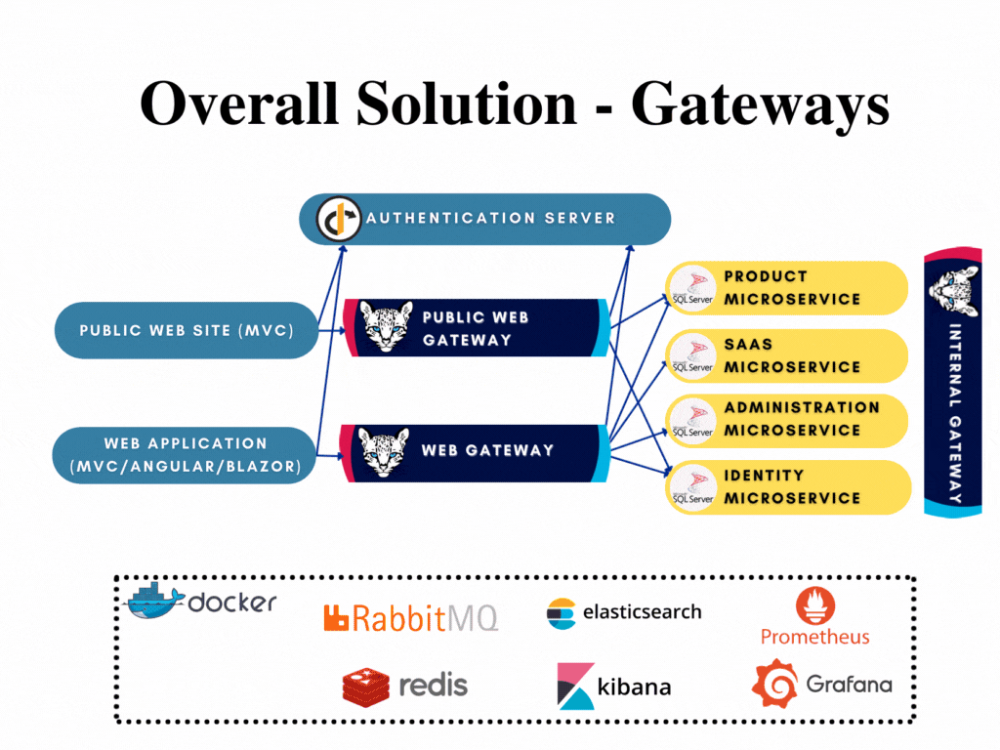
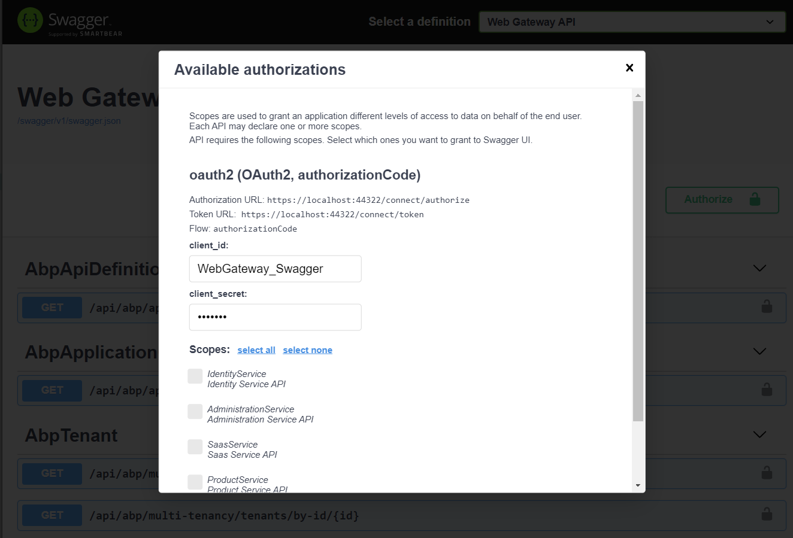
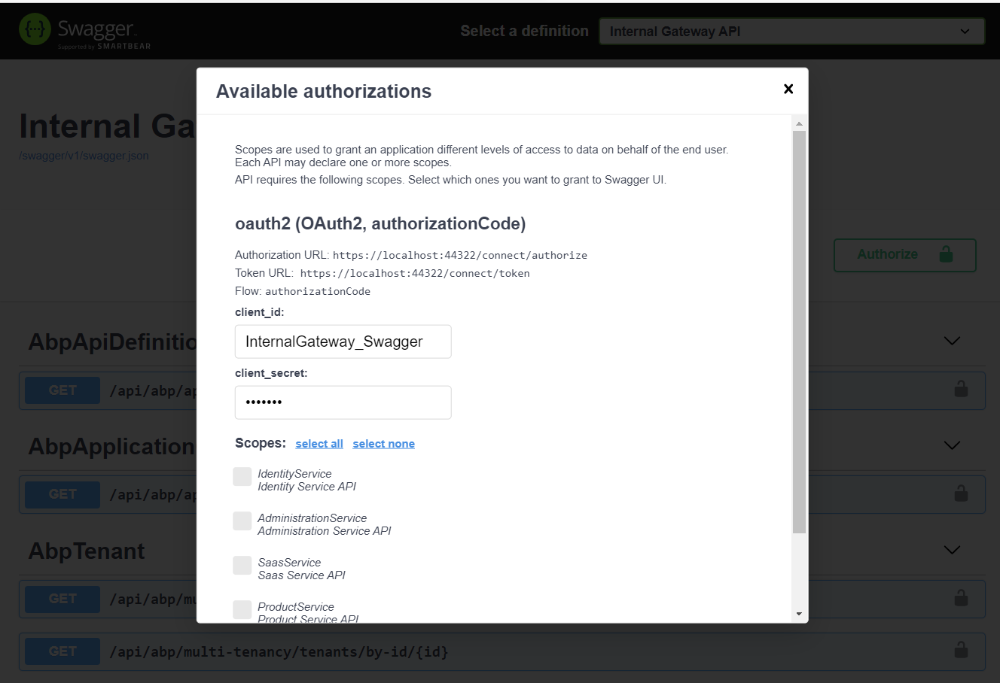

# Microservice Startup Template: API Gateways

API Gateways are used as single entry point to the microservices. ABP microservice startup template uses [Ocelot .Net Api Gateway](https://github.com/ThreeMammals/Ocelot) library. Through this library, gateways have the functionality of *routing*; *rate limiting*, *retry policies* etc. For more, check out [Ocelot Documentations](https://ocelot.readthedocs.io/en/latest/).

There are 3 different gateways are presented in the microservice startup template;

- **Web Gateway** is located under *gateways/web* folder. This API Gateway uses BFF pattern and redirects requests from Web application (MVC/Agular/Blazor) to Authentication Server or microservices.
- **Public Web Gateway**  is located under *gateways/webpublic* folder. This API Gateway also uses BFF pattern and redirects requests from Public Web application to Authentication Server or microservices.
- **Internal Gateway** is located under *gateways/internal* folder. This API Gateway is used between microservices for inter-communication.

All gateways has their respected solutions created already and can be developed further when if required without opening the whole template solution. The following image shows the gateway highlighted in the overall solution diagram:



To compare microservice template to tiered application template: Gateway is an **API.Host** project that proxies all the requests to related microservices.  

Gateways are depended to HttpApi layer of the microservices they are redirecting to.

All gateways depends on **SharedHostingGatewayModule** which implements default **Ocelot** and **Swagger** with authorization configuration (see the [Shared Modules](infrastructure.md#hosting-gateways) section).

## Backend for Frontend Pattern (BFF)

While API Gateway provides a **single point of entry** to system, Backend for Frontend pattern defines **each client with an individual API**. The Microservice solution template uses BFF pattern thus each application has its own web gateway.


If you are planning to add your custom client (such as mobile application), it is recommended to add a new gateway for that specific client since each client's requests will probably be different.

## Web Gateway

Web Gateway is used to connect the **Web** (back-office) application to microservices. This is done by setting this gateway as default **RemoteService** in Web application appsettings. ([See here](applications.md#remote service calls - web gateway))

### Module Configuration and Routing

As default, this gateway proxies each request to related microservice and redirects the account related requests to AuthServer;

- **IdentityService:** Depends on `IdentityServiceHttpApiModule` and re-routes 

  - `/api/identity/{everything}`
  - `/api/identity-server/{everything}`
  - `/api/account-admin/{everything}`

  to `localhost:44388` (IdentityService) in appsettings configuration.

- **AdministrationService:** Depends on `AdministrationServiceHttpApiModule` and re-routes

  -  `/api/abp/{everything}`  [application configuration endpoint](https://docs.abp.io/en/abp/latest/API/Application-Configuration)
  - `/api/audit-logging/{everything}`
  - `/api/language-management/{everything}`
  - `/api/text-template-management/{everything}`
  - `/api/feature-management/{everything}`
  - `/api/permission-management/{everything}`
  - `/api/setting-management/{everything}`
  - `/api/lepton-theme-management/{everything}`

  to `localhost:44367` (AdministrationService) in appsettings configuration.

- **SaasService:** Depends on `SaasServiceHttpApiModule` and re-routes

  -  `/api/saas/{everything}`

   to `localhost:44381` (SaasService) in appsettings configuration,

- **ProductService:** Depends on `ProductServiceHttpApiModule` and re-routes

  - `/api/product-service/{everything}`

   to `localhost:44361` (ProductService) in appsettings configuration.

- **AuthServer:** Depends on `AbpAccountPublicHttpApiModule` and re-routes

  -  `/api/account/{everything}` (login page etc requests)

  to `localhost:44322` (Authentication Server) in appsettings configuration.

### Authorization Configuration

Web Gateway has swagger with authorization configuration to make *authorization_code* interaction with AuthServer to be able to get authorized scopes:

```csharp
SwaggerWithAuthConfigurationHelper.Configure(
    context: context,
    authority: configuration["AuthServer:Authority"],
    scopes: new Dictionary<string, string> /* Requested scopes for authorization code request and descriptions for swagger UI only */
    {
        {"IdentityService", "Identity Service API"},
        {"AdministrationService", "Administration Service API"},
        {"SaasService", "Saas Service API"},
        {"ProductService", "Product Service API"}
    },
    apiTitle: "Web Gateway API"
);
```

As default, Web Gateway makes requests to all api scopes that are already allowed when the `WebGateway_Swagger` client is being created in [IdentityServer configuration](#identityServer configuration). To be able to make the request, required information is found under **AuthServer** section in `appsettings.json`:

```json
"AuthServer": {
  "Authority": "https://localhost:44322",
  "RequireHttpsMetadata": "true",
  "SwaggerClientId": "WebGateway_Swagger",
  "SwaggerClientSecret": "1q2w3e*"
},
```

 Web Gateway authorization screen can be seen below:



The automatically filled `client_id` and `client_secret` fields are set under **WebGatewayModule** `OnApplicationInitialization`:

```csharp
app.UseSwaggerUI(options =>
{
    options.SwaggerEndpoint("/swagger/v1/swagger.json", "Web Gateway API");
    var configuration = context.ServiceProvider.GetRequiredService<IConfiguration>();
    options.OAuthClientId(configuration["AuthServer:SwaggerClientId"]);
    options.OAuthClientSecret(configuration["AuthServer:SwaggerClientSecret"]);
});
```

> If you add a new microservice and want to use in your Web application; you need to [update this gateway configuration](add-microservice.md#updating gateways) and [IdentityServer configuration](gateways.md#identityServer configuration).

## Public Web Gateway

Public Web Gateway is used to connect the **Public  Web** (landing page) application to microservices. This is done by setting this gateway as default **RemoteService** in Public Web application appsettings. ([See here](applications.md#remote service calls - publicweb gateway))

### Module Configuration and Routing

As default, this gateway proxies each request to related microservice and redirects the account related requests to AuthServer;

- **ProductService:** Depends on `ProductServiceHttpApiModule` and re-routes

  - `/api/product-service/{everything}`

   to `localhost:44361` (ProductService) in appsettings configuration.

- **AuthServer:** Depends on `AbpAccountPublicHttpApiModule` and re-routes

  -  `/api/account/{everything}` (login page etc requests)

  to `localhost:44322` (Authentication Server) in appsettings configuration.

### Authorization Configuration

Web Gateway has swagger with authorization configuration to make *authorization_code* interaction with AuthServer to be able to get authorized scopes:

```csharp
SwaggerWithAuthConfigurationHelper.Configure(
    context: context,
    authority: configuration["AuthServer:Authority"],
    scopes: new
    Dictionary<string, string> /* Requested scopes for authorization code request and descriptions for swagger UI only */
    	{
        	{"ProductService", "Product Service API"}
    	},
    apiTitle: "Public Web Gateway API"
);
```

As default, PublicWeb Gateway makes requests to only **ProductService** scope that is already allowed when the `PublicWebGateway_Swagger` client is being created in [IdentityServer configuration](#identityServer configuration). To be able to make the request, required information is found under **AuthServer** section in `appsettings.json`:

```json
"AuthServer": {
  "Authority": "https://localhost:44322",
  "RequireHttpsMetadata": "true",
  "SwaggerClientId": "PublicWebGateway_Swagger",
  "SwaggerClientSecret": "1q2w3e*"
},
```

 PublicWeb Gateway authorization screen can be seen below:


The automatically filled `client_id` and `client_secret` fields are set under **PublicWebGatewayModule** `OnApplicationInitialization`:

```csharp
app.UseSwaggerUI(options =>
{
    options.SwaggerEndpoint("/swagger/v1/swagger.json", "Public Web Gateway API");
    var configuration = context.ServiceProvider.GetRequiredService<IConfiguration>();
    options.OAuthClientId(configuration["AuthServer:SwaggerClientId"]);
    options.OAuthClientSecret(configuration["AuthServer:SwaggerClientSecret"]);
});
```

> If you add a new microservice and want to use in your PublicWeb application; you need to [update this gateway configuration](add-microservice.md#updating gateways) and [IdentityServer configuration](#identityServer configuration).

## Internal Gateway

Apart from other web gateways, Internal Gateway is an api gateway to locate and redirect service requests in microservice inter-communication.

### Module Configuration and Routing

As default, this gateway proxies each request to related microservice and redirects the account related requests to AuthServer;

- **IdentityService:** Depends on `IdentityServiceHttpApiModule` and re-routes 

  - `/api/identity/{everything}`
  - `/api/identity-server/{everything}`
  - `/api/account-admin/{everything}`

  to `localhost:44388` (IdentityService) in appsettings configuration.

- **AdministrationService:** Depends on `AdministrationServiceHttpApiModule` and re-routes

  -  `/api/abp/{everything}`  [application configuration endpoint](https://docs.abp.io/en/abp/latest/API/Application-Configuration)
  - `/api/audit-logging/{everything}`
  - `/api/language-management/{everything}`
  - `/api/text-template-management/{everything}`
  - `/api/feature-management/{everything}`
  - `/api/permission-management/{everything}`
  - `/api/setting-management/{everything}`
  - `/api/lepton-theme-management/{everything}`

   to `localhost:44367` (AdministrationService) in appsettings configuration.

- **SaasService:** Depends on `SaasServiceHttpApiModule` and re-routes

  -  `/api/saas/{everything}`

   to `localhost:44381` (SaasService) in appsettings configuration,

- **ProductService:** Depends on `ProductServiceHttpApiModule` and re-routes

  - `/api/product-service/{everything}`

   to `localhost:44361` (ProductService) in appsettings configuration.

### Authorization Configuration

Internal Gateway has swagger with authorization configuration to make *authorization_code* interaction with AuthServer to be able to get authorized scopes:

```csharp
SwaggerWithAuthConfigurationHelper.Configure(
    context: context,
    authority: configuration["AuthServer:Authority"],
    scopes: new Dictionary<string, string> /* Requested scopes for authorization code request and descriptions for swagger UI only */
    {
        {"IdentityService", "Identity Service API"},
        {"AdministrationService", "Administration Service API"},
        {"SaasService", "Saas Service API"},
        {"ProductService", "Product Service API"}
    },
    apiTitle: "Internal Gateway API"
);
```

As default, Internal Gateway makes requests to all api scopes that are already allowed when the `InternalGateway_Swagger` client is being created in [IdentityServer configuration](#identityServer configuration). To be able to make the request, required information is found under **AuthServer** section in `appsettings.json`:

```json
"AuthServer": {
  "Authority": "https://localhost:44322",
  "RequireHttpsMetadata": "true",
  "SwaggerClientId": "InternalGateway_Swagger",
  "SwaggerClientSecret": "1q2w3e*"
},
```

 Internal Gateway authorization screen can be seen below:

> 

The automatically filled `client_id` and `client_secret` fields are set under **InternalGatewayModule** `OnApplicationInitialization`:

```csharp
app.UseSwaggerUI(options =>
{
    options.SwaggerEndpoint("/swagger/v1/swagger.json", "Internal Gateway API");
    var configuration = context.ServiceProvider.GetRequiredService<IConfiguration>();
    options.OAuthClientId(configuration["AuthServer:SwaggerClientId"]);
    options.OAuthClientSecret(configuration["AuthServer:SwaggerClientSecret"]);
});
```

> If you add a new microservice and want to use in your microservice inter-communication; you need to [update this gateway configuration](add-microservice.md#updating gateways) and [IdentityServer configuration](#identityServer configuration).

## IdentityServer Configuration

As default, all gateways uses swagger authorization so that user can login to AuthServer and make requests to authorized api endpoints. This is done by predefining a *swagger client* in **IdentityServerDataSeeder** under `CreateSwaggerClientsAsync` method at DbMigrator project:

```csharp
private async Task CreateSwaggerClientsAsync()
{
    await CreateSwaggerClientAsync("InternalGateway", new []{"IdentityService","AdministrationService","SaasService","ProductService"});
    await CreateSwaggerClientAsync("WebGateway", new []{"IdentityService","AdministrationService","SaasService","ProductService"});
    await CreateSwaggerClientAsync("PublicWebGateway", new []{"ProductService"});
}
```

Internal Gateway and Web Gateway has allowance for all the api scopes and Public WebGateway has only  allowance for `ProductService`.

## Next

- [Microservice Startup Template: Infrastructure](infrastructure.md)