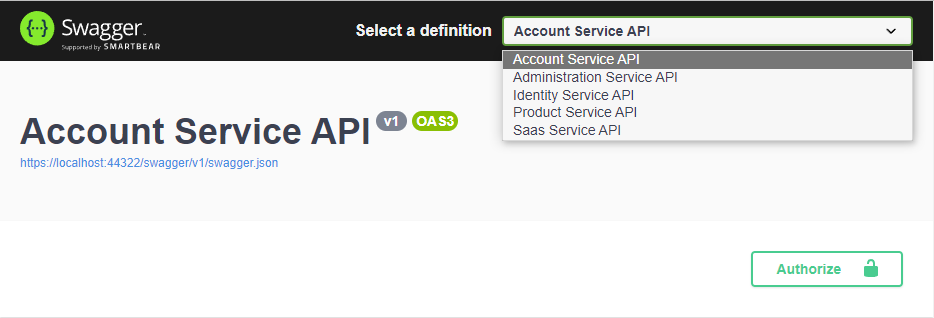
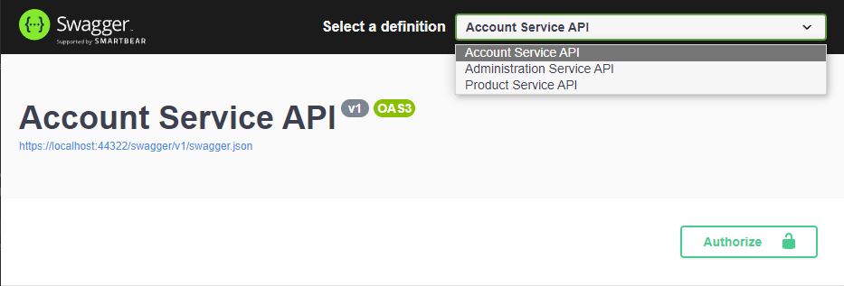

# Microservice Startup Template: API Gateways

API Gateways are used as single entry point to the microservices. ABP microservice startup template uses [Ocelot .Net Api Gateway](https://github.com/ThreeMammals/Ocelot) library. Through this library, gateways have the functionality of *routing*; *rate limiting*, *retry policies* etc. For more, check out [Ocelot Documentations](https://ocelot.readthedocs.io/en/latest/).

There are 2 different gateways are presented in the microservice startup template;

- **Web Gateway** is located under *gateways/web* folder. This API Gateway uses BFF pattern and redirects requests from Web application (MVC/Agular/Blazor) to Authentication Server or microservices.
- **Public Web Gateway**  is located under *gateways/webpublic* folder. This API Gateway also uses BFF pattern and redirects requests from Public Web application to Authentication Server or microservices.

All gateways has their respected solutions created already and can be developed further when if required without opening the whole template solution. The following image shows the gateway highlighted in the overall solution diagram:


To compare microservice template to tiered application template: Gateway is an **API.Host** project that proxies all the requests to related microservices.  

All gateways depends on **SharedHostingGatewayModule** which implements default **Ocelot** and **Polly** configurations (see the [Shared Modules](infrastructure.md#hosting-gateways) section).

## Backend for Frontend Pattern (BFF)

While API Gateway provides a **single point of entry** to system, Backend for Frontend pattern defines **each client with an individual API**. The Microservice solution template uses BFF pattern thus each application has its own web gateway.


If you are planning to add your custom client (such as mobile application), it is recommended to add a new gateway for that specific client since each client's requests will probably be different.

## Web Gateway

Web Gateway is used to connect the **Web** (back-office) application to microservices. This is done by setting this gateway as default [RemoteService](applications.md#remote-service-calls-web-gateway) in Web application appsettings.

### Module Configuration and Routing

As default, this gateway proxies each request from back-office application to related microservice and redirects the account related requests to AuthServer. Ocelot re-route configuration can be found in `ocelot.json` file. This configuration is added by using **AddOcelotJson** extension method in `Program.cs`. The re-routing configuration is as below:

- **Identity Service:** Uses static proxy and re-routes 

  - `/api/identity/{everything}`
  - `/api/identity-server/{everything}`
  - `/api/account-admin/{everything}`

  to `localhost:44388` (IdentityService).

- **Administration Service:** Uses static proxy and re-routes

  -  `/api/abp/{everything}`  [application configuration endpoint](https://docs.abp.io/en/abp/latest/API/Application-Configuration)
  - `/api/audit-logging/{everything}`
  - `/api/language-management/{everything}`
  - `/api/text-template-management/{everything}`
  - `/api/feature-management/{everything}`
  - `/api/permission-management/{everything}`
  - `/api/setting-management/{everything}`
  - `/api/lepton-theme-management/{everything}`

  to `localhost:44367` (AdministrationService).

- **Saas Service:** Uses static proxy and re-routes

  -  `/api/saas/{everything}`

   to `localhost:44381` (SaasService).

- **Product Service:** Uses dynamic proxy, depends on `ProductServiceHttpApiModule` and re-routes

  - `/api/product-service/{everything}`

   to `localhost:44361` (ProductService).

- **Account Service:** Uses static proxy and re-routes

  -  `/api/account/{everything}` (login page etc requests)

  to `localhost:44322` (AuthServer).

### Swagger and Authorization Configuration

Web Gateway has swagger with authorization configuration to make *authorization_code* interaction with AuthServer to be able to get authorized scopes:

```csharp
SwaggerConfigurationHelper.ConfigureWithAuth(
    context: context,
    authority: configuration["AuthServer:Authority"],
    scopes: new
    Dictionary<string, string> /* Requested scopes for authorization code request and descriptions for swagger UI only */ {
        { "AccountService", "Account Service API" },
        { "IdentityService", "Identity Service API" },
        { "AdministrationService", "Administration Service API" },
        { "SaasService", "Saas Service API" },
        { "ProductService", "Product Service API" }
    },
    apiTitle: "Web Gateway API"
);
```

As default, Web Gateway makes requests to all api scopes that are already allowed when the `WebGateway_Swagger` client is being created in [IdentityServer configuration](microservices#identity-server-authorization). To be able to make the request, required information is found under **AuthServer** section in `appsettings.json`:

```json
"AuthServer": {
  "Authority": "https://localhost:44322",
  "RequireHttpsMetadata": "true",
  "SwaggerClientId": "WebGateway_Swagger",
  "SwaggerClientSecret": "1q2w3e*"
},
```

Each routed service is added to swagger definitions distinctively that uses the same `SwaggerClientId` and `SwaggerClientSecret` from appsettings.

```csharp
app.UseSwaggerUI(options =>
{
    var configuration = context.ServiceProvider.GetRequiredService<IConfiguration>();
    var routes = configuration.GetSection("Routes").Get<List<OcelotConfiguration>>();
    var routedServices = routes
        .GroupBy(t => t.ServiceKey)
        .Select(r => r.First())
        .Distinct();

    foreach (var config in routedServices.OrderBy(q => q.ServiceKey))
    {
        var url = $"{config.DownstreamScheme}://{config.DownstreamHostAndPorts.FirstOrDefault()?.Host}:{config.DownstreamHostAndPorts.FirstOrDefault()?.Port}";
        if (!env.IsDevelopment())
        {
            url = $"https://{config.DownstreamHostAndPorts.FirstOrDefault()?.Host}";
        }

        options.SwaggerEndpoint($"{url}/swagger/v1/swagger.json", $"{config.ServiceKey} API");
        options.OAuthClientId(configuration["AuthServer:SwaggerClientId"]);
        options.OAuthClientSecret(configuration["AuthServer:SwaggerClientSecret"]);
    }
});
```

 This will allow each re-routed microservice to be selected from definition and authorized individually by using the same `WebGateway_Swagger` client.



> If you add a new microservice and want to use in your Web application; you need to [update this gateway configuration](add-microservice.md#updating gateways) and [IdentityServer configuration](gateways.md#identityserver-configuration).

## Public Web Gateway

Public Web Gateway is used to connect the **Public  Web** (landing page) application to microservices. This is done by setting this gateway as default [RemoteService](applications.md#remote-service-calls-web-gateway) in Public Web application appsettings. ([See here](applications.md#remote-service-calls-publicweb-gateway))

### Module Configuration and Routing

As default, this gateway proxies each request landing page application to related microservice and redirects the account related requests to AuthServer. Ocelot re-route configuration can be found in `ocelot.json` file. This configuration is added by using **AddOcelotJson** extension method in `Program.cs`. The re-routing configuration is as below:


- **Account Service:** Uses static proxy and re-routes

  -  `/api/account/{everything}` (login page etc requests)

  to `localhost:44322` (Authentication Server).

- **Administration Service:** Uses static proxy and re-routes

  - `/api/abp/{everything}`  [application configuration endpoint](https://docs.abp.io/en/abp/latest/API/Application-Configuration)


  to `localhost:44367` (AdministrationService).

- **Product Service:** Depends on `ProductServiceHttpApiModule` and re-routes

  - `/api/product-service/{everything}`

   to `localhost:44361` (ProductService).  


### Authorization Configuration

Public Web Gateway has swagger with authorization configuration to make *authorization_code* interaction with AuthServer to be able to get authorized scopes:

```csharp
SwaggerConfigurationHelper.ConfigureWithAuth(
    context: context,
    authority: configuration["AuthServer:Authority"],
    scopes: new Dictionary<string, string> /* Requested scopes for authorization code request and descriptions for swagger UI only */ {
            { "AccountService", "Account Service API" },
            { "AdministrationService", "Administration Service API" },
            { "ProductService", "Product Service API" }
        },
    apiTitle: "Public Web Gateway API"
);
```

As default, PublicWeb Gateway makes requests to only **ProductService** scope that is already allowed when the `PublicWebGateway_Swagger` client is being created in [IdentityServer configuration](microservices#identity-server-authorization). To be able to make the request, required information is found under **AuthServer** section in `appsettings.json`:

```json
"AuthServer": {
  "Authority": "https://localhost:44322",
  "RequireHttpsMetadata": "true",
  "SwaggerClientId": "WebGateway_Swagger",
  "SwaggerClientSecret": "1q2w3e*"
},
```

Each routed service is added to swagger definitions distinctively that uses the same `SwaggerClientId` and `SwaggerClientSecret` from appsettings.

```csharp
app.UseSwaggerUI(options =>
{
    var configuration = context.ServiceProvider.GetRequiredService<IConfiguration>();
    var routes = configuration.GetSection("Routes").Get<List<OcelotConfiguration>>();
    var routedServices = routes
        .GroupBy(t => t.ServiceKey)
        .Select(r => r.First())
        .Distinct();

    foreach (var config in routedServices.OrderBy(q => q.ServiceKey))
    {
        var url = $"{config.DownstreamScheme}://{config.DownstreamHostAndPorts.FirstOrDefault()?.Host}:{config.DownstreamHostAndPorts.FirstOrDefault()?.Port}";
        if (!env.IsDevelopment())
        {
            url = $"https://{config.DownstreamHostAndPorts.FirstOrDefault()?.Host}";
        }

        options.SwaggerEndpoint($"{url}/swagger/v1/swagger.json", $"{config.ServiceKey} API");
        options.OAuthClientId(configuration["AuthServer:SwaggerClientId"]);
        options.OAuthClientSecret(configuration["AuthServer:SwaggerClientSecret"]);
    }
});
```

 This will allow each re-routed microservice to be selected from definition and authorized individually by using the same `WebGateway_Swagger` client.



> If you add a new microservice and want to use in your PublicWeb application; you need to [update this gateway configuration](add-microservice.md#updating-gateways) and [IdentityServer configuration](gateways.md#identityserver-configuration).

## Next

- [Microservice Startup Template: Infrastructure](infrastructure.md)