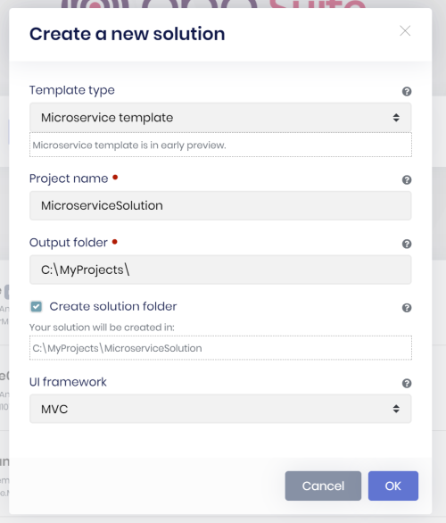
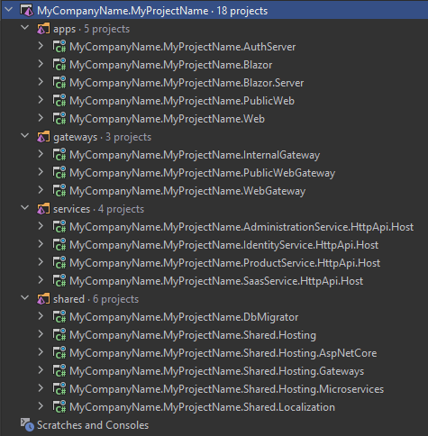
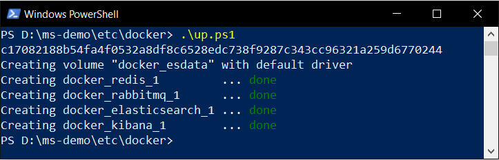
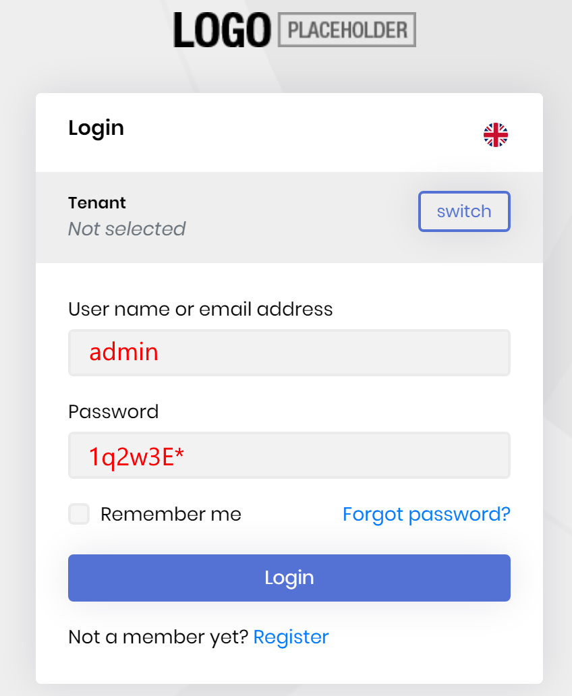
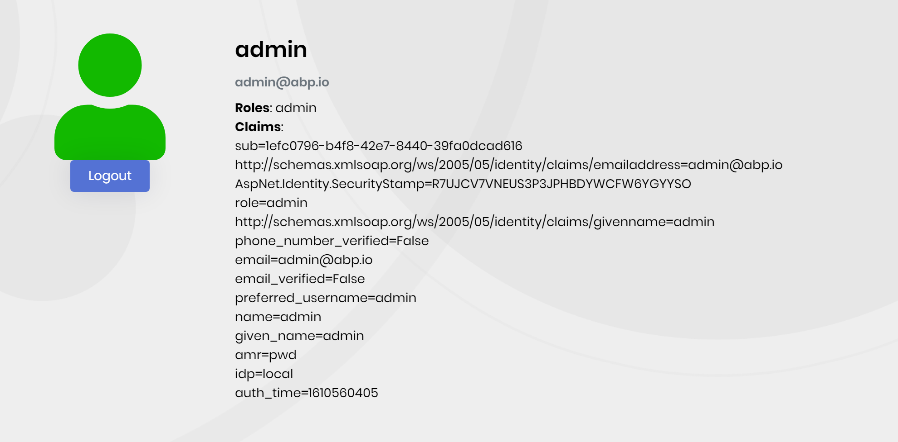
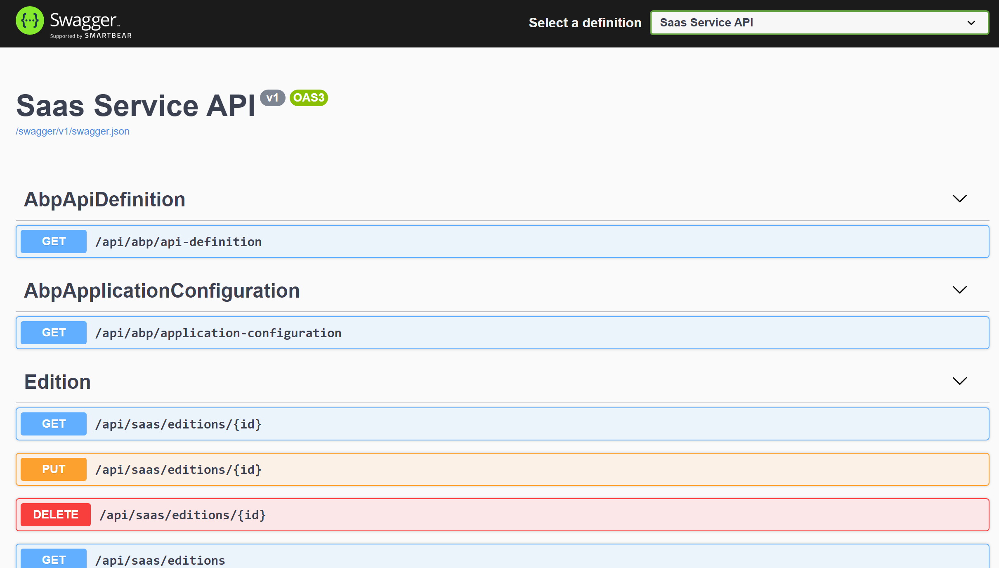
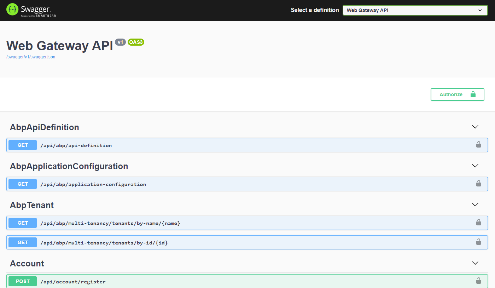
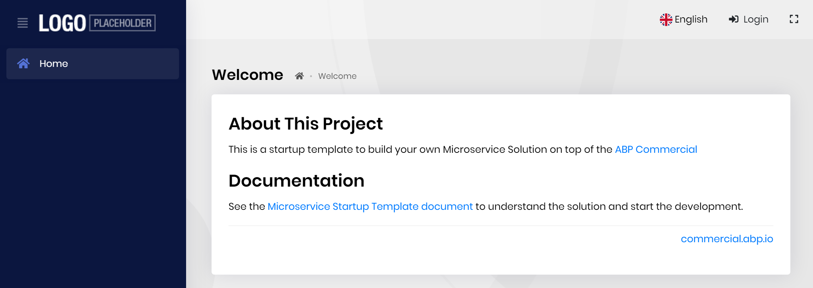
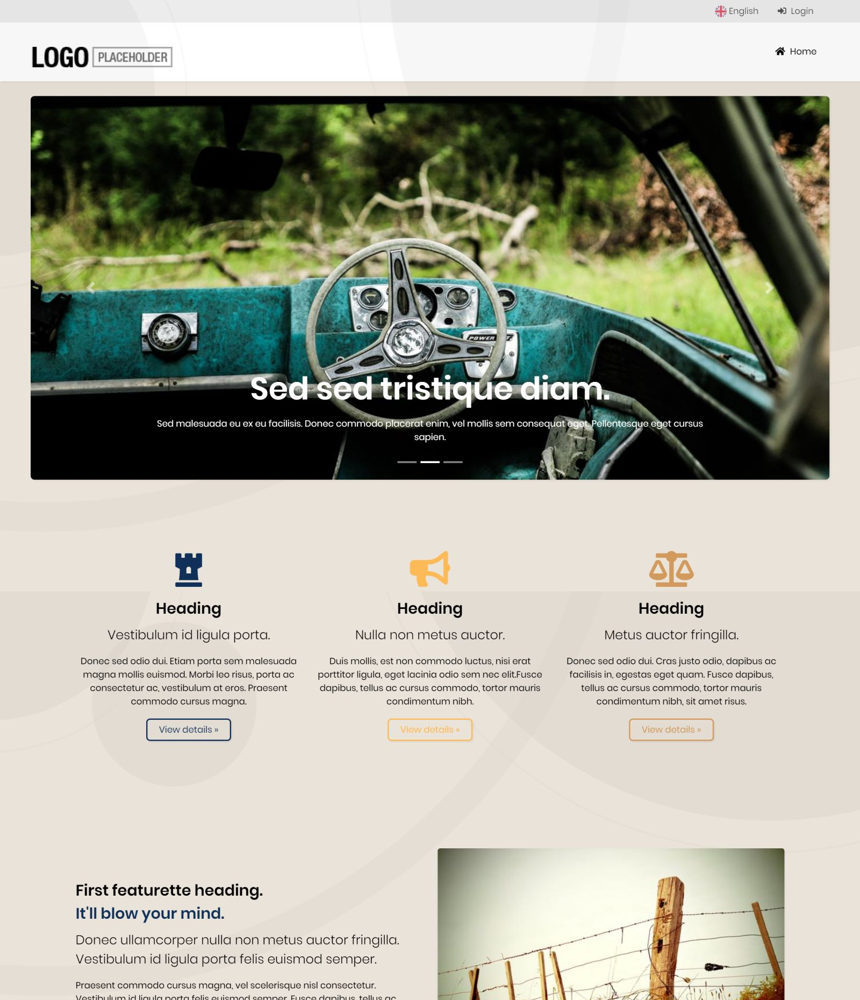

# Get Started with the Microservice Solution Template

This document explains how to start development with this solution template.

## Pre-Requirements

The following tools are required in order to run the solution;

* [Visual Studio 2019](https://visualstudio.microsoft.com/vs/community/) (v16.8+) or another suitable IDE.
* [.NET 5.0+ SDK](https://dotnet.microsoft.com/download) (If you have Visual Studio 2019, this will be installed already)
* [NPM](https://nodejs.org/) v14+ (or [Yarn](https://classic.yarnpkg.com/en/docs/install) 1.20+).
* [Powershell](https://docs.microsoft.com/en-us/powershell/) 5.0+
* [Docker Desktop](https://www.docker.com/products/docker-desktop) v3.0+

Other dependencies (like Redis and RabbitMQ) comes with a docker-compose configuration, so no external installation required.

## Downloading the Solution

Use the [ABP Suite](../../abp-suite/index.md) to [create a new solution](../../abp-suite/create-solution.md) by selecting the *Microservice* as the project type.

> Type `abp suite` in a command line terminal to start the ABP Suite.

## Open the Solution

Now, you can open the solution in Visual Studio or your favorite IDE. You will see a solution structure similar to the figure below (solution and project names will be different based on your naming preference);

*Figure: The solution structure (it will be a slightly different based on your UI preference).*

## Run the Infrastructure

The **etc/docker** folder under the main solution contains a `up.ps1` file. Execute it to run the necessary infrastructure services:

> First running may contain additional steps and take a long time since it will download the missing Docker images.

## Run the Solution on TYE

You can run and debug the microservice solution using [dotnet/tye](https://github.com/dotnet/tye). See the [Microservice Template Tye Integration](./tye-integration.md) document.

## Run the Solution on IDE

The system consists of multiple applications should be running together.

### Running the Authentication Server

First, run the **AuthServer** application.

> Right click to the project, *Set as Startup Project* and hit Ctrl+F5 while running the applications if you don't need to DEBUG it.

It will open a Login page:

If you want to test it, enter `admin` as the username and `1q2w3E*` as the password and hit ENTER. If you login successfully, you are redirected a *developer test page* that lists the current user claims:

> You can change this page however you like. Users are typically redirected to the *Authentication Server* from the other applications to login the system and they are automatically redirected to the client application after the login process. If you want, this test page can be converted to a landing page that contains links to your actual applications.

### Running the Services

Run the following applications in the given order (right click to each project, *Set as Startup Project* and hit Ctrl+F5) to make the services running;

* **InternalGateway**
* **AdministrationService**
* **IdentityService**
* **SaasService**
* **ProductService**

> Notice: Visual Studio may stop a previously started service (we think it is kind of a bug of the VS). In this case, re-start the stopped application. Alternatively, you can run the project or projects in a command line terminal, using the `dotnet run` command.

All these applications open a Swagger UI to explore the HTTP APIs. For example, the screenshot below was taken from the SaasService:

### Running the Main Web Application

The main *Web Application* can be an MVC (Razor Pages), Angular or Blazor application based on your preference. Regardless of your frontend application, you first need to run the **WebGateway** application. 

#### Run the Web Gateway

When you run the **WebGateway** application, it opens a Swagger UI to explore the HTTP APIs provided by this API Gateway:

> API Gateways in this solution truly shows the APIs they expose. That's normally not possible with using Swagger and Ocelot. However, we have developed a solution to make this possible by using a proper layering and code sharing. Details will be covered later.

#### Run the *MVC (Razor Pages)* Web Application

> You can skip this section if you haven't selected the **MVC (Razor Pages)** as the main web application UI framework.

Run the **Web** application in the solution.

#### Run the *Blazor* Web Application

> You can skip this section if you haven't selected the **Blazor** as the main web application UI framework.

Run the **Blazor** application in the solution.

#### Run the Angular Web Application

> You can skip this section if you haven't selected the **Angular** as the main web application UI framework.

* Open a command line terminal in the `angular` folder in the root folder of the solution.
* Execute `npm install` (or `yarn` if you prefer Yarn as the package manager).
* Execute `yarn start`.

#### Login to the Web Application

This will begin the *Main Web Application*:

Click to the *Login* link. It will redirect to the *Authentication Server*. Enter `admin` as the username and `1q2w3E*` as the password to login to the system. You will be redirected back to the web application.

> If you have previously logged into the *Authentication Server* then you are automatically login to this application when you click to the Login link thanks to the **single sign on** system.

### Running the Public Website

The *Public Web Site* application uses the *Public Web Gateway*, so we need to run it first.

#### Run the Public Web Gateway

When you run the **PublicWebGateway** application, it opens a Swagger UI to explore the HTTP APIs provided by this API Gateway:

#### Run the Public Website

Now, you can run the **PublicWeb** application:

> This is an example application if you need to a public/landing page for your system. It supports login (with **single sign-on** support) via the *Authentication Server*.
