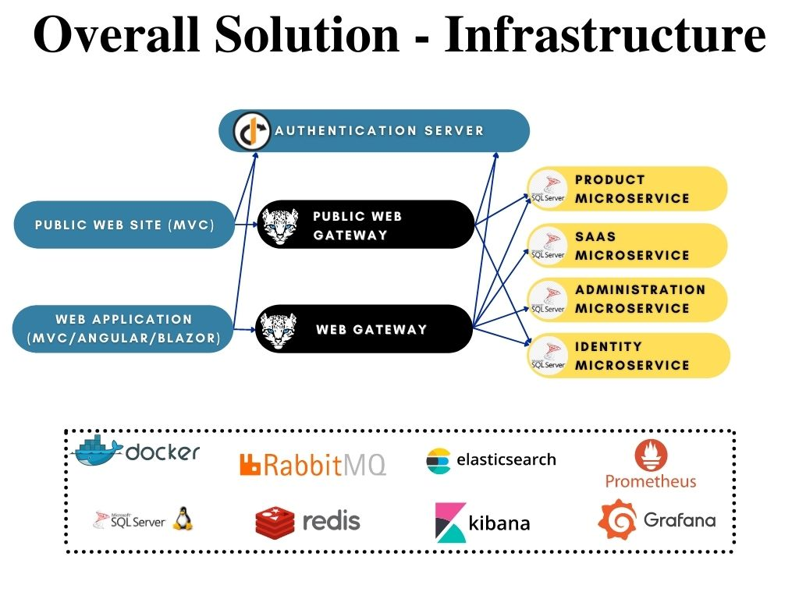
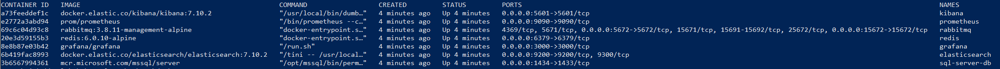
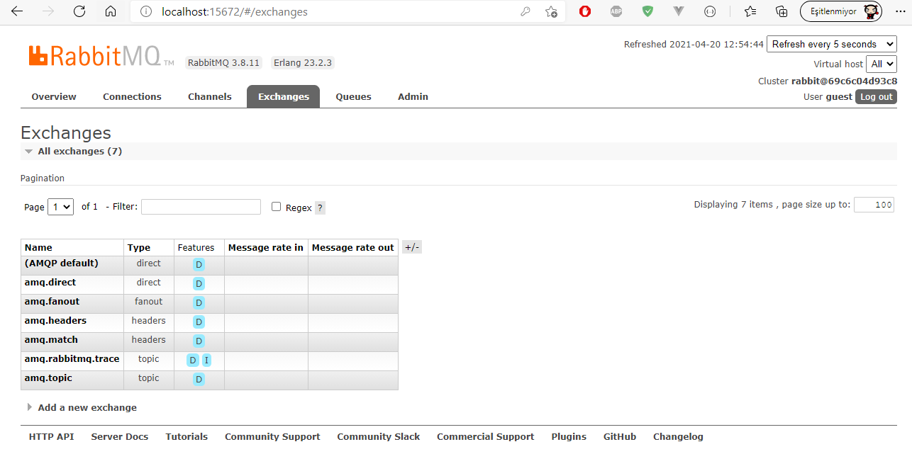
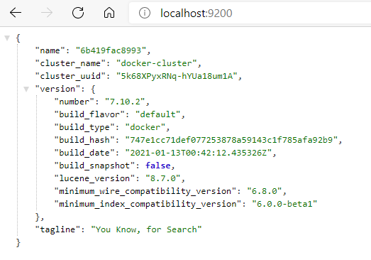
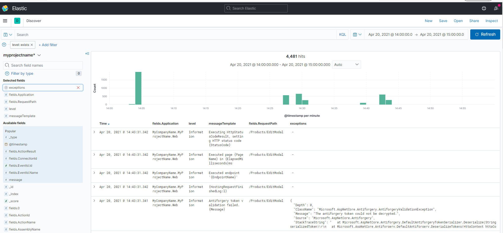
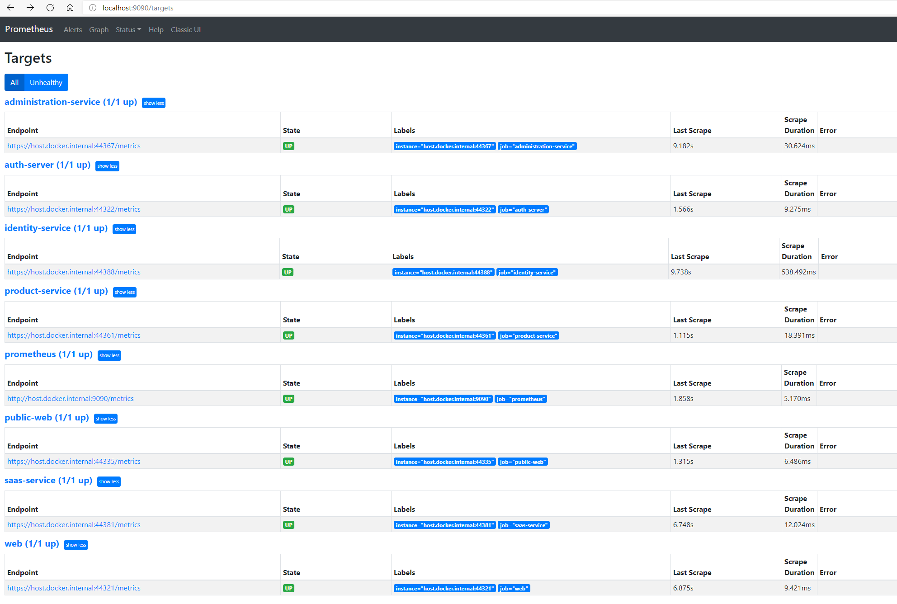
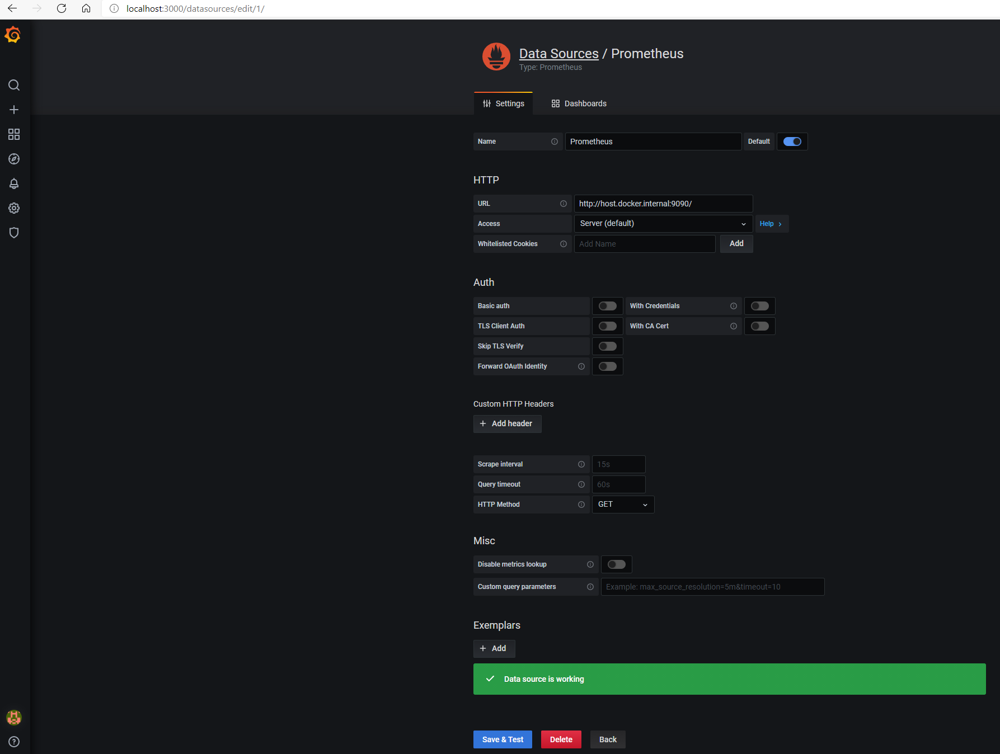
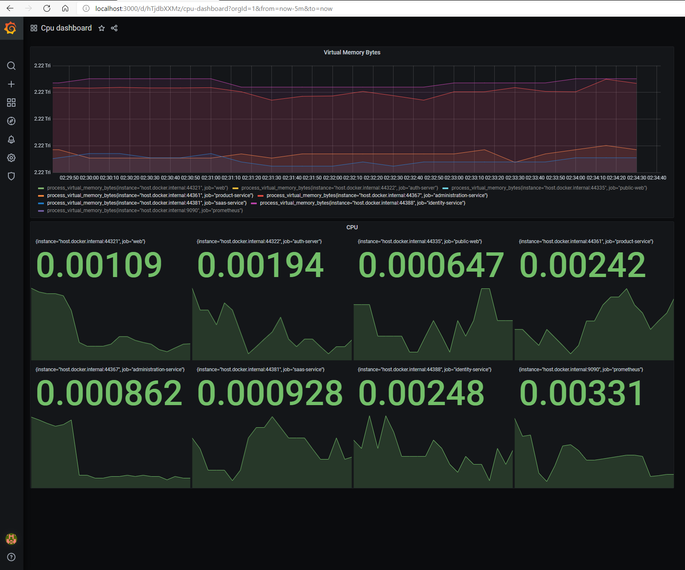

# Microservice Startup Template: Infrastructure

ABP Microservice Startup Template contains shared projects that are used in applications, gateways and microservices. There are also external services run on containers where some of them are mandatory for microservice template to run such as Redis and RabbitMQ.



Shared folder in microservice template solution contains **DbMigrator** project for centralized database migration and data seeding for microservices and shared modules used in applications, microservices and gateways. 

**Infrastructure services run on docker containers** as default and some of the services are **required** for microservice template to run properly while some of them are optional. [Docker compose](https://docs.docker.com/compose/) is used for running the infrastructure services. Two docker-compose.yml files are used for service configurations and they are located under *etc/docker* folder. While `docker-compose.infrastructure.yml` file contains `image`, `container_name`, `network` and `volume` data, `docker-compose.infrastructure.override.yml` file contains service `ports` and `environment` data. 

Docker-compose file defines

- Sql-Server (required as default)
- Redis (required)
- RabbitMQ (required)
- ElasticSearch
- Kibana
- Grafana
- Prometheus

services that run on a predefined **external docker-network**. Use `up.ps1` powershell command located in the same *etc/docker* folder to run the external infrastructure images that will execute the commands

```powershell
docker network create mycompanyname.myprojectname-network
docker-compose -f docker-compose.infrastructure.yml -f docker-compose.infrastructure.override.yml up -d
```

which creates the external docker network for infrastructure services and runs the docker-compose files in detached mode. To stop and remove the containers, use `down.ps1` powershell command. 

> You can use a single docker file by merging **docker-compose.infrastructure.yml** and **docker-compose.infrastructure.override.yml** files as you desire.



## Sql Server & Configuration

[Sql Server Docker Image](https://hub.docker.com/_/microsoft-mssql-server) is the **default database** and a **required** service for the microservice solution template. It's main configuration is located in *docker-compose.infrastructure.yml* file under `sql-server-db` service name. Port and environment information is located in *docker-compose.infrastructure.override.yml* file. The combined docker-compose service configuration is as below

```yaml
sql-server-db:
    container_name: sql-server-db
    image: mcr.microsoft.com/mssql/server:2019-latest
    volumes:
      - sqldata:/var/opt/mssql
    networks:
      - mycompanyname.myprojectname-network
    ports:
      - "1434:1433"
    environment:
      SA_PASSWORD: "myPassw0rd"
      ACCEPT_EULA: "Y"
```

All the microservices and AuthServer has connection strings configured based on containerized sql server database. All the connection strings used in microservice template solution are shown below

```json
"ConnectionStrings": {
    "IdentityService": "Server=(LocalDb)\\MSSQLLocalDB,1434;Database=MyProjectName_Identity;User Id=sa;password=myPassw0rd;MultipleActiveResultSets=true",
    "AdministrationService": "Server=(LocalDb)\\MSSQLLocalDB,1434;Database=MyProjectName_Administration;User Id=sa;password=myPassw0rd;MultipleActiveResultSets=true",
    "SaasService": "Server=(LocalDb)\\MSSQLLocalDB,1434;Database=MyProjectName_Saas;User Id=sa;password=myPassw0rd;MultipleActiveResultSets=true",
    "ProductService": "Server=(LocalDb)\\MSSQLLocalDB,1434;Database=MyProjectName_ProductService;User Id=sa;password=myPassw0rd;MultipleActiveResultSets=true"
  },
```

> sql-server-db container exposes **1434** port instead of default 1433 in order to prevent conflicts if there is a local sql-server or sql-server-express is already installed.
>
> You can always use none-containerized installed sql-server-express database but you will need to update all the connection strings in the solution.

## Redis Integration & Configuration

[Redis cache](https://docs.abp.io/en/abp/latest/Redis-Cache) is a **required** service for the microservice solution template. It is used for caching permissions and such.

Redis runs on container with the main configurations are located in *docker-compose.infrastructure.yml* and port information in *docker-compose.infrastructure.override.yml* file. Redis docker-compose service configuration is as below

```yaml
redis:
    container_name: redis
    image: redis:alpine
    networks:
      - mycompanyname.myprojectname-network
    ports:
      - "6379:6379"  
```

All the microservices uses `AbpCachingStackExchangeRedisModule` dependency over *SharedHostingMicroservicesModule* and applications (AuthServer, Web, PublicWeb) references explicitly to *Volo.Abp.Caching.StackExchangeRedis* package.

Microservices and applications have their redis configuration in appsettings *Redis* section

```json
"Redis": {
  "Configuration": "localhost:6379"
}
```

> **Redis 6.0.10-alpine** image is used as default. You can change the image tag in *docker-compose.infrastructure.yml* file and default exposed **6379** port in *docker-compose.infrastructure.override.yml* file.

## RabbitMQ Integration & Configuration

[Distributed Event Bus](https://docs.abp.io/en/abp/latest/Distributed-Event-Bus) is the tool for async communication in microservice systems and abp microservice template solution uses [RabbitMQ integration](https://docs.abp.io/en/abp/latest/Distributed-Event-Bus-RabbitMQ-Integration) for this capability. It is a **required** service in the solution template used for on-the-fly database migration of the microservices. RabbitMQ docker-compose service configuration is as below

```yaml
rabbitmq:
    container_name: rabbitmq
    image: rabbitmq:management-alpine
    networks:
      - mycompanyname.myprojectname-network
    ports:
      - "15672:15672"
      - "5672:5672"  
```

Default RabbitMQ-management port is **15672** and UI can be accessed with default `guest` username/password.



All the microservices uses `AbpEventBusRabbitMqModule` dependency over *SharedHostingMicroservicesModule* and applications (AuthServer, Web, PublicWeb) references explicitly to *Volo.Abp.EventBus.RabbitMQ* package.

Each application and microservice has it's configuration under appsettings *RabbitMQ* section.

```json
"RabbitMQ": {
  "Connections": {
    "Default": {
      "HostName": "localhost"
    }
  },
  "EventBus": {
    "ClientName": "MyProjectName_AuthServer",
    "ExchangeName": "MyProjectName"
  }
}
```

They all share the same **ExchangeName** and individual queues will be created after services start running.


> Minimal configurations are used to connect RabbitMQ. Check [RabbitMQ Integration docs](https://docs.abp.io/en/abp/latest/Distributed-Event-Bus-RabbitMQ-Integration#configuration) for more configuration settings.

## ElasticSearch & Kibana Integration

[ElasticSearch](https://www.elastic.co/elasticsearch/) is used for [Serilog](https://serilog.net/) integration for logging and [Kibana](https://www.elastic.co/kibana) is used as the visualization tool that integrated to ElasticSearch. Docker-compose service configuration for these services is defined as below

```yaml
elasticsearch:
    container_name: elasticsearch
    image: docker.elastic.co/elasticsearch/elasticsearch:8.5.3
    volumes:
      - esdata:/usr/share/elasticsearch/data
    networks:
      - mycompanyname.myprojectname-network
    environment:
      - xpack.monitoring.enabled=true
      - xpack.watcher.enabled=false
      - "ES_JAVA_OPTS=-Xms512m -Xmx512m"
      - discovery.type=single-node
    ports:
      - "9200:9200"

kibana:
    container_name: kibana
    image: docker.elastic.co/kibana/kibana:8.5.3
    depends_on:
      - elasticsearch
    networks:
      - mycompanyname.myprojectname-network
    environment:
      - ELASTICSEARCH_URL=http://host.docker.internal:9200
    ports: 
      - "5601:5601"
```

The ElasticSearch integration of Serilog configuration is done at **SerilogConfigurationHelper** located in *Shared.Hosting.AspNetCore* shared project. The *IndexFormat* is declared as `MyProjectName-log-{0:yyyy.MM}` under this configuration.

After running ElasticSearch in container, its endpoint should be exposed as below



Use the *IndexFormat* explained above to create preferred UI visualization data.



Configuration for each application and microservices is located under *ElasticSearch* section of appsettings

```json
"ElasticSearch": {
  "Url": "http://localhost:9200"
},
```

## Grafana & Prometheus Integration

[Grafana](https://grafana.com/) provides dashboards and data analysis from [Prometheus](https://prometheus.io/) metrics. Docker-compose service configuration for these services is defined as below

```yaml
grafana:
    container_name: grafana
    image: grafana/grafana
    volumes:
      - ../grafana/storage:/var/lib/grafana
    networks:
      - mycompanyname.myprojectname-network
    ports:
      - "3000:3000"
      
  prometheus:
    container_name: prometheus
    image: prom/prometheus
    volumes:
      - ../prometheus/prometheus.yml:/etc/prometheus/prometheus.yml
      - ../prometheus/storage:/prometheus
    networks:
      - mycompanyname.myprojectname-network
    ports:
      - "9090:9090"  
```

Prometheus scrape configuration, *prometheus.yml* file, is mounted and located under *etc/prometheus* folder.

> Grafana storage directory is mounted from *etc/granfana/storage* folder and Prometheus storage directory is from *etc/prometheus/storage*. You can also use [docker volumes](https://docs.docker.com/storage/volumes/#use-a-volume-with-docker-compose) instead of mounting directories.

Navigate to Prometheus targets to check endpoint targets



> If you are not running the solution on docker, you may have to change the prometheus *static_config* targets such as `-targets: ['auth-server']` to `-targets: ['host.docker.internal:44322']`

Applications using Prometheus  are configured at application initialization

```csharp
app.UseHttpMetrics();
...
app.UseConfiguredEndpoints(endpoints =>
{
    endpoints.MapMetrics();
});
```

Run Grafana and add Prometheus as *Data Source*

> For first time entry, default user name and password is **admin/admin**

Add dashboard using prometheus data source



## Shared Projects

Shared projects are as the name implies; modules and configurations that are used in other applications, services and/or microservices to prevent code duplication and centralize basic configurations. There are 5 shared projects in ABP Microservice Template solution.

### Localization

The *Shared.Localization* project contains configuration for [Virtual File System](https://docs.abp.io/en/abp/latest/Virtual-File-System) and **solution-wide** localization. It is also the localization resource used for public-web application. If you plan to develop monolith UI as the public-web application, this localization resource will be used.

```csharp
Configure<AbpVirtualFileSystemOptions>(options =>
{
    options.FileSets.AddEmbedded<MyProjectNameSharedLocalizationModule>();
});

Configure<AbpLocalizationOptions>(options =>
{
    options.Resources
        .Add<MyProjectNameResource>("en")
        .AddBaseTypes(
            typeof(AbpValidationResource)
        ).AddVirtualJson("/Localization/MyProjectName");

    options.DefaultResourceType = typeof(MyProjectNameResource);
});
```

The **SharedLocalizationModule** is depended by all applications, gateways and microservices.

> Use provided localization files if you want your localization keys available in all applications, gateways and microservices.

### Hosting

*Shared.Hosting* project contains **database configurations** in `SharedHostingModule` service configuration which is used in all other hosting modules. 

Each module with database connection in abp has its own connection string so that it can be [migrated](https://docs.abp.io/en/abp/latest/Entity-Framework-Core-Migrations) to [multiple databases](https://docs.abp.io/en/abp/latest/Entity-Framework-Core-Migrations#using-multiple-databases) when needed. This is achieved by [Connection Strings Management](https://docs.abp.io/en/abp/latest/Connection-Strings). Since *infrastructural microservices* such as [AdministrationService](microservices.md#AdministrationService), [IdentityService](microservices.md#IdentityService) and [SaasService](microservices.md#SaasService) uses one or more modules to perform, each module database configuration must be added to related database explicitly so that the module can connect to it's database.

Instead of adding all module connection strings in microservice connection string configuration explicitly; related connection strings are mapped into a single connection string. 

```csharp
private void ConfigureDatabaseConnections()
{
    Configure<AbpDbConnectionOptions>(options =>
    {
        options.Databases.Configure("SaasService", database =>
        {
            database.MappedConnections.Add("Saas");
            database.IsUsedByTenants = false;
        });
        
        options.Databases.Configure("AdministrationService", database =>
        {
            database.MappedConnections.Add("AbpAuditLogging");
            database.MappedConnections.Add("AbpPermissionManagement");
            database.MappedConnections.Add("AbpSettingManagement");
            database.MappedConnections.Add("AbpFeatureManagement");
            database.MappedConnections.Add("AbpLanguageManagement");
            database.MappedConnections.Add("TextTemplateManagement");
            database.MappedConnections.Add("AbpBlobStoring");
        });
        
        options.Databases.Configure("IdentityService", database =>
        {
            database.MappedConnections.Add("AbpIdentity");
            database.MappedConnections.Add("OpenIddict");
        });

        options.Databases.Configure("ProductService", database =>
        {
            database.MappedConnections.Add("ProductService");
        });
    });
}
```

### Hosting AspNetCore

*Shared.Hosting.AspNetCore* project is a base **hosting dependency for applications** such as [AuthServer](applications.md#authentication-server), [Web](applications.md#web-application-back-office), [PublicWeb](applications.md#public-application-landing-page). This module depends on

- `SharedHostingModule` 
- `AbpAspNetCoreSerilogModule`
- `AbpSwashbuckleModule`

modules and contains contains:

- Base configuration for serilog in `SerilogConfigurationHelper`

  ```csharp
  Log.Logger = new LoggerConfiguration()
  #if DEBUG
                  .MinimumLevel.Debug()
  #else
                  .MinimumLevel.Information()
  #endif
                  .MinimumLevel.Override("Microsoft", LogEventLevel.Information)
                  .MinimumLevel.Override("Microsoft.EntityFrameworkCore", LogEventLevel.Warning)
                  .Enrich.FromLogContext()
                  .Enrich.WithProperty("Application", $"{applicationName}")
                  .WriteTo.Async(c => c.File("Logs/logs.txt"))
                  .WriteTo.Elasticsearch(
                      new ElasticsearchSinkOptions(new Uri(configuration["ElasticSearch:Url"]))
                      {
                          AutoRegisterTemplate = true,
                          AutoRegisterTemplateVersion = AutoRegisterTemplateVersion.ESv6,
                          IndexFormat = "MyProjectName-log-{0:yyyy.MM}"
                      })
                  .WriteTo.Async(c => c.Console())
                  .CreateLogger();
  ```

- Swagger configuration in `SwaggerConfigurationHelper`

  ```csharp
  public static void Configure(
          ServiceConfigurationContext context,
          string apiTitle
      )
      {
          context.Services.AddAbpSwaggerGen(options =>
          {
              options.SwaggerDoc("v1", new OpenApiInfo { Title = apiTitle, Version = "v1" });
              options.DocInclusionPredicate((docName, description) => true);
              options.CustomSchemaIds(type => type.FullName);
          });
      }
      
      public static void ConfigureWithAuth(
          ServiceConfigurationContext context,
          string authority,
          Dictionary<string, string> scopes,
          string apiTitle,
          string apiVersion = "v1",
          string apiName = "v1"
      )
      {
          context.Services.AddAbpSwaggerGenWithOAuth(
              authority: authority,
              scopes: scopes,
              options =>
              {
                  options.SwaggerDoc(apiName, new OpenApiInfo { Title = apiTitle, Version = apiVersion });
                  options.DocInclusionPredicate((docName, description) => true);
                  options.CustomSchemaIds(type => type.FullName);
              });
      }
  ```

  

### Hosting Gateways

*Shared.Hosting.Gateways* project is a base **hosting dependency for gateways** such as [WebGateway](gateways.md#web-gateway) and [PublicWebGateway](gateways.md#public-web-gateway).

This module depends on 

- `SharedHostingAspNetCoreModule` for serilog configuration
- `AbpAspNetCoreMvcUiMultiTenancyModule` for tenantId redirection in the http headers

 modules along with `Ocelot` and `Ocelot.Provider.Polly` libraries. 

Ocelot service is configured to use Polly as default

```csharp
context.Services.AddOcelot(configuration)
    .AddPolly();
```

This module also contains `GatewayHostBuilderExtensions` to add ocelot.json configuration along with appsettings.json.

### Hosting Microservices

*Shared.Hosting.Microservices* project is a base **hosting dependency for microservices** such as [AdministrationService](microservices.md#administrationservice), [IdentityService](microservices.md#identityservice) and [SaasService](microservices.md#saasservice) and [ProductService](microservices.md#productservice). This module depends on `SharedHostingModule` and contains

- Module configuration that has `AbpDistributedCacheOptions`, `AbpMultiTenancyCacheOptions` and `Redis` configurations,

- `JwtBearerConfigurationHelper` has base JwtBearer authentication configuration,

  ```csharp
  public static void Configure(
              ServiceConfigurationContext context,
              string audience)
          {
              var configuration = context.Services.GetConfiguration();
  
              context.Services.AddAuthentication(JwtBearerDefaults.AuthenticationScheme)
                  .AddJwtBearer(options =>
                  {
                      options.Authority = configuration["AuthServer:Authority"];
                      options.RequireHttpsMetadata = Convert.ToBoolean(configuration["AuthServer:RequireHttpsMetadata"]);
                      options.Audience = audience;
                  });
          }
  ```

- DbMigrations folder that contains `PendingMigrationsCheckerBase` and `DatabaseMigrationEventHandlerBase` which are used for [Auto Migration](database-migrations.md#auto-migration-on-the-fly-migration).

This module also depends on **EntityFrameworkCore** layers of: 

- **SaasService** for making tenant migrations available for all `DatabaseMigrationEventHandlers` used for auto migration
- **AdministrationService** for making language seeding available for all `DatabaseMigrationEventHandlers` used for auto migration

## Next

- [Microservice Startup Template: Database Migrations](database-migrations.md)