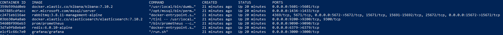

# How to Run Microservice Template on Tye

> This documentation introduces guidance for running your microservice template on [dotnet/tye](https://github.com/dotnet/tye). We suggest using tye for your development environment. You can check [tye getting started page](https://github.com/dotnet/tye/blob/main/docs/getting_started.md) for installation. 

## Pre-Requirements

- [Docker Desktop](https://www.docker.com/products/docker-desktop) v3.0+

- #### **Developer Certificates:** 
  - **Windows Users:** Run the powershell script file `create-certificate.ps1` . This file will create a self-signed certificate named `localhost.pfx` with a predefined password using **dotnet dev-certs** command. 
  - **Linux Users:** dotnet dev-certs may not be fully working on Linux so you may need to generate and trust your own certificate and put `localhost.pfx` file under **etc/dev-cert** folder inside solution directory.

    **Generate the certificate:** Under *etc/dev-cert* folder, *localhost.conf* file is already provided

    ```bash
    # See https://stackoverflow.com/questions/55485511/how-to-run-dotnet-dev-certs-https-trust
    # for more details
  
    # Generate certificate from config
    openssl req -x509 -nodes -days 365 -newkey rsa:2048 -keyout localhost.key -out localhost.crt \
      -config localhost.conf
    
    # Export pfx
    openssl pkcs12 -export -out localhost.pfx -inkey localhost.key -in localhost.crt -password pass:e8202f07-66e5-4619-be07-72ba76fde97f
    
    # Import CA as trusted
    sudo cp localhost.crt /usr/local/share/ca-certificates/
    sudo update-ca-certificates 
    
    # Validate the certificate
    openssl verify localhost.crt
    ```
    
  - **Mac Users:** You can either download **powershell** and use the `create-certificate.ps1` file to let dotnet dev-certs create the certificate or create manually using **openssl** as above.
  
- #### **Database Configuration:** 

  > If you are a windows user and have sql-server express installed already, you can skip this part. 

  If you are a Mac/Linux user or if you want to run the database in container; navigate to **etc/docker** folder under your microservice template solution. and run the command:

  ```yaml
  docker network create mycompanyname.myprojectname-network
  docker-compose -f docker-compose.infrastructure.yml -f docker-compose.infrastructure.override.yml up -d
  ```

  Or run the powershell command `up.ps1`. This will run the following infrastructure services externally:

  - Redis
  - RabbitMq
  - ElasticSearch
  - Kibana
  - MsSql-Server-Linux
  - Grafana
  - Prometheus

  

  Since you are running the infrastructure externally, you can **remove all the infrastructure services** from tye.yaml file. 

  To update the connection strings, you can either **update appsettings.json** files in each project with database connections **or** add environment variables to override the **appsettings**. 

  - **Override the appsettings:** In tye.yaml file, add env variable to each service using connection strings. Tye configuration should only contain project services now and shouldn't contain infrastructure services. Your tye.yaml file should be updated as above:

    ```yaml
    services:
    - name: auth-server
      project: apps/auth-server/src/MyCompanyName.MyProjectName.AuthServer/MyCompanyName.MyProjectName.AuthServer.csproj
      bindings:
        - protocol: https
          port: 44322
      env:
        - Kestrel__Certificates__Default__Path=../../../../etc/dev-cert/localhost.pfx
        - Kestrel__Certificates__Default__Password=e8202f07-66e5-4619-be07-72ba76fde97f
        - ConnectionStrings__IdentityService=Server=localhost,1434;Database=MyProjectName_Identity;User Id=sa;password=myPassw0rd;MultipleActiveResultSets=true
        - ConnectionStrings__AdministrationService=Server=localhost,1434;Database=MyProjectName_Administration;User Id=sa;password=myPassw0rd;MultipleActiveResultSets=true
        - ConnectionStrings__SaasService=Server=localhost,1434;Database=MyProjectName_Saas;User Id=sa;password=myPassw0rd;MultipleActiveResultSets=true
    
    - name: administration-service
      project: services/administration/src/MyCompanyName.MyProjectName.AdministrationService.HttpApi.Host/MyCompanyName.MyProjectName.AdministrationService.HttpApi.Host.csproj
      bindings:
        - protocol: https
          port: 44367
      env:
        - Kestrel__Certificates__Default__Path=../../../../etc/dev-cert/localhost.pfx
        - Kestrel__Certificates__Default__Password=e8202f07-66e5-4619-be07-72ba76fde97f
        - ConnectionStrings__AdministrationService=Server=localhost,1434;Database=MyProjectName_Administration;User Id=sa;password=myPassw0rd;MultipleActiveResultSets=true
        - ConnectionStrings__SaasService=Server=localhost,1434;Database=MyProjectName_Saas;User Id=sa;password=myPassw0rd;MultipleActiveResultSets=true
        
    - name: identity-service
      project: services/identity/src/MyCompanyName.MyProjectName.IdentityService.HttpApi.Host/MyCompanyName.MyProjectName.IdentityService.HttpApi.Host.csproj
      bindings:
        - protocol: https
          port: 44388
      env:
        - Kestrel__Certificates__Default__Path=../../../../etc/dev-cert/localhost.pfx
        - Kestrel__Certificates__Default__Password=e8202f07-66e5-4619-be07-72ba76fde97f
        - ConnectionStrings__IdentityService=Server=localhost,1434;Database=MyProjectName_Identity;User Id=sa;password=myPassw0rd;MultipleActiveResultSets=true
        - ConnectionStrings__AdministrationService=Server=localhost,1434;Database=MyProjectName_Administration;User Id=sa;password=myPassw0rd;MultipleActiveResultSets=true
        - ConnectionStrings__SaasService=Server=localhost,1434;Database=MyProjectName_Saas;User Id=sa;password=myPassw0rd;MultipleActiveResultSets=true
        
    - name: saas-service
      project: services/saas/src/MyCompanyName.MyProjectName.SaasService.HttpApi.Host/MyCompanyName.MyProjectName.SaasService.HttpApi.Host.csproj
      bindings:
        - protocol: https
          port: 44381
      env:
        - Kestrel__Certificates__Default__Path=../../../../etc/dev-cert/localhost.pfx
        - Kestrel__Certificates__Default__Password=e8202f07-66e5-4619-be07-72ba76fde97f
        - ConnectionStrings__AdministrationService=Server=localhost,1434;Database=MyProjectName_Administration;User Id=sa;password=myPassw0rd;MultipleActiveResultSets=true
        - ConnectionStrings__SaasService=Server=localhost,1434;Database=MyProjectName_Saas;User Id=sa;password=myPassw0rd;MultipleActiveResultSets=true    
    
    - name: product-service
      project: services/product/src/MyCompanyName.MyProjectName.ProductService.HttpApi.Host/MyCompanyName.MyProjectName.ProductService.HttpApi.Host.csproj
      bindings:
        - protocol: https
          port: 44361
      env:
        - Kestrel__Certificates__Default__Path=../../../../etc/dev-cert/localhost.pfx
        - Kestrel__Certificates__Default__Password=e8202f07-66e5-4619-be07-72ba76fde97f
        - ConnectionStrings__ProductService=Server=localhost,1434;Database=MyProjectName_ProductService;User Id=sa;password=myPassw0rd;MultipleActiveResultSets=true    
        - ConnectionStrings__AdministrationService=Server=localhost,1434;Database=MyProjectName_Administration;User Id=sa;password=myPassw0rd;MultipleActiveResultSets=true
        - ConnectionStrings__SaasService=Server=localhost,1434;Database=MyProjectName_Saas;User Id=sa;password=myPassw0rd;MultipleActiveResultSets=true
    ```

    > You can compare your tye configuration with the [template tye configuration](https://gist.github.com/gterdem/e9bab70702d5f7dd23916cb8e2c693e9).

  - **Update appsettings.json (Skip this part if you have already overridden appsettings):** Update all projects using connection strings appsettings.json file with new connection strings since Trusted_Connection will not work and authentication to database must be done with sql server authentication. Sample connection strings in appsettings for auth-server is shown below:

    ```json
    "ConnectionStrings": {
      "IdentityService": "Server=localhost;Database=MyProjectName_Identity;User Id=sa;password=myPassw0rd;MultipleActiveResultSets=true",
      "AdministrationService": "Server=localhost;Database=MyProjectName_Identity;User Id=sa;password=myPassw0rd;MultipleActiveResultSets=true",
      "SaasService": "Server=localhost;Database=MyProjectName_Identity;User Id=sa;password=myPassw0rd;MultipleActiveResultSets=true"
    },
    ```


## Running tye:

> Run `dotnet build` command if you are running the solution the first time  since tye will be running your projects locally.
>
> For run options, you can simply use `tye run -h` command.

Use the command `tye run` under your main solution directory to run the solution.


After tye is initialized, you can navigate to http://127.0.0.1:8000 (or http://localhost:8000) for tye dashboard.


#### Debug:

You can debug any service by *attaching to a process*. To run a service on debug mode simple use the command with the service name you want to debug: 

```bash
tye run --debug my-service
```

You will see an awaiting notice for attaching to a process when you *View* the *Logs* of the service you debug:


> In this state, product service will not start until you attach a debugger

In Visual Studio go to menu **Debug -> Attach to Process** then select the service process you are debugging.


You can debug your application normally.

If you want to attach a debugger to all of your services, you can use `*` instead of service name like:

```bash
tye run --debug *
```

#### Watch:

To improve the development pace, you can also enable the file system watchers. This way, only the modified and effected services will be restarted. To enable file watcher simply add *--watch*  switch to run command:

```bash
tye run --watch
```

