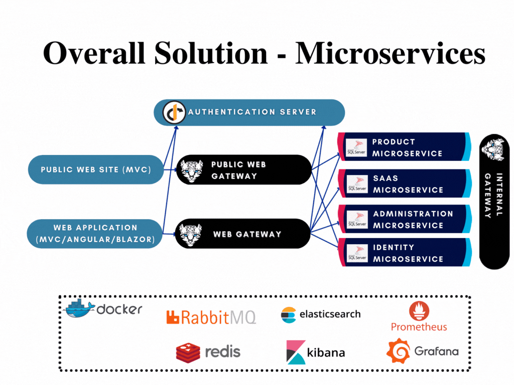

# Microservice Startup Template Microservices

> Microservices are the functional self deployable pieces of your system. While Infrastructural microservices don't have UI, it is possible to develop modular UI in the .Web layer of the microservices along with exposing rest api endpoints.



There are 4 different microservices are presented in the microservice startup template;

- **IdentityService** is located under *services/identity* folder. This service is an **infrastructural microservice** and hosts `Identity ` and `IdentityServer` related functionality and data store.
- **AdministrationService** is located under *services/administration* folder. This service is an **infrastructural microservice** and hosts administrative functionality such as `permission-management`, `setting-management`, `language-management`, `audit-logging` and such. 
- **SaasService** is located under *services/saas* folder. This service is an **infrastructural microservice** and hosts multi-tenancy related functionality and data store.
- **ProductService** is located under *services/product* folder. This is a **sample microservice** to examine and take reference for microservice development.

All microservices have their own solutions containing test projects under their respected folders. The infrastructural microservices are existing modules, combined together following [Module Development Best Practices & Conventions](https://docs.abp.io/en/abp/latest/Best-Practices/Index). Each of the microservice can also be developed further easily by following the modular development guideline.


All microservices;

- Depend on `SharedHostingMicroservicesModule` which contains configuration helpers for **JwtBearer** authorization, **Swagger** and **DbMigrations**,
- Contains configurations for AuthServer, Redis, RabbitMQ, ElasticSearch in appsettings.json file,
- Are capable of **on-the-fly migration**; have `DbMigrations` folder that contains `MigrationChecker` and `MigrationEventHandler`. This allows microservices migrate and seed their databases using distributed eventbus as an alternative usage to shared DbMigrator,
- Use **Sql Server**, containing `.EntityFrameworkCore` layer. This layer contains related database contexts, database context factories and migrations along with related module db configurations

> If you want to switch your database provider to **MongoDb** instead of EntityFrameworkCore for any of the microservice, you need to create `.MongoDb` project instead of `.EntityFrameworkCore`. Afterwards, add related modules MongoDb packages dependencies along with similar configurations made in EntityFrameworkCore layer like db context replacement and such. For more, check [MongoDB integration](https://docs.abp.io/en/abp/latest/Best-Practices/MongoDB-Integration).

## IdentityService

IdentityService is infrastructural microservice that provides modular solution by combining identity and identity-server management. All the related layers references respected layers of these modules.

### Identity-Server Authorization

IdentityService is defined as api resource and api scope with the name **IdentityService** in `IdentityServerDataSeeder`.

```csharp
private async Task CreateApiResourcesAsync()
{
    var commonApiUserClaims = new[]
    {
        "email",
        "email_verified",
        "name",
        "phone_number",
        "phone_number_verified",
        "role"
    };

    await CreateApiResourceAsync("IdentityService", commonApiUserClaims);
    await CreateApiResourceAsync("AdministrationService", commonApiUserClaims);
    await CreateApiResourceAsync("SaasService", commonApiUserClaims);
    await CreateApiResourceAsync("ProductService", commonApiUserClaims);
}
```

```csharp
private async Task CreateApiScopesAsync()
{
    await CreateApiScopeAsync("IdentityService");
    await CreateApiScopeAsync("AdministrationService");
    await CreateApiScopeAsync("SaasService");
    await CreateApiScopeAsync("ProductService");
}
```

As default,

- Web application (Mvc/Angular/Blazor) clients

- Web Gateway Swagger client
- Internal Gateway Swagger client
- AdministrationService client

requests **IdentityService** scope.

### Database Configuration

**IdentityServiceDbContext** implements 

- `IIdentityDbContext` 
- `IIdentityServerDbContext` 

in order to use these module db contexts as combined single db context. However DI container must also dynamically inject **IdentityServiceDbContext** whenever `IIdentityDbContext` or `IIdentityServerDbContext` is requested. The configuration under `ConfigureServices` provides the runtime database replacement

```csharp
context.Services.AddAbpDbContext<IdentityServiceDbContext>(options =>
{
    options.ReplaceDbContext<IIdentityDbContext>();
    options.ReplaceDbContext<IIdentityServerDbContext>();
    ...
});
```

There is also a SQL configuration for changing the migration table name to separate each service migration history table

```csharp
Configure<AbpDbContextOptions>(options =>
{
    options.Configure<IdentityServiceDbContext>(c =>
    {
        c.UseSqlServer(b =>
        {
            b.MigrationsHistoryTable("__IdentityService_Migrations");
        });
    });
});
```

### Migration and Seeding

**IdentityService.HttpApi.Host** runs `IdentityServiceDatabaseMigrationChecker` which checks pending migrations and migrates the IdentityService database. This is an async database migration comparing to DbMigrator; allowing database migration on the fly. 

`IdentityServiceDatabaseMigrationEventHandler` seeds IdentityServer data, Identity data (admin user) and default languages.

```csharp
public IdentityServiceDatabaseMigrationEventHandler(
    ICurrentTenant currentTenant,
    IUnitOfWorkManager unitOfWorkManager,
    ITenantStore tenantStore,
    IIdentityDataSeeder identityDataSeeder,
    IdentityServerDataSeeder identityServerDataSeeder,
    LanguageManagementDataSeeder languageManagementDataSeeder,
    ITenantRepository tenantRepository,
    IDistributedEventBus distributedEventBus
) : base(
    currentTenant,
    unitOfWorkManager,
    tenantStore,
    tenantRepository,
    distributedEventBus,
    IdentityServiceDbProperties.ConnectionStringName)
{
    _identityDataSeeder = identityDataSeeder;
    _identityServerDataSeeder = identityServerDataSeeder;
    _languageManagementDataSeeder = languageManagementDataSeeder;
}
```

Since **IdentityService.HttpApi.Host** seeds IdentityServer data, required IdentityServerClient data is set in appsettings `IdentityServerClients` section among with required db connection strings.

> IdentityService has **IdentityServerDataSeeder**, same with the one already existing in shared **DbMigrator** project. When you update the IdentityServerDataSeeder, don't forget to **update both files** that one exists in *IdentityService DbMigrations* folder and other in shared *DbMigrator* project.

IdentityService uses

- IdentityService connection string
- AdministrationService connection string
- SaasService connection string

which are located under *appsettings*.

### Layers and Module Configuration

IdentityService uses 

- [Identity Pro Module]([ABP Framework - Open Source Web Application Framework](https://docs.abp.io/en/commercial/latest/modules/identity)) 
- [IdentityServer Pro Module]([ABP Framework - Open Source Web Application Framework](https://docs.abp.io/en/commercial/latest/modules/identity-server))

#### IdentityService.Domain.Shared

Contains [Module Entity Extension](https://docs.abp.io/en/abp/latest/Module-Entity-Extensions) configuration and IdentityService related localization data. Depends on

- `AbpIdentityProDomainSharedModule` 
- `AbpIdentityServerDomainSharedModule`

modules.

#### IdentityService.Domain

Contains IdentityService Db properties such as `ConnectionStringName`and seeded `DefaultAdminPassword`. Depends on

- `AbpIdentityProDomainModule` 
- `AbpIdentityServerDomainModule`
- `IdentityServiceDomainSharedModule`

modules.

#### IdentityService.EntityFrameworkCore

Contains EntityFrameworkCore related information such `IdentityServiceDbContext`, `IdentityServiceDbContextFactory`, `EfCoreEntityExtensionsMapping` and `Migrations`. Depends on

- `AbpIdentityProEntityFrameworkCoreModule` 
- `AbpIdentityServerEntityFrameworkCoreModule`
- `AbpEntityFrameworkCoreSqlServerModule`
- `IdentityServiceDomainModule`

modules.

> If you are planning to use MongoDb instead of EntityFrameworkCore for your IdentityService, you need to replace this module with MongoDB equivalent.

#### IdentityService.Application.Contracts

Contains IdentityService application constants such as`RemoteServiceName`. Depends on

- `AbpIdentityApplicationContractsModule` 
- `AbpIdentityServerApplicationContractsModule`
- `AbpAccountAdminApplicationContractsModule`
- `IdentityServiceDomainSharedModule`

modules.

#### IdentityService.Application

Contains IdentityService automapper configuration. Depends on

- `AbpIdentityApplicationModule` 
- `AbpIdentityServerApplicationModule`
- `AbpAccountAdminApplicationModule`
- `IdentityServiceDomainModule`
- `IdentityServiceApplicationContractsModule`

modules.

#### IdentityService.HttpApi

Contains IdentityService http api configuration. Depends on

- `AbpIdentityHttpApiModule` 
- `AbpIdentityServerHttpApiModule`
- `AbpAccountAdminHttpApiModule`
- `IdentityServiceApplicationContractsModule`

modules.

#### IdentityService.HttpApi.Client

Contains IdentityService http api client proxy configuration. Depends on

- `AbpIdentityHttpApiClientModule` 
- `AbpIdentityServerHttpApiClientModule`
- `AbpAccountAdminHttpApiClientModule`
- `IdentityServiceApplicationContractsModule`

modules.

#### IdentityService.HttpApi.Host

IdentityService http api host project. Depends on 

- `IdentityServiceEntityFrameworkCoreModule` 
- `IdentityServiceApplicationModule`
- `IdentityServiceHttpApiModule`
- `SharedHostingMicroservicesModule`

modules. 

## AdministrationService

AdministrationService is an infrastructural microservice that hosts permission-management, feature-management, setting-management, audit-logging, language-management, text-template-management, lepton theme-management modules, functioning as combination of these modules. All the related layers references respected layers of these modules. 

### Identity-Server Authorization

As default,

- Web application (Mvc/Angular/Blazor) clients
- Public Web application client

- Web Gateway Swagger client
- Internal Gateway Swagger client

requests **AdministrationService** scope. The definition of this api resource and scope is done in `IdentityServerDataSeeder`.

AdministrationService has [synched interservice-communication](TODO) with **IdentityService** and should be able to make synched http requests to IdentityService order to function properly. This is done by adding this service as a client using `client_credentials` grant type with name *MyProjectName_AdministrationService* requesting *IdentityService* with `IdentityPermissions.Users.Default` permission. This is used for administration service requesting the user list in administration pages.

```csharp
//Administration Service Client
await CreateClientAsync(
    name: "MyProjectName_AdministrationService",
    scopes: commonScopes.Union(new[]
    {
        "IdentityService"
    }),
    grantTypes: new[] {"client_credentials"},
    secret: "1q2w3e*".Sha256(),
    permissions: new[] {IdentityPermissions.Users.Default}
);
```

To make the *client_credential* requests, IdentityModel configuration is done under `IdentityClients` section of appsettings along with `RemoteServices` configuration which points to **Internal Gateway** to locate IdentityService endpoint. This is done by using [Dynamic C# API Client Proxies](https://docs.abp.io/en/abp/latest/API/Dynamic-CSharp-API-Clients).

> If you need to make requests from AdministrationService to other microservices, you need to add their scope to client creation with required permission as in IdentityService user list request.

### Database Configuration

**AdministrationServiceDbContext** implements

- `IPermissionManagementDbContext`
- `ISettingManagementDbContext`
- `IFeatureManagementDbContext`
- `IAuditLoggingDbContext`
- `ILanguageManagementDbContext`
- `ITextTemplateManagementDbContext`
- `IBlobStoringDbContext`

in order to use these module db contexts as combined single db context. DI container dynamically injects **AdministrationServiceDbContext** whenever one of the used modules dbcontext is requested. The configuration under `ConfigureServices` provides the runtime database replacement

```csharp
context.Services.AddAbpDbContext<AdministrationServiceDbContext>(options =>
{
    options.ReplaceDbContext<IPermissionManagementDbContext>();
    options.ReplaceDbContext<ISettingManagementDbContext>();
    options.ReplaceDbContext<IFeatureManagementDbContext>();
    options.ReplaceDbContext<IAuditLoggingDbContext>();
    options.ReplaceDbContext<ILanguageManagementDbContext>();
    options.ReplaceDbContext<ITextTemplateManagementDbContext>();
    options.ReplaceDbContext<IBlobStoringDbContext>();
    ...
});
```

There is also a SQL configuration for changing the migration table name to separate each service migration history table

```csharp
Configure<AbpDbContextOptions>(options =>
{
    options.Configure<AdministrationServiceDbContext>(c =>
    {
        c.UseSqlServer(b =>
        {
            b.MigrationsHistoryTable("__AdministrationService_Migrations");
        });
    });
});
```

### Migration and Seeding

**AdministrationService.HttpApi.Host** runs `AdministrationServiceDatabaseMigrationChecker` which checks pending migrations and migrates the AdministrationService database. This is an async database migration comparing to DbMigrator; allowing database migration on the fly. 

`AdministrationServiceDatabaseMigrationEventHandler` seeds Permission definitions and permissions.

```csharp
public AdministrationServiceDatabaseMigrationEventHandler(
    ICurrentTenant currentTenant,
    IUnitOfWorkManager unitOfWorkManager,
    ITenantStore tenantStore,
    IPermissionDefinitionManager permissionDefinitionManager,
    IPermissionDataSeeder permissionDataSeeder,
    ITenantRepository tenantRepository,
    IDistributedEventBus distributedEventBus
) : base(
    currentTenant,
    unitOfWorkManager,
    tenantStore,
    tenantRepository,
    distributedEventBus,
    AdministrationServiceDbProperties.ConnectionStringName)
{
    _permissionDefinitionManager = permissionDefinitionManager;
    _permissionDataSeeder = permissionDataSeeder;
}
```

AdministrationService uses

- AdministrationService connection string
- SaasService connection string

which are located under *appsettings*.

### Layers and Module Configuration

AdministrationService uses

- [Permission Management Module](https://docs.abp.io/en/abp/latest/Modules/Permission-Management)
- [Feature Management Module](https://docs.abp.io/en/abp/latest/Modules/Feature-Management)
- [Setting Management Module](https://docs.abp.io/en/abp/latest/Modules/Setting-Management)
- [Audit Logging](https://docs.abp.io/en/commercial/latest/modules/audit-logging)
- [Language Management Module](https://docs.abp.io/en/commercial/latest/modules/language-management)
- [Text Template Management Module](https://docs.abp.io/en/commercial/latest/modules/text-template-management)
- [Lepton Theme Module](https://docs.abp.io/en/commercial/latest/themes/lepton)

#### AdministrationService.Domain.Shared

Contains [Module Entity Extension](https://docs.abp.io/en/abp/latest/Module-Entity-Extensions) configuration and AdministrationService related localization data. Depends on

- `AbpPermissionManagementDomainSharedModule` 
- `AbpFeatureManagementDomainSharedModule`
- `AbpSettingManagementDomainSharedModule`
- `AbpAuditLoggingDomainSharedModule`
- `LeptonThemeManagementDomainSharedModule`
- `LanguageManagementDomainSharedModule`
- `TextTemplateManagementDomainSharedModule`

modules.

#### AdministrationService.Domain

Contains AdministrationService Db properties such as `ConnectionStringName`. Depends on

- `AbpPermissionManagementDomainModule` 
- `AbpFeatureManagementDomainModule`
- `AbpSettingManagementDomainModule`
- `AbpAuditLoggingDomainModule`
- `LeptonThemeManagementDomainModule`
- `LanguageManagementDomainModule`
- `TextTemplateManagementDomainModule`
- `AbpPermissionManagementDomainIdentityServerModule`
- `AbpPermissionManagementDomainIdentityModule`
- `AdministrationServiceDomainSharedModule`

modules.

#### AdministrationService.EntityFrameworkCore

Contains EntityFrameworkCore related information such `AdministrationDbContext`, `AdministrationDbContextFactory`, `EfCoreEntityExtensionsMapping` and `Migrations`. Depends on

- `AbpEntityFrameworkCoreSqlServerModule`
- `AbpPermissionManagementEntityFrameworkCoreModule` 
- `AbpFeatureManagementEntityFrameworkCoreModule`
- `AbpSettingManagementEntityFrameworkCoreModule`
- `AbpAuditLoggingEntityFrameworkCoreModule`
- `BlobStoringDatabaseEntityFrameworkCoreModule`
- `LanguageManagementEntityFrameworkCoreModule`
- `TextTemplateManagementEntityFrameworkCoreModule`
- `AdministrationServiceDomainModule`

modules.

> If you are planning to use MongoDb instead of EntityFrameworkCore for your AdministrationService, you need to replace this module with MongoDB equivalent.

#### AdministrationService.Application.Contracts

Contains AdministrationService application constants such as`RemoteServiceName`. Depends on

- `AbpPermissionManagementApplicationContractsModule`
- `AbpFeatureManagementApplicationContractsModule` 
- `AbpSettingManagementApplicationContractsModule`
- `AbpAuditLoggingApplicationContractsModule`
- `LeptonThemeManagementApplicationContractsModule`
- `LanguageManagementApplicationContractsModule`
- `TextTemplateManagementApplicationContractsModule`
- `AdministrationServiceDomainSharedModule`

modules.

#### AdministrationService.Application

Contains AdministrationService automapper configuration. Depends on

- `AbpPermissionManagementApplicationModule`
- `AbpFeatureManagementApplicationModule` 
- `AbpSettingManagementApplicationModule`
- `AbpAuditLoggingApplicationModule`
- `LeptonThemeManagementApplicationModule`
- `LanguageManagementApplicationModule`
- `TextTemplateManagementApplicationModule`
- `AdministrationServiceDomainModule`
- `AdministrationServiceApplicationContractsModule`

modules.

#### AdministrationService.HttpApi

Contains AdministrationService http api configuration. Depends on

- `AbpPermissionManagementHttpApiModule`
- `AbpFeatureManagementHttpApiModule`
- `AbpSettingManagementHttpApiModule`
- `AbpAuditLoggingHttpApiModule`
- `LeptonThemeManagementHttpApiModule`
- `LanguageManagementHttpApiModule`
- `TextTemplateManagementHttpApiModule`
- `AdministrationServiceApplicationContractsModule`

modules.

#### AdministrationService.HttpApi.Client

Contains AdministrationService http api client proxy configuration. Depends on

- `AbpPermissionManagementHttpApiClientModule`
- `AbpFeatureManagementHttpApiClientModule`
- `AbpSettingManagementHttpApiClientModule`
- `AbpAuditLoggingHttpApiClientModule`
- `LeptonThemeManagementHttpApiClientModule`
- `LanguageManagementHttpApiClientModule`
- `TextTemplateManagementHttpApiClientModule`
- `AdministrationServiceApplicationContractsModule`

modules.

#### AdministrationService.HttpApi.Host

AdministrationService http api host project. Depends on 

- `MyProjectNameSharedHostingMicroservicesModule`
- `AbpHttpClientIdentityModelWebModule` to make client credential requests
- `AbpAspNetCoreMvcUiMultiTenancyModule` for multi-tenancy UI
- `AbpIdentityHttpApiClientModule` to make request to IdentityService
- `AbpAccountAdminApplicationContractsModule` for account permissions
- `AbpAccountPublicApplicationContractsModule` for account permissions
- `ProductServiceApplicationContractsModule` for ProductService permissions
- `SaasServiceApplicationContractsModule` SaasService permissions
- `IdentityServiceApplicationContractsModule` IdentityService permissions
- `AdministrationServiceApplicationModule`
- `AdministrationServiceEntityFrameworkCoreModule`
- `AdministrationServiceHttpApiModule`

modules. 

## SaasService

SaasService is an infrastructural microservice that for multi-tenancy functionality and data store.

### Identity-Server Authorization

As default, 

- Web application (Mvc/Angular/Blazor) clients
- WebGateway Swagger client
- InternalGateway client

requests **SaasService** scope. The definition of this api resource and scope is done in `IdentityServerDataSeeder`.

### Database Configuration

**SaasServiceDbContext** implements

- `ISaasDbContext`

in order to use this module db context. DI container dynamically injects **SaasServiceDbContext** whenever the Saas module db context is requested. The configuration under `ConfigureServices` provides the runtime database replacement

```csharp
context.Services.AddAbpDbContext<SaasServiceDbContext>(options =>
{
    options.ReplaceDbContext<ISaasDbContext>();
    ...
});
```

There is also a SQL configuration for changing the migration table name to separate each service migration history table

```csharp
Configure<AbpDbContextOptions>(options =>
{
    options.Configure<SaasServiceDbContext>(c =>
    {
        c.UseSqlServer(b =>
        {
            b.MigrationsHistoryTable("__SaasService_Migrations");
        });
    });
});
```

### Migration and Seeding

**SaasService.HttpApi.Host** runs `SaasServiceDatabaseMigrationChecker` which checks pending migrations and migrates the SaasService database. This is an async database migration comparing to DbMigrator; allowing database migration on the fly. 

As default, `SaasServiceDatabaseMigrationEventHandler` doesn't seed any data. 

SaasService uses

- SaasService connection string
- AdministrationService connection string

which are located under *appsettings*.

### Layers and Module Configuration

SaasService uses 

-  [Saas Module]([ABP Framework - Open Source Web Application Framework](https://docs.abp.io/en/commercial/latest/modules/saas))

#### SaasService.Domain.Shared

Contains [Module Entity Extension](https://docs.abp.io/en/abp/latest/Module-Entity-Extensions) configuration and SaasService related localization data. Depends on

- `SaasDomainSharedModule` 

module.

#### SaasService.Domain

Contains SaasService Db properties such as `ConnectionStringName`and seeded `DefaultAdminPassword`. Depends on

- `SaasDomainSharedModule` 
- `SaasServiceDomainSharedModule`

module.

#### SaasService.EntityFrameworkCore

Contains EntityFrameworkCore related information such `SaasServiceDbContext`, `SaasServiceDbContextFactory`, `EfCoreEntityExtensionsMapping` and `Migrations`. Depends on

- `AbpEntityFrameworkCoreSqlServerModule` 
- `SaasEntityFrameworkCoreModule`
- `SaasServiceDomainModule`

modules.

> If you are planning to use MongoDb instead of EntityFrameworkCore for your SaasService, you need to replace this module with MongoDB equivalent.

#### SaasService.Application.Contracts

Contains SaasService application constants such as`RemoteServiceName`. Depends on

- `SaasTenantApplicationContractsModule` 
- `SaasHostApplicationContractsModule`
- `SaasServiceDomainSharedModule`

modules.

#### SaasService.Application

Contains SaasService automapper configuration. Depends on

- `SaasTenantApplicationModule` 
- `SaasHostApplicationModule`
- `SaasServiceDomainModule`
- `SaasServiceApplicationContractsModule`

modules.

#### SaasService.HttpApi

Contains SaasService http api configuration. Depends on

- `SaasHostHttpApiModule` 
- `SaasTenantHttpApiModule`
- `SaasServiceApplicationContractsModule`

modules.

#### SaasService.HttpApi.Client

Contains SaasService http api client proxy configuration. Depends on

- `SaasTenantHttpApiClientModule` 
- `SaasHostHttpApiClientModule`
- `SaasServiceApplicationContractsModule`
- `IdentityServiceApplicationContractsModule`

modules.

#### IdentityService.HttpApi.Host

SaasService http api host project. Depends on 

- `MyProjectNameSharedHostingMicroservicesModule` 
- `SaasServiceEntityFrameworkCoreModule`
- `SaasServiceApplicationModule`
- `SaasServiceHttpApiModule`

modules. 

## ProductService

ProductService is a sample microservice for examination, created with using [Module Development Best Practices & Conventions](https://docs.abp.io/en/abp/latest/Best-Practices/Index). Since Microservice template solution is created with modularity in mind, it is pretty straight forward to integrate modules as microservices into the solution.

ProductService [solution structure](https://docs.abp.io/en/commercial/latest/startup-templates/module/solution-structure) contains *.Web* layer as **library** instead of traditional running project which provides modular UI development. When you develop the UI of your application inside the module, it will be rendered in your host application.

### Identity-Server Authorization

As default, 

- Web application (Mvc/Angular/Blazor) clients
- Public Web application client
- Web Gateway Swagger client
- Internal Gateway Swagger client
- Public Web Gateway Swagger client

requests **ProductService** scope. The definition of this api resource and scope is done in `IdentityServerDataSeeder`.

### Database Configuration

**ProductService.EntityFrameworkCore** project contains `ProductServiceDbContext`, `ProductServiceDbContextFactory`, `EfCoreEntityExtensionsMapping`,  `Migrations`, EfCore configuration and ProductRepository implementation. **SaasServiceDbContext** implements

- `IProductServiceDbContext`

which contains ProductService specific `DbSets`. Moreover, there is no need for runtime db context replacement hence there is no configuration related with it.

There is a SQL configuration for changing the migration table name to separate each service migration history table

```csharp
Configure<AbpDbContextOptions>(options =>
{
    options.Configure<ProductServiceDbContext>(c =>
    {
        c.UseSqlServer(b =>
        {
            b.MigrationsHistoryTable("__ProductService_Migrations");
        });
    });
});
```

### Migration and Seeding

**ProductService.HttpApi.Host** runs `ProductServiceDatabaseMigrationChecker` which checks pending migrations and migrates the ProductService database. This is an async database migration comparing to DbMigrator; allowing database migration on the fly. 

As default, `ProductServiceDatabaseMigrationEventHandler` doesn't seed any data. 

ProductService uses

- ProductService connection string
- AdministrationService connection string
- SaasService connection string

which are located under *appsettings*.

### Layers and Module Configuration

ProductService uses [Module Startup Template Solution Structure](https://docs.abp.io/en/commercial/latest/startup-templates/module/solution-structure).