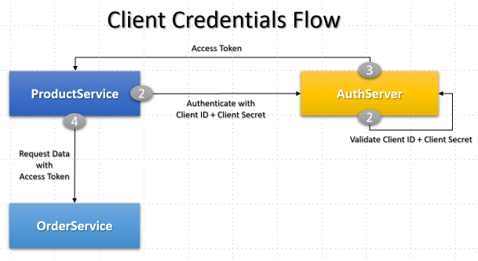
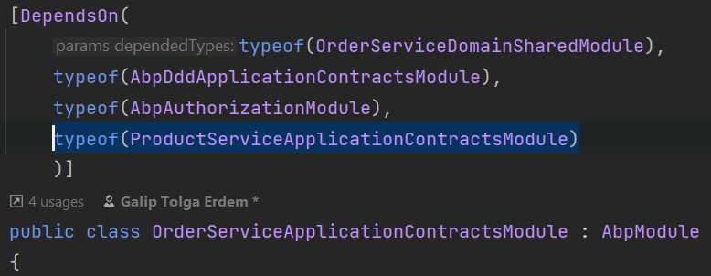
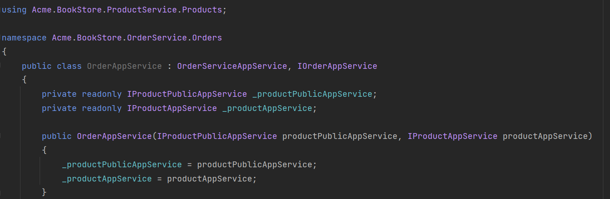
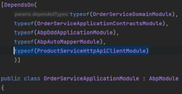
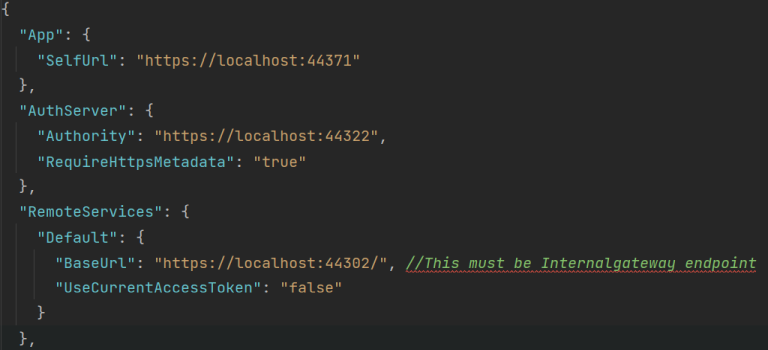
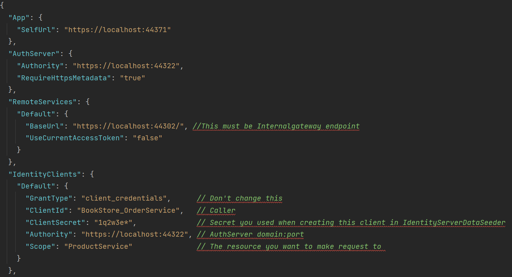
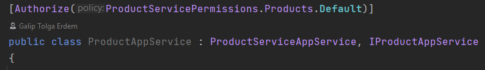
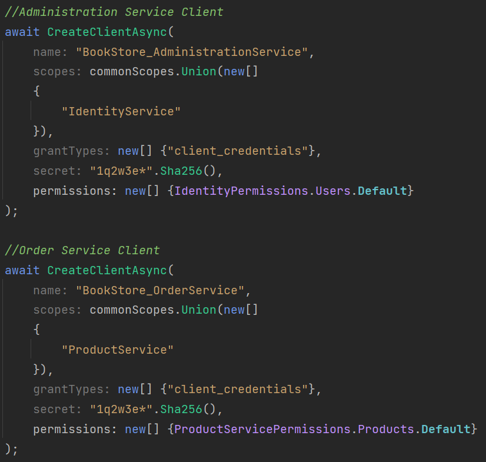
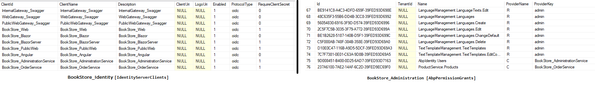

# Synchronous Communication between Microservices

> This documentation introduces guidance for synchronous communication between microservices. 

Sample demonstrates how to call *ProductService* from *OrderService*. If you don't know how the OrderService is created, please refer to [Add New Microservice guide](add-microservice.md).

## Client Credentials Flow



The [Client Credentials flow](https://docs.identityserver.io/en/latest/quickstarts/1_client_credentials.html) is a server to server flow and **there is no user authentication** involved in the process. Instead of user, client ID (service itself) as subject is authenticated with a predefined secret. Resulting access token contains client information instead of user information.

## Updating OrderService Application Contracts

To make ProductService application services available for OrderService application layer, you need to add the project reference of **Acme.BookStore.ProductService.Application.Contracts** project and then add module dependency to **OrderServiceApplicationContractsModule**.

* **Add csproj reference**:

  Open **Acme.BookStore.OrderService.Application.Contracts.csproj** and add the following project reference

```json
<ProjectReference Include="..\..\..\product\src\Acme.BookStore.ProductService.Application.Contracts\Acme.BookStore.ProductService.Application.Contracts.csproj" />
```

* **Add DependsOn attribute**:

  Open **OrderServiceApplicationContractsModule.cs** class and add the following module dependency
  
```csharp
typeof(ProductServiceApplicationContractsModule)
```

  

Now you can use Product related services in your OrderService application layer:



> Remember to build OrderService.Application project with `dotnet build` command if you are having problems with finding necessary namespace.

Since there is no implementation of *IProductAppService* and *IProductPublicAppService* exist in OrderService.Application layer, you need to configure it to make http calls for implementations. To achieve it, you need to add the project reference of **Acme.BookStore.ProductService.HttpApi.Client** project and then add module dependency to **OrderServiceApplicationModule**.

- **Add csproj reference**:

  Open **Acme.BookStore.OrderService.Application.csproj** and add the following project reference

  ```json
  <ProjectReference Include="..\..\..\product\src\Acme.BookStore.ProductService.HttpApi.Client\Acme.BookStore.ProductService.HttpApi.Client.csproj" />
  ```

- **Add DependsOn attribute**:

  Open **OrderServiceApplicationModule.cs** class and add the following module dependency

  ```csharp
  typeof(ProductServiceHttpApiClientModule)
  ```



Update **OrderService.HttpApi.Host** appsettings with **RemoteService** section to configure http calls will be made to **internal gateway** so that it can be located and redirected to product service http api end point.

```json
"RemoteServices": {
  "Default": {
    "BaseUrl": "https://localhost:44302/",
    "UseCurrentAccessToken": "false"
  }
},
```

OrderService.HttpApi.Host appsettings should look like:



## Configuring Auto-Discovery Endpoint

To automate requesting access token and adding it as *bearer* to request header; use **Volo.Abp.Http.Client.IdentityModel.Web** nuget package in  **OrderService.HttpApi.Host** project.

- **Add package reference**:

  Open **Acme.BookStore.OrderService.HttpApi.Host.csproj** and add the following package reference

  ```json
  <PackageReference Include="Volo.Abp.Http.Client.IdentityModel.Web" Version="4.4.2" />
  ```

- **Add DependsOn attribute**:

  Open **OrderServiceHttpApiHostModule.cs** class and add the following module dependency

  ```csharp
  typeof(AbpHttpClientIdentityModelModule)
  ```


Update **OrderService.HttpApi.Host** appsettings with **IdentityClients** section to configure Client Credential access token requst with client secret to AuthServer end point

```json
  "IdentityClients": {
    "Default": {
      "GrantType": "client_credentials", 
      "ClientId": "OrderService",
      "ClientSecret": "1q2w3e*",
      "Authority": "https://localhost:44322", 
      "Scope": "ProductService"
    }
  },
```

**OrderService.HttpApi.Host** appsettings should look like:



## IdentityServer Configuration

> You can also do the same functionality explained in this step by using IdentityServer Management UI. However it is a good practice to keep `IdentityServerDataSeeder` updated. 

To keep `IdentityServerDataSeeder` updated, you need to do the following steps in the **IdentityServerDataSeeder.cs** class. Note that there are 2 **IdentityServerDataSeeder.cs** classes in the solution:

1. `Acme.BookStore.DbMigrator\IdentityServerDataSeeder.cs`
2. `Acme.BookStore.IdentityService.HttpApi.Host\DbMigrations\IdentityServerDataSeeder.cs`. 


- **Add ProductService.Application.Contracts Reference for Permissions:**

  > If you will use the DbMigrator application you can skip this step since DbMigrator project already has this reference.

  For `Acme.BookStore.IdentityService.HttpApi.Host\DbMigrations\IdentityServerDataSeeder.cs` add **ProductService.Application.Contracts** project reference as below:

  ```json
  <ProjectReference Include="..\..\..\product\src\Acme.BookStore.ProductService.Application.Contracts\Acme.BookStore.ProductService.Application.Contracts.csproj" />
  ```

  **Create New Client:** 

  `OrderService` itself is a new client and you need to add the **OrderService** as a client under **CreateClientsAsync** as well. Open `IdentityServerDataSeeder.cs` and add the below line in 

  ```csharp
  await CreateClientAsync(
      name: "BookStore_OrderService",
      scopes: commonScopes.Union(new[]
      {
          "ProductService"
      }),
      grantTypes: new[] {"client_credentials"},
      secret: "1q2w3e*".Sha256(),
      permissions: new[] {ProductServicePermissions.Products.Default}
  );
  ```

  > **OrderService.HttpApi.Host** appsettings **IdentityClients** section data **must match** with the client creation data.

  **ProductAppService** has permission authorization and will return unauthorized exception (`401`) when a request has been made. To overcome this issue, add the required permissions of the service you are making to.

  Sample has ma

  

Since OrderService will only use **GetList** method of the ProductAppService, we are adding `ProductServicePermissions.Products.Default` permission for this client. 

Below you can see a screenshot of the final **IdentityServerDataSeeder.cs**, creating `OrderService ` client:



When the database is seeded BookStore_OrderService should be seeded with granted permissions:



## Next

- [Asynchronous Communication](asynched-communication.md)
