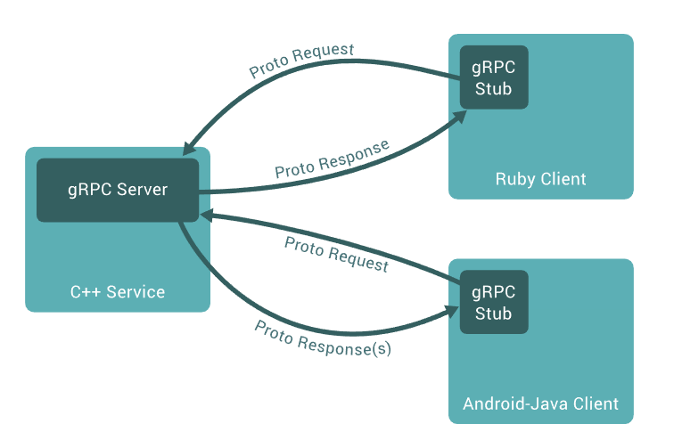

# Using gRPC

[gRPC](https://grpc.io/) is a cross-platform open source high performance remote procedure call framework created by Google to be used to provide inter-communication between large number of microservices. It uses [HTTP/2](https://en.wikipedia.org/wiki/HTTP/2) for transport layer and [Protocol Buffers](https://en.wikipedia.org/wiki/Protocol_Buffers) as the data format to serialize the structured data. It generates cross-platform client and server bindings different languages with the features like authentication, bi-directional streaming and flow control, blocking or non-blocking bindings, cancellation and timeouts.



<div class="figure" style="text-align:center"><i>gRPC Overview from grpc.io</i></div>

## Benefits

- Designed for low latency and high throughput communication, gRPC is great for lightweight **microservices** where the efficiency is critical.

- gRPC services can push messages in real-time without polling. It's support for bi-directional streaming makes gRPC an excellent tool for point to point real-time communication.
- gRPC toolong supports many popular development languages, making gRPC a good choice for multi-language environments.
- Protubuf is a lightweight mesage format. A gRPC message is always smaller than an equivalent JSON message. That can be an important factor of choice where the network environment is constrained.
- gRPC can be used to communicate between apps on the same machine. For more information, see [Inter-process communication with gRPC](https://learn.microsoft.com/en-us/aspnet/core/grpc/interprocess?view=aspnetcore-7.0).

<div class="figure">See more at <a href="https://learn.microsoft.com/en-us/aspnet/core/grpc/comparison">Compare gRPC services with HTTP APIs</a></div>

## Using gRPC with the ABP Framework

There are two great articles about gRPC integration to the ABP framework by Halil Ibrahim Kalkan:

- [Using gRPC with the ABP Framework | ABP Community](https://community.abp.io/posts/using-grpc-with-the-abp-framework-2dgaxzw3)
- [Consuming gRPC Services from Blazor WebAssembly Application Using gRPC-Web | ABP Community](https://community.abp.io/posts/consuming-grpc-services-from-blazor-webassembly-application-using-grpcweb-dqjry3rv)

This guide will explain a scenario where the basket microservice consumes the catalog microservice grpc service for obtaining detailed product information.

## Adding a gRPC service to a microservice

We will create a new gRPC service called **PublicProductGrpcService** under the application layer. This service will be the **server** for the gRPC communication. We'll start adding tooling for the gRPC service by adding the following packages to the application layer:

```csharp
<PackageReference Include="Google.Protobuf" Version="3.19.3" />
<PackageReference Include="Grpc.Core" Version="2.42.0" />
<PackageReference Include="Grpc.Tools" Version="2.42.0" PrivateAssets="All" />
```

Now we shall add a new folder called **Protos** under the application layer to add the proto files and add `product.proto` file under it:

```csharp
syntax = "proto3";

option csharp_namespace = "EShopOnAbp.CatalogService.Grpc";

package CatalogApi;

service ProductPublic {
	rpc GetById(ProductRequest) returns (ProductResponse);
}

message ProductRequest {
	string id = 1;
}

message ProductResponse {
	string id = 1;
	string code = 2;
	string name = 3;
	string imageName = 4;
	float price = 5;
	int32 stockCount = 6;
}
```

Now we have defined a new gRPC service called ProductPublic that accepts a `ProductRequest` complex object containing a string id parameter and returns an other complex object named `ProductResponse` with product properties we desire to return. 

> Note: The sequence of the properties are important since it will be used for serialization and deserialization order.

To generate the proto definition, update the application layer `.csproj` file:

```csharp
<ItemGroup>
  <Protobuf Include="Protos\product.proto" GrpcServices="Server" Generator="MSBuild:Compile" />
  <Content Include="@(Protobuf)" />
  <None Remove="@(Protobuf)" />
</ItemGroup>
```

This configuration will allow gRPC tooling to generate the gRPC services based on the supplied proto file on **compile time**. Compile your application layer to generate the gRPC service base class.

Nowe we can create the application service extending the base class:

```csharp
public class PublicProductGrpService : ProductPublic.ProductPublicBase
{
    private readonly IRepository<Product, Guid> _productRepository;
    private readonly IObjectMapper _objectMapper;

    public PublicProductGrpService(IRepository<Product, Guid> productRepository, IObjectMapper objectMapper)
    {
        _productRepository = productRepository;
        _objectMapper = objectMapper;
    }

    public override async Task<ProductResponse> GetById(ProductRequest request, ServerCallContext context)
    {
        var product = await _productRepository.GetAsync(Guid.Parse(request.Id));
        return _objectMapper.Map<Product, ProductResponse>(product);
    }
}
```

This application service containing a single gRPC service method simply gets the product with the provided id using the product repository and returns the mapped result. You can either use manual mapping or add in the automapper profile as below:

```cs
public class CatalogServiceApplicationAutoMapperProfile : Profile
{
    public CatalogServiceApplicationAutoMapperProfile()
    {
        CreateMap<Product, ProductResponse>();
    }
}
```

To host the gRPC service, add the `Grpc.AspNetCore.Server` package to the **Http.Api.Host** layer of your application:

```csharp
<ItemGroup>
  <PackageReference Include="Grpc.AspNetCore.Server" Version="2.42.0" />
</ItemGroup>
```

Now we can configure it in the Http.Api.Host module file `ConfigureServices` method:

```csharp
context.Services.AddGrpc(options =>
{
   options.EnableDetailedErrors = true; // Send detailed error to clients
});
```

The gRPC server must be hosted using HTTP2 protocol within a different port along side with the default http endpoints. Configure the Kestrel to expose the gRPC using a different end-point by adding a Kestrel section to the appsettings.json in your Http.Api.Host project:

```json
{
  "Kestrel": {
    "Endpoints": {
      "Http": {
        "Url": "http://localhost:5000",
        "Protocols": "Http1AndHttp2"
      },
      "Https": {
        "Url": "https://localhost:44354",
        "Protocols": "Http1AndHttp2"
      },
      "gRPC": {
        "Url": "http://localhost:81",
        "Protocols": "Http2"
      }
    }
  }
}
```

This configuration will allow running the gRPC server on port 81 using the HTTP2 protocol and it can be easily overridden on deployment.

Last step for the server-side is to configure the ABP endpoints. Update the `OnApplicationInitialization` method in Http.Api.Host module:

```cs
app.UseConfiguredEndpoints(endpoints =>
{
    endpoints.MapGrpcService<PublicProductGrpService>();
});
```

This configuration will map incoming gRPC requests to the gRPC service we have defined.

## Consuming the added gRPC service from another microservice

We will be using Basket microservice to consume the `PublicProductGrpService` we have created at the catalog microservice. 

Start with adding the tooling to the Basket microservice application layer:

```csharp
<PackageReference Include="Google.Protobuf" Version="3.19.3" />
<PackageReference Include="Grpc.Net.ClientFactory" Version="2.42.0" />
<PackageReference Include="Grpc.Tools" Version="2.42.0" PrivateAssets="All" />
```

We also need to configure the basket microservice as grpc **client** service to consume the proto:

```cs
<ItemGroup>
    <Protobuf Include="..\..\..\catalog\src\EShopOnAbp.CatalogService.Application\Protos\product.proto" GrpcServices="Client" />
</ItemGroup>
```

This configuration allows us to use the same proto generated by the Catalog microservice. 

Since Basket microservice will be using both HTTP and gRPC to communicate with the Catalog microservice, we need to configure the remote service endpoints of Basket microservice and provide which endpoint of remote service will be used for HTTP and which for gRPC. Add a RemoteServices section to appsettings.json  of your BasketService host layer:

```json
 "RemoteServices": {
    "Catalog": {
      "BaseUrl": "https://localhost:44354/",
      "GrpcUrl": "http://localhost:81"
    }
  },
```

> Note: The gRPC endpoint url must match with the gRPC server endpoint which is configured at Catalog microservice Kestrel configuration.

Now we can add gRPC client in the `ConfigureServices` method of the Basket microservice host application module:

```csharp
context.Services.AddGrpcClient<ProductPublic.ProductPublicClient>((services, options) =>
{
    var remoteServiceOptions = services.GetRequiredService<IOptionsMonitor<AbpRemoteServiceOptions>>().CurrentValue;
    var catalogServiceConfiguration = remoteServiceOptions.RemoteServices.GetConfigurationOrDefault("Catalog");
    var catalogGrpcUrl = catalogServiceConfiguration.GetOrDefault("GrpcUrl");

    options.Address = new Uri(catalogGrpcUrl);
});
```

This configuration will extract the gRPCUrl which is provided in the appsettings RemoteServices section.

Now you can use the gRPC service client in any application service by simply injecting it:

```csharp
public class BasketProductService : IBasketProductService, ITransientDependency
{
    private readonly ILogger<BasketProductService> _logger;
    private readonly ProductPublic.ProductPublicClient _productPublicGrpcClient;

    public BasketProductService(
        ILogger<BasketProductService> logger,
        ProductPublic.ProductPublicClient productPublicGrpcClient)
    {
        _logger = logger;
        _productPublicGrpcClient = productPublicGrpcClient;
    }

    private async Task<ProductDto> GetAsync(Guid productId)
    {
        var request = new ProductRequest { Id = productId.ToString() };
        _logger.LogInformation("=== GRPC request {@request}", request);
        var response = await _productPublicGrpcClient.GetByIdAsync(request);
        _logger.LogInformation("=== GRPC response {@response}", response);
        return _mapper.Map<ProductResponse, ProductDto>(response) ??
               throw new UserFriendlyException(BasketServiceDomainErrorCodes.ProductNotFound);
    }
}
```

## Consuming gRPC services from the web application

#TODO


## Dealing with multi-tenancy, localization and authorization in gRPC service calls

#TODO


## Next

- [Synchronous Communication](synchronous-interservice-communication.md)
- [Asynchronous Communication](asynchronous-interservice-communication.md)