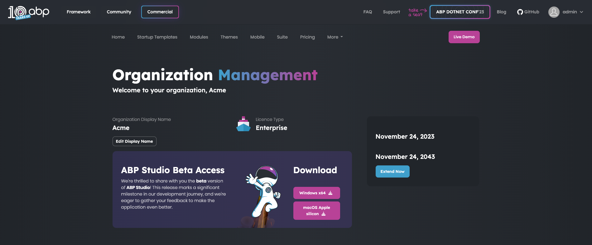
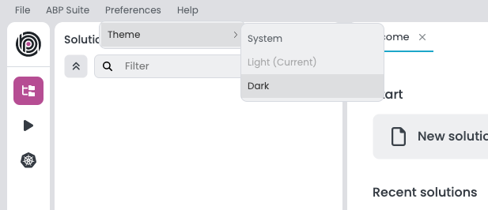

# Installing ABP Studio

> **Warning: Beta Version Information**\
> As of now, ABP Studio is in its beta phase, and access is exclusively available to invited organizations. To request access to the beta version, kindly visit [this web page](https://commercial.abp.io/studio). If you've already received an invitation, please proceed by following the installation guide below.

## Pre-requirements

Before you begin the installation process for ABP Studio, ensure that your system meets the following pre-requirements:
### PowerShell (Installed Automatically)*
Make sure PowerShell is installed on your system. It is automatically installed by ABP Studio, but if you want to install it manually, write the following command in your terminal:

   ```bash
   dotnet tool install --global PowerShell
   ```
### ABP CLI (Installed Automatically)*
Make sure ABP CLI (Command Line Interface) is installed on your system. It is automatically installed by ABP Studio, but if you want to install it manually, follow the instructions provided in the official [ABP CLI documentation](https://docs.abp.io/en/abp/latest/CLI). 
### ABPC CLI (Installed Automatically)*
The ABPC CLI (Command-Line Interface) is a tool that works with ABP Studio. It doesn't need the user interface; you can run it by typing commands or including it in scripts. When you install ABP Studio, the ABPC CLI comes with it automatically. This CLI tool helps automate tasks when you're working with CI/CD pipelines.
### Node*
Make sure Node.js is installed on your system. If not, you can download the `v16` or `v18` version from the official [Node.js website](https://nodejs.org/).
### WireGuard (Optional) 
ABP Studio needs WireGuard for Kubernetes operations. You can find the installation instructions for your specific operating system below:

**For Windows:** 
Installation instructions for your Windows operating system can be found on the official [WireGuard website](https://www.wireguard.com/).

**For macOS:**
To install, you can write the following command in your terminal:

```bash
brew install wireguard-tools
```
### Docker (Optional) 
ABP Studio needs Docker for Kubernetes operations. Install Docker by following the guidelines provided on the official [Docker website](https://docs.docker.com/get-docker/).

## Installation

Now that you have met the pre-requirements, follow the steps below to install ABP Studio:

1. **Download ABP Studio:** Visit [your organization page](https://commercial.abp.io/my-organizations) on the official [commercial.abp.io](https://commercial.abp.io/) website to download the latest version.




2. **Run the Installer:** Execute the installer and follow the on-screen instructions to install ABP Studio on your machine.

## Login

After successfully installing ABP Studio, you can log in to access its features. Follow these steps:

1. **Launch ABP Studio:** Open ABP Studio on your desktop.

2. **Login Credentials:** Enter your [commercial.abp.io](https://commercial.abp.io/) login credentials when prompted.

## Changing the UI Theme

ABP Studio allows you to customize the user interface theme according to your preferences. You can change the UI theme as in the image below:



## Upgrading

ABP Studio periodically checks for updates in the background and when a new version of ABP Studio is available, you will be notified through a modal. The modal will prompt you to update to the latest version as below:


When you see the "New Version Available" modal, follow these steps to seamlessly upgrade ABP Studio:

1. Click the "OK" button in the modal to initiate the download of the new version.
2. A progress indicator will display, showing the download status.
3. Once the download is complete, a new modal will appear with the "Install and Relaunch" buttons.
4. Click on the "Install and Relaunch" button to complete the installation process.
