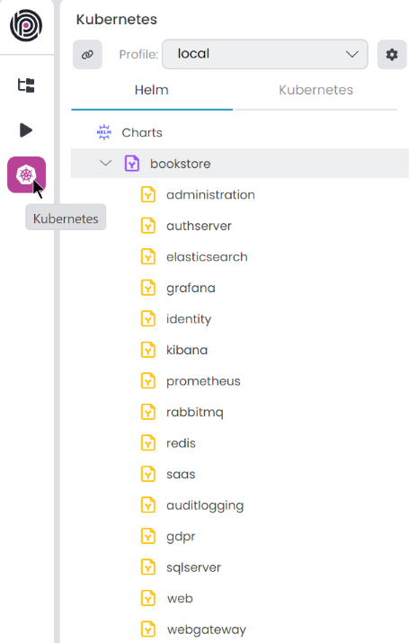

# ABP Studio: Working with Kubernetes

You can use the *Kubernetes* panel to manage your application(s) in Kubernetes cluster. This panel specially aims to microservice projects, with that way you don't have to run all your microservice projects in your local environment. You can run them in a Kubernetes cluster and debug one or more projects in your local environment. However you can still use this panel for monolithic projects too. Access this panel by clicking the *Kubernetes* button in the *ABP Studio* sidebar. 

> Pre-set configurations are added when you create a project; check the *Kubernetes Configuration* in the *Additional Options* step. The project structure might vary based on your selection. For example, an MVC microservice project looks like the following. You can add or remove the charts as you wish.
