# ABP Studio: Working with Kubernetes

You can use the *Kubernetes* panel to manage your application(s) in a Kubernetes cluster. This panel is specifically designed for microservice projects, so you don't have to run all your microservice projects in the local environment. Instead, deploy them in a Kubernetes cluster and debug one or more projects locally. However, you can still use this panel for monolithic projects as well. Access it by clicking the *Kubernetes* button in the *ABP Studio* sidebar.

> Pre-set configurations are added when you create a project; check the *Kubernetes Configuration* in the *Additional Options* step. The project structure might vary based on your selection. For example, an MVC microservice project looks like the following. You can add or remove the charts as you wish.

## Prerequisites

The *Kubernetes* panel is available only in the [business and enterprise](https://commercial.abp.io/pricing) licenses. You need to install and configure the following tools to use the *Kubernetes* panel.

* [kubectl](https://kubernetes.io/docs/tasks/tools/install-kubectl/)
* [Helm](https://helm.sh/docs/intro/install/)
* [Docker Desktop](https://www.docker.com/products/docker-desktop) with Kubernetes enabled
* [NGINX Ingress Controller](https://kubernetes.github.io/ingress-nginx/deploy)

## Profile

You can create multiple profiles to manage different Kubernetes clusters or namespaces within the same cluster. A profile is a set of configurations that you can use to connect to a Kubernetes cluster. If you check the *Kubernetes Configuration* when you create a project in the *Additional Options* step, the *local* profile comes out of the box, including all project charts. You can view all profiles in the combobox and change the current profile. To edit, click the gear icon located on the right side.

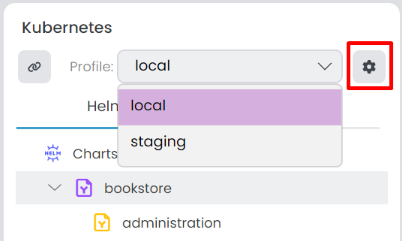

> When you change the current profile, it doesn't affect the *Charts* tree. The *Charts* section is related to the solution, not the profile. You can add or remove charts in the [Charts](#charts) section.

It opens the *Manage Kubernetes Profiles* window. You can edit/delete existing profiles or add a new one.

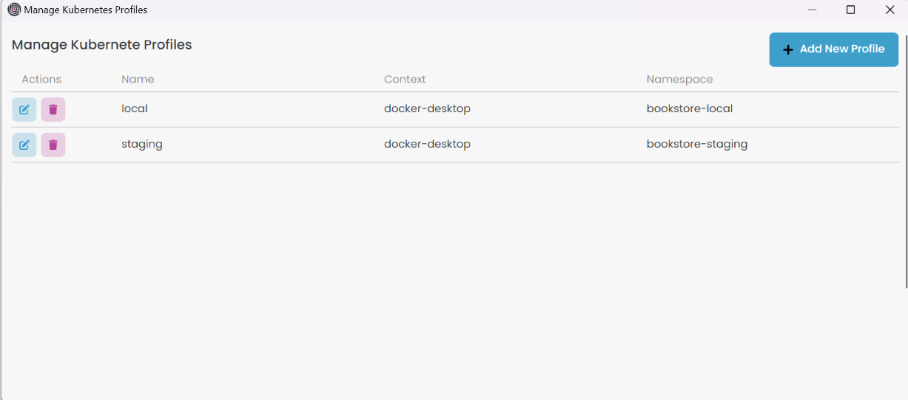

When you click *Add New Profile* button, it opens the *New Profile* window. In the *Profile Info* tab you can provide an arbitrary profile name, which should be unique among the profiles. In the *Context* combobox, you'll see existing Kubernetes contexts. Choose one of them. Afterwards, provide a *Namespace* that should be unique among the each *Context*. When creating a new profile, it stores the JSON file at the specified path. For microservice projects, you can specify the path `abp-solution-path/etc/abp-studio/k8s-profiles`, or for other project types, use `abp-solution-path/etc/k8s-profiles` to adhere to the standard format.

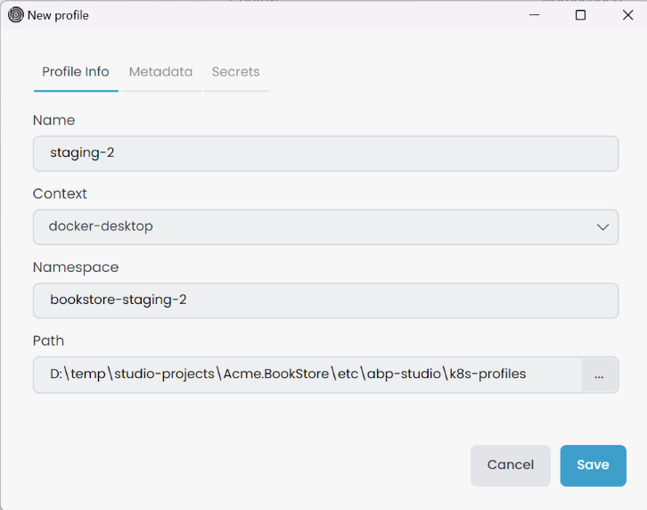

In the *Metadata* tab, you can provide additional information about the profile. We use this information in our commands such as *Build Docker Image(s)* and *Install Chart(s)*. For example, *dotnetEnvironment* is mandatory for the *Install Chart(s)* command to determine the environment variable. You can also add more metadata by clicking the *Add* button. It collects all metadata from root to child and overrides existing values by hierarchy. For example, if you define two identical metadata in the profile and a chart, it uses the chart metadata. You can add metadata for the [Kubernetes Profile](#profile), [Main Chart](#main-chart) and [Subchart](#subchart).

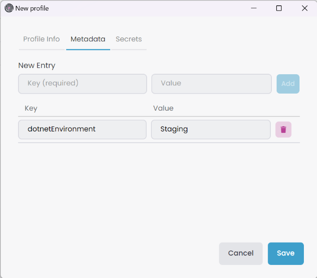

In the *Secrets* tab, you can provide secrets for the profile. We use this information in our commands such as *wireGuardPassword*. Similar to the *Metadata* tab, you can add more secrets by clicking the *Add* button. It collects all secrets from root to child and overrides existing values by hierarchy.

You can add secrets to the *Global Secrets* by clicking *Tools* -> *Global Secrets* in the toolbar, *Solution Secrets* by clicking *Solution* -> *Manage Secrets* in *Solution Explorer* root context-menu, and *Kubernetes Profile* by *Add or Edit Profile* -> *Secrets tab* in *Kubernetes* panel. Due to security concerns, *Secrets* information is saved in the local file system, not in the solution file. Therefore, you can't share it with your team members by default.

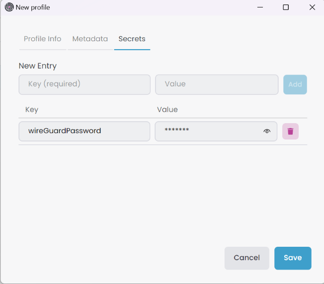

To create a new profile in the *Profile Info* tab, *Name*, *Context*, and *Namespace* are enough. However, you should provide *dotnetEnvironment* metadata information to use the Install Chart(s) command. Click the *Save* button to create a new profile. It adds the profile to the combobox. Similarly, you can edit or delete an existing profile.

When you create a new profile, you should also create a `values.{chart.name}-{profile.name}.yaml` file in the `abp-solution-path/etc/helm/chart` folder to override default values. For example, *values.bookstore-staging.yaml* is used for the *bookstore* chart in the *staging* Kubernetes profile.

## Charts

In the *Helm* tab we have a tree view of all charts in the solution. There are three chart types: *Chart Root*, *Main Chart* and *Subchart*.

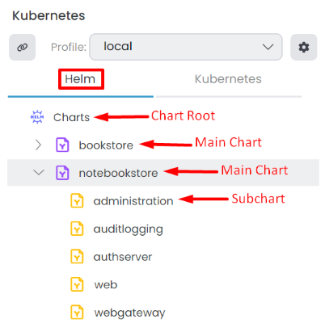

### Chart Root

It is the root of all main charts. You can have multiple main charts in the root. To add a new chart to the root, click the *Add Chart* button in the *Chart Root* context-menu. It opens the *Select Helm Chart* window. Pick the chart from the specified location and select the main helm chart. Store the helm chart in the `abp-solution-path/etc/helm/chart-name` folder; otherwise, commands won't work. Also, the main [chart name](https://helm.sh/docs/topics/charts/#the-chartyaml-file) and folder name should be the same. For example, if the main chart name is *notebookstore*, the folder name should be *notebookstore* as well. Similiar to creating new kubernetes profile, you should also create a `values.{chart.name}-{profile.name}.yaml` file in the `abp-solution-path/etc/helm/chart-name` folder to override default values. For example, *values.notebookstore-staging.yaml* is used for the *notebookstore* chart in the *staging* Kubernetes profile.

If you have multiple main charts, you can execute collective commands for all of them. To do that, right-click the *Chart Root* from the context-menu. The following options are available for the *Chart Root*.

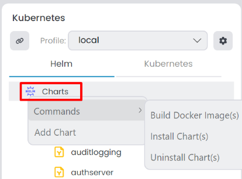

- `Commands`: You have several options to execute commands for all main charts.
  - `Build Docker Image(s)`: If build docker images available for subcharts it builds all of them.
  - `Install Chart(s)`: Installs all charts to selected profile.
  - `Uninstall Chart(s)`: Uninstalls all charts from selected profile.
- `Add Chart`: It opens the *Select Helm Chart* window. Pick the chart from the specified location and select the main helm chart to add a new main chart to the root.

### Main Chart

It is the root of all subcharts. When you add a new main chart to the root, it is automatically added with subcharts related to the main chart. Right click the main chart and select the command from the context-menu. The following options are available for the *Main Chart*.

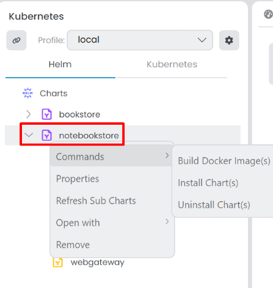

- `Commands`: You have several options to execute commands for the main chart. 
  - `Build Docker Image(s)`: If build docker images are available for subcharts, it builds all docker images for the selected main chart.
  - `Install Chart(s)`: Installs the selected chart to the current profile.
  - `Uninstall Chart(s)`: Uninstalls the selected chart from the current profile.
- `Properties`: It opens the *Chart Properties* window. You can see the chart information in the *Chart Info* tab. In the *Metadata* tab, you can add metadata for the selected main chart. It overrides the metadata in the profile. In the *Kubernetes Services* tab, you can relate a Kubernetes service with the main chart; however, since the main chart usually doesn't create kubernetes service, we can leave it empty.
- `Refrest Sub Charts`: Refreshes the subcharts of the selected main chart.
- `Open With`: You can open the selected chart with *Visual Studio Code* or *File Explorer*.
- `Remove`: Removes the selected main chart from the solution.

### Subchart

A subchart is a component associated with a main chart. When you add a new main chart to the root, it is automatically added with subcharts related to the main chart. Subcharts has specific configurations and functionalities that contribute to the overall functionality of the main chart. Right click the subchart and select the command from the context-menu. The following options are available for the *Subchart*.

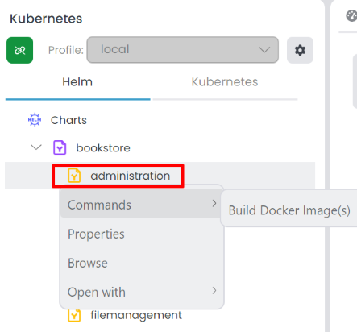

- `Commands`
  - `Build Docker Image(s)`: Builds docker image for the selected subchart. It's visible only if the subchart has *projectPath*, *imageName* and *projectType* metadata. *Project Type* only accept `angular` or `dotnet` values. It builds the docker image with the specified *imageName* and *projectPath*.
- `Properties`: It opens the *Chart Properties* window. You can see the chart information in the *Chart Info* tab. In the *Metadata* tab, you can add metadata for the selected subchart. It overrides the metadata in the profile and the main chart. In the *Kubernetes Services* tab, you can relate a Kubernetes service with the subchart; with that way you can see the *Browse* option in the context-menu when you connected to Kubernetes cluster.
- `Browse`: It opens the [browser](./monitoring-applications.md#browse) and navigates to the Kubernetes service URL. It's visible only if the subchart *Kubernetes Services* regex patterns matches with the [Kubernetes service](https://kubernetes.io/docs/concepts/services-networking/service/).
- `Open With`: You can open the selected subchart with *Visual Studio Code* or *File Explorer*.

#### Adding a New Subchart

When you add a new [microservice module](./solution-explorer.md#adding-a-new-microservice-module) to your solution, you should also create a subchart for it. However, the module type doesn't matter. Similarly, when you want to create a subchart for any reason, you can follow these steps:

- Open the main chart with *Visual Studio Code*.
- Create a folder in the *charts* folder.
- Edit the folder files based on your needs.
- After editing, the subchart template is completed; open ABP Studio and *Refresh Sub Charts* in the context-menu of the main chart. You can see the new subchart in the *Charts* tree.
- If the added subchart has *projectPath*, *imageName*, and *projectType* metadata, you can *Build Docker Image* for the subchart.
- If the added subchart has *Kubernetes Services* regex patterns, you can *Browse* the Kubernetes service when you are connected to the Kubernetes cluster.

## Connecting to a Kubernetes Cluster

Click the *Chain* icon or the *Connect* button in the *Kubernetes* tab to establish a connection with the selected Kubernetes cluster. During the initial connection, it may take a while to prepare; you can monitor the progress in the [Background Tasks](./overview.md#background-tasks) panel.

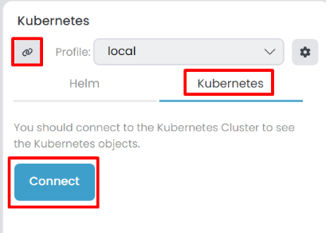

While connected, changing the current profile is not possible. Existing application services in the *Kubernetes* tab become visible when connected. To *Disconnect* you can click the *Chain* icon.

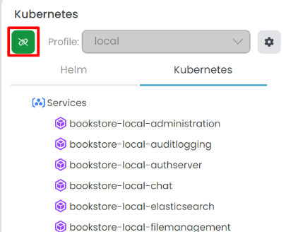

When you are connecting to a Kubernetes cluster, it automatically installs the WireGuard VPN to the Kubernetes cluster for a safe connection. You can specify the *wireGuardPassword* in the *Kubernetes Profile* -> *Secrets* tab or at a higher level such as *Solution Secrets* or *Global Secrets*. If you don't provide a password, it generates a random password and stores it in the *Kubernetes Profile* -> *Secrets*. However, if you try to connect to a cluster that already installed WireGuard VPN, then you should give the same password; otherwise, it won't connect. To see the random password, you can click the *eye* icon in the *Kubernetes Profile* -> *Secrets* tab.

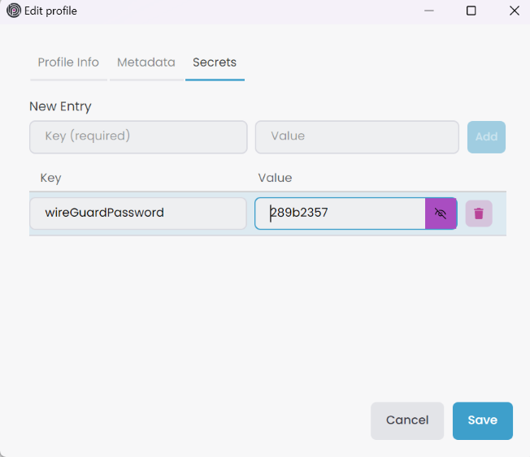

Since we're using the WireGuard VPN to connect to the Kubernetes cluster, we automatically append the Kubernetes services to your [hosts](https://en.wikipedia.org/wiki/Hosts_(file)) file. This enables seamless access to services, including [ClusterIP](https://kubernetes.io/docs/concepts/services-networking/service/#type-clusterip) types, using the specified *Kubernetes Service* names. For example, in this scenario, connecting to the SQL Server can be done with the server name `bookstore-local-sqlserver` via tools like [SSMS](https://learn.microsoft.com/en-us/sql/ssms/sql-server-management-studio-ssms). The default `sa` password for the SQL server is set to `myPassw@rd`.

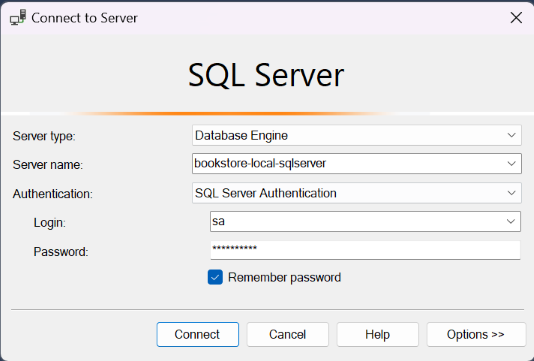

After we connect to the SQL Server, we can see the databases in the *Object Explorer* panel. 

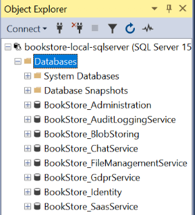

When connected to a Kubernetes cluster, applications establish a connection and begin sending [telemetry information](./monitoring-applications.md#collecting-telemetry-information) to ABP Studio. In the [Monitoring](./monitoring-applications.md#overall) panel, you can easily check the application's *State* and other details. Moreover, within the [Solution Runner](./running-applications.md) panel, look for the *Chain* icon with *(external)* information.

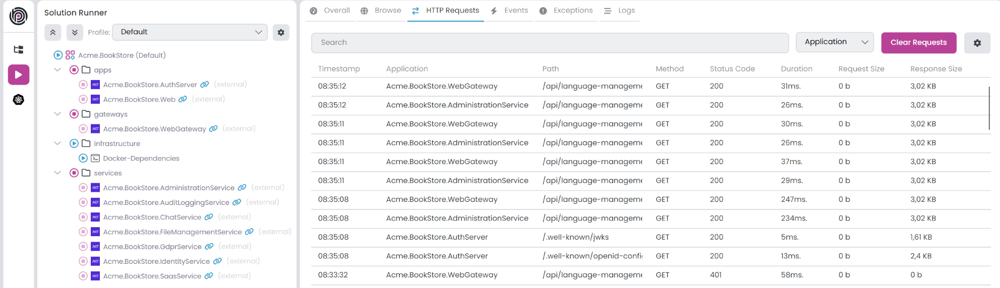

Upon disconnection from the cluster, we clean up the hosts file, excluding ingress hosts. This way, you can still access ingress hosts through your browser. For example, in this scenario, we can visit the `https://bookstore-local-web`.

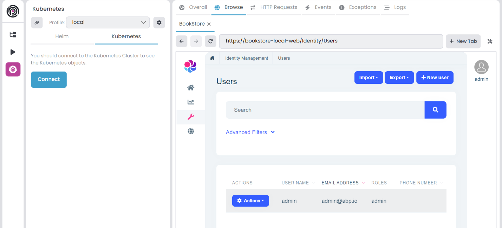

> When you list the services in the Kubernetes cluster with the `kubectl get svc` command, you should see the *abp-wg-easy* and *abp-wg-easy-vpn* services. After a while, if the *EXTERNAL-IP* is still *pending*, then it can't connect to the cluster. This could be caused by if you try to install the WireGuard VPN to a Docker Desktop Kubernetes cluster more than once. You can delete the previous WireGuard VPN by running the `helm uninstall abp-wg-easy` command in the previous namespace.

> It's important to note that connecting to the Kubernetes cluster is limited to one instance of ABP Studio at a time. Attempting to connect with another instance won't work as expected.
