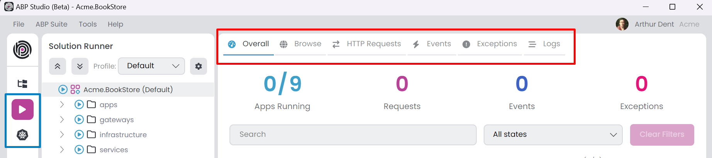
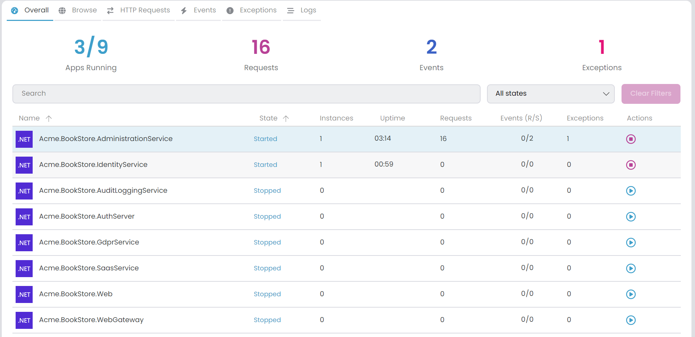
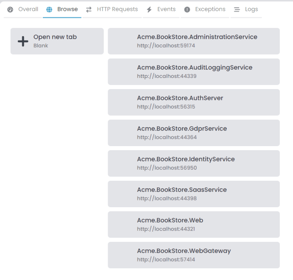
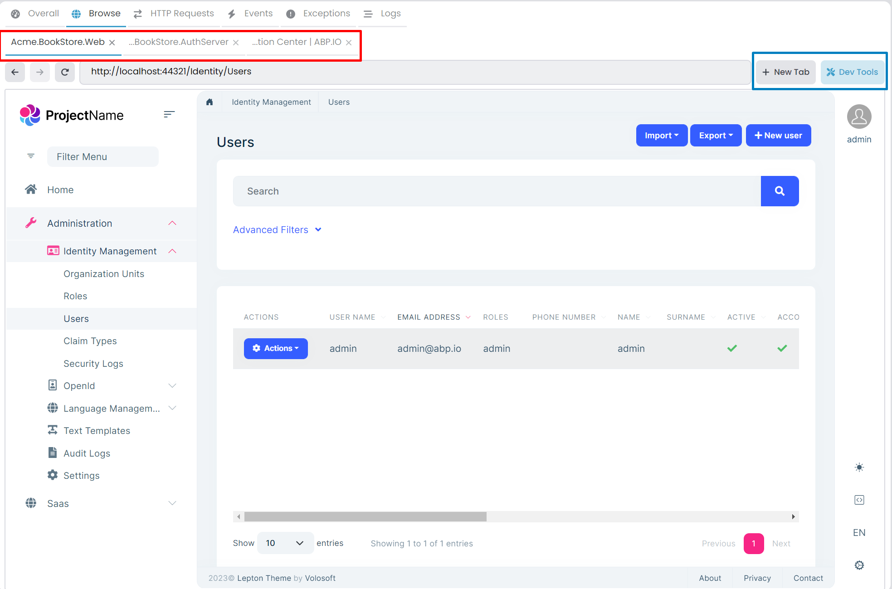
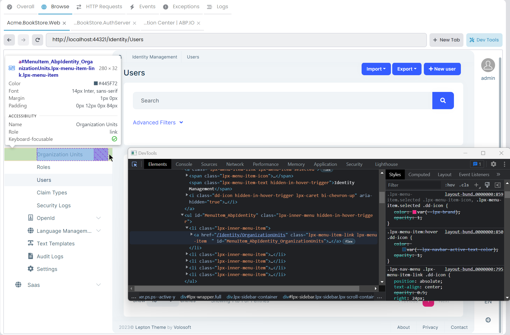

# ABP Studio: Monitoring Applications

ABP Studio offers a comprehensive centralized monitoring solution, enabling you to oversee all applications from a single interface. To see the monitoring tabs you can select the [Solution Runner](./running-applications.md) or *Kubernetes* from the left menu, monitoring tabs are automatically opened in the center. You can start the applications for monitoring. Various monitoring options are available, including [Overall](#overall), [Browse](#browse), [HTTP Requests](#http-requests), [Events](#events), [Exceptions](#exceptions), [Logs](#logs). 



## Collecting Telemetry Information

There are two application [types](./running-applications.md#abp-studio-running-applications): C# and CLI. Only C# applications can establish a connection with ABP Studio and transmit telemetry information via the `Volo.Abp.Studio.Client.AspNetCore` package. However, we can view the *Logs* and *Browse* (if there is a *Launch URL*) for both CLI and C# application types. Upon starting C# applications, they attempt to establish a connection with ABP Studio. When connection successful, you should see a chain icon next to the application name in [Solution Runner](./running-applications.md#run-1). Applications can connect the ABP Studio with *Solution Runner* -> *C# Application* -> *Run* -> *Start* or  from an outside environment such as debugging with Visual Studio. Additionally, they can establish a connection from a Kubernetes Cluster through the ABP Studio [Kubernetes Integration: Connecting to the Cluster](./quick-starts/microservice.md#kubernetes-integration-connecting-to-the-cluster).

You can [configure](https://docs.abp.io/en/abp/latest/Options) the *AbpStudioClientOptions* to disable send telemetry information. The package automatically gets the [configuration](https://docs.abp.io/en/abp/latest/Configuration) from the `IConfiguration`. So, you can set your configuration inside the `appsettings.json`:

- `StudioUrl`: The ABP Studio URL. Mostly you don't need to change this value. The default value is `http://localhost:38271`.
- `IsLinkEnabled`: If this value is true, it starts the connection to ABP Studio and transmits telemetry information. You can switch this to false for deactivation. The default value is true.

```json
"AbpStudioClient": { 
 "StudioUrl": "http://abp-studio-proxy:38271",
 "IsLinkEnabled": false
}
```

Alternatively you can configure the standard *Options* pattern in the `ConfigureServices` method of the `YourApplicationModule` class.

```csharp
public override void ConfigureServices(ServiceConfigurationContext context)
{
    Configure<AbpStudioClientOptions>(options =>
    {
        options.IsLinkEnabled = false;
        //options.StudioUrl = "";
    });
}
```

## Overall

In this tab, you can view comprehensive overall information. You have the option to search by application name and filter by application state. To reset all filters, use the *Clear Filters* button. When you apply a filter header informations gonna refresh by filtered applications.

- `Apps Running`: The number of applications running. It includes CLI and C# applications. In the example two C# microservice applications and one CLI application is running.
- `Requests`: The number of HTTP requests received by all C# applications.
- `Events`: The number of [Distributed Event](https://docs.abp.io/en/abp/latest/Distributed-Event-Bus) sent or received by all C# applications.
- `Exceptions`: The number of exceptions thrown by all C# applications.



In the data grid, details for each application are displayed. It's possible to sort rows by columns. When selecting a row, you can right-click to access the context menu, offering various actions. This menu allows for opening related tabs that are filtered by the selected application.

- `Name`: The name of the application.
- `State`: The state of the application. It can take on several values such as *Scheduled*, *Starting*, *Started*, *Stopping* and *Stopped*. In the event of an application crash during its starting, the state is mark as *Scheduled*, we can cancel the starting process at that stage.
- `Instances`: Indicates the count of running instances for the application. This value is particularly helpful when scaling the application within a Kubernetes, providing visibility into the number of currently active instances.
- `Uptime`: The time elapsed since the application started.
- `Requests`: The number of HTTP requests received by the application.
- `Events (R/S)`: The number of [Distributed Event](https://docs.abp.io/en/abp/latest/Distributed-Event-Bus) received or sent by the application.
- `Exceptions`: The number of exceptions thrown by the application.
- `Actions`: The actions that can be performed on the application. You can start and stop by the application.

> For the events system, you can exclusively view the [Distributed Event Bus](https://docs.abp.io/en/abp/latest/Distributed-Event-Bus). Generally, the [Local Event Bus](https://docs.abp.io/en/abp/latest/Local-Event-Bus) is not included.

## Browse

ABP Studio includes a browser tool that allows access to websites and running applications. You can open new tabs to browse different websites or view active applications. It's a convenient utility to access websites and applications without leaving ABP Studio. Clicking the *Browse* tab displays the running applications and an *Open new tab* button.



You can open the *Browse* tabs as many times as you want. It's possible to open the same application in several tabs simultaneously.  Additionally, you can access any URL by entering it into the address bar. 



When you click the *Dev Tools* button it opens the [Chrome DevTools](https://developers.google.com/web/tools/chrome-devtools) for the selected tab.



## HTTP Requests

Within this tab, you can view all *HTTP Requests* received by your applications. Clicking on a row enables you to view the details of each HTTP request. You have the option to filter requests using the search textbox or by selecting a specific application from the combobox. Additionally, clicking the gear icon allows you to ignore specific URLs by applying a regex pattern. The *Clear Requests* button removes all received requests.

## Events

In this tab, you can view all *Events* sent or received by your applications. Clicking on a row enables you to view the details of each event. You can filter them using the search textbox or by selecting a specific application. Additionally, you can choose the direction and source (inbox/outbox) of events. The *Clear Events* button removes all events.

## Exceptions

This tab displays all exceptions. Click on a row to inspect the details of each exception. You can filter them using the search textbox or by selecting a specific application. The *Clear Exceptions* button removes all exceptions.

## Logs

The *Logs* tab allows you to view all logs. To access logs, simply select an application. You can also apply filters using the search textbox or by selecting a specific log level. The *Clear* button removes all logs. If *Auto Scroll* is checked, the display automatically scrolls when new logs are received.
