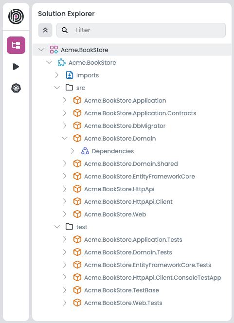
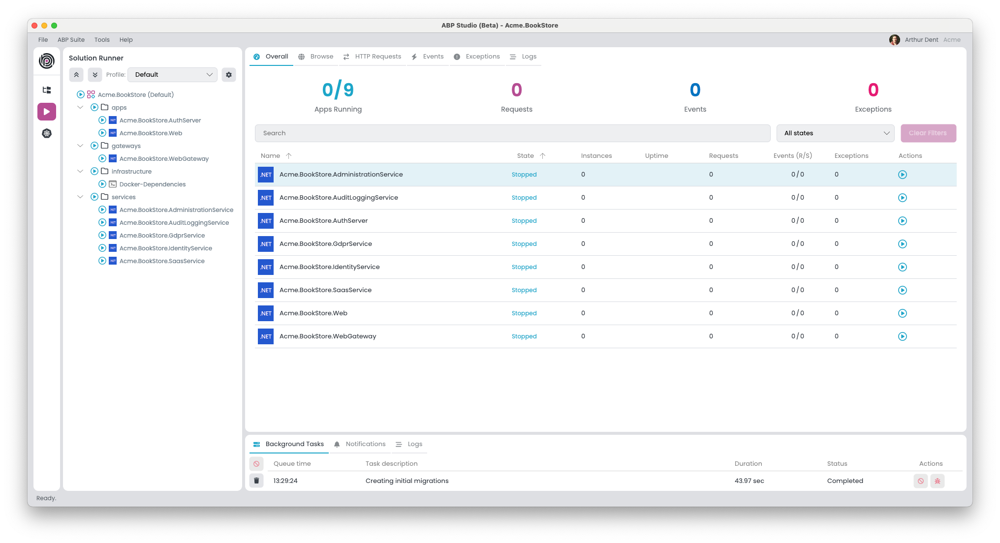
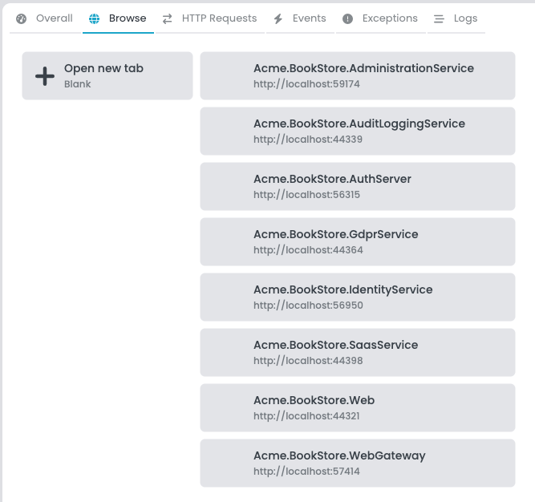
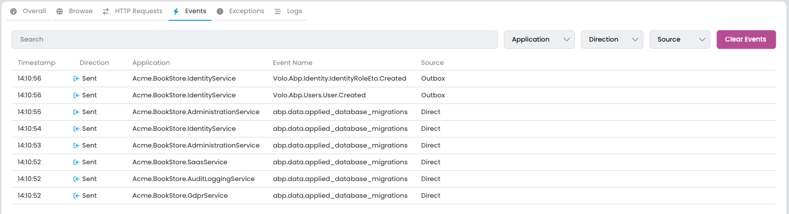
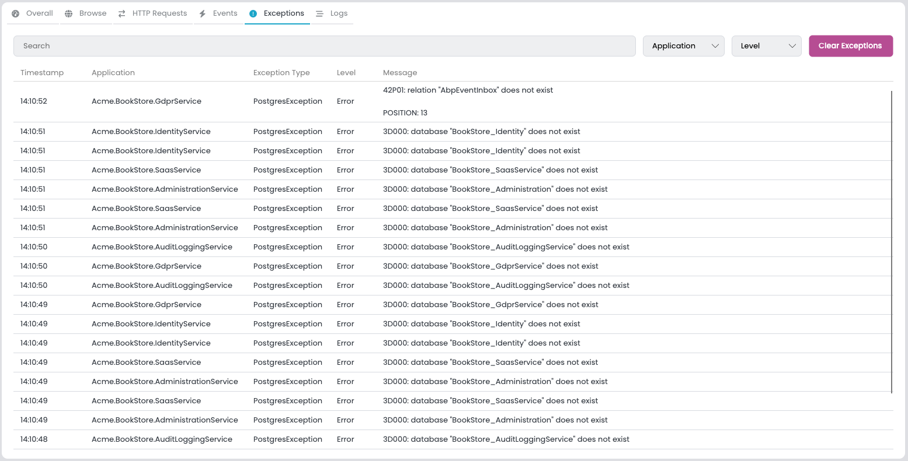
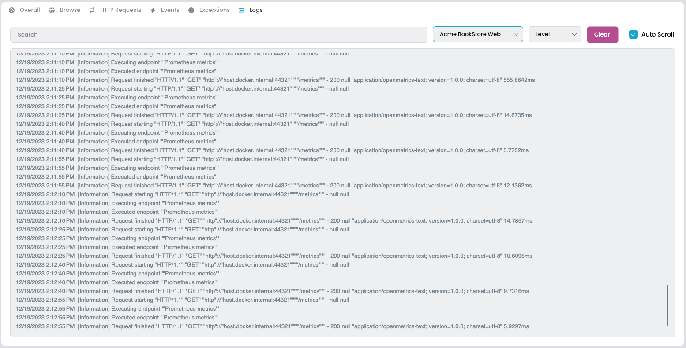
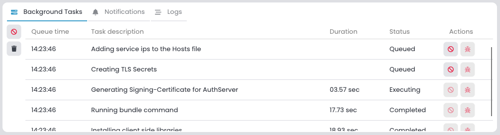
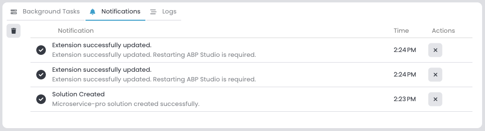
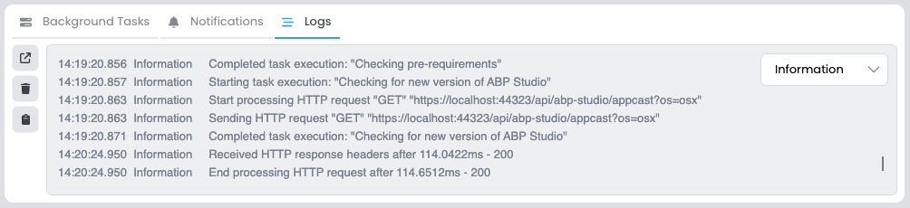

# Overview of ABP Studio's Interface Components

## Introduction

ABP Studio, a comprehensive desktop application, offers a wide range of features and functionalities tailored to streamline the development and management of ABP-based applications. This article provides an overview of the key components of ABP Studio, including the Top Menu, Sidebar, Solution Explorer, Solution Runner, Kubernetes, Welcome Screen, Application Monitor Area, Background Tasks, Notifications, and Logs. Understanding these components is essential for efficiently utilizing ABP Studio to its full potential.

## Top Menu

The Top Menu is the primary menu bar in ABP Studio. It offers access to various functionalities such as **File**, **ABP Suite**, **Tools**, and **Help**. This menu is intuitively designed to ensure easy access to some features of ABP Studio.

### File

- **Welcome Screen:** Opens the Welcome Screen.
- **New Solution:** Opens the new solution creation wizard.
- **Open Solution:** Opens a Solution previously created with ABP Studio.
- **Initialize Existing Solution:** Makes the project created outside ABP Studio recognizable by ABP Studio.
- **Recent Solutions:**  Shows Recent Solutions
- **Reload Solution:** Reloads the current solution.
- **Close Solution:** Closes the current solution.
- **Exit:** Closes ABP Studio.

### ABP Suite

If the [Suite](https://docs.abp.io/en/commercial/latest/abp-suite/index "https://docs.abp.io/en/commercial/latest/abp-suite/index") you click on is not installed, it installs it and opens it in the browser embedded in the application. If the Suite is already installed, it opens in the browser embedded in the application 

### Tools

- **Options:** Lists the options for the application.
    - **Theme:** Allows to change the theme on the UI.
- **Extensions:** Opens the “Manage Extensions” window.

### Help

- **License Information:** Opens the “License Information” window.
- **Framework Documentation:** Opens the official framework documentation website.
- **Commercial Documentation:** Opens the official commercial documentation website.
- **Community:** Opens the official ABP Community website.
- **Support:** Opens the official Support website.
- **My Support Questions:** Opens the page on the official Support site showing the tickets you have opened.
- **About:** Opens the “About” window

## Sidebar

Located on the left side of the interface, the Left Area is a panel that provides quick access to various functionalities like **Solution Explorer**, **Solution Runner**, and **Kubernetes**. It's designed for ease of use, allowing users to swiftly switch between different aspects of their project.

## Solution Explorer

The Solution Explorer is a crucial feature for managing the structure of your project. It displays the files and folders of your project in a hierarchical view, allowing users to navigate, organize, and manage their project's components easily.

## Solution Runner

Solution Runner is a tool within ABP Studio that enables users to build, run, and monitoring their applications directly from the interface. It likely includes functionalities for running, debugging, and viewing the output of applications.

## Kubernetes

ABP Studio offers robust Kubernetes integration, allowing users to manage and deploy their applications on Kubernetes clusters. This feature simplifies the complexities of Kubernetes, making it more accessible for users to leverage its capabilities.

## Welcome Screen

The Welcome Screen is the initial interface users encounter upon starting ABP Studio, designed to facilitate a smooth onboarding and project management experience. This tab is composed of several key sections, each aimed at optimizing the user's interaction with the ABP Studio.
  

### Start Section

- **New solution**: A prominently placed action point prompting users to initiate the creation of a new project. Selecting this option triggers the solution creation workflow, which guides users through the necessary steps to set up a new ABP application.
- **Open solution**: Adjacent to the new solution action, this option provides users with the ability to quickly navigate to and open a previously created solution. It is designed for convenience, allowing for seamless transitions between different projects.
- **Recent Solutions:** This list is dynamically populated with the most recently accessed six solutions, providing users with quick access to ongoing work. Each entry includes the name of the solution, the date of last activity, and its file path, facilitating easy identification and selection.

### Additional Learning Resources

In support of continuous learning and community engagement, the right-hand panel of the Welcome Tab features:

#### Tutorials

- **Getting started with the ABP Commercial**: A resource link designed to onboard new users, offering comprehensive guidance on leveraging ABP Commercial's features.
- **Introduction to the ABP Studio**: A resource link designed to open ABP Studio's introduction documentation.

#### Latest Community Posts

This feed showcases recent activity from the ABP community, serving as a portal to discussions, updates, and insights that can benefit the user. It highlights contributions from community members, fostering a sense of connection and collaboration.  

## Application Monitor Area

The Application Monitor Area is a functional component within ABP Studio that displays real-time operational status and metrics for applications. It indicates the active state of applications, the count of running instances, and so on. The interface is organized into several tabs: Overall, Browse, HTTP Requests, Events, Exceptions, and Logs. 

### Overall

The summary section gives a quick overview of the system's status, displaying metrics such as the number of apps running, total requests, events, and exceptions. This high-level view helps to quickly determine the health of the system.  

#### Applications List

- A detailed list of individual applications presents critical information at a glance. For each application, the monitor displays:
    - **Name**: The unique identifier for the application.
    - **State**: Current status (e.g., Running, Stopped) indicating the application's operational state.
    - **Instances**: The number of active instances, reflecting the scale at which the application is currently running.
    - **Uptime**: Duration since the application was last started.
    - **Requests**: Count of HTTP requests handled by the application, useful for assessing traffic and load.
    - **Events (R/S)**: Rate of events processed per second, which can be critical for event-driven architectures.
    - **Exceptions**: Number of exceptions thrown, which is a direct indicator of potential issues within the application.
    - **Actions**: Quick actions that can be taken directly from the monitor area, such as starting, stopping the application.

### Browse

Providing a built-in browser to open and interact with running applications or websites directly within ABP Studio.

### HTTP Requests

This tab provides a log of all HTTP requests across applications, complete with timestamps, paths, methods, and status codes. It enables developers to trace each request's journey and identify any potential bottlenecks or errors.

### Events

The Events tab is a centralized stream where all the distributed events across applications are recorded. It allows filtering by name, application, direction, and source, providing a transparent view of the inter-service communication.

### Exceptions

The Exceptions tab is dedicated to capturing and listing all exceptions thrown by connected applications. It is essential for debugging, offering the ability to filter by content, application, and severity level.

### Logs

The Logs tab in ABP Studio displays a real-time feed of log entries from applications, allowing for filtering by content, application, and severity level for targeted troubleshooting.

Each tab and component within the Application Monitor Area is designed with the user's need for information and control in mind. The UI is crafted to be intuitive, ensuring that users can navigate and comprehend the system's state without unnecessary complexity. Enhancements like search functionality, filter options, and clear visual indicators further empower users to maintain and manage their applications efficiently.

## Background Tasks

The Background Tasks section of ABP Studio provides a user interface for observing and managing asynchronous operations that occur within the studio environment. This area displays a list of tasks with their respective details:

- **Queue time**: The timestamp marking when the task entered the queue.
- **Task description**: A summary of the task's objective.
- **Duration**: The time taken from the start of the task until its completion.
- **Status**: Denotes the task's current phase, with possible states being 'Queued', 'Executing', 'Completed', 'Failed', or 'Canceled'.
- **Actions:** Task-specific interactions are available:
    - Tasks can be canceled by the user if they are marked as 'Cancelable' and are currently in the 'Queued' state.
    - Users have the ability to view error details for tasks that have 'Failed' to understand and address the causes of failure.

System behavior includes:

- Tasks are removed from the list three minutes after successful completion to ensure a clean workspace.
- Tasks are executed one at a time, with new tasks entering a queued state until the active task is finished.

The design of the Background Tasks interface provides users with transparency and control over automated processes, ensuring efficient task management within the development environment.

## Notifications

The Notifications feature in ABP Studio is designed to inform users of various system events through a dedicated Notifications section in bottom area. This feature provides real-time alerts in the form of informational messages, warnings, success confirmations, and error notifications, each differentiated by distinct visual cues for immediate recognition. Notifications serve to keep the user apprised of the application's state, background operations, and any issues that require attention.  

- Notifications are displayed transiently on the user interface for a brief period, typically five seconds, ensuring the user is promptly informed without causing prolonged distraction.
- Exception notifications may persist for a longer duration, such as ten seconds, to highlight issues that need urgent attention.
- The system maintains a limit of 99 notifications to avoid clutter, automatically removing the oldest notification once this threshold is reached.
- Users can manually dismiss notifications or interact with them if additional actions are associated with the alert.
- Notifications are consolidated in a list that can be accessed through the Notifications interface, allowing users to review past alerts and perform relevant actions.

This interface is integral to maintaining an effective flow of communication within ABP Studio, providing users with immediate updates on the application's status and activities.

## Logs

The Logs feature in ABP Studio is designed to capture and display a stream of log entries generated by the application. This feature facilitates the observation and analysis of events and system behaviors over time. The Logs interface presents a list of log messages with various verbosity levels, from Information to Warning and Fatal, allowing developers to filter and focus on the messages that are pertinent to their current tasks.

Features of the Logs interface include:

- **Log Levels**: A collection of severity levels that the user can select from to filter log entries. By default, the logs are filtered to show Information level and above.
- **Open Button**: A function that enables users to open the logs folder on their system for in-depth analysis or archiving purposes.
- **Clear Button**: Provides the ability to clear the current log entries displayed within the interface, which can be useful for focusing on new events post-clearance.
- **Copy Button**: Allows for the copying of log information to the clipboard for use in troubleshooting or documentation, although its implementation may be pending.

The Logs section in ABP Studio displays a chronological record of the application's logs, enabling developers to track events, identify issues, and monitor the internal operations of the studio environment.
