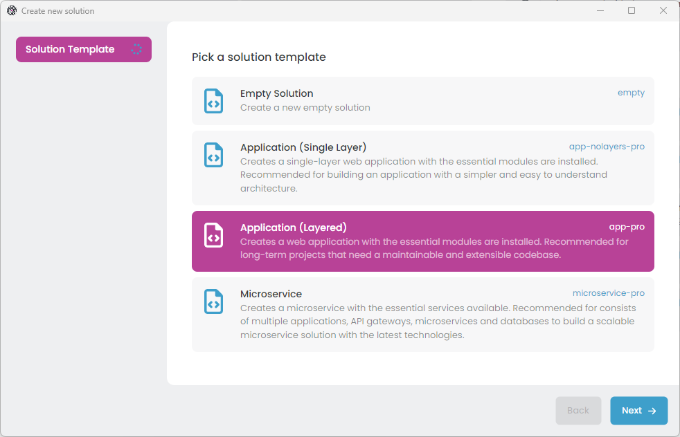
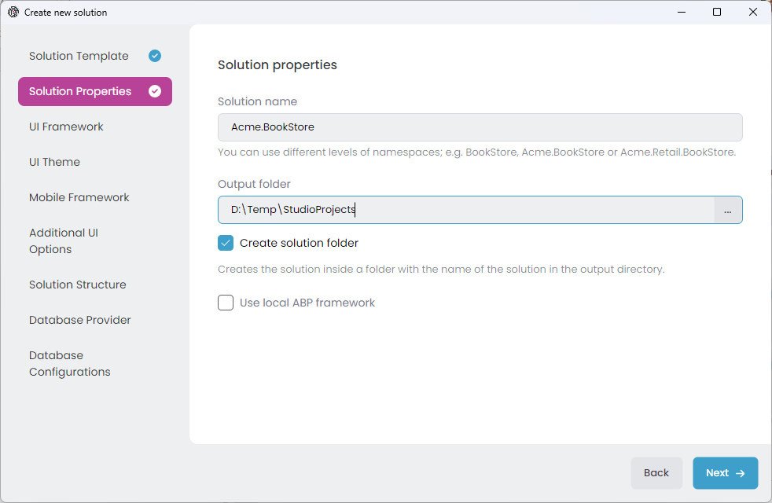
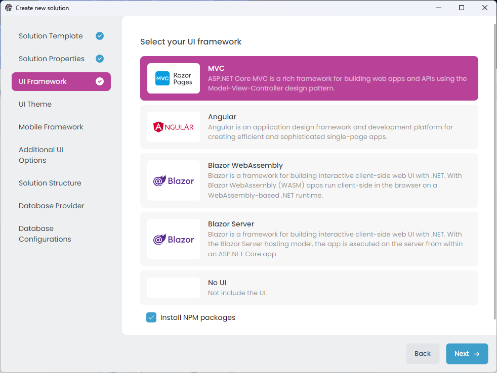
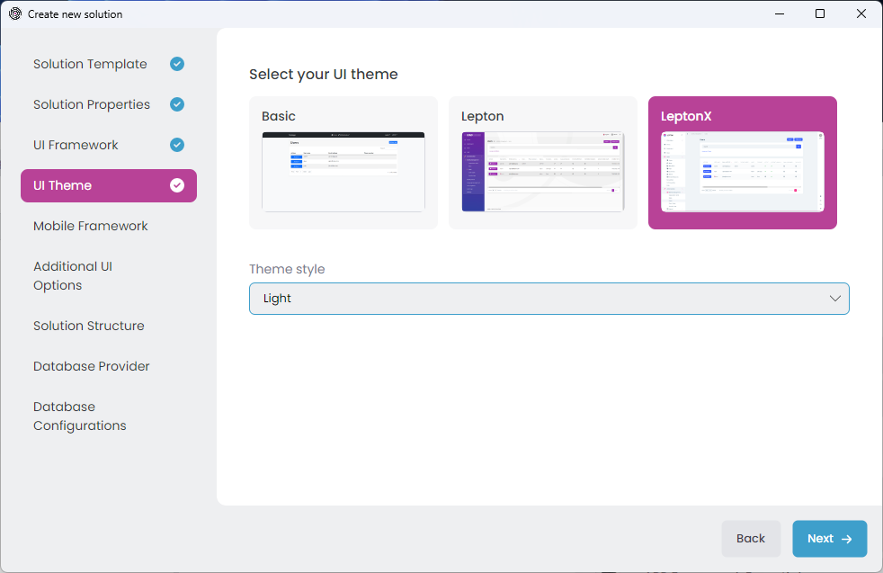
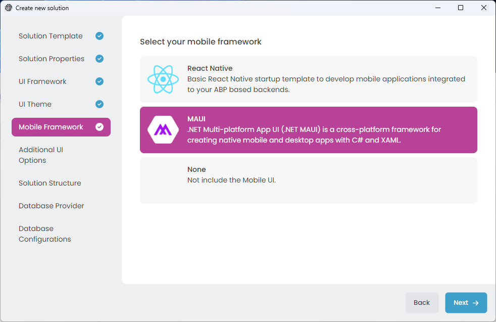
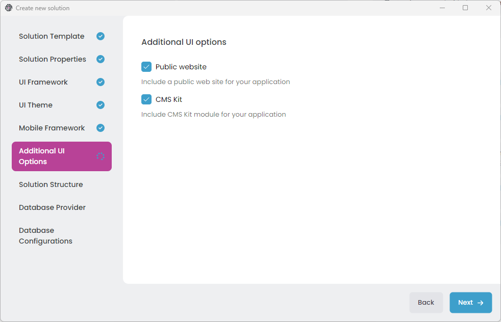

# Quick Start: Creating a Layered Web Application

Welcome to ABP Studio. In this quick start guide, you will learn how to create a layered (and potentially modular) web application using ABP Studio.

Assuming that you have [installed and logged in](../installation.md) to the application, you should see the following screen when you open ABP Studio:

Select the *File* -> *New Solution* in the main menu, or click the *New solution* button on the Welcome screen to open the *Create new solution* wizard:

We will use the *Application (Layered)* solution template for this tutorial, so pick it and click the *Next* button:

In that screen, you choose a name for your solution. You can use different level of namespaces; e.g. `BookStore`, `Acme.BookStore` or `Acme.Retail.BookStore`.

Then select an *output folder* to create your solution. The *Create solution folder* option will create a folder in the given output folder with the same name of your solution.

Once your configuration is done, click the *Next* button to navigate to the *UI Framework* selection:

Here, you see all the possible UI options supported by that startup solution template. You can pick your favorite one.

Notice that; Once you select a UI type, some additional options will be available under the UI Framework list. You can further configure the options or leave them as default and click the *Next* button for the *UI Theme* selection screen:

LeptonX is the suggested UI theme that is proper for production usage. Select one of the theme and configure additional options and click the *Next* button for the *Mobile Framework* selection:

Here, you see all the mobile applications available in that startup solution template. These mobile applications are well-integrated to your solution and can use the same backend with your web application. They are simple (not have pre-built features as much as the web application) but a very good starting point to build your mobile application.

Pick the one best for you, or select the *None* if you don't want a mobile application in your solution, then click Next to navigate to the *Additional UI options* screen:

d